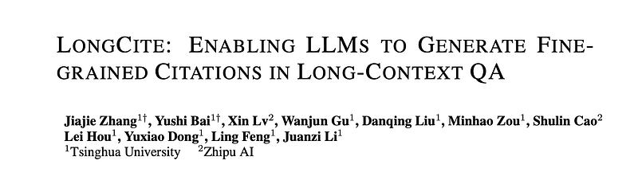
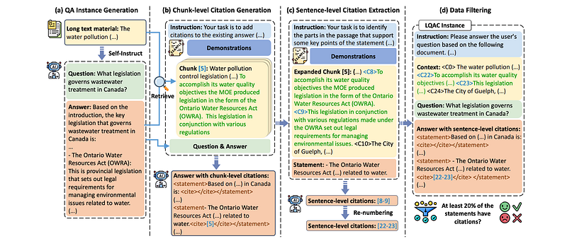
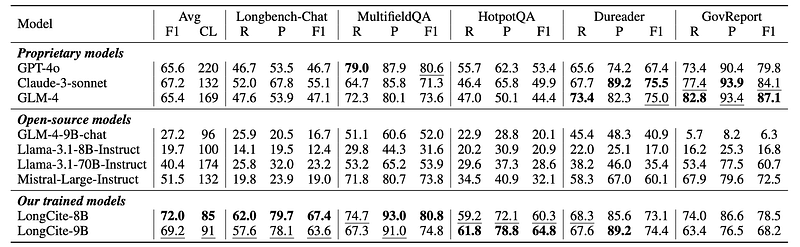
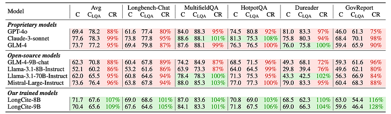

# Papers Explained 273 - LongCite

Given a long context D and a query q, the LLM is required to return a response A, which consists of n statements s_1, . . . , s_n, and each statement s_i cites a list of snippets Ci = {ci,1, ci,2, . . . } from D.

This page ingests the source article into the wiki and connects it to [[Papers Explained Corpus]], [[Long Context]], [[Large Language Models]], [[Evaluation and Benchmarks]], [[Document AI]], [[Code Models]].

## Source Metadata

- Source file: `raw/2024-12-17_Papers-Explained-273--LongCite-4800340e51d7.html`
- Source title: Papers Explained 273: LongCite
- Published: 2024-12-17
- Canonical: [https://medium.com/@ritvik19/papers-explained-273-longcite-4800340e51d7](https://medium.com/@ritvik19/papers-explained-273-longcite-4800340e51d7)

## Key Ideas

- The project is available on [GitHub](https://github.com/THUDM/LongCite).
- LongBench-Cite is built by combining data from two existing benchmarks:
- LongBench: focuses on long-context tasks in both English and Chinese, with an average document length of 7k words (English) and 13k characters (Chinese).
- LongBench-Chat: consists of 50 real-world queries with long contexts (10k to 100k in length) covering tasks like document QA, summarization, and coding.
- The LongBench-Cite benchmark evaluates LLMs on two key dimensions: correctness and citation quality:

## Notes

This work aims to enable long-context LLMs to generate responses with fine-grained sentence-level citations, improving their faithfulness and verifiability. LongBench-Cite, an automated benchmark for assessing current LLMs’ performance in Long-Context Question Answering with Citations (LQAC), is also introduced. A novel pipeline called CoF (Coarse to Fine) is proposed; it utilizes off-the-shelf LLMs to automatically generate long-context QA instances with precise sentence-level citations. This pipeline is leveraged to construct LongCite-45k, a large-scale SFT dataset for LQAC. Finally, LongCite-8B and LongCite-9B are trained using the LongCite-45k dataset, successfully enabling their generation of accurate responses and fine-grained sentence-level citations in a single output.

The project is available on [GitHub](https://github.com/THUDM/LongCite).

## LongBench-Cite

### Problem Definition

Given a long context D and a query q, the LLM is required to return a response A, which consists of n statements s_1, . . . , s_n, and each statement s_i cites a list of snippets Ci = {ci,1, ci,2, . . . } from D.

### Data Collection

LongBench-Cite is built by combining data from two existing benchmarks:

- LongBench: focuses on long-context tasks in both English and Chinese, with an average document length of 7k words (English) and 13k characters (Chinese).

- LongBench-Chat: consists of 50 real-world queries with long contexts (10k to 100k in length) covering tasks like document QA, summarization, and coding.

*Figure: Data Statistics in LongBench-Cite.*

### Automatic Evaluation

The LongBench-Cite benchmark evaluates LLMs on two key dimensions: correctness and citation quality:

Correctness is assessed by removing citations from the LLM’s response and asking GPT-4o to rate its accuracy based on the query and ground truth answers.

A new metric, correctness ratio (CR), compares the correctness in the LQAC (Long-context QA with Citations) setting to the vanilla long-context QA setting, revealing the impact of citations on performance.

Citation quality is evaluated using citation F1, calculated from citation recall and citation precision:

- Citation recall: measures whether the response is fully supported by cited snippets. GPT-4o is used to determine if the concatenated cited snippets fully, partially, or not at all support each statement in the response.

- Citation precision: measures the relevance of cited snippets to the statements they support. GPT-4o again judges whether a cited snippet partially or fully supports a statement.

- Citation length: the average token number of cited snippets, is also used to quantify the granularity of citations. A lower average length indicates finer-grained and more concise citations.

## CoF: Automatic SFT Data Construction For LQAC

*Figure: Overview of our CoF pipeline.*

CoF consists of four steps:

- Given a long context material, CoF first employs the LLM to generate a query and corresponding answer through Self-Instruct. Different task type descriptions (summarization, information extraction, multi-hop reasoning) are incorporated into the prompts to ensure diverse query generation.

- CoF then uses sentences in the answer to retrieve roughly k chunks from the context, which are subsequently input into the LLM to add coarse-grained chunk- level citations into the answer.

- Next, the LLM generates fine-grained sentence-level citations for each statement by extracting supporting sentences from the corresponding chunk-level citations.

- Instances with less than 20% of statements in the answer having citations are discarded.

## LongCite-45K

The above framework is used to construct LongCite-45k, a large-scale SFT dataset for LQAC. First, 50k documents are collected from the pre-training corpus of GLM-4, covering 9 varied domains including books, encyclopedias, academic papers, codes, etc. These documents are mainly in English and Chinese and their lengths range from 256 to 128k tokens. CoF is then applied, using GLM-4 as the backbone LLM and Zhipu Embedding-v2 as the retriever, to generate a QA pair with sentence-level citations for each document. This results in 44,600 high-quality LQAC instances after the filtering stage.

## LongCite: Teach Long-Context Llms To Generate Citations

GLM-4–9B and Llama-3.1–8B, are selected for the training experiments. LongCite-45k is combined with 76k general SFT instances from ShareGPT to ensure the model’s general capacities. The models are named LongCite-9B (abbr. for GLM-4–9B-LongCite) and LongCite-8B (abbr. for Llama-3.1–8B-LongCite) after SFT.

To investigate whether SFT on LQAC data will influence models’ long-context QA correctness compared to standard long-context SFT (i.e., SFT on vanilla long-context QA data), the two base models are additionally trained using the pure long-context QA pairs (without the task instruction and citations) in LongCite-45k. The trained models are named LongSFT-9B (abbr. for GLM-4–9B-LongSFT) and LongSFT-8B (abbr. for Llama-3.1–8B-LongSFT). When calculating correctness ratios for LongCite-9B/8B, LongSFT-9B/8B is used to obtain the correctness in vanilla long-context QA setting (i.e., CLQA).

## Evaluation

*Figure: Citation recall (R), citation precision (P), citation F1 (F1), and citation length (CL) of different models on LongBench-Cite using LAC-S strategy.*

*Figure: Correctness in LQAC setting (C) using LAC-S strategy, correctness in vanilla long-context QA setting (CLQA), and correctness ratio (CR) of different models on LongBench-Cite.*

Benchmarking Results Of Current LLMs:

- Open-source LLMs, especially models with smaller sizes, have poor citation quality and lag far behind proprietary LLMs.

- The citation quality of proprietary LLMs is still unsatisfactory. The citation F1 is only around 0.5, which means less than half statements in their responses are fully supported by the citations.

- Generating responses and citations in one pass via in-context learning hurts the long-context QA performance.

Citation Quality:

- LongCite-8B and LongCite-9B achieve the highest citation F1 scores among all models, outperforming proprietary models and the CoF pipeline.

- LongCite models generate significantly shorter citations than proprietary models and chunk-level citations, indicating finer granularity.

Long-Context QA Correctness:

- SFT with citation information significantly improves response correctness on all datasets compared to vanilla long-context SFT. (CR > 100%)

- LongCite-8B/9B achieve correctness comparable to officially post-trained models (GLM-4–9B-chat and Llama-3.1–8B-Instruct).

## Paper

LongCite: Enabling LLMs to Generate Fine-grained Citations in Long-context QA [2409.02897](https://arxiv.org/abs/2409.02897)

## Figures

Figures from the Medium HTML export (`raw/2024-12-17_Papers-Explained-273--LongCite-4800340e51d7.html`); local copies under `wiki/assets/papers-explained-273-longcite/` when download succeeded.

| Figure | Caption |
|--------|---------|
|  | Title card: LongCite. |
|  | Data Statistics in LongBench-Cite. |
|  | Overview of our CoF pipeline. |
|  | Citation recall (R), citation precision (P), citation F1 (F1), and citation length (CL) of different models on LongBench-Cite using LAC-S strategy. |
|  | Correctness in LQAC setting (C) using LAC-S strategy, correctness in vanilla long-context QA setting (CLQA), and correctness ratio (CR) of different models on LongBench-Cite. |
## Related

- [[Papers Explained Corpus]]
- [[Long Context]]
- [[Large Language Models]]
- [[Evaluation and Benchmarks]]
- [[Document AI]]
- [[Code Models]]
- [[Papers Explained 272 - RAFT]]
- [[Papers Explained 274 - Thought Preference Optimization]]

#summary #topic
