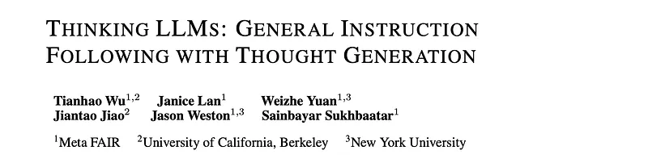
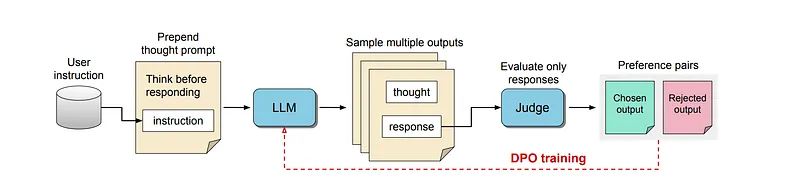
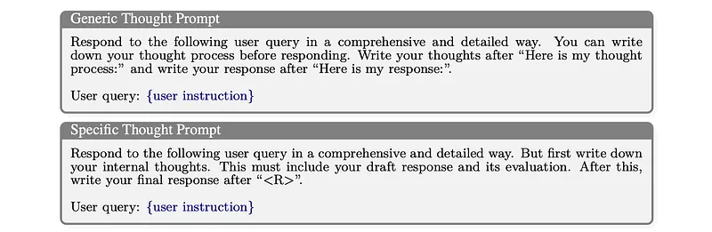
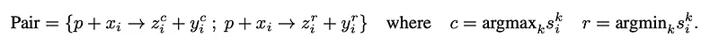
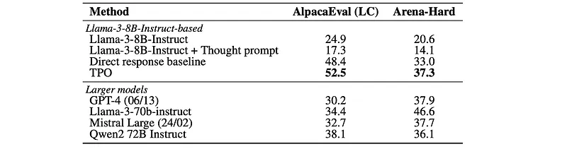
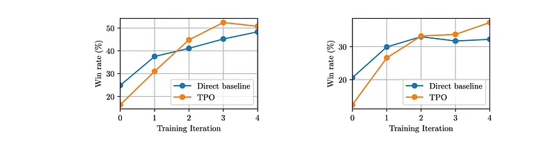
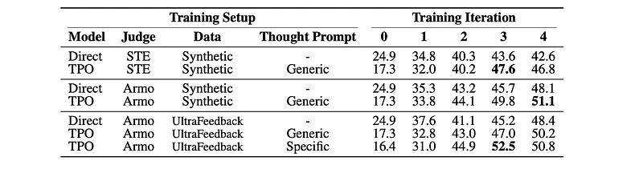

# Papers Explained 274 - Thought Preference Optimization

Starting with a typical instruction-tuned LLM that outputs a response directly after the user instruction and assuming that there is no provided labeled thought data that can be finetuned on, training is much more challenging.

This page ingests the source article into the wiki and connects it to [[Papers Explained Corpus]], [[Reinforcement Learning Topic]], [[Large Language Models]], [[Evaluation and Benchmarks]], [[Synthetic Data]], [[Reasoning Models]].

## Source Metadata

- Source file: `raw/2024-12-18_Papers-Explained-274--Thought-Preference-Optimization-4f365380ae74.md`
- Source title: Papers Explained 274: Thought Preference Optimization
- Published: 2024-12-18
- Canonical: [https://medium.com/@ritvik19/papers-explained-274-thought-preference-optimization-4f365380ae74](https://medium.com/@ritvik19/papers-explained-274-thought-preference-optimization-4f365380ae74)

## Key Ideas

- To initiate the training process, the model is prompted to generate its thought process followed by the response for a given training user instruction.
- The first prompt is generic, allowing the model to determine the content of the thoughts.
- The second prompt is more specific, requiring the thought to include a draft response and its evaluation.
- Unlike conventional RLAIF, the judge can only see the response part of the outputs, so the thought part cannot influence its judgment. This approach is chosen for several reasons.
- First, there is a lack of a judge model that is capable of evaluating internal thoughts. Building such a judge is inherently challenging because it is hard to collect human thoughts.

## Notes

This work proposes a training method for equipping existing LLMs with such thinking abilities for general instruction following without use of additional human data. This is achieved through an iterative search and optimization procedure that explores the space of possible thought generations, enabling the model to learn how to think without direct supervision. For each instruction, the thought candidates are scored using a judge model to evaluate their responses only, and then optimized via preference optimization.

## Thought Preference Optimization

*Figure: Thought Preference Optimization*

Starting with a typical instruction-tuned LLM that outputs a response directly after the user instruction and assuming that there is no provided labeled thought data that can be finetuned on, training is much more challenging.

To initiate the training process, the model is prompted to generate its thought process followed by the response for a given training user instruction. Multiple outputs are sampled, and preference optimization is then used to enhance the quality of thoughts (and paired responses) based solely on the quality of the responses.

### Generating Thoughts from Thinking LLMs

*Figure: Thought Prompting.*

Two thought prompts are considered:

- The first prompt is generic, allowing the model to determine the content of the thoughts.

- The second prompt is more specific, requiring the thought to include a draft response and its evaluation. This specific prompt provides greater control over the content of the thoughts but necessitates expert knowledge regarding helpful thought types for large language models.

The thought component will be concealed from the end user, with only the response being presented. This distinguishes the outputs from chain-of-thought prompting, where reasoning steps are typically incorporated into the overall response, often without clear distinction. While this approach may be beneficial in specific scenarios like solving mathematical problems, users generally expect responses without excessive intermediate reasoning steps. Hiding the thought component enables it to assume various forms that are typically uninteresting to the user, such as making mistakes, drafting and evaluating responses, and attempting to better understand the question.

### Optimizing Thoughts Via Preference Optimization

While initial thought prompting generates thoughts via the instruction tuned model, they are not optimized to be actually useful in making the response better. They typically underperform thoughtless direct responses. Therefore, it is necessary to train the model so it makes better use of thought generation. The Reinforcement Learning from AI Feedback (RLAIF) paradigm is employed, where responses are generated from the model and ranked using a reward model that acts as a judge. In particular, iterative Direct Preference Optimization (DPO) is used for its simplicity and efficacy.

Unlike conventional RLAIF, the judge can only see the response part of the outputs, so the thought part cannot influence its judgment. This approach is chosen for several reasons.

First, there is a lack of a judge model that is capable of evaluating internal thoughts. Building such a judge is inherently challenging because it is hard to collect human thoughts.

Secondly, the ultimate goal is to provide better responses to the user. Thus, it might be better to optimize the final objective instead of relying on an auxiliary objective that might not align well.

Training starts with a seed model M0 that is instruction-tuned to directly respond to the user instruction. A dataset of user instructions {xi} is also needed to begin training the model. At each training iteration t, instructions are fed to the current model Mt along with the thought prompt p.

For each input, k ≤ K outputs are samples, each containing thought zik and response yik parts.

After extracting the response parts yik, they are fed to the judge model J for scoring. For pointwise judge models that take a single response and output a scalar score, the process is simple:

Judge models that take a pair of responses and output the winner are also considered. In this case, the judge model is applied to all possible pairs {yim,yin} from the set of responses. This includes swapping positions in order to reduce the position-bias of the judge. Once all pairwise winners are obtained, they are converted to individual pointwise scores using ELO scoring.

The highest and lowest scoring responses are selected as “chosen” and “rejected” samples to construct a preference pair. These preference pairs encompass both thought and response components.

Using this process, the model can learn which thought led to a better response.

These preference pairs are used with the DPO loss to train the current model Mt. This results in a new model Mt+1, which is then used for the next training iteration.

Some judge models exhibit a length-bias, favoring longer responses. This bias leads to an increase in response length with each training iteration, ultimately producing an overly verbose model. To address this issue, a length-control (LC) mechanism is implemented. A normalization function N(lik) = lik −meank(lik)/stdk(lik) is defined. Scores are recomputed by penalizing longer responses using the following equation:

The hyper-parameter ρ controls the strength of the length-control mechanism. Both the score and the length are normalized to ensure they are on a similar scale.

## Experiment Setup

Llama-3–8B-Instruct serves as the seed model for training. Two models are considered as judge models: Self-Taught Evaluator (STE) and ArmoRM. STE, based on Llama-3–70B-Instruct, outputs its preference in natural language after generating a Chain of Thought (CoT) when presented with two responses. ArmoRM, an 8B reward model, directly outputs a scalar score for a single response.

Initial experiments utilize synthetic instructions generated from Llama-2–70B-Chat through 8-shot prompting using random samples from the Open Assistant dataset. Subsequent experiments transition to UltraFeedback, which comprises actual human instructions. Each training iteration employs 5000 instructions not included in prior iterations.

For each prompt, K = 8 responses are generated using a temperature of 0.8 and top-p of 0.95. Training spans 10 epochs per iteration, with the best checkpoint selected based on a validation set of 1500 prompts randomly sampled from UltraFeedback. Up to 4 iterations are conducted. The length-control parameter ρ is typically set within the range of [0, 0.5], where 0 signifies no length-control.

## Evaluation

*Figure: Benchmark win rates (%) for AlpacaEval (length-controlled (LC)) and Arena-Hard.*

*Figure: Training iterations on AlpacaEval (left) and Arena-Hard (right), comparing our TPO
method to the direct baseline starting from the seed (iteration 0) model.*

*Figure: Breakdown of AlpacaEval results for different judge models, training instruction sets and Thought Prompts.*

TPO achieved a win rate of 52.5% on AlpacaEval, outperforming the direct baseline by 4.1% and the seed model by 27.6%.

- TPO’s performance improved significantly with training iterations, eventually surpassing the direct baseline.

- TPO achieved a win rate of 37.3% on Arena-Hard, outperforming the direct baseline by 4.3% and placing it as the best performing model on the leaderboard for its size.

- TPO’s performance on both benchmarks suggests that the model is adapting to use its “thought processes” to improve its responses.

- The use of “UltraFeedback instructions” and “ArmoRM judge” contributed to the model’s success.

## Paper

Thinking LLMs: General Instruction Following with Thought Generation [2410.10630](https://arxiv.org/abs/2410.10630)

## Figures

Figures from the Medium HTML export (`raw/2024-12-18_Papers-Explained-274--Thought-Preference-Optimization-4f365380ae74.md`); local copies under `wiki/assets/papers-explained-274-thought-preference-optimization/` when download succeeded.

| Figure | Caption |
|--------|---------|
|  | Title card: Thought Preference Optimization. |
|  | Thought Preference Optimization. |
|  | Thought Prompting. |
|  | Training starts with a seed model M0 that is instruction-tuned to directly respond to the user instruction. |
|  | After extracting the response parts yik, they are fed to the judge model J for scoring. |
|  | The highest and lowest scoring responses are selected as “chosen” and “rejected” samples to construct a preference pair. |
|  | Some judge models exhibit a length-bias, favoring longer responses. |
|  | Benchmark win rates (%) for AlpacaEval (length-controlled (LC)) and Arena-Hard. |
|  | Training iterations on AlpacaEval (left) and Arena-Hard (right), comparing our TPO method to the direct baseline starting from the seed (iteration 0) model. |
|  | Breakdown of AlpacaEval results for different judge models, training instruction sets and Thought Prompts. |
## Related

- [[Papers Explained Corpus]]
- [[Reinforcement Learning Topic]]
- [[Large Language Models]]
- [[Evaluation and Benchmarks]]
- [[Synthetic Data]]
- [[Reasoning Models]]
- [[Papers Explained 273 - LongCite]]
- [[Papers Explained 275 - Self-Consistency Preference Optimization]]

#summary #topic
