# Papers Explained 275 - Self-Consistency Preference Optimization

Self-consistency is a method applied at inference time based on multiple sampling in order to find the most consistent answer. Self-consistency preference optimization (SCPO) extends this concept to help train models. SCPO iteratively trains consistent answers to be preferred over inconsistent ones on unsupervised new problems.

This page ingests the source article into the wiki and connects it to [[Papers Explained Corpus]], [[Reinforcement Learning Topic]], [[Large Language Models]], [[Reasoning Models]].

## Source Metadata

- Source file: `raw/2024-12-19_Papers-Explained-275--Self-Consistency-Preference-Optimization-ccd08f5acafb.md`
- Source title: Papers Explained 275: Self-Consistency Preference Optimization
- Published: 2024-12-19
- Canonical: [https://medium.com/@ritvik19/papers-explained-275-self-consistency-preference-optimization-ccd08f5acafb](https://medium.com/@ritvik19/papers-explained-275-self-consistency-preference-optimization-ccd08f5acafb)

## Key Ideas

- Self-consistency is a method applied at inference time based on multiple sampling in order to find the most consistent answer. Self-consistency preference optimization (SCPO) extends this concept to help train models.
- SCPO assumes access to an initial base model M0 and a small amount of (seed) high-quality unlabeled queries, which are typically complex reasoning problems.
- For each problem x in the training data Dt, temperature-based sampling is used with the current model Mt to generate k responses y ̄x = {y1 , y2 , · · · , yk } sampled from Mt (·|x), the vote function V (·) extracts the final answer corresponding to each...
- Using the vote function, preference pairs Dpairs are created by selecting the most consistent response as the chosen response and selecting the least consistent one as the rejected response, provided that the vote of the chosen response is greater than a...
- The number of votes attained by a response can also reflect the model’s confidence in the response, implying that pairs where the vote margin — the difference in votes attained by the chosen vs.

## Notes

Self-consistency is a method applied at inference time based on multiple sampling in order to find the most consistent answer. Self-consistency preference optimization (SCPO) extends this concept to help train models. SCPO iteratively trains consistent answers to be preferred over inconsistent ones on unsupervised new problems.

## Self-Consistency Preference Optimization

*Figure: Self-consistency Preference Optimization*

### Initialization

SCPO assumes access to an initial base model M0 and a small amount of (seed) high-quality unlabeled queries, which are typically complex reasoning problems. The model will be trained and updated at each training iteration resulting in models M1 , M2 , · · · , MT , where T is the total number of iterations. Instead of gold labels (answers) for responses, SCPO uses the consistency of the model Mt, as measured by a real-valued vote function V(·), to rate and rank the quality of each response.

### Generating New Problems

Following other self-alignment methods, few-shot prompting is used to self-generate additional problems from the model. Using the seed set, multiple example problems are chosen at random and placed in context to generate a new problem. While the model may generate some unanswerable queries, these can be filtered out using the vote function V(·). Specifically, a query x, is filtered out if none of the responses generated by Mt have vote ≥ τ. At each iteration t, the seed queries are augmented with the problems generated from Mt to obtain the training problems for the next iteration Dt+1.

### Building Self-Consistency Preference Pairs

For each problem x in the training data Dt, temperature-based sampling is used with the current model Mt to generate k responses y ̄x = {y1 , y2 , · · · , yk } sampled from Mt (·|x), the vote function V (·) extracts the final answer corresponding to each response y ∈ y ̄x via ans(·) and returns the relative frequency of the final answer, i.e.,

Using the vote function, preference pairs Dpairs are created by selecting the most consistent response as the chosen response and selecting the least consistent one as the rejected response, provided that the vote of the chosen response is greater than a threshold τ .

### SCPO Loss Function

The number of votes attained by a response can also reflect the model’s confidence in the response, implying that pairs where the vote margin — the difference in votes attained by the chosen vs. the rejected response — is larger, are of higher quality and vice-versa. This is modeled in SCPO’s training by using an instance-level weight w(x) to the loss, i.e., for the preference pair

where k is the total number of responses generated for each question (total number of votes cast). The following loss function is used:

### Iterative Training

Starting with an initial seed model M0, a series of models M1, M2 are trained for T = 2 iterations. Each model Mt+1 is trained using L_SCPO on D_t pairs, the data generated by the t-th model, defined as follows:

- M0: Seed LLM, initialized with a pretrained LLM (need not be instruction-finetuned).

- M1 : Initialized with M0 to generate D0pairs from D0 (+ new problems) and trained using L_SCPO .

- M2 : Initialized with M1 to generate D1pairs from D1 (+ new problems) and trained using L_SCPO .

This approach is similar to the Self-Rewarding LM training loop except for the fact that the model’s self-consistency is used to score responses instead of using the same model as a judge to verify its own correctness.

### Semi-Supervised Training with SCPO

While SCPO does not necessitate access to gold labels, datasets containing gold labels can be readily integrated alongside unlabeled datasets during SCPO training. When gold labels are available for a query xgold, k responses are sampled, and pairs are constructed such that the selected response y+ is correct and the rejected response y− is incorrect. Queries where such pairs cannot be formed are discarded. Given the inherent high quality of these pairs, the weight of annotated instances w(xgold) is set to 1.

## Experimental Setup

The effectiveness of SCPO is evaluated on GSM8K, MATH, and ZebraLogic datasets. For GSM8K and MATH, Llama-3 Base 8B serves as the seed model (M0), while Llama-3 Instruct 8B is used for ZebraLogic.

On GSM8K and MATH, the model is prompted to generate problems similar to four-shot examples from the training set. Problems where the maximum number of votes (V(yi)) for any response is less than half the number of responses sampled (τ = 0.5k) are filtered out. Due to the increased consistency of M1 models, the filtering threshold (τ) is raised to 0.7k and 0.6k for M2 training data on GSM8K and MATH, respectively. For ZebraLogic, the model is prompted to rephrase or perturb features of a puzzle in a one-shot manner. Subsequently, the underlying model (Mt) generates 16 responses for each question, and questions where none of the responses receive at least two votes (τ = 2) for M1 or half the number of responses (τ = 0.5k) for M2 are filtered out.

Models trained with SCPO in unsupervised (SCPOUnsup.) and semi-supervised (SCPOSemi-Sup.) settings are compared against the following baselines: the seed model (Zero-shot CoT), supervised training with gold answers (IRPOGold), and unsupervised training with external reinforcement learning (IRPORM).

## Evaluation

### GSM8K and MATH

*Figure: GSM8K zero-shot accuracy.*

*Figure: MATH zero-shot accuracy.*

- SCPO consistently outperforms unsupervised baselines, achieving significant improvements in both greedy and self-consistency accuracy.

- Multiple iterations of SCPO training lead to further improvements in reasoning abilities, especially in the unsupervised setting.

- Unsupervised SCPO achieves comparable performance to supervised IRPO training with gold labels, demonstrating its effectiveness in leveraging self-generated data.

- Semi-supervised SCPO, combining gold labels with SCPO, further enhances performance, outperforming IRPO with gold labels.

- The effectiveness of SCPO is attributed to the high correlation between vote shares and accuracy, allowing for effective bootstrapping from generated problems.

### ZebraLogic

*Figure: ZebraLogic test performance.*

- SCPO significantly outperforms unsupervised baselines, including IRPORM, on ZebraLogic.

- One iteration of SCPO (M1) improves puzzle accuracy by 5.4% and cell accuracy by 8.5% compared to the seed model (M0).

- Two iterations of SCPO (M2) achieve the best performance on ZebraLogic for 8B-scale LLMs, surpassing the seed model by 6.5% in puzzle accuracy and reaching the 30th position on the leaderboard.

- SCPO-trained models outperform significantly larger models, including Llama-3 Instruct 70B, Gemma-2 27B, and Claude-3 Haiku, in terms of puzzle accuracy.

- SCPO-trained models also achieve the highest cell accuracy compared to other models.

### Importance of weighted SCPO loss

The performance of models trained with a weighted LSCPO loss is compared against models trained with an unweighted LSCPO loss.

*Figure: Ablation comparing unweighted loss to weighted loss used in SCPO.*

- The weighted LSCPO loss consistently outperforms the unweighted version across all datasets and iterations.

- The improvement in accuracy is particularly significant in the first iteration of training, with a 2.5% increase on GSM8K and 1.44% increase on MATH using greedy inference.

- Even in the second iteration, models trained with the weighted LSCPO loss show a roughly 1% improvement on both GSM8K and MATH.

### Models become more consistent across iterations

Analysis conducted on the vote share of the most consistent response (V(y+)/k) across iterations of models trained using unsupervised SCPO.

*Figure: Vote share (%) of the most consistent response.*

- SCPO training increases model consistency with each training iteration across different tasks as it reduces model diversity due to preference-optimization rounds.

### Impact of consistency-based filtering on constructing preferences

The filtering threshold (τ) is varied from 0.1k to 0.7k, with instances having fewer than half the votes going towards the majority answer being filtered out.

*Figure: Impact of using different thresholds on majority vote to filter training data on MATH.*

- As the vote threshold (τ) increases, the quality of the training preference pairs improves, with the accuracy margin increasing from 18% to 68%. However, the size of the training data decreases significantly.

- The performance of the trained model increases until τ = 0.5k and then decreases. This suggests that the quality of the preference data (accuracy margin) is more important than quantity for model performance up to a certain point.

### Comparison of self-consistency to RMs

A comparison is conducted between SCPO and ArmoRM, across three datasets and included an out-of-distribution setting

*Figure: Comparing the quality of metrics.*

- SCPO outperforms ArmoRM in terms of correct pairwise preference orderings, particularly in the out-of-distribution setting (ZebraLogic).

- ArmoRM consistently has more incorrect preference orderings than SCPO, suggesting that the added noise in training may contribute to its poorer performance.

- SCPO results in more ties (equal votes for chosen and rejected answers), which are ignored in its loss function.

## Paper

Self-Consistency Preference Optimization [2411.04109](https://arxiv.org/abs/2411.04109)

## Figures

Figures from the Medium HTML export (`raw/2024-12-19_Papers-Explained-275--Self-Consistency-Preference-Optimization-ccd08f5acafb.md`); local copies under `wiki/assets/papers-explained-275-self-consistency-preference-optimization/` when download succeeded.

| Figure | Caption |
|--------|---------|
| 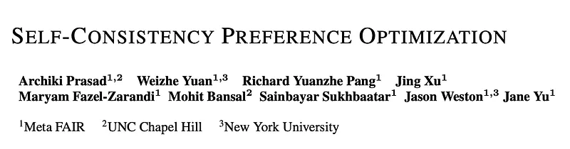 | Title card: Self-Consistency Preference Optimization. |
| 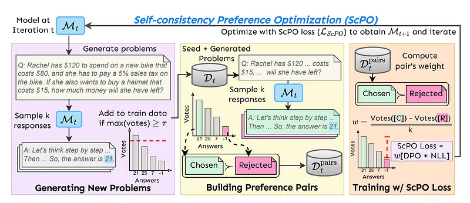 | Self-consistency Preference Optimization. |
| 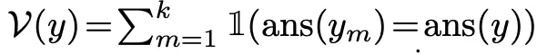 | Using the vote function, preference pairs Dpairs are created by selecting the most consistent response as the chosen response and selecting... |
| 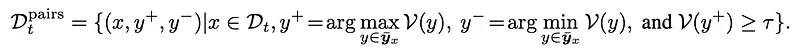 | Building Self-Consistency Preference Pairs. |
| 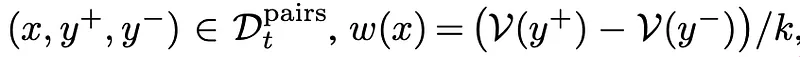 | where k is the total number of responses generated for each question (total number of votes cast). The following loss function is used. |
| 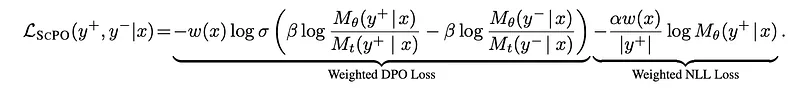 | where k is the total number of responses generated for each question (total number of votes cast). The following loss function is used. |
| 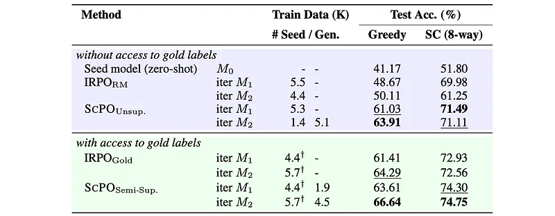 | GSM8K zero-shot accuracy. |
| 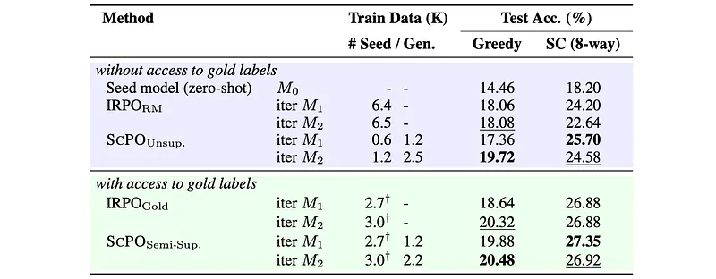 | MATH zero-shot accuracy. |
| 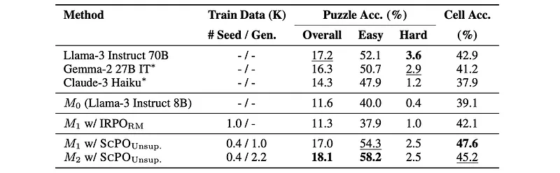 | ZebraLogic test performance. |
| 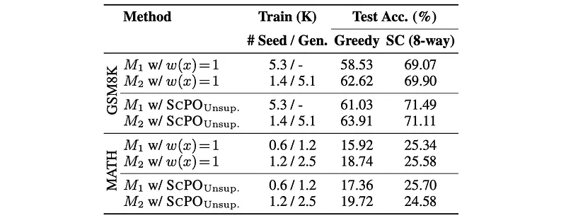 | Ablation comparing unweighted loss to weighted loss used in SCPO. |
| 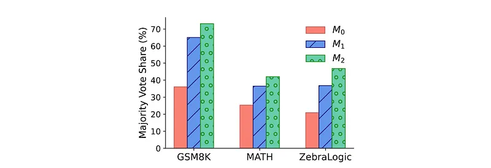 | Vote share (%) of the most consistent response. |
|  | Impact of using different thresholds on majority vote to filter training data on MATH. |
| 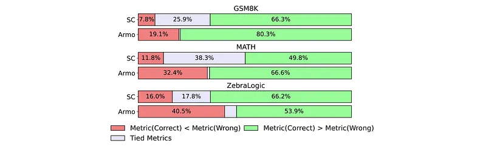 | Comparing the quality of metrics. |
## Related

- [[Papers Explained Corpus]]
- [[Reinforcement Learning Topic]]
- [[Large Language Models]]
- [[Reasoning Models]]
- [[Papers Explained 274 - Thought Preference Optimization]]
- [[Papers Explained 276 - Self-Taught Evaluators]]

#summary #topic
