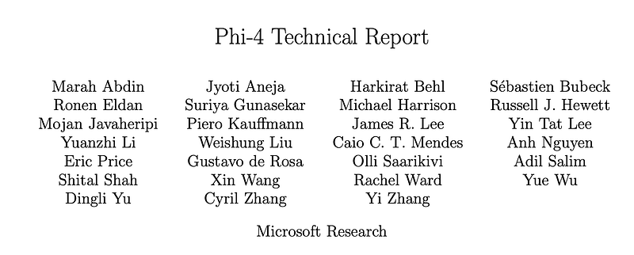
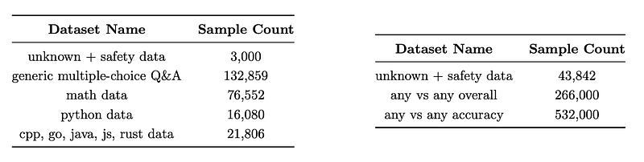
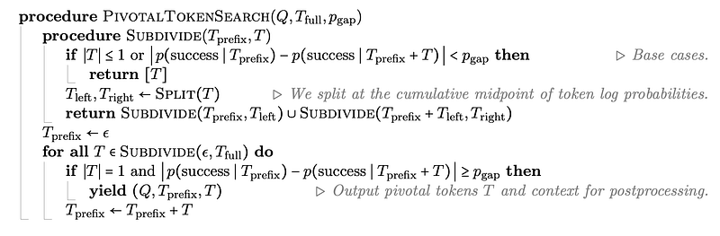
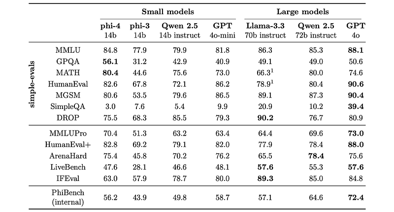

# Papers Explained 278 - Phi-4

Phi-4 is a 14B parameter model that advances the performance of small language models by introducing innovative synthetic data generation methods for reasoning-focused tasks. This advancement is achieved by optimizing the training curriculum and data mixture, and by introducing new techniques in post-training.

This page ingests the source article into the wiki and connects it to [[Papers Explained Corpus]], [[Synthetic Data]], [[Large Language Models]], [[Model Compression and Efficiency]], [[Reasoning Models]], [[Reinforcement Learning Topic]], [[Supervised Fine-Tuning]].

## Source Metadata

- Source file: `raw/2024-12-24_Papers-Explained-278--Phi-4-ea59220f3f88.html`
- Source title: Papers Explained 278: Phi-4
- Published: 2024-12-24
- Canonical: [https://medium.com/@ritvik19/papers-explained-278-phi-4-ea59220f3f88](https://medium.com/@ritvik19/papers-explained-278-phi-4-ea59220f3f88)

## Key Ideas

- Phi-4 is a 14B parameter model that advances the performance of small language models by introducing innovative synthetic data generation methods for reasoning-focused tasks.
- Synthetic data constitutes the bulk of the training data for phi-4 and is generated using a diverse array of techniques, including multi-agent prompting, self-revision workflows, and instruction reversal.
- The development of phi-4 is guided by three core pillars:
- Synthetic Data for Pretraining and Midtraining
- Curation and Filtering of High-Quality Organic Data

## Notes

Phi-4 is a 14B parameter model that advances the performance of small language models by introducing innovative synthetic data generation methods for reasoning-focused tasks. This advancement is achieved by optimizing the training curriculum and data mixture, and by introducing new techniques in post-training.

Synthetic data constitutes the bulk of the training data for phi-4 and is generated using a diverse array of techniques, including multi-agent prompting, self-revision workflows, and instruction reversal. Techniques such as rejection sampling and a novel approach to Direct Preference Optimization (DPO) are employed to refine the model’s outputs.

The development of phi-4 is guided by three core pillars:

- Synthetic Data for Pretraining and Midtraining

- Curation and Filtering of High-Quality Organic Data

- New refined versions of SFT datasets, as well as by developing a new technique to create DPO pairs, based on pivotal token search.

Recommended Reading [Papers Explained 192: Phi-3.5](https://medium.com/@ritvik19/papers-explained-192-phi-3-5-a95429ea26c9)

## Purpose of Synthetic Data

The relationship between tokens in organic datasets is often complex and indirect, requiring many reasoning steps to connect the current token to the next. In contrast, each token generated by a language model is predicted by the preceding tokens, making it easier for the model to follow resulting reasoning patterns. Synthetic data may act as a form of “spoon-feeding,” presenting challenges in a digestible and progression-oriented manner.

Synthetic data is typically closer to the format of outputs expected from models. Training on such data helps align the model’s pretraining experience with scenarios encountered during inference, ensuring that context seen during generation remains in-distribution with respect to the data the model was pretrained on.

The approach to generating synthetic data for phi-4 is guided by the following principles:

1. Diversity: The data should comprehensively cover subtopics and skills within each domain. This requires curating diverse seeds from organic sources.

2. Nuance and Complexity: Effective training requires nuanced, non-trivial examples that reflect the complexity and the richness of the domain. Data must go beyond basics to include edge cases and advanced examples.

3. Accuracy: Code should execute correctly, proofs should be valid, and explanations should adhere to established knowledge, etc.

4. Chain-of-Thought: Data should encourage systematic reasoning, teaching the model various approaches to the problems in a step-by-step manner. This fosters coherent outputs for complex tasks.

### Seed Curation

- Web and Code-based Seeds: snippets extracted from web pages, books, and code repositories focusing on complexity, reasoning depth, and educational value. A two-stage filtering process is employed: identifying pages with strong educational potential and segmenting selected pages into passages and scoring them for factual and reasoning content.

- Question Datasets: Collected questions from websites, forums, and Q&A platforms. Questions are filtered using a plurality-based technique to balance difficulty: generating multiple independent answers for each question and applying majority voting to assess response consistency. Questions where all answers agreed (too easy) or are entirely inconsistent (too difficult or ambiguous) are discarded.

- Creating Question-Answer Pairs from Diverse Sources: Language models are used to extract question-answer pairs from organic sources like books, scientific papers, and code. Deduction chains or logical progressions in text are detected to identify key reasoning steps, which are then reformulated into questions and corresponding answers.

### Data Transformation

- Rewrite and Augment: Seeds are transformed into synthetic data through multi-step prompting workflows: rewriting useful content into exercises, discussions, or structured reasoning tasks. Self-revision is implemented through a feedback loop where a model critiqued and improved its own outputs, guided by rubrics focused on reasoning and factual accuracy.

- Instruction Reversal for Code and Other Tasks: Instructions are generated from existing code snippets, including problem descriptions or task prompts. Synthetic data pairs are structured with the instruction preceding the code. Only data with high fidelity between the original and regenerated code is retained. This method could be generalized to other use cases.

- Validation of Code and Other Scientific Data: Synthetic code data is validated through execution loops and tests. Scientific datasets have questions extracted from materials using a method designed to ensure high relevance, groundedness, and difficulty balance.

### Curation and Filtering of Web and Q&A Data

Ablation studies showed that organic questions are substantially more effective than synthetic questions. While rewritten questions improved the model’s capabilities, the gains were not as pronounced. A significant portion of the collected questions lacked accurate solutions. To address this, the answers were replaced with synthetically generated ones and majority-voting was used to increase accuracy.

The focus is on collecting reasoning-dense and nuanced material like academic papers, educational forums, and programming tutorials. This data served both as direct training data and as seeds for synthetic data generation. Clean and correct natural data is crucial for seeding, as minor errors could significantly degrade the quality of synthetic data.

- Targeted Acquisitions: Repositories with reasoning-dense documents, including publicly permissible sources (e.g., arXiv, PubMed Central, GitHub) and licensed sources (e.g., books), were acquired, aiming for comprehensiveness, recency, and cleanliness.

- Filtering Web Dumps: To capture information-rich sources like forums and blogs, high-quality documents are selected from web dumps using small classifiers trained on LLM-generated annotations. A specialized pipeline amplified high-quality non-STEM content. Corrupted text and binary files are removed based on n-gram statistics and compression ratios.

- Multilingual Data: Multilingual datasets (German, Spanish, French, Portuguese, Italian, Hindi, Japanese, etc.) are incorporated from CommonCrawl and Wikipedia. A fastText-based language identification model categorized documents into 176 languages, and the same classifiers used for filtering web dumps were applied to ensure quality. These classifiers are trained on multilingual LLM-generated annotations.

- Custom Extraction and Cleaning Pipelines: Custom heuristics and parsers are developed for each data source to ensure cleanliness and uniformity. A custom HTML-to-text extractor is built for general web data, carefully preserving content like equations, code blocks, tables, and forum thread structure often corrupted by simpler parsers. This extractor used signals like HTML tags, CSS classes, content length, and tree depth to distinguish elements like boilerplate, advertisements, and essential content.

### Post-Training datasets

- Supervised Fine-Tuning (SFT) Datasets are generated using carefully curated user prompts taken from a mixture of publicly available datasets and synthetically generated data. Multiple model responses are generated and the best are selected using an LLM-based evaluation process.

- Direct Preference Optimization (DPO) pairs are generated based on rejection sampling and LLM evaluation, a part of which is based on an approach to creating pivotal token-based pairs.

## Pre Training

The phi-4 model is based on a decoder-only transformer architecture with 14B parameters and a default context length of 4096. The architecture closely follows phi-3-medium, except that tiktoken tokenizer (for better multilingual support) with a padded vocabulary size of 100,352 (including unused tokens) is used and full attention over the 4K context length, rather than a 2K sliding window used in phi-3-medium, is employed. The model is pre-trained for approximately 10T tokens.

Two key observations are noted from the phi-3 family of models.

- Web datasets showed small benefits on reasoning heavy benchmarks. Prioritizing more epochs over synthetic data led to better performance with respect to adding fresh web tokens.

- Models trained only with synthetic data underperformed on the knowledge-heavy benchmarks and demonstrated increased hallucinations.

*Figure: Data mixture for pretraining.*

## Mid Training

Pretraining is followed by a shorter midtraining stage to increase the original context length of 4k to 16k. High-quality non-synthetic datasets (i.e., academic, books, and code data) are filtered to separate samples above 8K context. The data subsets that are 16K or higher in length are then up-weighted. New synthetic datasets that satisfy the > 4K sequence requirement are also created. The final data mixture includes 30% of the newly curated longer context data and a 70% portion of recall tokens from the pretraining stage. To accommodate longer context, the base frequency of rope position encoding is increased to 250K.

## Post Training

Post-training is aimed at transforming the pretrained language model into an AI assistant that users can safely interact with. The pretrained model is aligned with one round of SFT, one round of DPO on data from our pivotal token search method, and one round of DPO on full length preference pairs.

### Supervised Fine-Tuning

In this phase, the pretrained model is fine-tuned on a variety of data across diverse domains, including math, coding, reasoning, conversation, model identity, and safety. Multilingual data for 40 languages is also added. Around 8B tokens of data are used in this phase, all formatted in the chatml format.

### Direct Preference Optimization

DPO is used to align the model with human preferences, and also to steer the model away from unwanted behavior through pairs of desired and undesired outputs. DPO data covers chat format data, reasoning, and Responsible AI (RAI) data and improves the model in math, coding, reasoning, robustness, and safety. Two rounds of DPO are conducted on the SFT model. A technique, Pivotal Token Search (PTS), is introduced to generate pairs for DPO for the first DPO round.

*Figure: Data Mixture for Pivotal Token DPO and Judge Guided DPO*

For the second round, called judge-guided DPO, approximately 850k pairs of desired and undesired outputs are gathered. The prompts are sourced from various publicly available instruction tuning datasets and also include prompts related to safety and Responsible AI (RAI). Next, for each of these prompts, responses are generated from GPT-4o, GPT-4t and the model. From these responses, various combinations of DPO pairs are created and GPT-4o is used as a judge to label positive or negative for a given pair.

### Pivotal Token Search

Consider a generative model producing a token-by-token response to a given prompt. For each token produced, which corresponds to a prefix of the model response, one can consider the conditional probability of the model’s answer being correct given that prefix, as well as the increment in this probability with respect to that token (in other words, the difference in the probability of being correct before and after producing that token). It is often the case that the overall correctness is highly dependent on a successful generation of a small number of key tokens.

*Figure: Illustration of pivotal tokens for GPT-4o at temperature 1.*

There are many tokens with probabilities much lower than that of the pivotal token which would contribute to noise in the gradients diluting the signal from the pivotal token. Moreover, when two texts substantially deviate from each other, comparison of their individual next-token log probabilities (as done in DPO) is not very meaningful. Rather, it makes more sense that the signal should come from the first tokens after the two texts start diverging from each other.

To alleviate these effects, a method called Pivotal Token Search (PTS) is employed for generating preference data that specifically targets pivotal tokens in isolation, creating DPO pairs in which the preference optimization takes effect with respect to a single token.

*Figure: Pseudocode for Pivotal Token Search (PTS).*

PTS identifies points in a completion token sequence Tfull = t1, t2, … for some user query Q where the next token ti has a significant impact on the probability of success p(success ∣ t1, …, ti). PTS estimates these probabilities by sampling completions starting from Q + t1, …, ti, which are checked for correctness with an oracle for Q. The procedure Subdivide recursively splits the sequence into segments ti, …, tj until the change in probability |p(success∣t1,…,ti−1)−p(success∣t1,…,tj)| for each segment is below a threshold p_gap or the segment is just a single token. Tokens with a sharp change in success probability are kept as pivotal. Pivotal tokens are turned into preference data by taking Q + t1, …, ti−1 as the query, and single tokens t_acc and t_rej that increase/decrease p(success ∣ t1, …, ti−1, t_acc/rej) as the accepted and rejected completions, respectively.

*Figure: Sample Preference data generated by Pivotal Token Search.*

The binary-search algorithm for PTS is not always guaranteed to find all pivotal tokens, but it only finds pivotal tokens and it finds all of them if the success probability is near-monotone over the course of the solution.

PTS is used to generate preference data for tasks where ground-truth is readily available, such as mathematics, various forms of question answering and coding. To improve sample efficiency, the target questions are filtered to only include those with 0.2 ≤ p(success) ≤ 0.8, as pivotal tokens are rare for tasks that are very easy or hard.

## Evaluations

To evaluate and demonstrate the capabilities of the phi-4 language model, Utilized existing benchmarks like MMLU, GPQA, MATH, HumanEval, MGSM, SimpleQA, MMLU-Pro, HumanEval+, ArenaHard, and IFEval. Compared phi-4’s performance against other models, including Qwen-2.5–14B-Instruct and GPT-4o.

*Figure: Performance of phi-4 on a set of standard benchmarks.*

- Phi-4 outperforms Qwen-2.5–14B-Instruct in 9 out of 12 benchmarks.

- Phi-4 excels in STEM Q&A tasks, outperforming even its teacher model (GPT-4o) on GPQA and MATH.

- Phi-4 achieves high scores in coding tasks (HumanEval and HumanEval+).

- Phi-4 shows weaker performance on SimpleQA, DROP, and IFEval. While the SimpleQA and DROP results are considered potentially misleading, IFEval reveals a genuine weakness in instruction following.

## Paper

Phi-4 Technical Report [412.08905](https://arxiv.org/abs/2412.08905)

Recommended Reading [Small LLMs](https://ritvik19.medium.com/list/small-llms-41124d5c7c80) [Phi Series](https://ritvik19.medium.com/list/phi-series-b029e31edb1c)

## Figures

Figures from the Medium HTML export (`raw/2024-12-24_Papers-Explained-278--Phi-4-ea59220f3f88.html`); local copies under `wiki/assets/papers-explained-278-phi-4/` when download succeeded.

| Figure | Caption |
|--------|---------|
|  | Title card: Phi-4. |
|  | Data mixture for pretraining. |
|  | Data Mixture for Pivotal Token DPO and Judge Guided DPO. |
|  | Illustration of pivotal tokens for GPT-4o at temperature 1. |
|  | Pseudocode for Pivotal Token Search (PTS). |
|  | Sample Preference data generated by Pivotal Token Search. |
|  | Performance of phi-4 on a set of standard benchmarks. |
## Related

- [[Papers Explained Corpus]]
- [[Synthetic Data]]
- [[Large Language Models]]
- [[Model Compression and Efficiency]]
- [[Reasoning Models]]
- [[Reinforcement Learning Topic]]
- [[Supervised Fine-Tuning]]
- [[Papers Explained 277 - ModernBERT]]
- [[Papers Explained Review 07 - Convolution Layers]]

#summary #topic
