# Papers Explained 279 - LearnLM Tutor

LearnLM-Tutor is a text-based conversational AI tutor, built upon Gemini 1.0 and fine-tuned for 1:1 educational interactions, evaluated with seven pedagogical benchmarks demonstrating improved educational capabilities compared to a prompt-tuned Gemini 1.0, developed using a participatory, multidisciplinary approach incorporating learner...

This page ingests the source article into the wiki and connects it to [[Papers Explained Corpus]], [[Large Language Models]], [[Reinforcement Learning Topic]], [[Multilingual Models]], [[Supervised Fine-Tuning]], [[Reinforcement Learning]].

## Source Metadata

- Source file: `raw/2025-01-02_Papers-Explained-279--LearnLM-Tutor-77503db05415.md`
- Source title: Papers Explained 279: LearnLM Tutor
- Published: 2025-01-02
- Canonical: [https://medium.com/@ritvik19/papers-explained-279-learnlm-tutor-77503db05415](https://medium.com/@ritvik19/papers-explained-279-learnlm-tutor-77503db05415)

## Key Ideas

- LearnLM-Tutor is a text-based conversational AI tutor, built upon Gemini 1.0 and fine-tuned for 1:1 educational interactions, evaluated with seven pedagogical benchmarks demonstrating improved educational capabilities compared to a prompt-tuned Gemini 1.0...
- Diverse participatory research methods, including workshops, co-design exercises, semi-structured interviews, and user studies, are utilized in a collaborative and iterative development process.
- Models do not typically behave like human tutors. Such default behavior can be modified in two ways: prompting or fine-tuning (through supervised and/or reinforcement learning).
- Models 𝑀0–𝑀4 are fine-tuned via SFT over all parameters of a base model (PaLM 2.0 for 𝑀0–𝑀3 and Gemini 1.0 for 𝑀4). While RL is crucial for building high-quality gen AI tutors, focus has thus far been placed only on SFT.
- The data should adhere to the principles developed through the participatory studies described.

## Notes

LearnLM-Tutor is a text-based conversational AI tutor, built upon Gemini 1.0 and fine-tuned for 1:1 educational interactions, evaluated with seven pedagogical benchmarks demonstrating improved educational capabilities compared to a prompt-tuned Gemini 1.0, developed using a participatory, multidisciplinary approach incorporating learner and educator feedback to translate learning science principles into practical improvements.

## Participatory approach

Diverse participatory research methods, including workshops, co-design exercises, semi-structured interviews, and user studies, are utilized in a collaborative and iterative development process.

Participatory Workshops: Two workshops were conducted in the UK, one with university students (n=60) and another with STEM high school teachers (n=34). These workshops included grounding exercises exploring participants’ educational experiences and speculative design exercises envisioning future learning scenarios with AI. Key findings included learner struggles with time management, cognitive overload, and demotivation; educator struggles with personalized attention and feedback; shared appreciation for personalized tutoring; learner comfort with AI tutors; shared concerns about AI hallucinations, cheating potential, and verbose responses; and a shared vision for AI-enabled flexible, cross-disciplinary learning.

Initial Interviews and Wizard-of-Oz Sessions: Three adult learners engaged in semi-structured interviews and Wizard-of-Oz prototyping sessions simulating AI tutor interactions while learning Python. Six teachers and academics were also interviewed. Learner challenges included assumed prerequisite knowledge gaps, unclear explanations, difficulty focusing on video lectures, and navigating course materials. Learners desired AI tutors with access to learning materials, short communications, frequent assessments, encouragement, and constant availability. Educators emphasized principles like encouraging problem-solving, clear explanations, positive reinforcement, proactive support, questioning for understanding, and step-by-step instruction.

Co-design Activities (Shiff Bot): The Shiff Bot experiment, a collaboration with an educator and YouTube creator, informed LearnLM-Tutor’s development. Key principles from Shiff Bot included guiding learners to discover answers, providing credible resources, creating a safe space for mistakes, understanding learner context (screen, code, errors), and acknowledging AI fallibility. Shiff Bot’s integration with learning materials and adoption of the educator’s teaching style proved valuable, influencing LearnLM-Tutor’s focus on grounded interactions. Learner feedback on Shiff Bot highlighted its non-disruptive learning assistance, code understanding support, and encouragement of self-explanation.

## Method

*Figure: LearnLM-Tutor Development.*

Models do not typically behave like human tutors. Such default behavior can be modified in two ways: prompting or fine-tuning (through supervised and/or reinforcement learning).

### Prompting

Prompting is the easiest and most popular way to adjust the behaviour of gen AI. It requires the EdTech designer to write a set of instructions in natural language on what good tutoring behaviours look like. The prompting approach, however, has a number of limitations. Most importantly, it requires explicit specification of what good tutoring behaviours look like in natural language. This involves enumerating what should be done and when, what should be avoided and when, all the possible exceptions to the rules, etc. Pedagogy is too nuanced to be explained with prompting. Furthermore, prompting produced unreliable and inconsistent results, because there are limits to how much it can push the behaviour of gen AI away from the core principles ingrained into it during the pre-training and instruction tuning phases of its development.

### Fine-tuning

Models 𝑀0–𝑀4 are fine-tuned via SFT over all parameters of a base model (PaLM 2.0 for 𝑀0–𝑀3 and Gemini 1.0 for 𝑀4). While RL is crucial for building high-quality gen AI tutors, focus has thus far been placed only on SFT. Successful fine-tuning has two prerequisites: enough high-quality data and a good measure of success. However, neither are available in the education domain. To address the shortage of SFT data, datasets were created, following three main requirements:

- The data should adhere to the principles developed through the participatory studies described.

- It should include multi-turn conversations with a variety of hypothetical learners across a wide range of topics.

- The data should demonstrate appropriate pedagogical responses with respect to the current limitations of text-based gen AI.

### SFT Datasets

Human Tutoring: Conversations between human learners and educators via a text-based chat interface. While providing examples of human pedagogy, this data has limitations: it isn’t targeted to specific pedagogical behaviors, contains off-topic discussion, and has uneven quality.

Gen AI Role-Play: A framework where Gen AI models play both tutor and learner, guided by static and dynamic prompts. Dynamic prompts inject information about the learner’s state into the tutor’s prompt, enabling specific pedagogical behaviors. While synthetic, the human-designed framing and dynamic prompting, along with manual filtering and editing, create reasonably consistent pedagogical dialogue.

GSM8k Dialogue: Adaptation of GSM8k word problems and solutions into learner/tutor conversations. The tutor delivers Socratic solution steps, while a prompted Gen AI model generates learner responses (including correct and incorrect ones based on sampled behavioral states). Another prompted model rewrites the conversation to improve flow and pedagogy. This dataset is synthetic, but grounded in human-written solutions, ensuring greater correctness.

Golden Conversations: Teacher-written conversations explicitly demonstrating desired pedagogical behaviors. A rubric guides the writing process, including learning scenarios, learner personas, and specific behaviors (e.g., adjusting explanations based on feedback). Gen AI assists with brainstorming and drafting responses, which are then edited for quality and pedagogy. This is the most labor-intensive method.

## Measuring Pedagogy in Gen AI

### Accuracy on education-related benchmarks

LearnLM-Tutor’s performance is compared to Gemini 1.0 using established benchmarks like MMLU, MATH, HellaSwag, and HumanEval. LearnLM-Tutor replicates Gemini Pro’s performance, demonstrating no significant accuracy regressions.

Human evaluations assessed the accuracy of individual turns in conversations. No significant difference is found between Gemini 1.0 and LearnLM-Tutor, with both achieving high “Fully verified” turn scores.

### Limitations of Current approaches

- Lack of Suitable Metrics: Traditional learning science metrics often rely on self-reports, making them unsuitable for AI evaluation. Existing gen AI tutor evaluations often use domain-agnostic metrics (BLEU, BERTScore, Rouge, DialogRPT) that measure coherence and human-likeness but not pedagogical value.

- Issues with Domain-Agnostic Metrics: These metrics often assume a single “optimal” answer, which doesn’t reflect the diverse ways to respond pedagogically. They are also easily manipulated.

- Generative AI Critics: A promising approach involves using another generative AI to critique the tutor’s responses, assessing presentation and correctness. However, this hasn’t been widely applied to pedagogical evaluation.

- Human Expert Evaluations: Human evaluations are valuable but face challenges. Limited access to pedagogical experts leads to small sample sizes or evaluations by study authors, introducing bias. There’s also a lack of standardized protocols. The common framework by Tack and Piech (comparing tutors on teacher-likeness, student understanding, and helpfulness) is useful but doesn’t fully capture pedagogical richness.

- Real Student Evaluations: Few studies involve real students due to the difficulty and cost. Most use paid raters as learners. Studies with real students are often small-scale and conducted in controlled lab settings, limiting validity.

### Proposed Approach

*Figure: Overview of the evaluation taxonomy.*

To navigate the large space of practical considerations needed to implement pedagogical evaluations, a taxonomy is designed, which is then used to compile seven pedagogical benchmarks with different trade-off profiles.

Data collection: Participants To evaluate a gen AI tutor,its responses in learning conversations needs to be collected. Who should interact with the tutor in these conversations?

Data collection: Single- or multi-turn Should single conversation turns be collected individually, or should many turns be collected simultaneously?

Data collection: Unguided or Scenario-Guided When role-playing participants simulate multi-turn conversations, should they be given guidance to structure their interactions with the tutor?

Data collection: Learner proficiency Assuming paid participants are used to simulate learning interactions, should they be experts or novices in the subject they are studying with the tutor?

Ratings: Evaluation Type Should tutor responses be rated by humans or automated strategies?

Ratings: Rater Perspective Learners and educators have different perspectives on what makes a good tutor response. While learners may be the direct users of gen AI tutors, educators decide whether to incorporate them into their teaching or recommend it to learners.

Ratings: Evaluation scope When evaluating multi-turn pedagogical conversations, should raters judge each tutor turn individually, or the entire conversation holistically?

Ratings: Comparative evaluations When comparing gen AI tutors, should we evaluate each on its own using common benchmarks, or should we compare them directly side-by-side?

## Evaluation

### Unguided conversations: Subjective learner feedback

Learners participated in a 45-minute unguided session with either LearnLM-Tutor or Gemini 1.0 tutor, using a chat interface and an academic YouTube video as a learning resource. After the session, learners answered seven questions assessing their perception of the tutors.

- Learners rated LearnLM-Tutor higher than Gemini 1.0 in most categories. Statistically significant difference is observed in learner confidence regarding applying the learned material independently in the future, with LearnLM-Tutor receiving higher ratings.

### Turn-level pedagogy: teacher feedback

Expert pedagogical raters reviewed and rated unguided conversations between learners and both LearnLM-Tutor and Gemini 1.0. Raters assessed the appropriateness and desired nature of each tutor’s response based on nine predefined pedagogical “moves.”

- LearnLM-Tutor is significantly better than Gemini 1.0 at promoting learner engagement.

- While not statistically significant, LearnLM-Tutor received lower ratings for speaking encouragingly compared to Gemini 1.0. This could be due to LearnLM-Tutor’s lack of reinforcement learning (RL) training or its shorter, more concise response style.

- LearnLM-Tutor is rated better at identifying learner mistakes but worse at identifying successes. This might be a consequence of efforts to mitigate the tendency of AI models to be overly positive (sycophancy).

### Conversation-level pedagogy: teacher feedback

Graduate-level experts role-played as learners interacting with both AI tutors (LearnLM-Tutor and Gemini 1.0) based on a standardized educational video and scenario. Conversations were rated by pedagogical experts using a rubric

- LearnLM-Tutor is generally preferred over Gemini 1.0 by expert raters across most pedagogical attributes.

- Statistically significant differences in favor of LearnLM-Tutor are observed for “Asks Questions” and “Openings,” indicating its effectiveness in promoting active learning.

- Large effect sizes suggest LearnLM-Tutor excels in encouraging active learning, motivation, adaptation to learner needs, and managing cognitive load.

### Side-by-side pedagogy: teacher feedback

Raters ranked pairs of conversations generated by LearnLM-Tutor and Gemini 1.0 based on five criteria adapted from the GenAI for Education literature.

- LearnLM-Tutor is statistically significantly preferred over Gemini 1.0 in 4 out of 5 categories.

- There is no significant preference for either model on accuracy.

## Paper

[Towards Responsible Development of Generative AI for Education: An Evaluation-Driven Approach](https://storage.googleapis.com/deepmind-media/LearnLM/LearnLM_paper.pdf)

## Figures

Figures from the Medium HTML export (`raw/2025-01-02_Papers-Explained-279--LearnLM-Tutor-77503db05415.md`); local copies under `wiki/assets/papers-explained-279-learnlm-tutor/` when download succeeded.

| Figure | Caption |
|--------|---------|
| 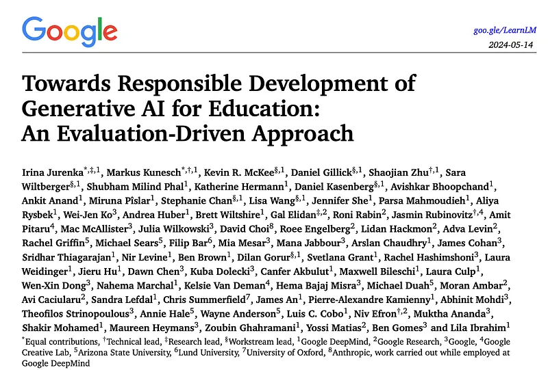 | Title card: LearnLM Tutor. |
| 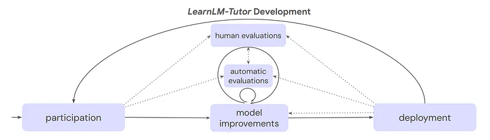 | LearnLM-Tutor Development. |
| 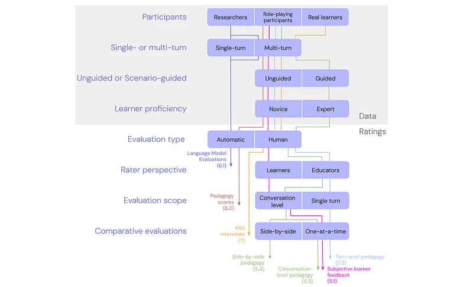 | Overview of the evaluation taxonomy. |
| 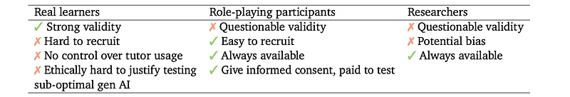 | Data collection: Participants To evaluate a gen AI tutor,its responses in learning conversations needs to be collected. |
|  | Data collection: Single- or multi-turn Should single conversation turns be collected individually, or should many turns be collected... |
| 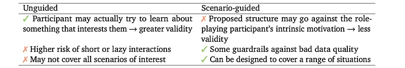 | Data collection: Learner proficiency Assuming paid participants are used to simulate learning interactions, should they be experts or... |
| 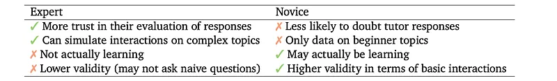 | Ratings: Evaluation Type Should tutor responses be rated by humans or automated strategies? |
| 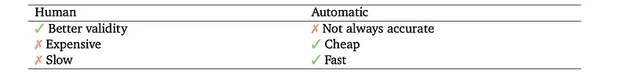 | Ratings: Evaluation Type Should tutor responses be rated by humans or automated strategies? |
| 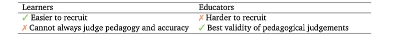 | Ratings: Rater Perspective Learners and educators have different perspectives on what makes a good tutor response. |
|  | Ratings: Comparative evaluations When comparing gen AI tutors, should we evaluate each on its own using common benchmarks, or should we... |
| 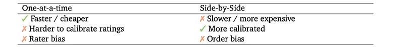 | Proposed Approach. |
| 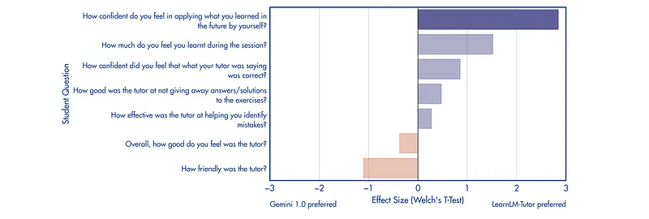 | Unguided conversations: Subjective learner feedback. |
| 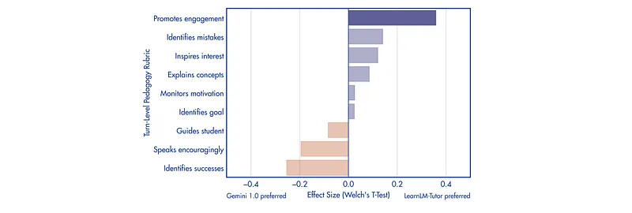 | Expert pedagogical raters reviewed and rated unguided conversations between learners and both LearnLM-Tutor and Gemini 1.0. |
| 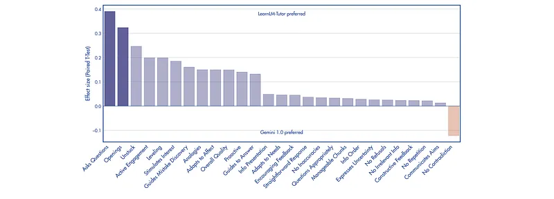 | Conversation-level pedagogy: teacher feedback. |
| 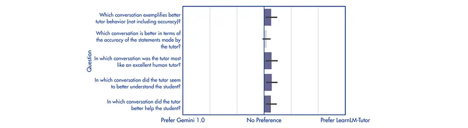 | Raters ranked pairs of conversations generated by LearnLM-Tutor and Gemini 1.0 based on five criteria adapted from the GenAI for Education... |
## Related

- [[Papers Explained Corpus]]
- [[Large Language Models]]
- [[Reinforcement Learning Topic]]
- [[Multilingual Models]]
- [[Supervised Fine-Tuning]]
- [[Reinforcement Learning]]
- [[Papers Explained Review 12 - LLMs for Maths]]
- [[Papers Explained 280 - LearnLM]]

#summary #topic
