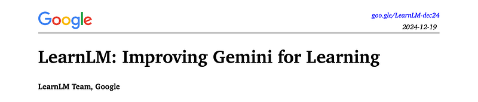
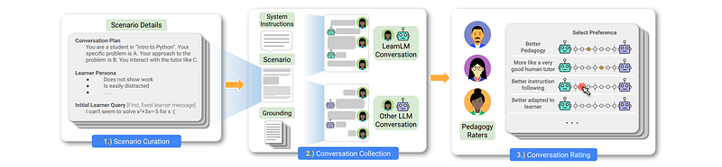
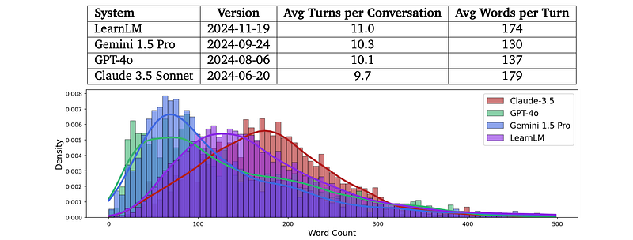
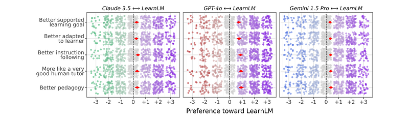
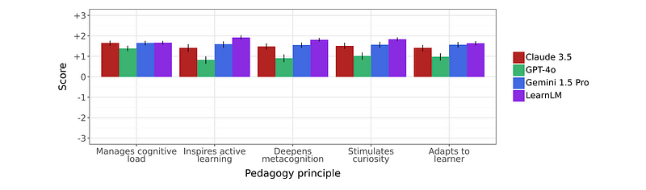
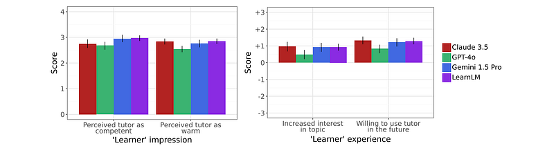

# Papers Explained 280 - LearnLM

LearnLM is designed to enhance Gemini’s learning capabilities and is trained using pedagogical instruction following. This involves providing the model with system-level instructions that define the desired pedagogical attributes in its responses.

This page ingests the source article into the wiki and connects it to [[Papers Explained Corpus]], [[Large Language Models]], [[Mixture of Experts]], [[Vision Language Models]], [[Safety and Alignment]], [[Reinforcement Learning Topic]], [[Supervised Fine-Tuning]].

## Source Metadata

- Source file: `raw/2025-01-03_Papers-Explained-280--LearnLM-df8cdc2fed45.html`
- Source title: Papers Explained 280: LearnLM
- Published: 2025-01-03
- Canonical: [https://medium.com/@ritvik19/papers-explained-280-learnlm-df8cdc2fed45](https://medium.com/@ritvik19/papers-explained-280-learnlm-df8cdc2fed45)

## Key Ideas

- SFT data is updated such that each conversation begins with a different System Instruction that specifically describes the pedagogical behavior present in that conversation.
- By co-training with Gemini’s post-training mixture, the model can learn new kinds of instruction following without “forgetting” other core reasoning, multimodal understanding, factuality, safety, or multi-turn properties.
- To evaluate the performance of LearnLM, against other leading LLMs (GPT-4o, Claude 3.5 Sonnet, and Gemini 1.5 Pro) in tutoring scenarios.
- 2360 conversations (58,459 messages) between the LLMs and learners are collected .
- LearnLM’s response length distribution differed from other models, but length wasn’t clearly correlated with perceived quality.

## Notes

LearnLM is designed to enhance Gemini’s learning capabilities and is trained using pedagogical instruction following. This involves providing the model with system-level instructions that define the desired pedagogical attributes in its responses. The model is created by incorporating pedagogical data into a post-training mixture with the existing Gemini 1.5 Pro model (co-training).

SFT data is updated according to a focus on pedagogical instruction. Reinforcement Learning from Human Feedback (RLHF) is additionally leveraged. For this, human preference data is collected to train Reward Models (RMs) and prompts for the RL stage. Instead of running post-training after Gemini’s standard post-training, co-training with Gemini is implemented, meaning data is mixed directly with Gemini’s SFT, RM, and RL stages. LearnLM is the result of this experimental mixture. Data and evaluations have also been integrated into the main Gemini models.

SFT data is updated such that each conversation begins with a different System Instruction that specifically describes the pedagogical behavior present in that conversation. More general or vague instructions are counterproductive because the model learns to ignore instructions that are not useful for predicting the target model turns.

To collect human preference data, each conversation is seeded with a different pedagogically-focused System Instruction, and raters label model samples based on the degree to which they adhere to those instructions. These conversations and turn-level labels are used to train a reward model, which is then employed during RLHF to score samples from the policy model. While SFT seems to improve pedagogical instruction following somewhat, RL is significantly more effective, as preference judgements often contain subtle distinctions in how instructions are interpreted and followed in the context of long conversations.

By co-training with Gemini’s post-training mixture, the model can learn new kinds of instruction following without “forgetting” other core reasoning, multimodal understanding, factuality, safety, or multi-turn properties. Moving forward, it can also more easily keep the model in sync with Gemini as the training recipe evolves.

## Evaluation

To evaluate the performance of LearnLM, against other leading LLMs (GPT-4o, Claude 3.5 Sonnet, and Gemini 1.5 Pro) in tutoring scenarios.

2360 conversations (58,459 messages) between the LLMs and learners are collected . Expert evaluations are conducted in two stages: (1) experts role-played as learners and provided feedback, and (2) experts compared pairs of conversations between LearnLM and other LLMs and rated them across various pedagogical categories.

- LearnLM’s response length distribution differed from other models, but length wasn’t clearly correlated with perceived quality.

*Figure: Pedagogy experts’ preferences over LearnLM and other contemporaneous systems.*

- LearnLM outperformed GPT-4o, Claude 3.5, and Gemini 1.5 Pro in comparative preference ratings across all five assessment categories, particularly in overall pedagogy.

*Figure: Evaluation of systems on each category of our pedagogy rubric from a 7-point Likert scale.*

- LearnLM received the highest ratings across all categories of a pedagogy rubric, excelling in inspiring active learning, deepening metacognition, and stimulating curiosity.

*Figure: Impressions shared by the pedagogy experts role-playing as learners in our pedagogical scenarios.*

- Learner experience with LearnLM, Gemini 1.5 Pro, and Claude 3.5 were similar in terms of stimulating interest, perceived warmth, and perceived usefulness, while GPT-4o scored lower in these areas.

## Paper

LearnLM: Improving Gemini for Learning [2412.16429](https://arxiv.org/abs/2412.16429)

## Figures

Figures from the Medium HTML export (`raw/2025-01-03_Papers-Explained-280--LearnLM-df8cdc2fed45.html`); local copies under `wiki/assets/papers-explained-280-learnlm/` when download succeeded.

| Figure | Caption |
|--------|---------|
|  | Title card: LearnLM. |
|  | LearnLM is designed to enhance Gemini’s learning capabilities and is trained using pedagogical instruction following. |
|  | 2360 conversations (58,459 messages) between the LLMs and learners are collected. |
|  | Pedagogy experts’ preferences over LearnLM and other contemporaneous systems. |
|  | Evaluation of systems on each category of our pedagogy rubric from a 7-point Likert scale. |
|  | Impressions shared by the pedagogy experts role-playing as learners in our pedagogical scenarios. |
## Related

- [[Papers Explained Corpus]]
- [[Large Language Models]]
- [[Mixture of Experts]]
- [[Vision Language Models]]
- [[Safety and Alignment]]
- [[Reinforcement Learning Topic]]
- [[Supervised Fine-Tuning]]
- [[Papers Explained 279 - LearnLM Tutor]]
- [[Papers Explained 281 - Tulu]]

#summary #topic
