# Papers Explained 281 - Tulu

This paper explores the instruction-tuning of language models using various open-source datasets.

This page ingests the source article into the wiki and connects it to [[Papers Explained Corpus]], [[Large Language Models]], [[Synthetic Data]], [[Reasoning Models]], [[Safety and Alignment]], [[Multilingual Models]], [[Supervised Fine-Tuning]].

## Source Metadata

- Source file: `raw/2025-01-06_Papers-Explained-281--Tulu-ee85648cbf1b.md`
- Source title: Papers Explained 281: Tulu
- Published: 2025-01-06
- Canonical: [https://medium.com/@ritvik19/papers-explained-181-tulu-ee85648cbf1b](https://medium.com/@ritvik19/papers-explained-181-tulu-ee85648cbf1b)

## Key Ideas

- Instruction tuning refers to the practice of fine tuning pretrained language models to better understand and respond to a wide variety of human requests that are expressed in natural language.
- SuperNI: A collection of diverse NLP tasks with instructions
- CoT: A collection of datasets annotated with chain-of-thoughts. The CoT mixture from the FLAN v2 collection is split out as a separate dataset.
- Flan V2: A collection of NLP tasks that combines a number of existing NLP datasets with various data augmentations.
- Dolly: A collection of instruction-following samples created by Databricks employees.

## Notes

This paper explores the instruction-tuning of language models using various open-source datasets. The researchers trained a suite of models ranging from 6.7B to 65B parameters on 12 different instruction datasets, systematically evaluating their performance across several areas including factual knowledge, reasoning, multilingual capabilities, coding, safety, and open-ended instruction following. TÜLU is the best-performing instruction-tuned language model suite developed in the research.

## Instruction Tuning and Resources

Instruction tuning refers to the practice of fine tuning pretrained language models to better understand and respond to a wide variety of human requests that are expressed in natural language. The success of instruction tuning requires at least two key components: 1) a powerful pretrained language model that has grasped a vast amount of knowledge from web-scale pretraining, and 2) an instruction dataset that is diverse and representative enough to adapt the LM to potential downstream usage.

### Instruction Datasets

*Figure: Instruction datasets investigated in this work. CoT and FLAN V2 are sampled to 100K to match the sizes of other datasets.*

- SuperNI: A collection of diverse NLP tasks with instructions

- CoT: A collection of datasets annotated with chain-of-thoughts. The CoT mixture from the FLAN v2 collection is split out as a separate dataset.

- Flan V2: A collection of NLP tasks that combines a number of existing NLP datasets with various data augmentations.

- Dolly: A collection of instruction-following samples created by Databricks employees.

- Open Assistant 1: A crowdsourced human-annotated assistant-style conversation corpus, consist- ing of a large number of sample conversations in a wide variety of languages.

- Self-Instruct: A dataset of instruction-following samples created by prompting GPT-3 to create new samples given some example instances.

- Unnatural Instructions: A dataset of instruction-following samples created by prompting Davinci- 002.

- Alpaca: A dataset created using a self-instruct-style method with Davinci-003 as the generation model and some improvements over self-instruct.

- Code-Alpaca: A dataset created using the Alpaca method, but focussing on code generation.

- GPT-4 Alpaca: A dataset created using the Alpaca dataset as inputs, but replacing the example generations with generations from GPT-4.

- Baize: A dataset created by prompt ChatGPT and letting it converse with itself.

- ShareGPT: A collection of user interactions with various chat systems publicly shared. The ‘html-cleaned’ variant available is used. Long conversations (over 2048 tokens) are split into max-2048 token chunks, following the Vicuna setup. No further filtering of samples is done.

### Pretrained Models

*Figure: Base models that are finetuned in this work.*

The LLAMA suite, a series of pretrained models ranging in size from 6.7B to 65B parameters, is primarily used. LLAMA-1 models were initially used, and LLAMA-2 was subsequently added. OPT and Pythia models with a size comparable to the LLAMA 6.7B model are also considered, to examine the effect of different base models.

## Training Models with Various Datasets

All datasets are formatted to follow a chatbot-style schema to unify the varied styles and formats of the instruction datasets. Special tokens <|user|> and <|assistant|> are added before user utterances and target assistant responses respectively, and an end-of-text marker </s> at the end of each assistant output. At inference time, this marker will stop the model’s response for each round.

*Figure: An example from ShareGPT data.*

Existing studies have shown that increasing the diversity of instructions can effectively improve the performance of instruction tuning. Following this motivation, two mixtures of datasets are created:

- A Human data mixture, which comprises the best human-authored datasets, including FLAN V2, CoT, Dolly, and Open Assistant 1

- A Human+GPT data mixture, which comprises the human mixture and three additional datasets that have generations by OpenAI GPT models, including GPT4-Alpaca, Code-Alpaca, and ShareGPT.

LLAMA models trained on the Human+GPT data mixture are named TÜLU, after a hybrid camel resulting from interbreeding between different species. TÜLU models are differentiated from the LLAMA-2 base models by versioning them as TÜLU-1.1.

## Evaluation Setup

### Model-Based Evaluation using GPT-4

To evaluate the open-ended instructability, a model-based approach introduced in AlpacaEval is adopted. The test set consists of 805 instructions, with 252 instructions from the Self-Instruct evaluation, 188 from the Open Assistant evaluation, 129 from the helpful evaluation by Anthropic, 80 from the Vicuna evaluation, and 156 from the Koala evaluation. The simulated GPT-4 annotator, which computes the win rate of the testing model as judged by GPT-4 when compared to the outputs produced by Davinci-003, is used. The AlpacaEval codebase and prompt are utilized.

### Human Evaluation

To further test the quality of the open-ended generations, a human evaluation is conducted based on 332 instructions that combine the Self-Instruct evaluation set and Vicuna evaluation set.

- Individual acceptability is assessed by asking human raters to determine if each system’s responses were acceptable in isolation. This is a binary decision, and raters mark a response as acceptable if and only if the response answered the request in the query, had no significant errors, and did not have repetitive information.

- Pairwise preference is then assessed by asking humans to compare the outputs of two systems and select which one they think is more helpful. This is a 5-way decision, and raters could select if one of the responses is “clearly” or “slightly” better than the other or if it is a tie implying that both responses were equally good or bad.

## Evaluation

### Analysis of Instruction Tuning Datasets and Base Models

*Figure: Comparison of different instruction tuning datasets.*

*Figure: Performance of different base models after training on the Human+GPT data mixture.*

- There’s no single best instruction dataset; different datasets improve performance on different tasks. For example, CoT is beneficial for mathematical reasoning (GSM), and Code-Alpaca helps with Codex-Eval

- Combining datasets yields the best overall performance across tasks, although not necessarily the best for individual tasks. This suggests that better dataset mixing strategies could improve performance further.

- The quality of the base model significantly impacts performance. LLaMa consistently outperforms OPT and Pythia, likely due to its larger pretraining dataset. The improvement with LLAMA-2 further supports this.

- Some datasets (e.g., self-instruct) degrade performance on certain tasks (e.g., GSM, TydiQA), possibly due to data quality issues, lack of chain-of-thought examples, or limited multilingual data.

### Pushing the Limits of Open Models

*Figure: Performance of TÜLU and other trained models to vanilla LLAMA models and the state-of-the-art proprietary models across evaluation settings.*

- Instruction tuning significantly improves the performance of all LLAMA model sizes, with smaller models showing the most substantial relative improvement.

- The 65B LLAMA model performs comparably to or even better than the 65B TÜLU model (instruction-tuned) on MMLU, BBH, and TydiQA, suggesting that instruction tuning may not benefit models already possessing strong capabilities and could even lead to a loss of original capabilities.

- Despite improvements, TÜLU models still lag behind ChatGPT and GPT-4 across all evaluation metrics. This gap is considered significant and not likely due to data contamination in the evaluation datasets.

### Evaluation of Potential Risks and Harms

*Figure: Performance of models on ToxiGen and TruthfulQA.*

- Models trained on GPT-distilled datasets generally performed best across both toxicity and truthfulness benchmarks.

- Models trained on GPT-sourced data produced less toxic outputs than GPT itself. Larger models trained on GPT-distilled data almost entirely avoided generating toxic content, potentially due to overfitting on refusal behaviors. This contrasts with GPT and GPT-4, which generated toxic outputs a significant portion of the time.

- TruthfulQA performance did not improve with increasing model size. Larger models produced more factually correct answers but also hedged and refused to answer more frequently, leading to no net improvement in overall performance. This contrasts with the trend observed in other benchmarks.

### Model-Based Evaluation Results for Open-Ended Generation

*Figure: Win-rate (%) of LLAMA models of varying sizes finetuned on the given dataset against Davinci-003 using AlpacaEval.*

*Figure: Win-rate scores of 13B models given by GPT-4 strongly correlate with the average numbers of unique tokens in the model responses (Pearson 𝑟 = 0.96).*

Models trained on traditional NLP datasets performed poorly on open-ended instruction following, despite improvements shown in other metrics. This contrasts with the strong performance of models trained on datasets encouraging long, diverse generations.

- Datasets like ShareGPT, which encourage long and diverse generations, yielded the best-performing models. ShareGPT consistently outperformed other models, even those significantly larger (e.g., 13B ShareGPT vs 65B TÜLU). This suggests that data diversity and length of generated responses are crucial factors.

- A strong positive correlation (Pearson correlation of 0.96, p << 0.05) was found between the average number of unique tokens generated and the AlpacaEval win-rate. While this doesn’t imply that AlpacaEval simply counts unique tokens, it highlights that model preference scores don’t necessarily reflect all model capabilities.

- Model preference evaluation (like AlpacaEval) is insufficient for a holistic evaluation of LLMs and should be part of a broader evaluation framework.

### Human Evaluation Results for Open-Ended Generation

*Figure: Human acceptance and Human preference rates.*

- The 65B TÜLU model outperforms the 7B TÜLU model across all evaluations (AlpacaEval, benchmark-based evaluation, and human evaluation). This suggests that larger base models are beneficial.

- A significant performance gap remains between the 65B TÜLU model and ChatGPT.

- Using distilled datasets significantly improves model performance, indicating a deficiency in human-authored datasets.

- While the 7B TÜLU model outperforms the 65B human-mix TÜLU model in model preference evaluations, acceptability scores suggest the opposite, highlighting potential limitations of pairwise model comparisons.

- The 65B human-mix model is more likely to produce acceptable responses than the 7B model, despite the pairwise comparison results.

## Paper

How Far Can Camels Go? Exploring the State of Instruction Tuning on Open Resources [2306.04751](https://arxiv.org/abs/2306.04751)

## Figures

Figures from the Medium HTML export (`raw/2025-01-06_Papers-Explained-281--Tulu-ee85648cbf1b.md`); local copies under `wiki/assets/papers-explained-281-tulu/` when download succeeded.

| Figure | Caption |
|--------|---------|
| 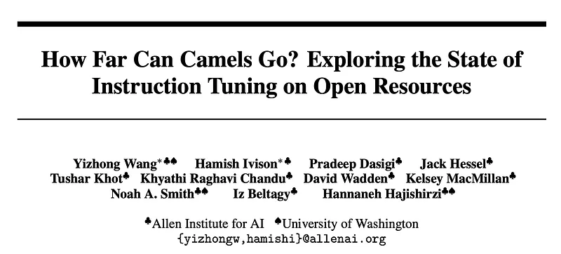 | Title card: Tulu. |
| 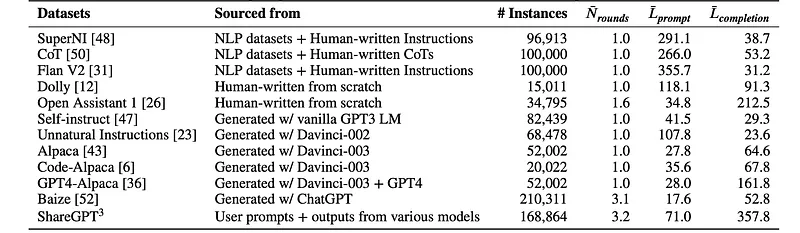 | Instruction datasets investigated in this work. CoT and FLAN V2 are sampled to 100K to match the sizes of other datasets. |
| 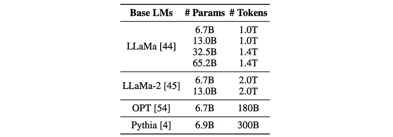 | Base models that are finetuned in this work. |
| 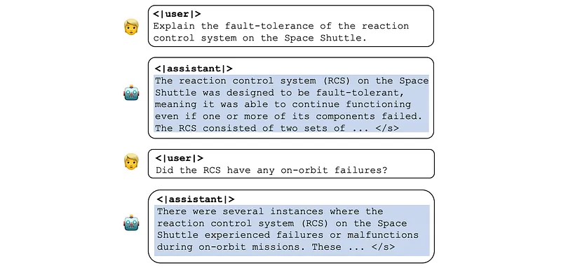 | An example from ShareGPT data. |
| 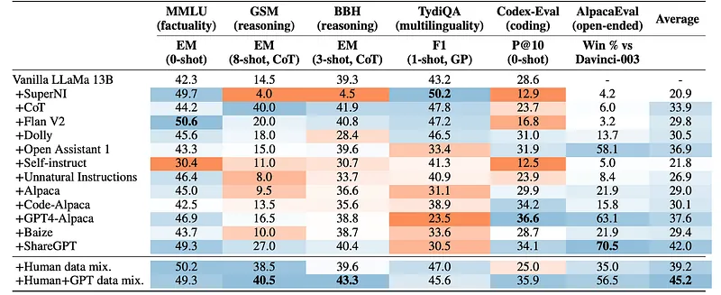 | Comparison of different instruction tuning datasets. |
| 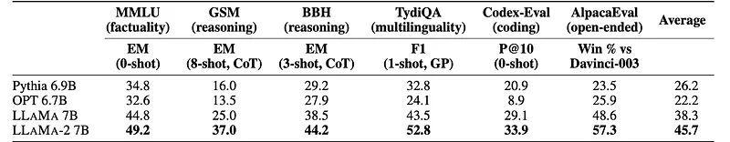 | Performance of different base models after training on the Human+GPT data mixture. |
| 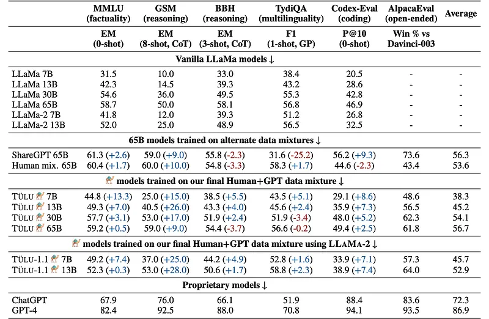 | Performance of TÜLU and other trained models to vanilla LLAMA models and the state-of-the-art proprietary models across evaluation settings. |
| 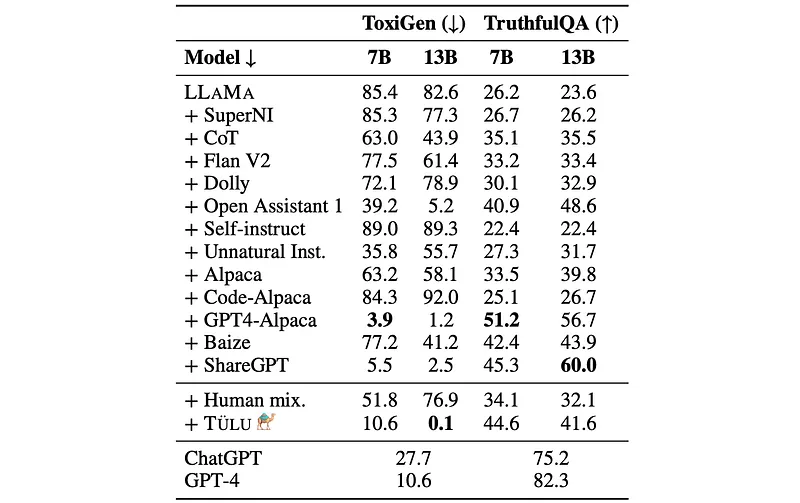 | Performance of models on ToxiGen and TruthfulQA. |
| 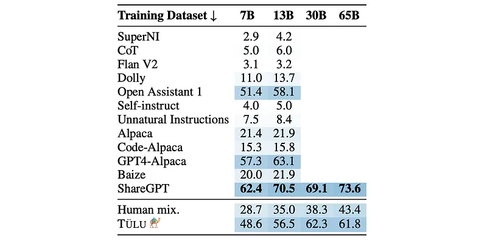 | Win-rate (%) of LLAMA models of varying sizes finetuned on the given dataset against Davinci-003 using AlpacaEval. |
| 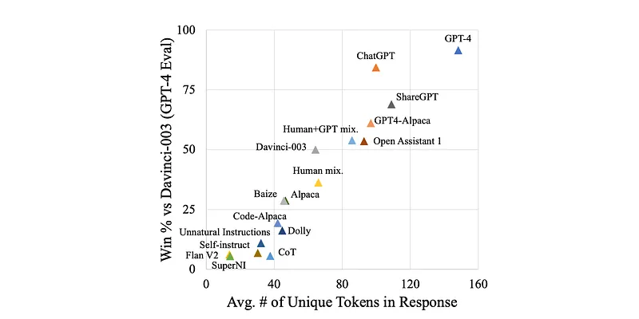 | Win-rate scores of 13B models given by GPT-4 strongly correlate with the average numbers of unique tokens in the model responses (Pearson 𝑟 = 0.96). |
| 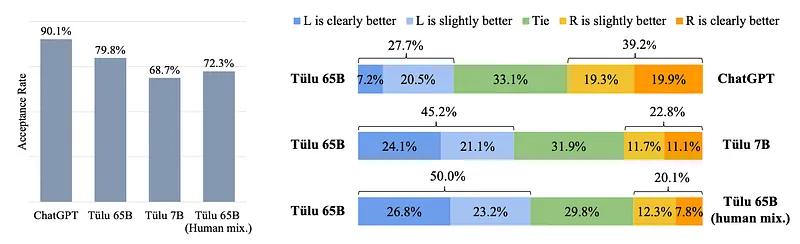 | Human acceptance and Human preference rates. |
## Related

- [[Papers Explained Corpus]]
- [[Large Language Models]]
- [[Synthetic Data]]
- [[Reasoning Models]]
- [[Safety and Alignment]]
- [[Multilingual Models]]
- [[Supervised Fine-Tuning]]
- [[Papers Explained 280 - LearnLM]]
- [[Papers Explained 282 - Tulu V2]]

#summary #topic
