# Papers Explained 283 - Tulu V3

The [models](https://huggingface.co/collections/allenai/tulu-3-models-673b8e0dc3512e30e7dc54f5) and [datasets](https://huggingface.co/collections/allenai/tulu-3-datasets-673b8df14442393f7213f372) are available at HuggingFace.

This page ingests the source article into the wiki and connects it to [[Papers Explained Corpus]], [[Reinforcement Learning Topic]], [[Synthetic Data]], [[Safety and Alignment]], [[Reasoning Models]], [[Large Language Models]], [[Reinforcement Learning]], [[Supervised Fine-Tuning]], [[Verifier-Bounded Learning]], [[On-Policy Distillation]].

## Source Metadata

- Source file: `raw/2025-01-08_Papers-Explained-283--Tulu-V3-fc7758b18724.html`
- Source title: Papers Explained 283: Tulu V3
- Published: 2025-01-08
- Canonical: [https://medium.com/@ritvik19/papers-explained-183-tulu-v3-fc7758b18724](https://medium.com/@ritvik19/papers-explained-183-tulu-v3-fc7758b18724)

## Key Ideas

- The TÜLU 3 effort began with identifying key areas where open post-training recipes often fall behind and that are desirable capabilities for generalist language models.
- Data Curation: A variety of prompts are curated to be allocated across multiple stages of optimization. New synthetic prompts or, when available, prompts from existing datasets are created to target specific capabilities.
- Supervised Fine Tuning: Supervised finetuning (SFT) is performed on carefully selected prompts and completions.
- Preference Tuning: Preference tuning, specifically DPO, is applied to newly curated on-policy synthetically created preference data from selected prompts along with off-policy data.
- Reinforcement Learning with Verifiable Rewards: A new RL-based post-training stage trains the model on verifiable rewards instead of a reward model, as is common for traditional RLHF PPO training.

## Notes

TÜLU 3 is a family of fully-open state-of-the-art post-trained models. It includes data, code, and training recipes, serving as a comprehensive guide for modern post-training techniques. TÜLU 3 builds on Llama 3.1 base models and achieves results surpassing the instruct versions of Llama 3.1, Qwen 2.5, Mistral, and even closed models such as GPT-4o-mini and Claude 3.5-Haiku. The training algorithms for the models include supervised fine-tuning (SFT), Direct Preference Optimization (DPO), and a novel method called Reinforcement Learning with Verifiable Rewards (RLVR).

The [models](https://huggingface.co/collections/allenai/tulu-3-models-673b8e0dc3512e30e7dc54f5) and [datasets](https://huggingface.co/collections/allenai/tulu-3-datasets-673b8df14442393f7213f372) are available at HuggingFace.

## Overview

*Figure: An overview of the TÜLU 3 recipe.*

The TÜLU 3 effort began with identifying key areas where open post-training recipes often fall behind and that are desirable capabilities for generalist language models.

- Data Curation: A variety of prompts are curated to be allocated across multiple stages of optimization. New synthetic prompts or, when available, prompts from existing datasets are created to target specific capabilities.

- Supervised Fine Tuning: Supervised finetuning (SFT) is performed on carefully selected prompts and completions. Through thorough experimentation, the final SFT data and training hyperparameters are determined to enhance target core skills without significantly impacting the performance of others.

- Preference Tuning: Preference tuning, specifically DPO, is applied to newly curated on-policy synthetically created preference data from selected prompts along with off-policy data. As in the SFT stage, the best preference data mix is identified through thorough experimentation, uncovering what formats of data, methods, or hyperparameters lead to improvements.

- Reinforcement Learning with Verifiable Rewards: A new RL-based post-training stage trains the model on verifiable rewards instead of a reward model, as is common for traditional RLHF PPO training. Tasks with verifiable outcomes, such as mathematical problem-solving, are selected and rewards are only provided when the model’s generations are verified to be correct. RL is then used to train on these rewards.

## TÜLU 3 Data

*Figure: Summary of theprompt dataset.*

### Sourcing from Public Datasets

The process begins with a broad survey of public datasets, including those annotated by dedicated workers, sourced from real users, and synthesized with models. Each individual dataset is then manually reviewed, and those meeting the following considerations are selected:

Diversity: Datasets that promote diversity are chosen, including WildChat, a large source of real-user interaction with models; Open Assistant, created by volunteer workers for general chatting; No Robots, annotated by expert workers for a broad range of open-ended categories; and FLAN v2, a big compilation of classical NLP tasks. A decontaminated subset of UltraFeedback, a composition of several datasets (FalseQA, UltraChat, Evol-Instruct, FLAN v2) and showing strong performance for general preference tuning, is also included.

Target Skills: OpenMathInstruct and NuminaMath are included for math reasoning, Evol-CodeAlpaca for coding, a subset of Daring-Anteater for precise instruction following, Aya for multilinguality, SciRIFF for scientific literature understanding, and TableGPT for processing table-related tasks.

### Synthesizing for Target Skills

To ensure diversity in generation, the persona-driven methodology is followed to generate synthetic data. The key idea is to use different personas (e.g., “A machine learning researcher focused on neural networks”) with a data synthesis prompt (e.g., “create a coding problem”) to steer an LLM to synthesize data with corresponding perspectives. Specifically, ∼250K personas from Persona Hub are conditioned on to generate prompts targeting specific skills such as precise instruction following, math and coding.

Precise instruction following is the ability to follow verifiable instructions in natural language, such as “write 3 paragraphs,” that can be automatically verified with heuristics. Verifiable instructions covering 25 different constraint types defined in IFEval benchmark are generated. Manually writing 1–2 example instructions per constraint results in a total of 33 verifiable instructions which are used as seed prompts. New instructions are then generated using GPT-4o given a data synthesis prompt, persona, and a single verifiable instruction as an example. In total, 29,980 verifiable instruction-response pairs are collected and called IF-PERSONA-SFT.

For math and coding, GPT-4o is zero-shot prompted to generate problems that are unique and specific to a given persona input. Having generated the problems, multi-step math solutions are generated using GPT-4o, and python programs using claude-3–5-sonnet. In total, ∼220K and 35K instances are collected for math reasoning and coding.

It is crucial to ensure models can reliably reject unsafe and appropriately handle nuanced and out of scope queries. A set of noncompliance queries that the model ought to not comply with, alongside safety-related direct and adversarial prompts covering both benign and harmful scenarios are curated. Noncompliance prompts are obtained based on a contextual noncompliance taxonomy spanning multiple categories including incomplete, unsupported, indeterminate, and humanizing requests (in addition to unsafe requests). Safety-related prompts are carefully selected among synthetic adversarial prompts, synthetic vanilla (direct) requests, real-world user-LLM interactions (In-The-Wild), and curated annotator-written examples to maximize coverage, diversity, and balance.

### Prompt Decontamination

*Figure: Decontaminated datasets. % is the percent of the dataset removed.*

Experiments were conducted with full-string, n-gram, and embedding-based matching. N-gram matching yielded the most useful results. While embedding-based methods can in principle identify non-trivial contamination like that due to paraphrasing, it was difficult to distinguish mere distributional similarity from actual paraphrasing.

For each token in a test instance, it is considered to match a token in a train instance if the two instances share an 8-gram containing that token. A test instance itself is considered to have significant overlap with a train instance if more than 50% of the test tokens have 8-gram matches with the same training instance.

A training set is considered contaminated if any number of its instances overlap with more than 2% of the instances in any of the evaluations in the development and unseen suites. All the training sets that were contaminated with the unseen evaluations were removed.

*Figure: Public datasets where significant (>5% eval overlap) contamination is found.*

## Supervised Fine Tuning

For prompts with existing responses, the original response is kept if it was written by a human or a frontier model, like GPT-4o. Empty responses and responses that contain information about models or their developers are additionally filtered. If a set of prompts did not have responses, like Persona prompts, or if the original responses were from a weaker model (e.g. WildGuardMix), new responses are generated using GPT-4o. Hardcoded prompts have hand-written responses.

To develop the SFT mix, skills that were lagging behind state of the art models using Llama 3.1 trained on TÜLU 2 were first identified. Targeting each of these skills in isolation, high quality publicly available datasets and synthetic datasets were collected.

These mixtures were then combined to create the initial TÜLU 3 preview mix. The mixture was then iterated on by adding or removing datasets to improve lagging skills, decontaminating against evaluations and downsampling particularly large datasets.

### Key Data Experiments

TÜLU 3 8B SFT and TÜLU 3 70B SFT models are compared against other SFT-only models trained on Llama 3 8B or 70B. A series of controlled experiments were run after developing the final SFT mix to explore the importance of different decisions made during data mixing and training.

*Figure: Summary of the performance of TÜLU 3 SFT models against comparable baselines.*

- The new TÜLU 3 SFT mix significantly outperforms the previous TÜLU 2 mix and other competitive 8B SFT models.

*Figure: Performance during the SFT ablations.*

- Removing WildChat, a source of diverse chat data, leads to a small but noticeable performance degradation across multiple skills, particularly on AlpacaEval. This highlights the importance of diverse real-world data.

- Safety-specific SFT data is largely orthogonal to other datasets in the mix. Removing it primarily affects safety performance, while other skills remain relatively unchanged. Contrastive prompts help prevent over-refusal of safe prompts.

- New Persona datasets targeting mathematics, coding, and instruction following improve performance on HumanEval(+), GSM8K, MATH, and IFEval. Removing these datasets leads to a drop in performance on these metrics.

- Data targeting specific skills, such as mathematics, significantly improves performance on relevant metrics (GSM8K and MATH). Removing mathematics-specific data leads to a substantial drop in performance on these metrics.

*Figure: Average and skill-specific performance on stratified subsamples of the final SFT mix.*

- Model performance generally improves with increasing amounts of SFT data, with notable gains on GSM8K. However, TruthfulQA performance decreases as the data size increases. Further increases in SFT data size were not explored due to allocation of prompts for preference optimization.

### Key Training Experiments

*Figure: Mathematical performance of different base models trained on the mix.*

Base Model Choice: Both larger model size (70B vs. 8B) and domain-specific pretraining data (Qwen 2.5 Math vs. Qwen 2.5) significantly improved performance on GSM8K and MATH datasets.

*Figure: The impact of different chat templates on SFT model performance, trained using an intermediate SFT mixture on Llama 3.0.*

Chat Template Variation: Replacing newlines with eos tokens in the chat template yielded the best performance, but this approach was not adopted due to potential inconsistencies in later post-training stages. Removing the newline at the end of the template had some impact, but the best performing template was included in the codebase.

*Figure: Average performance of our 8B and 70B SFT models using random seeds, and compared against the best model soup using the models trained with different seeds.*

Random Seeds and Model Soups: Performance varied noticeably across different random seeds. The best performing model soup did not consistently outperform the best single model trained with a specific seed. Therefore, the best single SFT run for each model size was selected for the final models.

## Preference Fine Tuning

*Figure: Pipeline for generating and scaling preference data that is based from Ultrafeedback.*

Our data creation pipeline consists of three stages: prompt selection, response generation from a pool of models, and preference annotation with LLM-as-a-judge to create (preferred, rejected) pairs.

*Figure: Summary of the best preference dataset mixes for TÜLU 3 8B DPO and TÜLU 3 70B DPO.*

### Key Findings of Data Ablations

*Figure: Effect of scaling the size of the preference dataset, specifically the number of unique prompts, on downstream DPO model performance.*

- Scaling with Unique Prompts: Increasing the number of unique prompts improves downstream DPO performance across several metrics.

*Figure: Effect of scaling a preference dataset by duplicating prompts on downstream DPO performance using the Ultrafeedback dataset.*

- Scaling with Duplicated Prompts: Duplicating prompts with different responses does *not* significantly improve DPO performance, and may even degrade it. Investing in unique prompts is more effective.

*Figure: Effect of reusing prompts from SFT mix and new prompts from the same datasets subsampled for the SFT dataset mix.*

- Unused vs. Reused Prompts: Using new, unused prompts from the same datasets as the SFT (Supervised Fine-Tuning) stage leads to slightly better DPO performance than reusing SFT prompts. Combining unused and reused prompts yields the best results.

*Figure: Effect of including on-policy data during the Response Generation stage of the synthetic preference data pipeline on downstream DPO model performance.*

- On-Policy Data: Including on-policy data (text generations from the SFT model) improves downstream DPO performance compared to using only off-policy data.

*Figure: Performance of DPO models trained on preference annotations by different LLM judges.*

- LLM Judge Comparison: GPT-4o, Llama 3.1 (405B), and GPT-4 turbo perform similarly as preference judges, with GPT-4o slightly ahead. GPT-4o was chosen for the synthetic pipeline due to ease of use, cost, and batch inference speed.

*Figure: Effect of different DPO mix on 8B and 70B models: UltraFeedback, Helpsteer2, and the best preference mix.*

- Beyond Ultrafeedback: The TÜLU 3 preference mix significantly outperforms training on Ultrafeedback alone, especially for the 70B model. This suggests the limitations of using existing preference datasets with less capable models’ completions. Helpsteer2 also performs worse than the best mix.

*Figure: Adding persona preference data to the SFT Reused mix for DPO.*

- Persona Preference Data: Only the Persona IF (Instruction Following) preference data improves average and targeted IFEval scores. Persona Math and Code data do not improve their respective evaluations and slightly harm the average score. Only Persona IF was included in the final mix.

*Figure: Performance of different IF-targeted preference mixes, average and IFEval.*

- Targeting Instruction Following: Several methods were explored: Persona IF (rewriting prompts to relax constraints), IF-augmented (combining instructions with constraints), and WildChat IF (using prompts with constraints from WildChat). IF-persona significantly improves IFEval scores. IF-augmented-verified (filtered IF-augmented) offers a smaller improvement. Combining both yields the best IFEval performance.

- WildChat Data: Adding WildChat preference data generally improves DPO performance. Reusing WildChat prompts from SFT training performs better than combining reused and unused prompts.

*Figure: Comparing the use of the original completions to regenerating completions using our synthetic preference pipeline.*

- Regenerated Preference Datasets: Regenerating completions and preferences for existing datasets (Helpsteer2, Ultrafeedback, MultiPref) using the synthetic pipeline improves downstream DPO performance compared to the original datasets.

## Reinforcement Learning on Verifiable Rewards

*Figure: An overview of how Reinforcement Learning with Verifiable Rewards (RLVR) works.*

RLVR, a novel method for training language models, leverages the existing RLHF objective but replaces the reward model with a verification function.

Data for RLVR is created by obtaining prompts with an accompanying binary verifier. Two domains (mathematics, exact instruction following) and three evaluations (GSM8K, MATH, IFEval) are focused on, utilizing relatively straightforward methods for verification.

For GSM8K, each sample is augmented with the standard 8-shot prompt used during evaluation to encourage the model to use chain-of-thought. The final number produced is then extracted and compared to the ground-truth label to determine correctness.

In MATH, similar to GSM8K, each sample is augmented with the standard 3-shot CoT prompt to encourage chain-of-thought generation during evaluation. The answer is then extracted and correctness is determined following the ‘flex’ MATH evaluation logic.

IFEval utilizes randomly sampled instructions from the TÜLU 2 SFT mix combined with constraints. A verification function exists for each constraint template, able to verify whether a completion satisfies a constraint.

With these prompts and verification functions, models are trained via Proximal Policy Optimization (PPO).

*Figure: Summary of the verifiable prompt dataset.*

### Key Findings

- RLVR improves performance: Training with RLVR leads to improved test performance across all three settings, outperforming the initial model in each evaluation. Verifiable rewards (correctness on the training set) also consistently improve. Increased KL budget doesn’t always correlate with improved verifiable rewards in GSM8K and MATH.

*Figure: The comparison of RLVR’s performance on GSM8K between starting from a DPO checkpoint and starting from a weaker SFT checkpoint.*

- Starting point influences KL divergence but not final verifiable rewards: Both weaker (SFT) and stronger (DPO) initial models can achieve the same level of verifiable rewards, but the weaker model requires a larger KL divergence. However, starting from a stronger model generally results in better test set performance.

*Figure: The performance of RLVR vs KL Divergence under different value model initialization.*

- Initializing from a general RM is beneficial: Initializing RLVR’s value function from a general reward model achieves the highest GSM8K test score and higher average scores, highlighting the importance of the value function.

*Figure: Comparison of 1) using scores from on top of the verifiable rewards and 2) using only the verifiable rewards.*

- Verifiable rewards alone are superior: Using only verifiable rewards outperforms using scores from the reward model, as the latter introduces noise.

## Paper

TÜLU 3: Pushing Frontiers in Open Language Model Post-Training [2411.15124](https://arxiv.org/abs/2411.15124)

## Figures

Figures from the Medium HTML export (`raw/2025-01-08_Papers-Explained-283--Tulu-V3-fc7758b18724.html`); local copies under `wiki/assets/papers-explained-283-tulu-v3/` when download succeeded.

| Figure | Caption |
|--------|---------|
| 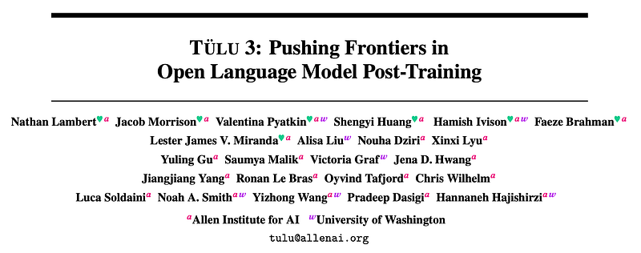 | Title card: Tulu V3. |
| 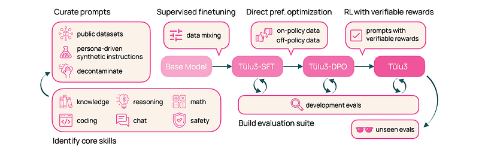 | An overview of the TÜLU 3 recipe. |
| 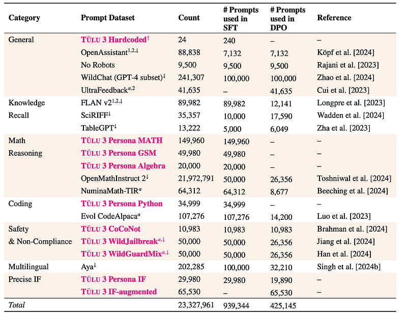 | Summary of theprompt dataset. |
| 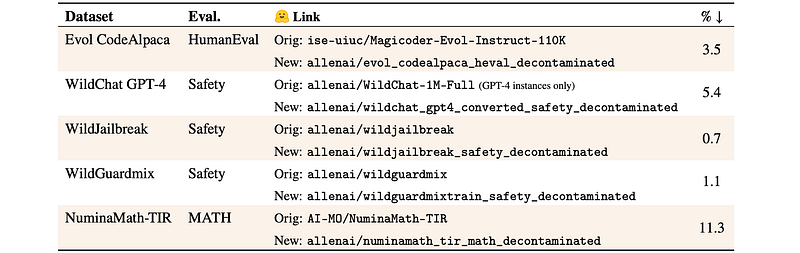 | Decontaminated datasets. % is the percent of the dataset removed. |
| 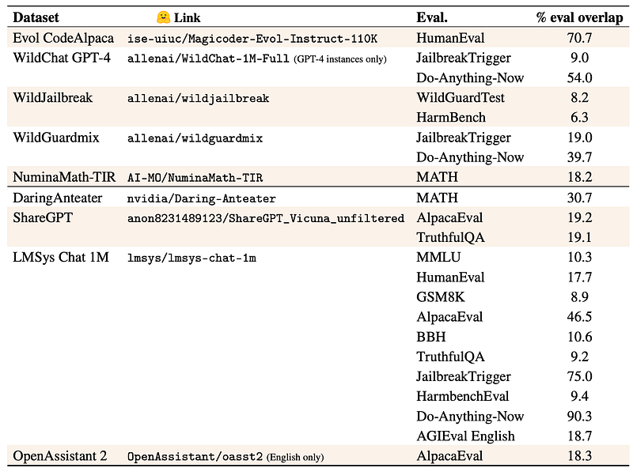 | Public datasets where significant (>5% eval overlap) contamination is found. |
| 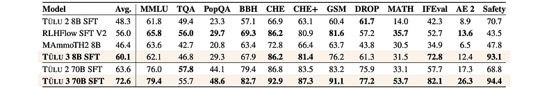 | Summary of the performance of TÜLU 3 SFT models against comparable baselines. |
| 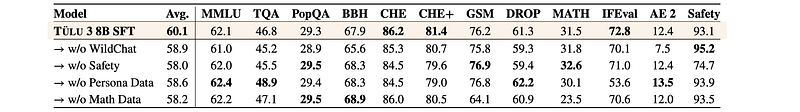 | Performance during the SFT ablations. |
| 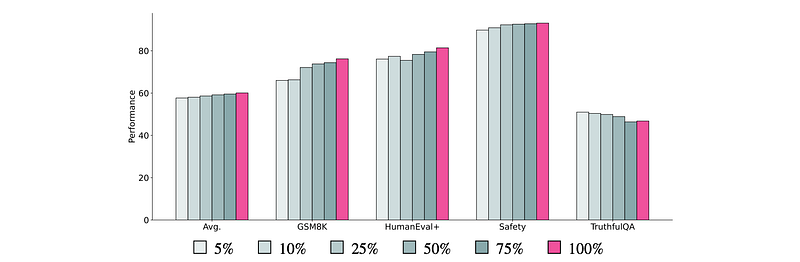 | Average and skill-specific performance on stratified subsamples of the final SFT mix. |
|  | Mathematical performance of different base models trained on the mix. |
|  | The impact of different chat templates on SFT model performance, trained using an intermediate SFT mixture on Llama 3.0. |
| 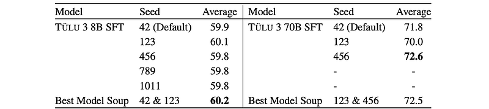 | Average performance of our 8B and 70B SFT models using random seeds, and compared against the best model soup using the models trained with different seeds. |
| 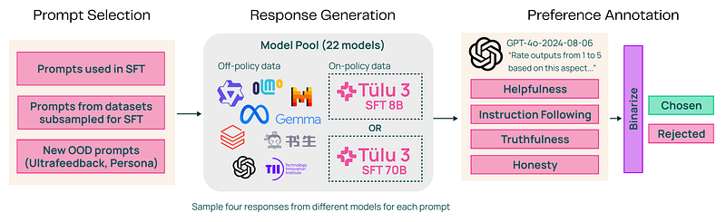 | Pipeline for generating and scaling preference data that is based from Ultrafeedback. |
| 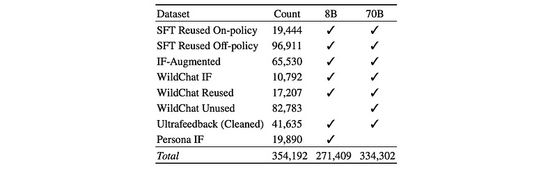 | Summary of the best preference dataset mixes for TÜLU 3 8B DPO and TÜLU 3 70B DPO. |
| 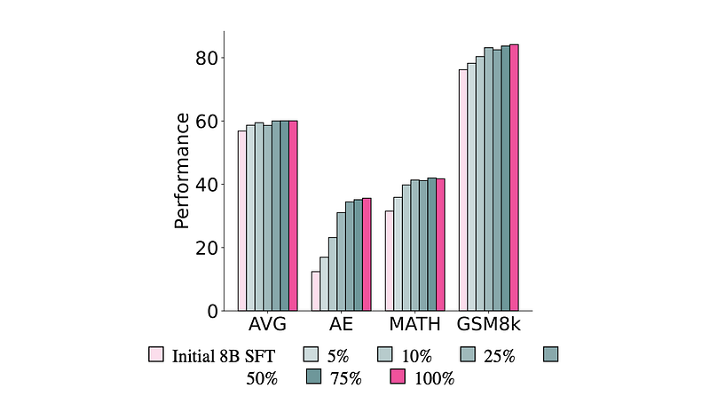 | Effect of scaling the size of the preference dataset, specifically the number of unique prompts, on downstream DPO model performance. |
| 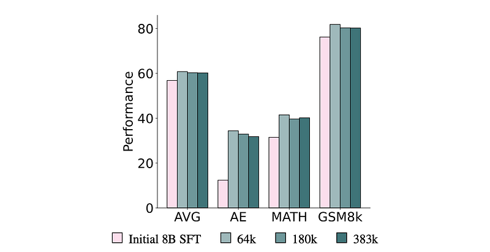 | Effect of scaling a preference dataset by duplicating prompts on downstream DPO performance using the Ultrafeedback dataset. |
| 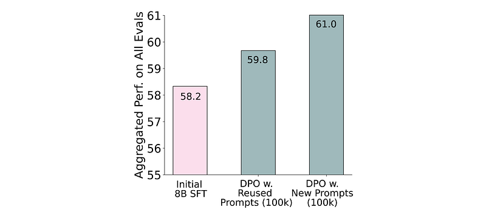 | Effect of reusing prompts from SFT mix and new prompts from the same datasets subsampled for the SFT dataset mix. |
| 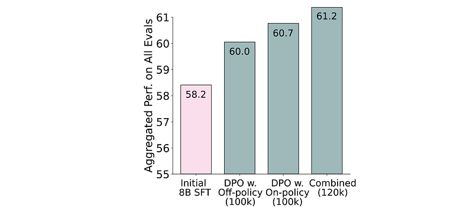 | Effect of including on-policy data during the Response Generation stage of the synthetic preference data pipeline on downstream DPO model performance. |
| 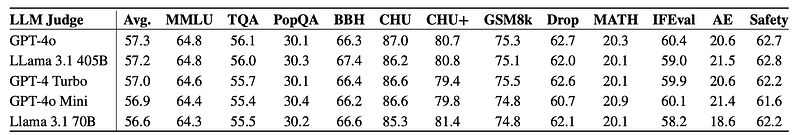 | Performance of DPO models trained on preference annotations by different LLM judges. |
| 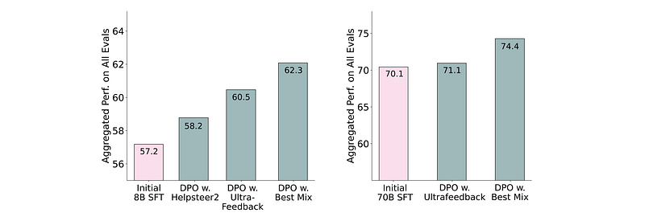 | Effect of different DPO mix on 8B and 70B models: UltraFeedback, Helpsteer2, and the best preference mix. |
| 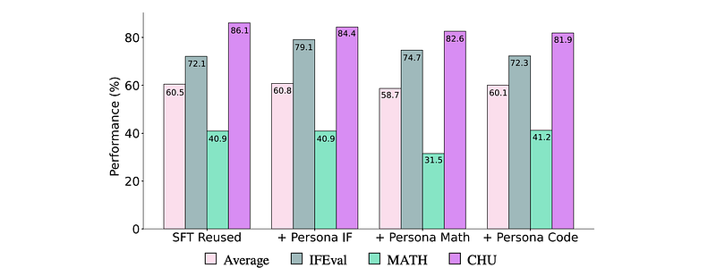 | Adding persona preference data to the SFT Reused mix for DPO. |
| 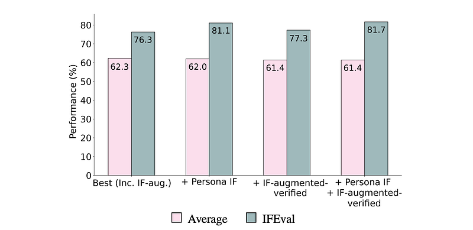 | Performance of different IF-targeted preference mixes, average and IFEval. |
| 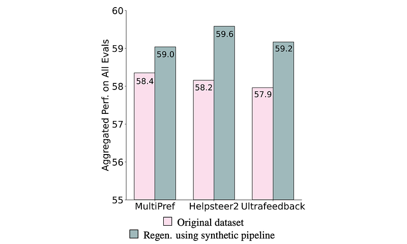 | Comparing the use of the original completions to regenerating completions using our synthetic preference pipeline. |
| 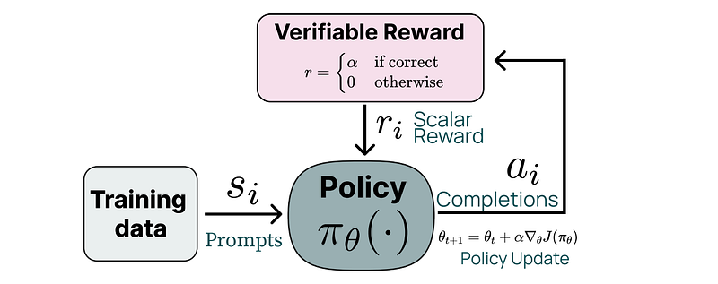 | An overview of how Reinforcement Learning with Verifiable Rewards (RLVR) works. |
| 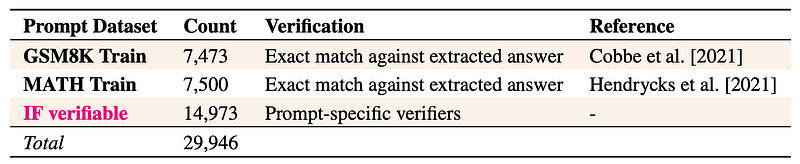 | Summary of the verifiable prompt dataset. |
| 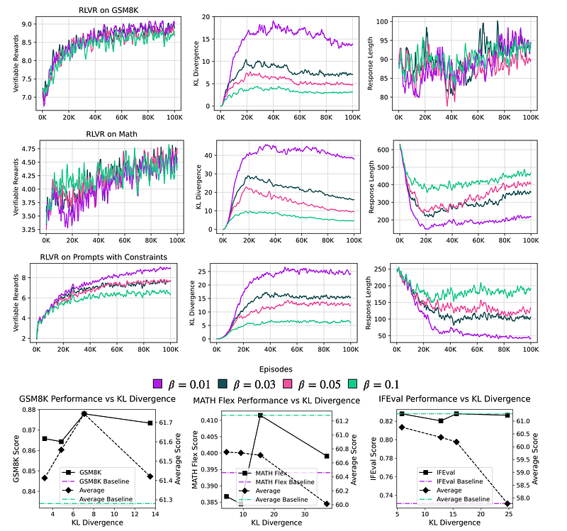 | With these prompts and verification functions, models are trained via Proximal Policy Optimization (PPO). |
| 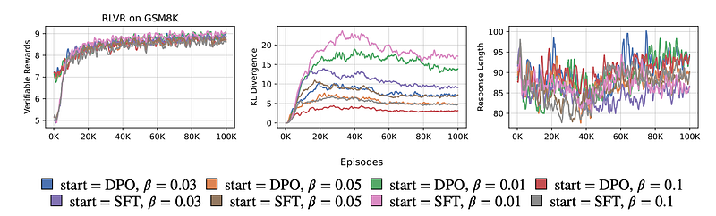 | The comparison of RLVR’s performance on GSM8K between starting from a DPO checkpoint and starting from a weaker SFT checkpoint. |
| 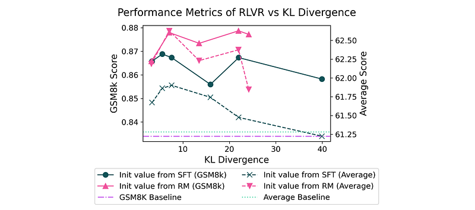 | The performance of RLVR vs KL Divergence under different value model initialization. |
| 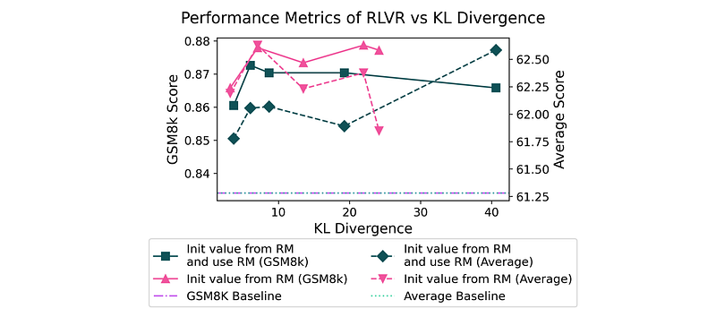 | Comparison of 1) using scores from on top of the verifiable rewards and 2) using only the verifiable rewards. |
## Related

- [[Papers Explained Corpus]]
- [[Reinforcement Learning Topic]]
- [[Synthetic Data]]
- [[Safety and Alignment]]
- [[Reasoning Models]]
- [[Large Language Models]]
- [[Reinforcement Learning]]
- [[Supervised Fine-Tuning]]
- [[Verifier-Bounded Learning]]
- [[On-Policy Distillation]]
- [[Papers Explained 282 - Tulu V2]]
- [[Papers Explained 284 - OLMo 2]]

#summary #topic
