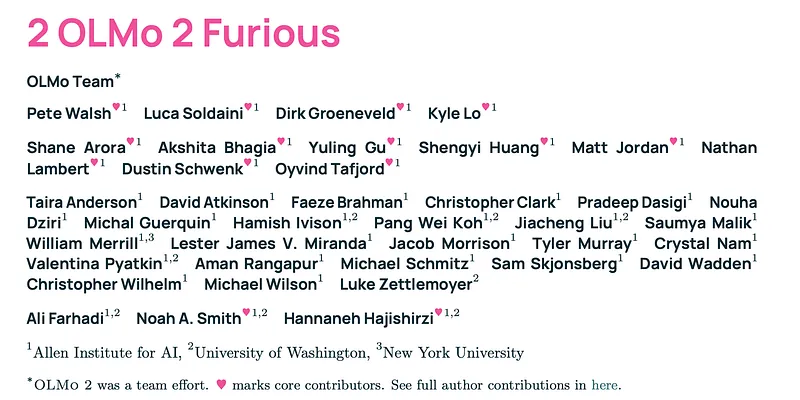
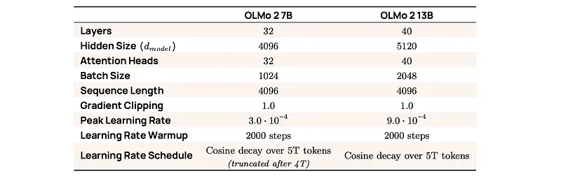
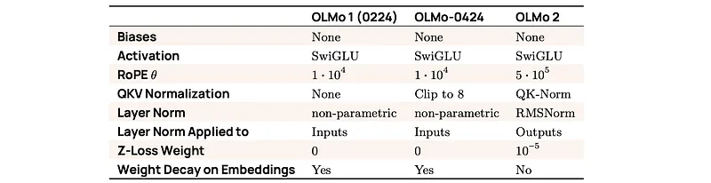
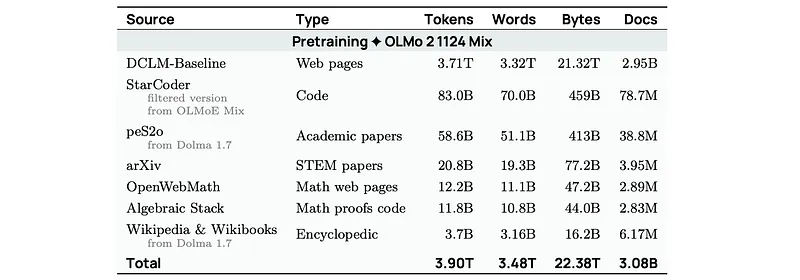
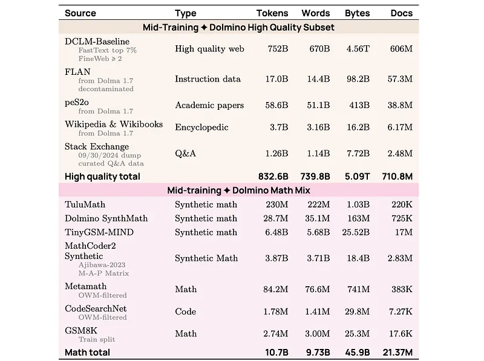
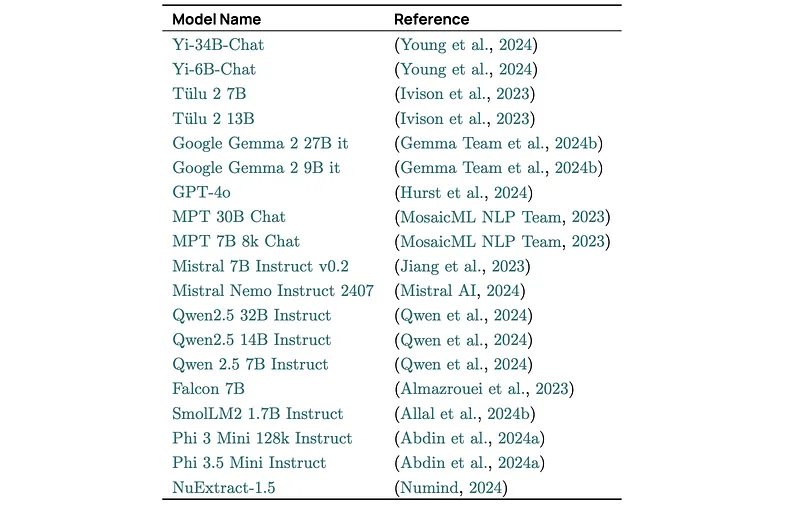
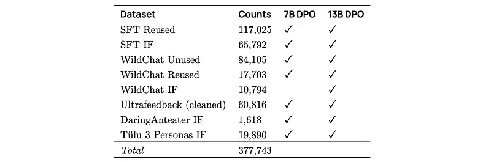
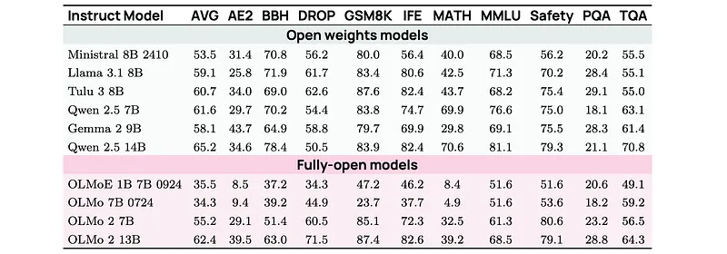
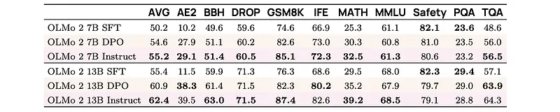
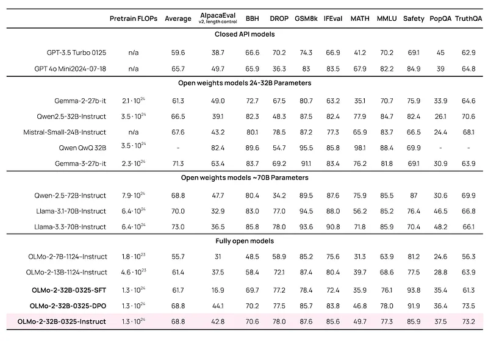

# Papers Explained 284 - OLMo 2

A decoder-only transformer architecture is adopted, delivering 7B and 13B parameter variants. The architecture is very similar to the first iteration of OLMo with several changes to improve training stability and performance.

This page ingests the source article into the wiki and connects it to [[Papers Explained Corpus]], [[Large Language Models]], [[Embedding and Retrieval]], [[Supervised Fine-Tuning]].

## Source Metadata

- Source file: `raw/2025-01-09_Papers-Explained-284--OLMo-2-f4d34e886503.md`
- Source title: Papers Explained 284: OLMo 2
- Published: 2025-01-09
- Canonical: [https://medium.com/@ritvik19/papers-explained-olmo-2-f4d34e886503](https://medium.com/@ritvik19/papers-explained-olmo-2-f4d34e886503)

## Key Ideas

- The original OLMo modified the decoder-only transformer architecture with:
- No biases: All bias terms are excluded from the architecture.
- SwiGLU activation function: The SwiGLU activation function is used and the corresponding hidden size is set to approximately 8d, but increased to the closest multiple of 128 to improve throughput.
- Rotary positional embeddings (RoPE): Absolute positional embeddings are replaced with rotary positional embeddings.
- When building OLMo-0424, modifications were made for training stability and downstream performance:

## Notes

OLMo 2 are dense autoregressive models with improved architecture and training recipe, pre-training data mixtures, and instruction tuning recipes. The modified model architecture and training recipe achieve both better training stability and improved per-token efficiency. The updated pretraining data mixture introduces a new, specialized data mix called Dolmino Mix 1124, which significantly improves model capabilities across many downstream task benchmarks when introduced via late-stage curriculum training. Finally, best practices from Tülu 3 are incorporated to develop OLMo 2-Instruct, focusing on permissive data and extending final-stage reinforcement learning with verifiable rewards.

## Model Architecture

*Figure: OLMo 2 hyperparameters.*

A decoder-only transformer architecture is adopted, delivering 7B and 13B parameter variants. The architecture is very similar to the first iteration of OLMo with several changes to improve training stability and performance.

The original OLMo modified the decoder-only transformer architecture with:

- No biases: All bias terms are excluded from the architecture.

- SwiGLU activation function: The SwiGLU activation function is used and the corresponding hidden size is set to approximately 8d, but increased to the closest multiple of 128 to improve throughput.

- Rotary positional embeddings (RoPE): Absolute positional embeddings are replaced with rotary positional embeddings.

When building OLMo-0424, modifications were made for training stability and downstream performance:

- QKV Clipping: For training stability, as seen in DBRX.

- Increased context: From 2048 to 4096.

OLMo 2 made further modifications:

- RMSNorm: The RMSNorm variant of LayerNorm without a bias term is used to normalize activations, instead of nonparametric LayerNorm.

- Reordered norm: The outputs to the attention and feedforward (MLP) layers within each transformer block are normalized, instead of the inputs:

h ∶= x + RMSNorm(Attention(x)) (1)

hout ∶= h + RMSNorm(MLP(x)) (2)

where x is the input to the layer, h is an intermediate hidden state, and hout is the output

- QK-norm: The key and query projections are normalized with RMSNorm before calculating attention. This avoids attention logits being too large, which can lead to training loss divergence.

- Z-Loss: Z-loss regularization is adopted, as it has been empirically shown to improve run stability.

- RoPE θ = 5e5: The RoPE θ is increased to 500,000 from 10,000. This approach increases the resolution of positional encoding.

*Figure: Summary of how OLMo family model architectures have evolved over time.*

### Tokenizer

OLMo 1 and OLMo-0424 were trained using a modified version of the GPT-NeoX-20B tokenizer that includes special tokens ||| PHONE_NUMBER|||, |||EMAIL_ADDRESS|||, and |||IP_ADDRESS|||, which were used to mask personal identifiable information.

For OLMo 2, the pre-tokenizer and vocabulary are borrowed from cl100k, the tokenizer developed for GPT-3.5 and GPT- 4. To maintain backwards compatibility with early Dolma data sources, the same masking tokens used in previous OLMo models are added.

## Pretraining

### Data

Base OLMo 2 models are trained in two stages, each with its corresponding data mix.

- The first pretraining stage is the longest and uses mostly web-sourced data. In this stage, an iteration on a pretraining mix of high-quality web data drawing on other recent open data releases is used.

- During the second stage, referred to as mid-training, the highest-quality web documents and curated non-web sources are up-sampled; synthetic data crafted to patch math capabilities of the model is also employed.

In total, OLMo 2 7B is trained on 4.05 trillion tokens (3.90 trillion for pretraining stage), while OLMo 2 13B is trained on 5.6 trillion tokens (5 trillion for pretraining stage).

*Figure: Composition of the pretraining data for OLMo 2.*

*Figure: Composition of the mid-training data (Dolmino).*

### Recipe

OLMo 2 models are randomly initialized from a truncated normal distribution with a mean of 0 and a standard deviation of 0.02

Pretraining stage: A learning rate schedule warms up the learning rate from 0 to the peak learning rate over 2000 steps, followed by a cosine decay calibrated to reach 10% of the peak learning rate after 5T tokens. For the 7B variant, the schedule truncates at 4T tokens and then begins the second stage. As the 13B variant ran with a higher learning rate from the start, the cosine decay finishes at 5T tokens before starting the second stage.

Mid-training stage: To find a better local minimum, multiple runs are performed with different random data orders, and then the resulting models are averaged. For the 7B variant, three separate runs for 50B tokens each, with different randomized data orders, are performed; the resulting models are averaged to produce the final model. For the 13B variant, three separate runs for 100B tokens each, and then a fourth run for 300B tokens, are performed. The final model is the average of all four models.

## Post Training

To adapt OLMo 2 to downstream generative tasks, we follow the Tülu 3 recipe. The Tülu 3 approach involves three phases of training: supervised finetuning (SFT), preference tuning with Direct Preference Optimization (DPO) and on-policy preference data, and finally Reinforcement Learning with Verifiable Rewards (RLVR).

### Supervised Fine Tuning

The SFT training relies on selecting the highest-quality, existing instruction datasets and complementing them with scaled synthetic data for Supervised Fine Tuning based on the PersonaHub method. The final SFT mix used for OLMo has 939,104 prompts.

Given that OLMo 2 is not trained for multilingual tasks, experimenting with removing all multilingual data from the SFT stage was conducted. When removing the entire Aya split and the multilingual samples of Wildchat from Tülu 3, a degradation of ∼ 0.5 points on average was seen, indicating that the Tülu 3 dataset is balanced and cannot be easily improved by removing irrelevant subsets.

### Preference Fine Tuning with DPO

The core strategy of the Tülu 3 pipeline for Preference Fine Tuning is building upon and scaling the UltraFeedback pipeline or generating synthetic preferences across data for target domains. On-policy data is included by sampling responses from some development OLMo 2 SFT models at both 7B and 13B, with independent datasets for each.

From Tülu 3, the model pool is updated to only include models with permissible licenses.

*Figure: External models used to sample off-policy data in the synthetic preference pipeline.*

A minor shift is made from Tülu 3 on the exact prompts used for DPO. Prompts are obtained from several sources, resulting in datasets of 366.7k prompts for 7B and 377.7k prompts for 13B. Given this set of prompts, responses are generated from a pool of 20 models of different families and sizes.

*Figure: Prompt sources for preference finetuning datasets.*

To create synthetic preference data, GPT-4–2024–08–06 is used as a language model judge. It is prompted to rate completions based on helpfulness, truthfulness, honesty, and instruction-following aspects.

### Reinforcement Learning with Verifiable Rewards (RLVR)

RLVR is applied to the highest-performing 7B and 13B DPO checkpoints with a combined dataset comprising GSM8K, MATH training sets, and prompts with constraints from Tülu 3. For RLVR, PPO’s value function is initialized from the corresponding RMs, which is shown to help improve average scores across evaluations. After the initial RLVR training pass on the 13B model, its performance on GSM8K and MATH was lower than a previous development instruct model. Consequently, two additional RLVR training iterations were performed: first on the GSM8K training set, followed by the MATH training set. The models selected at the end of the RLVR stage constitute the final OLMo 2 Instruct models.

## Evaluation

*Figure: The results for OLMo 2 Instruct at both 7B and 13B relative to peer open weight models.*

- OLMo 2-Instruct models demonstrate comparable performance to other leading open-weight models.

- OLMo 2 13B Instruct performs close to Qwen 2.5 14B Instruct and OLMo 2 7B outperforms both Tülu 3 8B and Llama 3.1 8B Instruct.

*Figure: Comparison of performance for OLMo 2 Instruct after different training stages.*

- The Reinforcement Learning from Value Ratings (RLVR) stage consistently improved performance across different model scales.

## OLMo 2 32B

OLMo 2 32B is the most capable and largest model in the OLMo 2 family, scaling up the OLMo 2 training recipe used for the 7B and 13B models. It is the first fully-open model (all data, code, weights, and details are freely available) to outperform GPT3.5-Turbo and GPT-4o mini on a suite of popular, multi-skill academic benchmarks. It is comparable to the leading open-weight models while requiring only a fraction of training compute.

OLMo 2 32B is developed in two phases — base model and instruct model.

- The base model is trained in two stages — pretraining and midtraining — which covers over 90% of the total training budget.

- The instruct model is derived from the base model using supervised fine tuning (SFT), direct preference optimization (DPO), and reinforcement learning with verifiable rewards (RLVR).

Pre-training occurs on OLMo-Mix-1124, a collection of 3.9 trillion tokens sourced from DCLM, Dolma, Starcoder, and Proof Pile II. Each OLMo base model is trained on successively more tokens with larger model size:

- OLMo 2 7B is trained for one epoch, up to 4T tokens,

- OLMo 2 13B is trained for 1.3 epochs, up to 5T tokens.

- OLMo 2 32B is trained for 1.5 epochs, up to 6T tokens.

Mid-training occurs on a curated collection called Dolmino, containing 843 billion tokens from several sources:

- High-quality documents re-sampled from the OLMo-Mix-1124 using a quality filter;

- Documents containing educational, math, or academic content that were not included in OLMo-Mix-1124;

- Instruction-tuning data, both synthetic and human generated, some of which is from the Tulu 3 Mix.

Mid-training for each OLMo 2 model is performed differently:

- For OLMo 2 7B, training the final stage 1 checkpoint on a subsampled 50B tokens while linearly annealing the learning rate to zero is performed three times on a different data order of the same 50B tokens, and the three final checkpoints are averaged, a process called model souping.

- For OLMo 2 13B and 32B, this process is repeated using two samples of 100B and 300B tokens. Three checkpoints are created using the 100B samples using different data order, and one checkpoint using the 300B sample. Model souping is performed on these four model variants.

Post-training: OLMo 2 32B’s post-training recipe follows Tülu 3 closely, as done with the 7B and 13B models. Tülu 3 uses a three stage approach to training: High-quality instructions for supervised finetuning, on-policy preference data, and reinforcement learning with verifiable rewards (RLVR).

Modifications were made to the Tülu 3 recipe for training OLMo 2 32B Instruct:

- Instructions from the SFT dataset and the chosen responses of the preference data that included mentions of a date cutoff from the synthetic data generation process were filtered out. This resulted in a new version of the instruction dataset, Tulu 3 SFT Mixture 0225, and preference dataset, OLMo-2–32B-pref-mix-0325.

- Majority voting is used to improve the quality of answers to synthetic math questions. For the Persona MATH and Grade School Math datasets from Tülu 3, only prompts and completions where the model reaches a majority vote over 5 completions are included. New versions of the math and grade school math datasets are available.

- RLVR training stage is applied on GSM8K, IFEval, and MATH prompts. For the 32B model, training is similar to Llama 3.1 8B Tülu 3.1, with Group Relative Policy Optimization (GRPO). Intermediate RL checkpoints are released on HuggingFace for researchers to study the impacts of RLVR on instruction models.

## Paper

2 OLMo 2 Furious [2501.00656](https://arxiv.org/abs/2501.00656)

## Figures

Figures from the Medium HTML export (`raw/2025-01-09_Papers-Explained-284--OLMo-2-f4d34e886503.md`); local copies under `wiki/assets/papers-explained-284-olmo-2/` when download succeeded.

| Figure | Caption |
|--------|---------|
|  | Title card: OLMo 2. |
|  | OLMo 2 hyperparameters. |
|  | Summary of how OLMo family model architectures have evolved over time. |
|  | Composition of the pretraining data for OLMo 2. |
|  | Composition of the mid-training data (Dolmino). |
|  | External models used to sample off-policy data in the synthetic preference pipeline. |
|  | Prompt sources for preference finetuning datasets. |
|  | The results for OLMo 2 Instruct at both 7B and 13B relative to peer open weight models. |
|  | Comparison of performance for OLMo 2 Instruct after different training stages. |
|  | Modifications were made to the Tülu 3 recipe for training OLMo 2 32B Instruct. |
## Related

- [[Papers Explained Corpus]]
- [[Large Language Models]]
- [[Embedding and Retrieval]]
- [[Supervised Fine-Tuning]]
- [[Papers Explained 283 - Tulu V3]]
- [[Papers Explained 285 - OpenScholar]]
- [[Papers Explained: OLMo 3]] — Direct successor; OLMo 3 extends this architecture with a larger 8192-token context window, sliding window attention (SWA), an added long-context extension stage, and the new OlmoRL post-training stack.

#summary #topic
