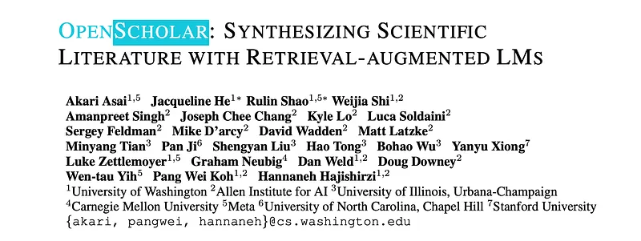
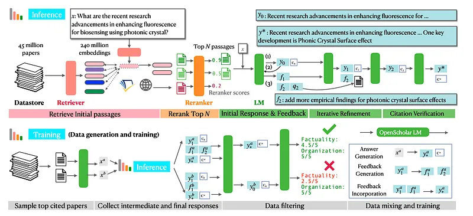
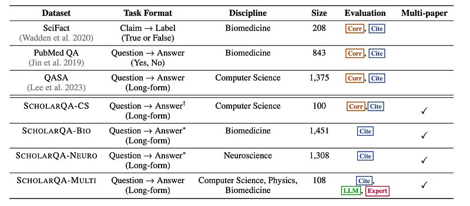
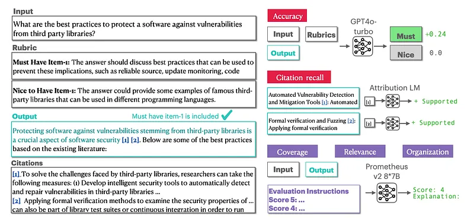
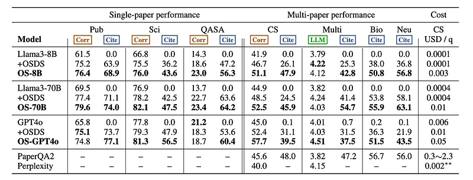
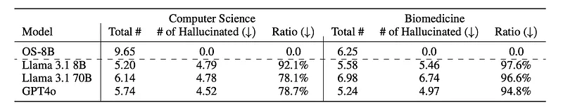
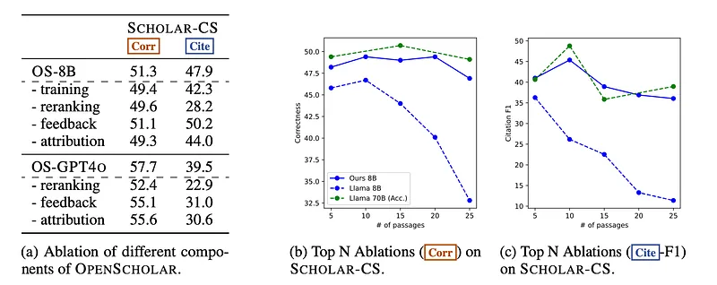
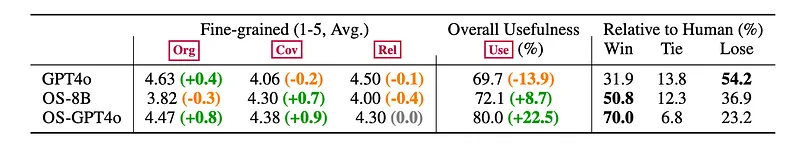
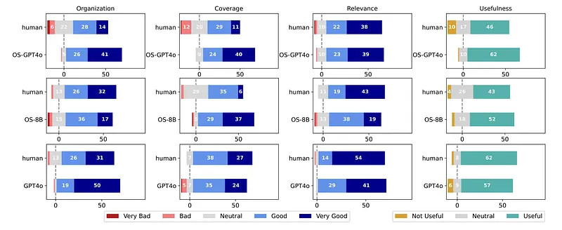

# Papers Explained 285 - OpenScholar

OpenScholar is a specialized retrieval-augmented language model that answers scientific queries by identifying relevant passages from 45 million open-access papers and synthesizing citation-backed responses.

This page ingests the source article into the wiki and connects it to [[Papers Explained Corpus]], [[Embedding and Retrieval]], [[Large Language Models]], [[Evaluation and Benchmarks]], [[Agentic AI]].

## Source Metadata

- Source file: `raw/2025-01-10_Papers-Explained-285--OpenScholar-76b1b2df7b99.md`
- Source title: Papers Explained 285: OpenScholar
- Published: 2025-01-10
- Canonical: [https://medium.com/@ritvik19/papers-explained-185-openscholar-76b1b2df7b99](https://medium.com/@ritvik19/papers-explained-185-openscholar-76b1b2df7b99)

## Key Ideas

- All the artifacts are available at [HuggingFace](https://huggingface.co/collections/OpenScholar/openscholar-v1-67376a89f6a80f448da411a6).
- The retrieval pipeline consists of a datastore D, a bi-encoder retriever θbi, and a cross-encoder reranker θcross. Initial candidate paragraphs are selected using D and θbi, as well as external APIs.
- Collect scientific papers to construct datastore
- peS2o v3 consists of 45 million open-access academic papers from S2ORC up until October 2024.
- Passages are retrieved from three sources:

## Notes

OpenScholar is a specialized retrieval-augmented language model that answers scientific queries by identifying relevant passages from 45 million open-access papers and synthesizing citation-backed responses. To evaluate OpenScholar, ScholarQABench, the first large-scale multi-domain benchmark for literature search, is developed, comprising 2,967 expert-written queries and 208 long-form answers across computer science, physics, neuroscience, and biomedicine.

All the artifacts are available at [HuggingFace](https://huggingface.co/collections/OpenScholar/openscholar-v1-67376a89f6a80f448da411a6).

### Task Formulation

Given a scientific query x, the task is to identify relevant papers,synthesize their findings, and generate a response y that effectively addresses the query. This response should be accompanied by a set of citations, C = c1 , c2 , . . . , cK , wherein each citation ci in C corresponds to specific passages from scientific literature, and should be provided as an in-line citation, linked to the relevant spans of text in y, following standard practice in scientific writing. These citations allow researchers to trace the output back to the original literature, ensuring transparency and verifiability.

## OpenScholar

*Figure: Detailed overview of OpenScholar inference (top) and training (bottom).*

To ensure the retrieval of relevant papers and generate high-quality outputs, OpenScholar consists of three key components: a datastore D, a retriever R, and a generator LM G. In standard retrieval-augmented inference pipelines, the process begins with R, which retrieves a set of passages P = {p1 , p2 , . . . , pN } from D — a large-scale corpus of previously published scientific papers — based on semantic relevance to the input query x. These passages serve as context for the next step. The generator LM G then takes both the retrieved passages P and the input query x to produce the output y along with corresponding citations C. Formally, this process can be represented as:

### Open Scholar Retrieval Pipeline

The retrieval pipeline consists of a datastore D, a bi-encoder retriever θbi, and a cross-encoder reranker θcross. Initial candidate paragraphs are selected using D and θbi, as well as external APIs. The top N relevant paragraphs are then refined and identified using θcross.

Collect scientific papers to construct datastore

peS2o v3 consists of 45 million open-access academic papers from S2ORC up until October 2024. The main text of each paper is split into discrete, 250-word text blocks (as determined by white space) and the paper title is concatenated to each block to formulate passages in D. The datastore consists of 234 million passages.

Retrieve initial paragraphs

Passages are retrieved from three sources:

- the peS2o datastore using a trained retriever

- publicly available abstracts from papers returned via the Semantic Scholar API based on search keywords

- publicly available texts from papers retrieved through a web search engine using the original query x.

For (1), embeddings of each passage in D are first generated using the passage bi-encoder θbi, which processes text chunks (e.g., queries or passages) into dense vectors. θbi is developed by continually pre-training Contriever on a mixture of peS2o version 2, CCNews, and Proofpile2 in an unsupervised fashion to improve domain-specific retrieval performance . During inference, the top 100 passages are retrieved through a nearest neighbor search.

For (2), keywords are first generated from the query x using a generator LM. These keywords are then used to retrieve the top 10 papers.

For (3), the top 10 search results are obtained using the You.com retrieval API, restricting the search to academic platforms such as ArXiv and PubMed.

Rerank and finalize top N paragraphs

After the initial stage, over 100 relevant passages per query have been gathered. Feeding a large number of documents that might include irrelevant content to LLMs can cause efficiency and performance issues. Hence, a cross-encoder reranker, denoted as θcross, is used.

For each candidate paragraph, the cross-encoder reranker jointly encodes and computes the relevance score between the input query and each of the passages. The passages are then ranked accordingly using the relevance score. To train θcross for scientific domains, a BGE-reranker is fine-tuned using synthetic data generated by Llama 3 70B Instruct. Specifically, queries are randomly generated based on abstracts from peS2o and the top 10 passages are retrieved. Llama 3 70B Instruct then assigns relevance scores from 1 to 5 for these passages, where scores of 4 or 5 are considered positive, and scores of 1 or 2 are considered negative. Passages with a score of 3 are discarded.

During reranking and finalization of the top N passages, additional meta-filtering is implemented, which includes:

- limiting the number of passages per paper to three passages

- incorporating normalized citation counts into relevance scores predicted by the cross-encoder.

### Iterative Generation With Retrieval-Augmented Self-Feedback

In OpenScholar, an iterative generation approach with self-feedback is introduced, which involves three steps:

- initial response and feedback generation to output the initial draft y0 and a set of feedback on y0

- iterative refinement with additional retrieval to improve y0 using the feedback

- citation verification.

Initial response and feedback generation

Given the input x and retrieved passages P, the generator LM first produces an initial response y0 with citation markers tied to the corresponding passages in P. After generating y0, the LM generates a set of feedback on y0, F that is aimed at improving the initial response. Although the model can generate an arbitrary number of feedback (T ), a maximum limit of three feedback sentences is set for efficient inference. The LM also generates a retrieval query for additional retrieval using the pipeline.

Iterative refinement

The process iterates over the feedback F to incrementally refine the output. The LM uses the previous output yk−1, the retrieved passages P, and newly retrieved passages if any, to generate an updated output yk. This process is repeated until all feedback has been addressed, resulting in a final output yT by timestep T.

Citation verification

Finally, the generator LM is instructed to verify the citations in the generated text. The generator ensures that all citation-worthy statements — scientific claims requiring justification — are adequately supported by references from the retrieved passages. If any claims lack proper citations, the LM performs a post hoc insertion to ensure that citation-worthy statements are supported by passages.

### Training

Data is generated using LLama 3.1 70B. The process begins with sampling 1 million paper abstracts from the peS2o dataset and retrieving papers’ meta information such as publication year or citations. Then, 10,000 papers published later than 2017 are randomly selected. An LM is prompted to generate literature review questions or information-seeking queries based on each abstract, which may require multiple papers to answer. The OpenScholar pipeline is employed to produce the final output yT, along with intermediate generations such as feedback F and initial outputs.

A two-step data filtering process is introduced: pairwise-filtering and rubric-filtering, leveraging the same LM used for data generation. In pairwise filtering, the quality of model outputs yT and y0 is compared, and the higher-quality output is retained. y0 is preferred over yT around 20% of the time, due to over-editing or increased redundancy after multiple iteration steps. The chosen response is then evaluated on a five-point scale across two aspects: organization and factual precision and citation accuracy. A valid model output must achieve a score of 4.5 or higher in both categories, and instances whose outputs do not meet this requirement are discarded.

From this synthetic pipeline, three types of training data are generated: answer generation (x → y), feedback generation (y0 → F), and feedback incorporation (yt−1, ft → yt). This synthetic training data is further blended with existing general-domain instruction-tuning data and scientific instruction-tuning data, ensuring that 50% of the training data comes from scientific domains, while the remaining 50% is sourced from general-domain data. Synthetic fact verification and boolean QA data is also generated based on sampled abstract data from peS2o. For this, papers are sorted based on citation count and the top 100,000 papers are selected.

Llama 3.1 8B Instruct is trained on the generated training data.

## ScholarQA Bench

*Figure: Overview of ScholarQA Bench.*

### Data Curation

ScholarQA Bench is designed to evaluate model capabilities in automating scientific literature review. The curation process is guided by three key factors: Diversity of tasks, Diversity of disciplines and Inclusion of multi-paper tasks

For single-paper tasks, existing widely-used single-paper datasets are curated and adapted.

- SciFact is a dataset of 1.4K expert-written scientific claims in the biomedical domain, paired with gold evidence from existing PubMed paper abstracts annotated with labels and rationales. The validation set queries are labeled as either supports (true) or contradicts (false), discarding the original gold evidence. The task is reformulated as binary open-retrieval, wherein a system needs to identify relevant papers from a large collection of papers.

- PubMedQA has expert-annotated (yes/no/maybe) QA data on PubMed paper abstracts. Similar to SciFact, only instances with yes or no labels are kept, and the original abstract passage is discarded to formulate the task as an open-retrieval setup.

- QASA is a single paper QA dataset that consists of question answering pairs, requiring reasoning over scientific articles in AI and ML. The model’s ability to sufficiently answer a detailed question about the target paper is evaluated. While the original dataset provides three subtasks (answer selection, rationale generation and answer compositions) as well as end-to-end QA, models’ performance is evaluated based on an end-to-end QA setup.

In the real world, complex, open-ended questions are asked independently from existing papers, and require multi-paper retrieval and reasoning. Three new long-form QA datasets, annotated by experts, are curated for these challenging settings. The multi-paper tasks include four scientific disciplines.

ScholarQA-CS:

- Collected 100 literature review questions across various computer science disciplines

- Questions were written by expert annotators holding Ph.D.s in the field (professors, postdoctoral researchers, and research scientists)

- Each question has a detailed answer rubric with key ingredients for a correct answer, categorized by importance (“must-have” and “nice-to-have”), along with supporting quotes from sources

- Annotators were instructed not to use LLM services for the initial part of the task

- After the initial web search, annotators were shown corresponding responses from four LLM services in a randomized order

ScholarQA-BIO and ScholarQA-NEURO:

- Collected 2,759 expert-written literature review questions in biomedicine and neuroscience

- Questions were written by six experts who have a Ph.D. in relevant areas and are currently research scientists and engineers

- Annotators chose papers from their area of expertise and generated complex scientific questions that biomedical scientists might reasonably ask about the scientific literature based upon their parsing of those papers

ScholarQA-MULTI:

- Collected 108 literature review questions and expert-written answers with citations in four domains: computer science (AI/ML, HCI), Biomedicine (Bioimaging, Genetics), Physics (Astrophysics, Photonics, Bio Physics)

- All annotations were conducted by Ph.D. students or post-Ph.D. scientists who have more than three years of research experience in the corresponding areas and have multiple first-author publications

- Annotators were instructed not to use any LLM-based systems such as ChatGPT, and told to only use general search (e.g., Google Search) or paper search systems (e.g., Semantic Scholar)

### Metrics

*Figure: An ScholarQA-CS example and evaluation overview*

A multifaceted automatic evaluation pipeline was developed to facilitate reproducible and efficient evaluations, complementing expert assessments.

Correctness (Corr): measures the degree of overlap or matching between a model-generated answer and human-annotated reference.

- For short-form generation tasks, accuracy is used as the correctness metric.

- For QASA, ROUGE-L is used as an evaluation metric.

- For ScholarQA-CS, a new long-form evaluation pipeline is developed, which employs expert-annotated rubrics to evaluate general and annotation-driven criteria.

Citation Accuracy (Cite): evaluates LMs’ ability to correctly attribute relevant evidence for all citation-worthy statements in long-form responses to literature review questions. Measures citation precision, recall, and F1 score using reference numbers linked to passages provided during inference.

Content Quality and Organization:

- Relevance (Rel) to the question: assesses how well the generated answer addresses the question.

- Coverage (Cov): evaluates the diversity of topics discussed and the sufficiency of details.

- Organization and Writing Flow (Org): assesses the coherence and flow of the generated text.

- These aspects are evaluated using Prometheus v2, a tool that assigns five-scale scores based on defined rubrics.

## Evaluation

Various LLMs (Llama 3.1 8B, 70B, GPT-4o) are evaluated with and without retrieval augmentation using OpenScholar. It is also compared with other proprietary systems like Perplexity Pro and PaperQA2.

*Figure: Results of ScholarQABench.*

- OpenScholar significantly outperformed baseline LLMs (even GPT-4o) and other specialized literature review systems (PaperQA2, Perplexity Pro) on scientific question answering tasks, demonstrating improvements in both correctness and citation accuracy.

- Training on domain-specific data significantly improved the performance of the 8B model, making it more efficient and cost-effective compared to larger, proprietary models.

*Figure: Statistics of hallucinated papers in computer science and biomedicine domains.*

- LLMs without retrieval augmentation struggled to generate correct citations and exhibited limited coverage on multi-paper tasks. A large percentage of cited papers by these models were fabricated (78–98%).

- Ablation studies showed that removing components like reranking, feedback, and attribution significantly impacted performance.

- OpenScholar’s trained 8B model maintained strong performance with a larger number of context passages (up to N=20), while the performance of untrained LLMs deteriorated after a certain context size.

## Expert Evaluation

Human evaluation of answers generated by OpenScholar (with GPT4o and an 8B model), GPT4o (without retrieval), and human experts for 108 literature review questions from ScholarQA-MULTI. Evaluations included fine-grained assessments (Coverage, Organization, Relevance, Usefulness) and pairwise preference judgments. A controlled experiment was also conducted to assess the impact of answer length on evaluation results. Finally, human explanations for pairwise preferences are analyzed.

*Figure: Human evaluation results.*

*Figure: Fine-grained evaluation results.*

- OpenScholar (both with GPT4o and the 8B model) outperformed human-written answers in over 50% of cases.

- OpenScholar’s advantage is primarily attributed to its broader and deeper coverage of information.

- GPT4o without retrieval performed significantly worse than both OpenScholar versions and human answers, demonstrating the importance of retrieval capabilities.

- OpenScholar-GPT4o and OpenScholar-8B were rated as “Useful” in 80% and 72% of queries, respectively.

- While the 8B model performed well, GPT4o generated more organized and fluent outputs.

- A controlled experiment with shortened OpenScholar-GPT4o answers showed that superior performance wasn’t solely due to longer answer length.

- Analysis of human explanations for pairwise preferences revealed that coverage was a crucial factor, with annotators favoring model-generated answers for their greater depth of information. However, the quality of citations provided by the models was identified as an area for improvement.

## Paper

OpenScholar: Synthesizing Scientific Literature with Retrieval-augmented LMs [2411.14199](https://arxiv.org/abs/2411.14199)

## Figures

Figures from the Medium HTML export (`raw/2025-01-10_Papers-Explained-285--OpenScholar-76b1b2df7b99.md`); local copies under `wiki/assets/papers-explained-285-openscholar/` when download succeeded.

| Figure | Caption |
|--------|---------|
|  | Title card: OpenScholar. |
|  | Detailed overview of OpenScholar inference (top) and training (bottom). |
|  | OpenScholar. |
|  | Overview of ScholarQA Bench. |
|  | An ScholarQA-CS example and evaluation overview. |
|  | Results of ScholarQABench. |
|  | Statistics of hallucinated papers in computer science and biomedicine domains. |
|  | Various LLMs (Llama 3.1 8B, 70B, GPT-4o) are evaluated with and without retrieval augmentation using OpenScholar. |
|  | Human evaluation results. |
|  | Fine-grained evaluation results. |
## Related

- [[Papers Explained Corpus]]
- [[Embedding and Retrieval]]
- [[Large Language Models]]
- [[Evaluation and Benchmarks]]
- [[Agentic AI]]
- [[Papers Explained 284 - OLMo 2]]
- [[Papers Explained 286 - NuNER]]

#summary #topic
