# Papers Explained 287 - NuExtract

NuExtract is a lightweight text-to-JSON LLM, that allows extraction of arbitrarily complex information from text and turns it into structured data. This model can be directly used in a zero-shot setting or fine-tuned to solve a specific extraction problem.

This page ingests the source article into the wiki and connects it to [[Papers Explained Corpus]], [[Large Language Models]], [[Synthetic Data]], [[Reasoning Models]], [[Document AI]]. Official NuMind launch posts: [[NuExtract: A Foundation Model for Structured Extraction]] (1.0), [[NuExtract 1.5 — Multilingual, Infinite context, still small, and better than GPT-4o!]], [[NuExtract 2.0: Outclassing Frontier LLMs in Information Extraction]], [[NuExtract3: The Reasoning Open-Source OCR & Structured Extraction LLM]]; see also [[NuExtract]] and [[NuMind]].

## Source Metadata

- Source file: `raw/2025-01-14_Papers-Explained-287--NuExtract-f722082999b5.html`
- Source title: Papers Explained 287: NuExtract
- Published: 2025-01-14
- Canonical: [https://medium.com/@ritvik19/papers-explained-287-nuextract-f722082999b5](https://medium.com/@ritvik19/papers-explained-287-nuextract-f722082999b5)

## Key Ideas

- The models are available on [HuggingFace](https://huggingface.co/collections/numind/nuextract-6679e82d13c37a0fe4742d3d).
- The goal of Structured Extraction is to extract all kinds of information from a document — entities, quantities, dates, and so on — and to identify their (potentially hierarchical) relationships.
- The schema is represented by an empty JSON. Each array is filled with an element template, and empty strings indicate the extracted fields.
- This template format does not allow for the inclusion of field descriptions because examples are believed to be more informative than descriptions.
- 300k pieces of English text from the C4 dataset, a large and diverse general-domain dataset, are used. The idea is that something interesting to extract will be found in most texts.

## Notes

NuExtract is a lightweight text-to-JSON LLM, that allows extraction of arbitrarily complex information from text and turns it into structured data. This model can be directly used in a zero-shot setting or fine-tuned to solve a specific extraction problem.

The models are available on [HuggingFace](https://huggingface.co/collections/numind/nuextract-6679e82d13c37a0fe4742d3d).

## Structured Extraction

The goal of Structured Extraction is to extract all kinds of information from a document — entities, quantities, dates, and so on — and to identify their (potentially hierarchical) relationships. The extracted information is then structured in the form of a tree, which usually follows a template (a.k.a. schema) so that it can easily be parsed to fill up a database or directly used to take automatic actions.

*Figure: Structured Extraction Example*

## NuExtract

*Figure: NuExtract creation procedure.*

### Template/Schema Representation

The schema is represented by an empty JSON. Each array is filled with an element template, and empty strings indicate the extracted fields. Only strings are output and other JSON types are ignored as there is not much interest in supporting them (a number can always be returned as a string). This template format is used because of its simplicity.

This template format does not allow for the inclusion of field descriptions because examples are believed to be more informative than descriptions.

### Dataset Creation

300k pieces of English text from the C4 dataset, a large and diverse general-domain dataset, are used. The idea is that something interesting to extract will be found in most texts. To annotate this text, an LLM is first prompted to generate a template from each piece of text.

> !!!START Context!!!

> *<text-to-annotate>*

> !!!END Context!!!

> Goal: Generate an information extraction dataset.

> Input: Text document + instructions for annotation.

> Output: 1 JSON object (schema).

> Schema:

> Describes the information to be extracted.

> Each field should:

> Be a clear and concise name representing the extracted data.

> ONLY STRING TYPE ARE ALLOWED AS VALUES (it can be an array of strings, or an object with string values, or an array of objects with string values…).

> NO BOOLEAN, INT, ENUM, ETC.

> The schema can focus only on part of the context document, or on the whole document.

> Constraints:

> Extracted information should be thematically coherent and form a well-structured JSON schema with a clear relationship between fields.

> *<few-shot examples>*

Once templates are available, an LLM can be used to extract information according to each template. For half of the examples, information is extracted from the full text. For the other half, part of the text is removed (but the original template is kept). Removing part of the text creates empty fields in the output, and will teach the model that it is acceptable to return an empty string when the information is not present. This form of negative sampling is a way to fight hallucinations.

> !!!START Context!!!

> *<text-to-annotate>*

> !!!END Context!!!

> Goal: Extract strings from the text corresponding to the given schema.

> Input: Text document + schema.

> Output: 1 JSON object

> Schema:

> The schema describes the information to be extracted.

> ONLY STRING TYPE ARE ALLOWED AS VALUES (it can be an array of strings, or an object with string values, or an array of objects with string values…).

> NO BOOLEAN, INT, ENUM, ETC.

> The schema can focus only on part of the context document, or on the whole document.

> Output:

> THE OUTPUT SHOULD FOLLOW EXACTLY THE SCHEMA.

> It should respect the schema and contain the extracted information from the context document.

> THE STRING SHOULD BE PRESENT EXACTLY AS IT IS IN THE CONTEXT DOCUMENT. NO PARAPHRASING ALLOWED.

> If the information is NOT PRESENT in the context, return “” for empty string and [] for empty array. If the list of object is empty, return [].

> Return only the information extracted as JSON. Do not output anything else or says anything else.

> Information to extract:

> *<schema>*

This prompt is used with Llama 3 70B to annotate 300k pieces of text. Examples for which the template is not followed, as well as examples for which extracted values are not found in the text, are filtered out. This results in 50k annotated examples.

### Base Models

An encoder-decoder architecture is likely the best choice for this task. However, these models have not been trained as exten

sively as recent generative LLMs. As a result, pure decoder LLMs are used. Phi-3-mini (3.8B parameters) is used for NuExtract, Phi-3-small (7B parameters) for NuExtract-large, and Qwen1.5–0.5B (0.5B parameters) for NuExtract-tiny. These base models are fine-tuned on the dataset.

### Evaluation

To assess the performance of NuExtract models in structured extraction tasks, a benchmark is created by selecting “problems” like parsing resumes, creating templates for each problem, finding raw text and manually extracting information.

Additionally, metrics are developed to evaluate the performance of NuExtract models. A tree matching method is used to align extracted values, with similarity computation between corresponding values using exact matching. The average leaf similarities are then used to obtain a measure between 0 (completely different) and 1 (perfect match).

*Figure: Comparison of NuExtract models with popular generic LLMs in the zero-shot setting.*

- NuExtract-tiny outperforms GPT-3.5 while being at least 100 times smaller.

- NuExtract outperforms Llama3–70B while being 35 times smaller.

- NuExtract-large reaches GPT-4o levels while being at least 100 times smaller.

*Figure: Comparison of NuExtract models with popular generic LLMs of the chemical extraction problem.*

- Fine-tuning NuExtract models on the chemistry problem significantly improves performance.

- NuExtract-tiny, despite having only 0.5B parameters, surpasses GPT-4o after fine-tuning.

- NuExtract and NuExtract-large achieve exceptional performance after fine-tuning.

- Fine-tuning small language models for structured extraction problems yields substantial benefits.

## NuExtract 1.5

NuExtract 1.5 is the new version of our foundation model for structured extraction. It is multilingual, can handle arbitrarily long documents, and outperforms GPT-4o in English while being 500 times smaller.

The models are available at [HuggingFace](https://huggingface.co/collections/numind/nuextract-15-670900bc74417005409a8b2d).

### Dataset Creation

For the training dataset, raw documents are taken from the C4 dataset. Fifty percent of English documents and fifty percent of documents from other languages (mainly French, German, Spanish, Italian, and Portuguese) are chosen. To enable NuExtract to handle long documents properly, longer documents are included than in the original NuExtract.

An English template is used for half the documents, regardless of their language, while the same language as the document is used for the other half. This allows users to create a unique template in English when processing documents in multiple languages. The same automatic annotating procedure as in the original NuExtract is then used.

### Infinite Context

To solve the memory issue for long sequences, NuExtract is trained to be able to extract information from a document while being given previous information. To give this ability to NuExtract 1.5, new examples are added to the dataset for which previous information is given, such as:

*Figure: Example of continuation extraction.*

With such examples, the model should learn to merge previous and new information. This merging is not trivial; sometimes there is conflicting information. In this case, the temperature value is overwritten as the new information is more relevant.

This “continuation” ability allows processing of arbitrarily long documents by iteratively re-injecting the current state of information while processing text via a sliding context window — reminiscent of recurrent neural networks.

### Training

Phi-3.5 mini (3.8B) is trained on the dataset to obtain NuExtract 1.5. A 0.5B model is also attempted to be trained on this dataset, but it proves too small to be multilingual and have continuation abilities. As a result, Qwen 2.5 0.5B is trained only on English documents and without continuation examples.

### Evaluation

English Performance

*Figure: Zero-shot results on the structured extraction benchmark.*

Zero-Shot Results: NuExtract 1.5 significantly outperforms the original NuExtract and slightly surpasses GPT-4o in zero-shot performance.

*Figure: Many-shot results on the structured extraction benchmark.*

Few-Shot Results: With few-shot learning (fine-tuning for NuExtract, in-context learning for GPT-4o), all models improve substantially. GPT-4o slightly outperforms NuExtract 1.5. NuExtract 1.5 significantly outperforms NuExtract 1.5 tiny, suggesting a larger NuExtract model could outperform GPT-4o.

Multilingual Performance

*Figure: Multilingual zero-shot results on the structured extraction benchmark.*

NuExtract 1.5 shows significant improvement over the original NuExtract but is outperformed by GPT-4o. Model size is suspected to be a key factor in multilingual performance.

Long Documents Performance

*Figure: Performance on long documents (between 8k and 10k tokens).*

8k-10k token documents: NuExtract 1.5 outperforms GPT-4o on documents in the 8k-10k token range. This suggests NuExtract 1.5 handles long contexts effectively. NuExtract 1.5 significantly outperforms NuExtract 1.5 tiny.

*Figure: Performance on even longer documents (between 10k and 20k tokens).*

10k-20k token documents: Using a 10k token sliding window, NuExtract 1.5 continues to outperform GPT-4o, confirming its strong performance on long documents and the effectiveness of the continuation strategy.

*Figure: Performance of NuExtract on long documents (8k-10k tokens) as function of the size of the extraction window.*

Extraction Window Size Impact: NuExtract 1.5’s performance degrades gracefully as the extraction window size decreases. A 2k token window is required for GPT-4o to outperform NuExtract 1.5. Smaller windows reduce memory usage significantly. While the continuation procedure isn’t perfect, it allows processing of documents exceeding GPU memory capacity.

## NuExtract 2

NuExtract 2.0 adds **vision** (direct image extraction without OCR), **abstraction** (classification, reformatting, deduced answers, translation), and **in-context learning** via examples in the prompt. Three open-weight sizes ship on Qwen VL bases (2B MIT, 4B research license, 8B MIT), all with **32k** context. See [[NuExtract 2.0: Outclassing Frontier LLMs in Information Extraction]].

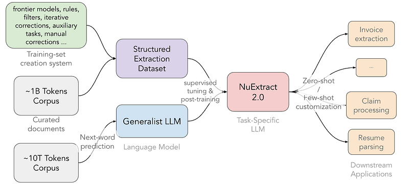

Prior versions only copy-pasted verbatim strings; 2.0 templates specify typed fields: `verbatim-string`, `string`, `choice`, `date`, `number`, `null`. VLMs preserve tables and diagrams that OCR would flatten.

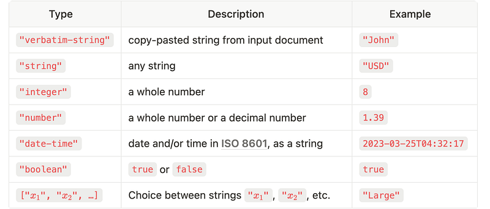

**In-context learning**: trained with minimalist prompt examples for text and images; three shots can materially boost F-Score. **NuExtract 2.0 8B** reaches **73 F-Score**, edging non-reasoning frontier models; **NuExtract 2.0 PRO** leads GPT-4.1 by **+9** F-Score and reasoning Claude 4 Opus / Gemini 2.5 PRO by **+5 / +2**.

## NuExtract 3

**NuExtract3** unifies **structured extraction** (documents → JSON) and **content extraction** (OCR → Markdown) in one model, trained **SFT then RL** for toggleable extraction-specific reasoning. Built on Fine-PDF real documents plus synthetic complexity; introduces **14 new field types**. See [[NuExtract3: The Reasoning Open-Source OCR & Structured Extraction LLM]].

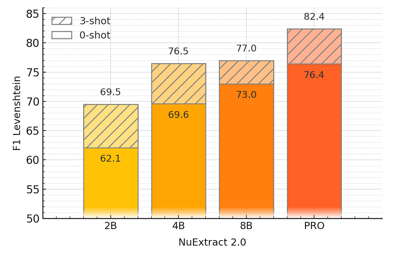

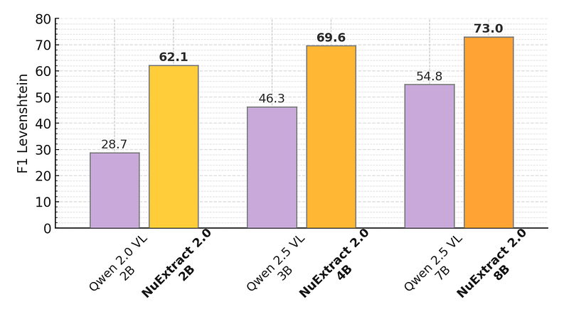

On an in-house ~600-example / 15-problem benchmark, NuExtract3 beats generalist models on structured extraction, content extraction (150 weird-table documents), and OCR repurposed from that benchmark—outperforming both generalist and specialist baselines at similar scale.

## Paper

[NuExtract: A Foundation Model for Structured Extraction](https://numind.ai/blog/nuextract-a-foundation-model-for-structured-extraction)

[NuExtract 1.5 — Multilingual, Infinite context, still small, and better than GPT-4o!](https://numind.ai/blog/nuextract-1-5---multilingual-infinite-context-still-small-and-better-than-gpt-4o)

[NuExtract 2.0: Outclassing Frontier LLMs in Information Extraction](https://about.nuextract.ai/blog/outclassing-frontier-llms-nuextract-2-0)

[NuExtract3: The Reasoning Open-Source OCR & Structured Extraction LLM](https://about.nuextract.ai/blog/nuextract-3-release)

## Figures

Figures from the Medium HTML export (`raw/2025-01-14_Papers-Explained-287--NuExtract-f722082999b5.html`); local copies under `wiki/assets/papers-explained-287-nuextract/` when download succeeded.

| Figure | Caption |
|--------|---------|
| 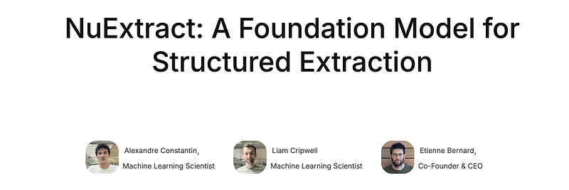 | Title card: NuExtract. |
| 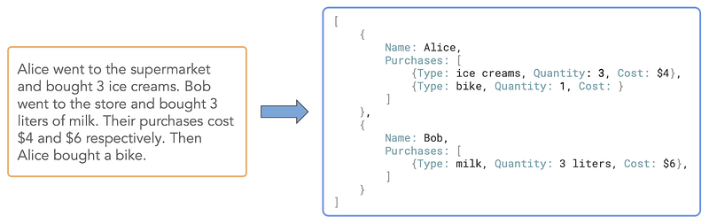 | Structured Extraction Example. |
| 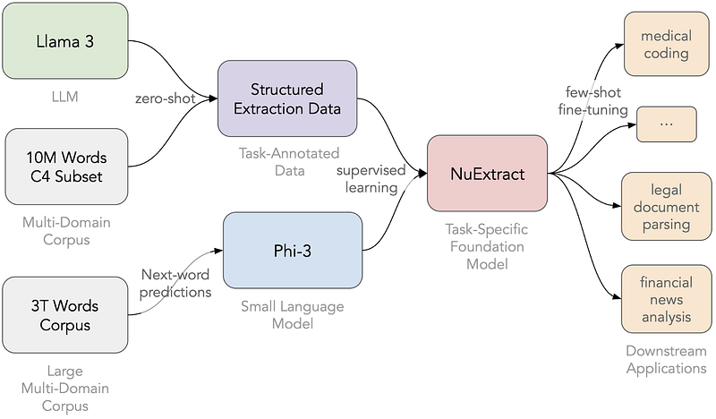 | NuExtract creation procedure. |
| 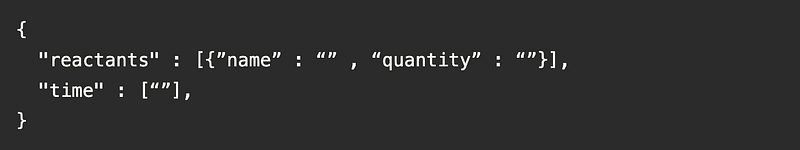 | The schema is represented by an empty JSON. |
| 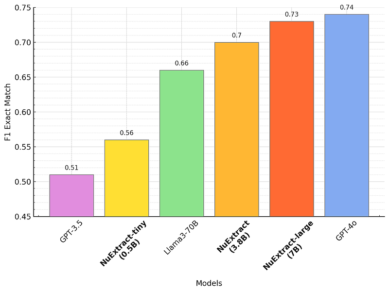 | Comparison of NuExtract models with popular generic LLMs in the zero-shot setting. |
| 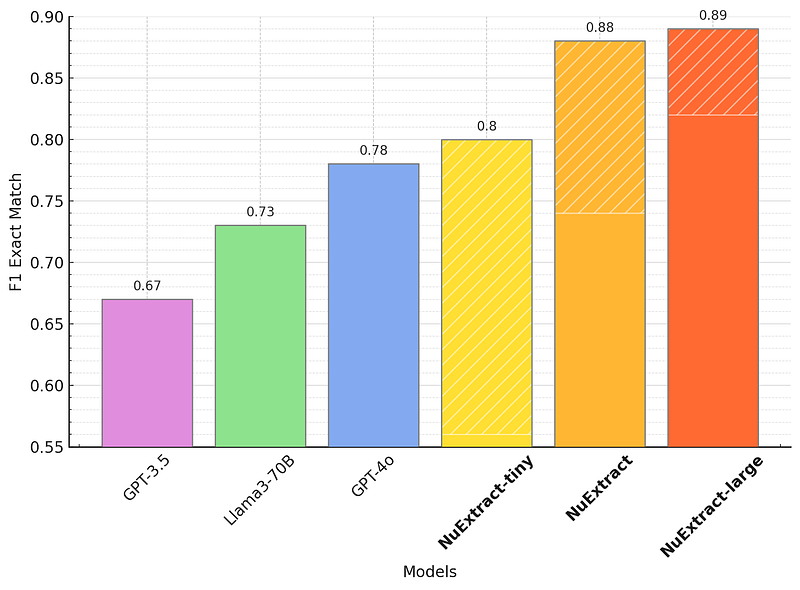 | Comparison of NuExtract models with popular generic LLMs of the chemical extraction problem. |
| 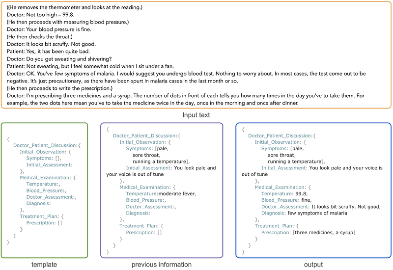 | Example of continuation extraction. |
| 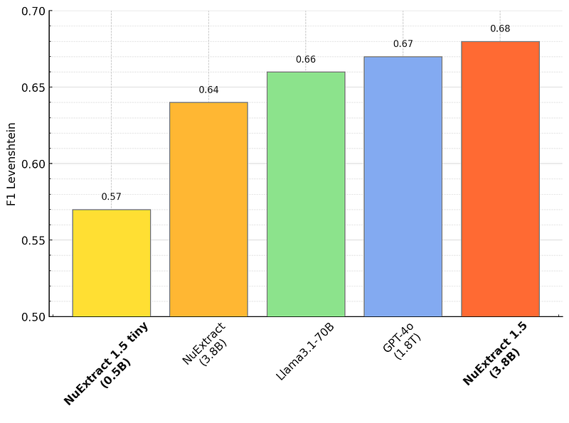 | Zero-shot results on the structured extraction benchmark. |
| 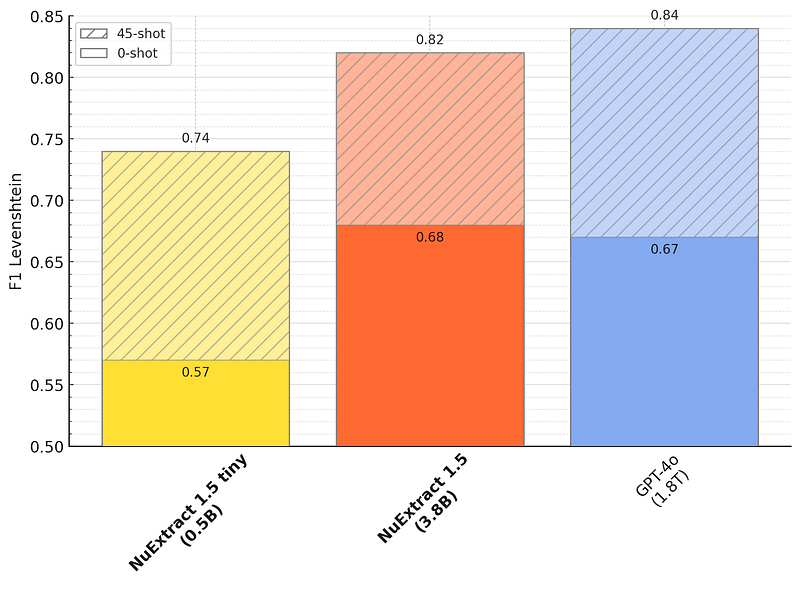 | Many-shot results on the structured extraction benchmark. |
| 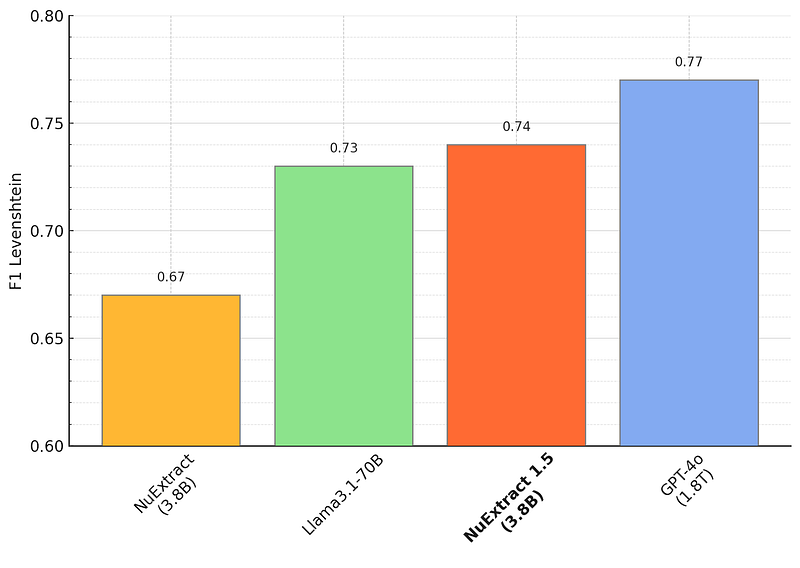 | Multilingual zero-shot results on the structured extraction benchmark. |
| 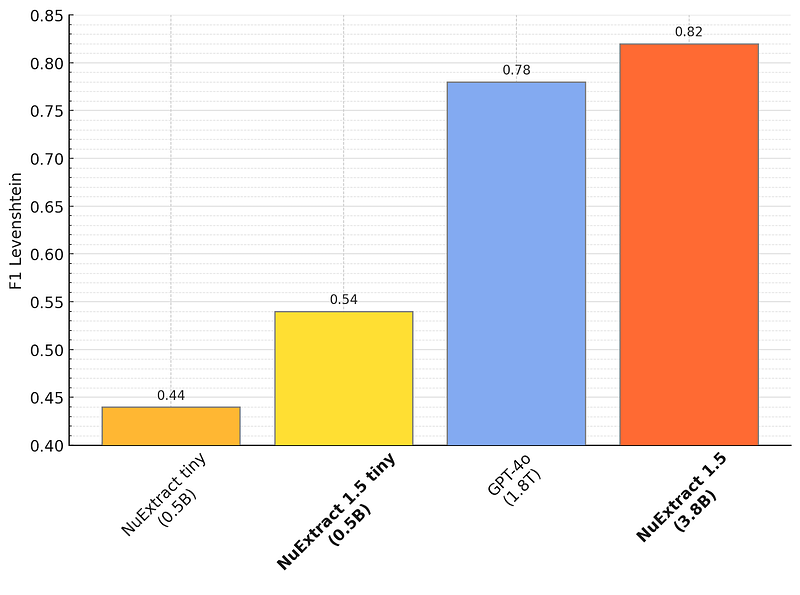 | Performance on long documents (between 8k and 10k tokens). |
| 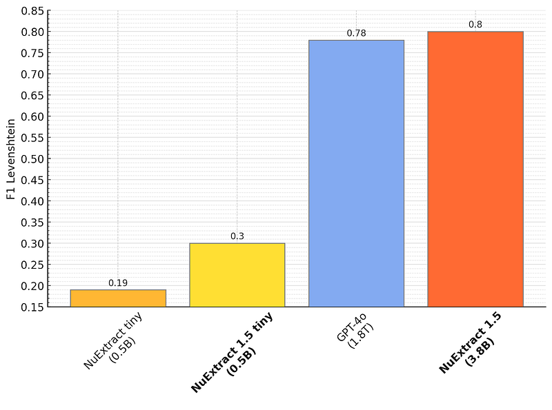 | Performance on even longer documents (between 10k and 20k tokens). |
| 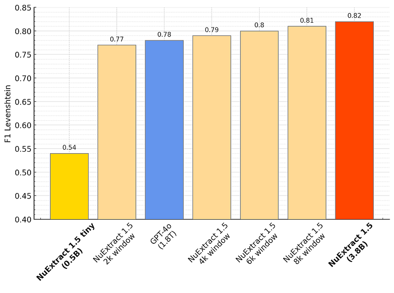 | Extraction window size impact on long-document performance. |
|  | Creation procedure of NuExtract 2.0. |
|  | Template field types (NuExtract 2.0). |
| 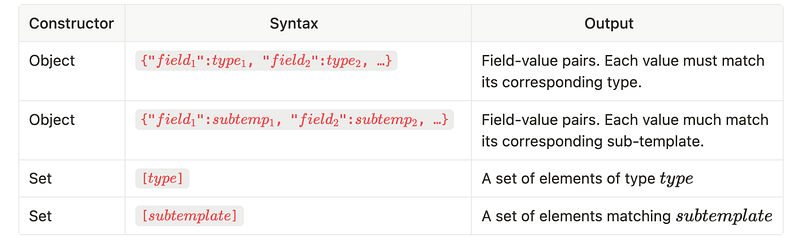 | Template constructors. |
| 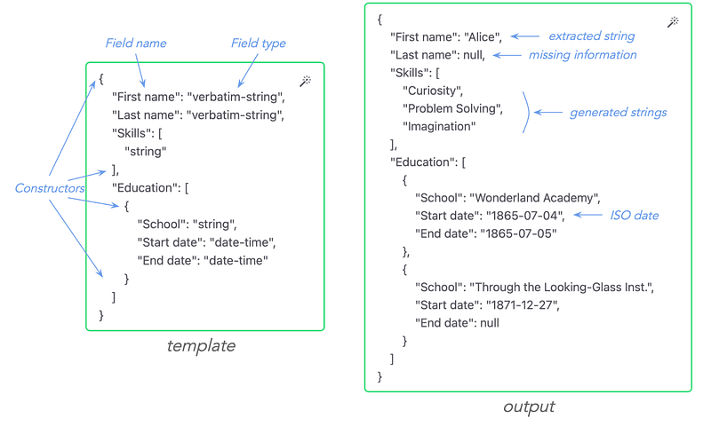 | Example NuExtract 2.0 template and extraction output. |
| 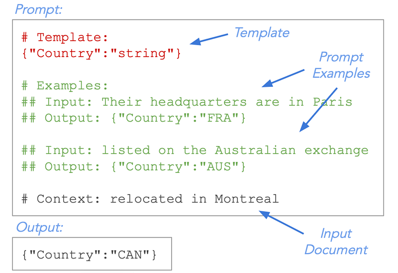 | Minimalist ICL training example. |
|  | NuExtract3 structured extraction task. |
|  | NuExtract3 content extraction (OCR) task. |
| 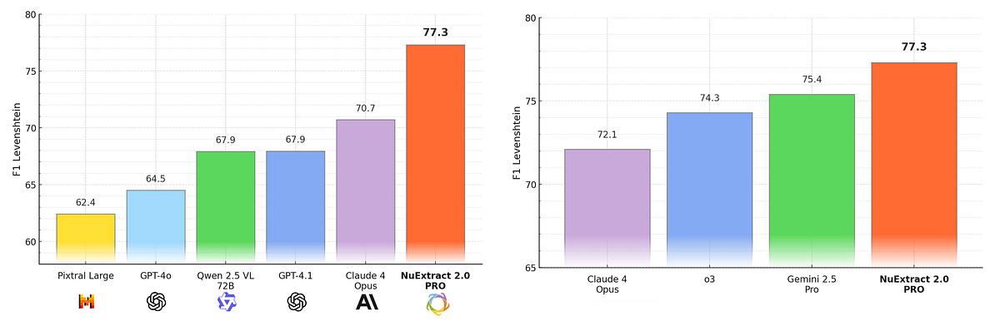 | NuExtract3 training procedure (SFT + RL). |
## Related

- [[Papers Explained Corpus]]
- [[Large Language Models]]
- [[Synthetic Data]]
- [[Reasoning Models]]
- [[Document AI]]
- [[NuExtract 2.0: Outclassing Frontier LLMs in Information Extraction]]
- [[NuExtract3: The Reasoning Open-Source OCR & Structured Extraction LLM]]
- [[NuMind]]
- [[NuExtract]]
- [[Papers Explained 286 - NuNER]]
- [[Papers Explained 288 - STaR]]
