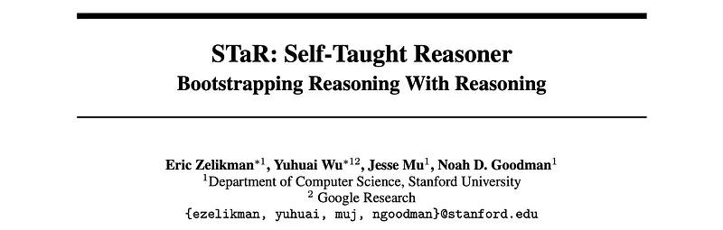
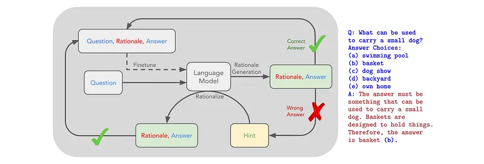
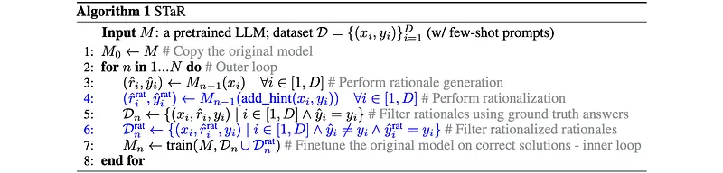
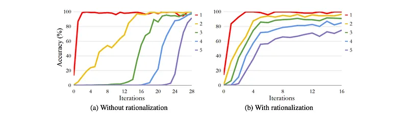

# Papers Explained 288 - STaR

Self-Taught Reasoner (STaR) is a technique to iteratively leverage a small number of rationale examples and a large dataset without rationales, to boot- strap the ability to perform successively more complex reasoning.

This page ingests the source article into the wiki and connects it to [[Papers Explained Corpus]], [[Reasoning Models]], [[Large Language Models]], [[Synthetic Data]], [[Code Models]], [[Supervised Fine-Tuning]].

## Source Metadata

- Source file: `raw/2025-01-15_Papers-Explained-288--STaR-cf485a5b117e.md`
- Source title: Papers Explained 288: STaR
- Published: 2025-01-15
- Canonical: [https://medium.com/@ritvik19/papers-explained-288-star-cf485a5b117e](https://medium.com/@ritvik19/papers-explained-288-star-cf485a5b117e)

## Key Ideas

- Experiments focus on arithmetic, commonsense reasoning, and grade school math to demonstrate STaR’s breadth.
- STaR achieved 89.5% accuracy on n-digit arithmetic addition after 16 iterations.
- Rationalization significantly accelerated learning, enabling the model to learn multiple digit lengths concurrently.
- Introducing additional digits during training improved performance on both seen and unseen (out-of-distribution) examples, although it introduced instability.
- STaR outperformed a baseline model trained without rationales (76.3% accuracy).

## Notes

Self-Taught Reasoner (STaR) is a technique to iteratively leverage a small number of rationale examples and a large dataset without rationales, to boot- strap the ability to perform successively more complex reasoning.

## Method

*Figure: An overview of STaR and a STaR-generated rationale.*

Given a pretrained LLM M and an initial dataset of problems x with answers y: D = {(xi, yi)}. The technique starts with a small prompt set P of examples with intermediate rationales r: P = {(xpi , rip, yip)}, where P ≪ D (e.g. P = 10). Like standard few-shot prompting, this prompt set is concatenated to each example in D, i.e. xi = (xp1, r1p, y1p, . . . , xpP , rPp , yPp , xi), which encourages the model to produce a rationale rˆi for xi followed by an answer yˆi. Rationales that lead to correct answers are assumed to be of better quality than those that lead to incorrect answers. Therefore, the generated rationales are filtered to include only the ones which result in the correct answer (yˆi = yi). The base model M is fine-tuned on this filtered dataset, and this process is restarted by generating the new rationales with the newly fine-tuned model. This process is repeated until the performance plateaus. During this process, once a new dataset is collected, training starts from the original pre-trained model M instead of continually training one model to avoid overfitting.

### Rationalization

The rationale generation bootstrapping algorithm carries a limitation. Since the model is only trained on the examples which it answers correctly, improvement ends when the model fails to solve new problems in the training set. This is fundamentally due to the fact that the algorithm cannot obtain any training signal from failed examples. A technique called “rationalization” is proposed. Specifically, the answer is provided as a hint to the model and it is asked to generate rationales in the same style as in the previous rationale generation step. Given the answer, the model is able to reason backwards, and hence more easily generate a rationale that leads to the correct answer.

## Experiment Setup

Experiments focus on arithmetic, commonsense reasoning, and grade school math to demonstrate STaR’s breadth. GPT-J, a 6B-parameter model, is chosen because the checkpoint and fine-tuning code are publicly available, and the model is large enough to generate rationales of non-trivial quality to be bootstrapped from.

## Evaluations

### Arithmetic

*Figure: A visualization of the accuracy of n-digit summation with each iteration of STaR with and without rationalization for arithmetic.*

- STaR achieved 89.5% accuracy on n-digit arithmetic addition after 16 iterations.

- Rationalization significantly accelerated learning, enabling the model to learn multiple digit lengths concurrently.

- Introducing additional digits during training improved performance on both seen and unseen (out-of-distribution) examples, although it introduced instability.

- STaR outperformed a baseline model trained without rationales (76.3% accuracy).

- Few-shot accuracy on arithmetic was very low, even with rationales.

### CommonsenseQA

- STaR with rationalization achieved 72.5% accuracy on the CQA dev set, outperforming a fine-tuned GPT-J baseline (68.8%), a fine-tuned GPT-3 baseline (73.0%), and a few-shot 137B LaMDA model (55.6%).

- STaR without rationalization also outperformed the GPT-J fine-tuned baseline, despite training on less data.

- Qualitative analysis and a human evaluation suggest that STaR improves the quality of generated rationales compared to few-shot prompting.

- Failure cases often involve logical fallacies, such as making topic-related statements without providing actual arguments.

### GSM8K

- STaR achieved 10.7% accuracy on the GSM8K test set, outperforming few-shot baselines and a fine-tuned GPT-J baseline (5.8%).

- Rationalization did not significantly improve performance on this dataset.

- The model often generated solutions with fewer steps than the ground truth, sometimes skipping steps or finding alternative solutions.

## Paper

STaR: Bootstrapping Reasoning With Reasoning [2203.14465](https://arxiv.org/abs/2203.14465)

## Figures

Figures from the Medium HTML export (`raw/2025-01-15_Papers-Explained-288--STaR-cf485a5b117e.md`); local copies under `wiki/assets/papers-explained-288-star/` when download succeeded.

| Figure | Caption |
|--------|---------|
|  | Title card: STaR. |
|  | An overview of STaR and a STaR-generated rationale. |
|  | Given a pretrained LLM M and an initial dataset of problems x with answers y: D = {(xi, yi)}. |
|  | A visualization of the accuracy of n-digit summation with each iteration of STaR with and without rationalization for arithmetic. |
|  | Experiments focus on arithmetic, commonsense reasoning, and grade school math to demonstrate STaR’s breadth. |
|  | Experiments focus on arithmetic, commonsense reasoning, and grade school math to demonstrate STaR’s breadth. |
## Related

- [[Papers Explained Corpus]]
- [[Reasoning Models]]
- [[Large Language Models]]
- [[Synthetic Data]]
- [[Code Models]]
- [[Supervised Fine-Tuning]]
- [[Papers Explained 287 - NuExtract]]
- [[Papers Explained 289 - V-STaR]]

#summary #topic
