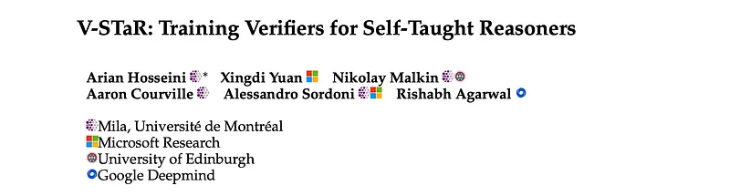
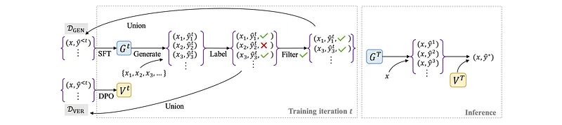
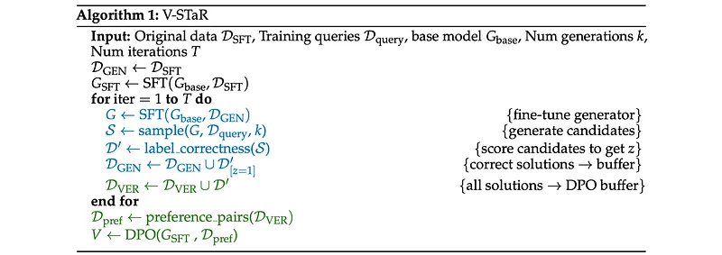
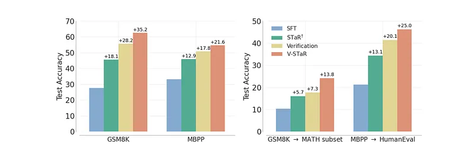
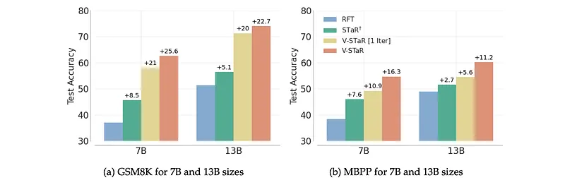
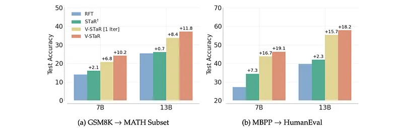
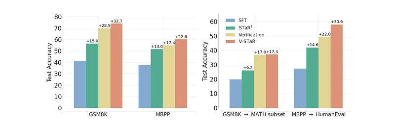
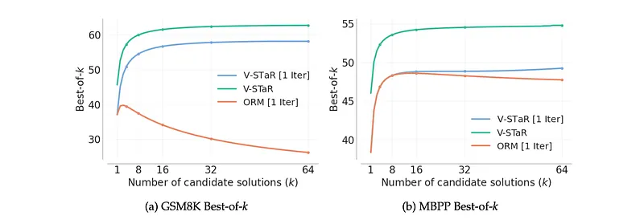
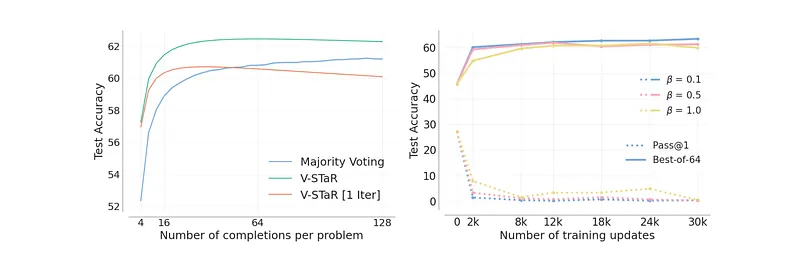

# Papers Explained 289 - V-STaR

Verification for Self-Taught Reasoners (V-STaR) utilizes both the correct and incorrect solutions generated during the self-improvement process to train a verifier using DPO that judges correctness of model-generated solutions. This verifier is used at inference time to select one solution among many candidate solutions.

This page ingests the source article into the wiki and connects it to [[Papers Explained Corpus]], [[Reasoning Models]], [[Large Language Models]], [[Reinforcement Learning Topic]], [[Safety and Alignment]], [[Model Compression and Efficiency]], [[Verifier-Bounded Learning]], [[Reinforcement Learning]], [[Supervised Fine-Tuning]].

## Source Metadata

- Source file: `raw/2025-01-16_Papers-Explained-289--V-STaR-4d2aeedab861.md`
- Source title: Papers Explained 289: V-STaR
- Published: 2025-01-16
- Canonical: [https://medium.com/@ritvik19/papers-explained-289-v-star-4d2aeedab861](https://medium.com/@ritvik19/papers-explained-289-v-star-4d2aeedab861)

## Key Ideas

- Verification for Self-Taught Reasoners (V-STaR) utilizes both the correct and incorrect solutions generated during the self-improvement process to train a verifier using DPO that judges correctness of model-generated solutions.
- V-STaR utilizes both the correct and incorrect solutions generated during the self-improvement process to train a better generator and verifier.
- First, a pretrained LLM Gbase is fine-tuned on the original training data DSFT to obtain generator GSFT.
- Next, k completions for each problem in the training data are sampled from the generator {yˆi,j ∼ G(y|xi)}kj=1, where x ∈ Dquery.
- Generated solutions are labeled for their correctness z using ground truth answers or test cases. Only correct generated solutions (z = 1) are used to augment the generator training data DGEN as (xi, yˆi,j).

## Notes

Verification for Self-Taught Reasoners (V-STaR) utilizes both the correct and incorrect solutions generated during the self-improvement process to train a verifier using DPO that judges correctness of model-generated solutions. This verifier is used at inference time to select one solution among many candidate solutions.

## Method

*Figure: Generator and verifier training in V-STaR.*

V-STaR utilizes both the correct and incorrect solutions generated during the self-improvement process to train a better generator and verifier.

- First, a pretrained LLM Gbase is fine-tuned on the original training data DSFT to obtain generator GSFT.

- Next, k completions for each problem in the training data are sampled from the generator {yˆi,j ∼ G(y|xi)}kj=1, where x ∈ Dquery.

- Generated solutions are labeled for their correctness z using ground truth answers or test cases. Only correct generated solutions (z = 1) are used to augment the generator training data DGEN as (xi, yˆi,j). Both correct and incorrect generated solutions are added to verifier data DVER with their correctness label as (xi, yˆi,j, zi,j), so the verifier can learn from generator’s mistakes.

- In the next iteration t, the generator Gt is obtained by fine-tuning the pretrained model Gbase on the augmented DGEN. Solutions can be sampled again from this generator Gt. This process is repeated for up to T iterations to augment DGEN and DVER iteratively.

- The final generator GT is obtained by using DGEN to fine-tune a pretrained model Gbase. The verifier VT is obtained by using DVER to further train a model GSFT which was fine-tuned on the original DSFT.

Current LLM verifiers are trained with a combination of language modeling and binary classification loss. These two objectives can be unified via offline preference learning methods, such as DPO, where the proximity to the reference policy is a proxy for the language modeling objective while the classification loss is a proxy for reward modelling. Empirically, DPO verifiers were found to be better than ORM-style verifiers, when using LoRA adapters.

To use DPO for training verifiers, a preference pair dataset is constructed using collected solutions in DVER. Correct solutions are treated as preferred and incorrect solutions as not preferred completions given the problem. Specifically, DVER = {(xi, y+ , y− ), · · · , (xi, y+ , y− )}N , where m is the number of preference pairs which are from the Cartesian product of correct and incorrect solutions. Verifiers V are trained using this constructed DVER and the SFT policy GSFT using the DPO objective.

## Experimental Setup

Experiments are conducted on GSM8K for solving math problems, and MBPP for code-generation problems.

LLaMA2 and CodeLLaMA 7B and 13B models are fine-tuned using LoRA (Hu et al., 2022). Generators are trained with a causal language modeling objective, and the baseline (V-STaR[1 Iter]) and V-STaR verifiers are trained using DPO. The reference policy GSFT for DPO is trained on the original training data for 2 and 3 epochs for GSM8K and MBPP, respectively.

For each iteration, 16 completions are sampled per query from the previous iteration’s generator. For GSM8K, the first iteration samples are from a generator trained solely on the original GSM8K training data for 2 epochs. For MBPP, this data is from a 3-shot pretrained CodeLLaMA. Completions are labeled for correctness by checking the final answer for math problems and running test cases for coding problems.

## Evaluation

*Figure: Test accuracy of 7B V-STaR compared to self-improvement and verification baselines.*

*Figure: Pass@1 and Best-of-64 scores for generator-only and verifier-based methods.*

*Figure: Out-of-domain transfer evaluation.*

*Figure: Test accuracy of 13B V-STaR compared to baselines.*

- V-STaR consistently improves performance on GSM8K, MBPP, MATH subset, and HumanEval datasets for LLaMA2 7B and 13B models.

- V-STaR achieves 6–17% absolute improvement in test accuracy on math tasks and 4–12% improvement on code generation tasks compared to baseline methods like STaR† and Verification.

- Iterative training of the generator and verifier leads to better performance compared to a single iteration.

- V-STaR demonstrates improved out-of-domain performance on HumanEval (when trained on MBPP) and a subset of MATH (when trained on GSM8K).

- Using incorrect solutions to train the verifier provides significant improvements compared to only using correct solutions.

*Figure: Best-of-k test accuracy of V-STaR, V-STaR [1 Iter], and outcome-supervised reward model (ORM) style verifier 7B models*

- Best-of-k accuracy saturates for k ≥ 16.

- DPO-based verifiers outperform ORM-style verifiers, especially when considering more candidate solutions.

*Figure: Left: Best-of-k test accuracy of 7B V-STaR compared to V-STaR[1 Iter] and selfconsistency. Right: Comparing DPO-based generator and verifier for V-STaR 7B, measured by Pass@1 and Best-of-64 respectively on GSM8K*

- V-STaR outperforms majority voting when searching over a large number of candidate solutions.

- The verifier’s generation ability degrades after a small number of training updates when used as a generator.

- Including the verifier in the training loop to filter solutions for the next iteration does not provide substantial gains on MBPP.

## Paper

V-STaR: Training Verifiers for Self-Taught Reasoners [2402.06457](https://arxiv.org/abs/2402.06457)

## Figures

Figures from the Medium HTML export (`raw/2025-01-16_Papers-Explained-289--V-STaR-4d2aeedab861.md`); local copies under `wiki/assets/papers-explained-289-v-star/` when download succeeded.

| Figure | Caption |
|--------|---------|
|  | Title card: V-STaR. |
|  | Generator and verifier training in V-STaR. |
|  | V-STaR utilizes both the correct and incorrect solutions generated during the self-improvement process to train a better generator and... |
|  | Test accuracy of 7B V-STaR compared to self-improvement and verification baselines. |
|  | Pass@1 and Best-of-64 scores for generator-only and verifier-based methods. |
|  | Out-of-domain transfer evaluation. |
|  | Test accuracy of 13B V-STaR compared to baselines. |
|  | Best-of-k test accuracy of V-STaR, V-STaR [1 Iter], and outcome-supervised reward model (ORM) style verifier 7B models. |
|  | Left: Best-of-k test accuracy of 7B V-STaR compared to V-STaR[1 Iter] and selfconsistency. Right: Comparing DPO-based generator and verifier for V-STaR 7B, measured by Pass@1 and Best-of-64 respectively on GSM8K. |
## Related

- [[Papers Explained Corpus]]
- [[Reasoning Models]]
- [[Large Language Models]]
- [[Reinforcement Learning Topic]]
- [[Safety and Alignment]]
- [[Model Compression and Efficiency]]
- [[Verifier-Bounded Learning]]
- [[Reinforcement Learning]]
- [[Supervised Fine-Tuning]]
- [[Papers Explained 288 - STaR]]
- [[Papers Explained 290 - rStar-Math]]

#summary #topic
