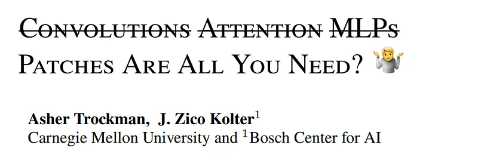
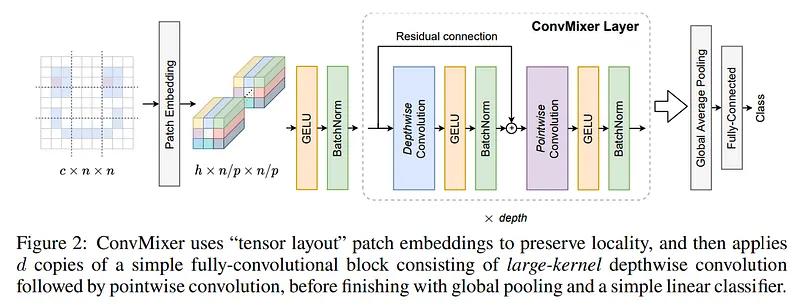
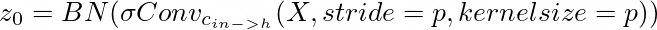
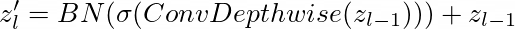
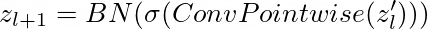

# Papers Explained 29 - ConvMixer

ConvMixer is similar to the Vision Transformer (and MLP-Mixer) in many respects: it directly operates on patches, it maintains an equal-resolution-and-size representation throughout all layers, it does no downsampling of the representation at successive layers, and it separates “channel-wise mixing” from the “spatial mixing” of...

This page ingests the source article into the wiki and connects it to [[Papers Explained Corpus]], [[Computer Vision]], [[Embedding and Retrieval]], [[Large Language Models]], [[Code Models]].

## Source Metadata

- Source file: `raw/2023-02-09_Papers-Explained-29--ConvMixer-f073f0356526.md`
- Source title: Papers Explained 29: ConvMixer
- Published: 2023-02-09
- Canonical: [https://medium.com/@ritvik19/papers-explained-29-convmixer-f073f0356526](https://medium.com/@ritvik19/papers-explained-29-convmixer-f073f0356526)

## Key Ideas

- ConvMixer is similar to the Vision Transformer (and MLP-Mixer) in many respects: it directly operates on patches, it maintains an equal-resolution-and-size representation throughout all layers, it does no downsampling of the representation at successive...
- ConvMixer consists of a patch embedding layer followed by repeated applications of a simple fully-convolutional block. We maintain the spatial structure of the patch embeddings.
- The ConvMixer block itself consists of depthwise convolution (i.e., grouped convolution with groups equal to the number of channels, h) followed by pointwise (i.e., kernel size 1 × 1) convolution.
- After many applications of this block, we perform global pooling to get a feature vector of size h, which we pass to a softmax classifier.
- ConvMixers are evaluated on ImageNet-1k classification data

## Notes

ConvMixer is similar to the Vision Transformer (and MLP-Mixer) in many respects: it directly operates on patches, it maintains an equal-resolution-and-size representation throughout all layers, it does no downsampling of the representation at successive layers, and it separates “channel-wise mixing” from the “spatial mixing” of information. But unlike the Vision Transformer and MLP-Mixer, ConvMixer does all these operations via only standard convolutions.

ConvMixer consists of a patch embedding layer followed by repeated applications of a simple fully-convolutional block. We maintain the spatial structure of the patch embeddings. Patch embeddings with patch size p and embedding dimension h can be implemented as convolution with cin input channels, h output channels, kernel size p, and stride p:

The ConvMixer block itself consists of depthwise convolution (i.e., grouped convolution with groups equal to the number of channels, h) followed by pointwise (i.e., kernel size 1 × 1) convolution. ConvMixers work best with unusually large kernel sizes for the depthwise convolution. Each of the convolutions is followed by an activation and post-activation BatchNorm:

After many applications of this block, we perform global pooling to get a feature vector of size h, which we pass to a softmax classifier.

ConvMixers are evaluated on ImageNet-1k classification data

Recommended Reading: [Papers Explained Review 01: Convolutional Neural Networks](https://ritvik19.medium.com/papers-explained-review-01-convolutional-neural-networks-78aeff61dcb3)

## Paper

Patches Are All You Need? [2201.09792](https://arxiv.org/abs/2201.09792)

## Implementation

[ConvMixer](https://www.kaggle.com/code/ritvik1909/convmixer)

## Figures

Figures from the Medium HTML export (`raw/2023-02-09_Papers-Explained-29--ConvMixer-f073f0356526.md`); local copies under `wiki/assets/papers-explained-29-convmixer/` when download succeeded.

| Figure | Caption |
|--------|---------|
|  | Title card: ConvMixer. |
|  | ConvMixer consists of a patch embedding layer followed by repeated applications of a simple fully-convolutional block. |
|  | ConvMixer consists of a patch embedding layer followed by repeated applications of a simple fully-convolutional block. |
|  | Papers Explained 29: ConvMixer. |
|  | After many applications of this block, we perform global pooling to get a feature vector of size h, which we pass to a softmax classifier. |
## Related

- [[Papers Explained Corpus]]
- [[Computer Vision]]
- [[Embedding and Retrieval]]
- [[Large Language Models]]
- [[Code Models]]
- [[Papers Explained 28 - Masked AutoEncoder]]
- [[Papers Explained 30 - DocFormer]]

#summary #topic
