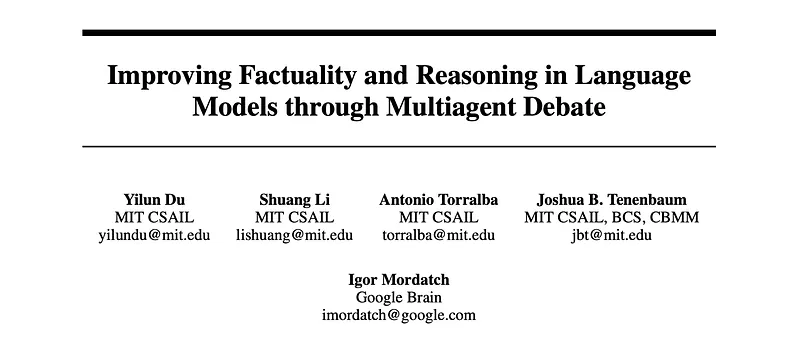
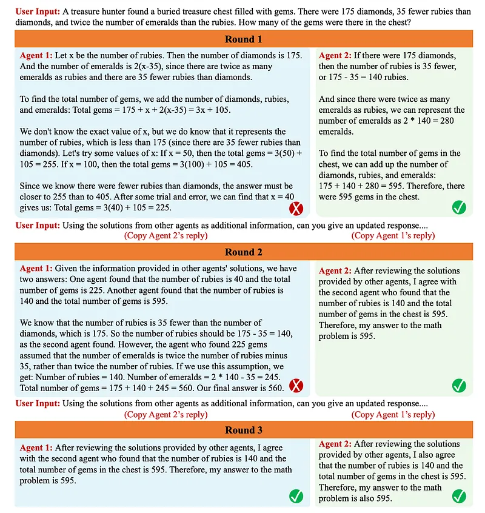
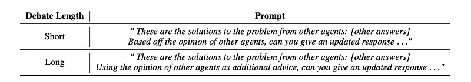
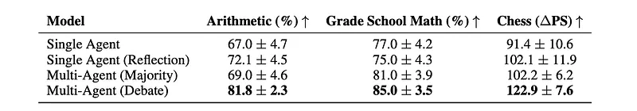
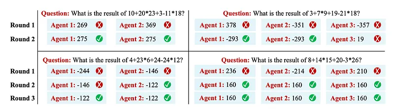
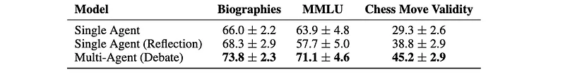
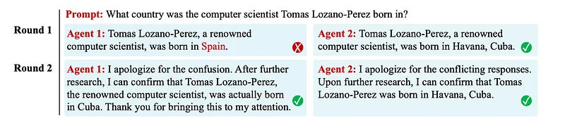

# Papers Explained 291 - Multiagent Debate

Multiagent Debate is a complementary approach to improve language responses where multiple language model instances propose and debate their individual responses and reasoning processes over multiple rounds to arrive at a common final answer.

This page ingests the source article into the wiki and connects it to [[Papers Explained Corpus]], [[Large Language Models]], [[Agentic AI]], [[Reasoning Models]].

## Source Metadata

- Source file: `raw/2025-01-20_Papers-Explained-291--Multiagent-Debate-1a1693d5fa5e.md`
- Source title: Papers Explained 291: Multiagent Debate
- Published: 2025-01-20
- Canonical: [https://medium.com/@ritvik19/papers-explained-291-multiagent-debate-1a1693d5fa5e](https://medium.com/@ritvik19/papers-explained-291-multiagent-debate-1a1693d5fa5e)

## Key Ideas

- To mimic multi-threaded reasoning and multi-source factuality checking processes, a multi-agent debate procedure between multiple instances of large language models is proposed.
- Concretely, each agent first independently solves the given problem or task. After each agent generates a response, a consensus prompt is fed to each agent, instructing them to update their responses based on the responses of other agents.
- Empirically, language models are able to converge on a single shared answer after multiple rounds of debate. In general, prompts that encouraged models to be more “stubborn” based on their own solutions led to longer debates and better final solutions.
- Multiagent debate significantly improves reasoning performance across different tasks compared to single-agent, self-reflection, and multiagent voting baselines.
- Even when all agents initially provide incorrect answers, the debate process can lead to the correct solution.

## Notes

Multiagent Debate is a complementary approach to improve language responses where multiple language model instances propose and debate their individual responses and reasoning processes over multiple rounds to arrive at a common final answer. This approach significantly enhances mathematical and strategic reasoning across a number of tasks.

## Method

*Figure: Illustration of Debate.*

To mimic multi-threaded reasoning and multi-source factuality checking processes, a multi-agent debate procedure between multiple instances of large language models is proposed. Given a question, multiple agents, represented as copies of a large language model, generate answers. Each response serves as a possible thought process or source of information which agents may re-examine to find consistent final answers.

After initial responses are generated from different agents, a round of debate is initiated. Individual responses from other agents are concatenated and given as context to each agent, with each agent instructed to construct a new response based on such responses. Each language agent is thus responsible for both verifying the collection of responses given by other agents, and refining its own response based on other agents’ responses. This debate procedure is iteratively repeated over multiple rounds for improved performance.

Concretely, each agent first independently solves the given problem or task. After each agent generates a response, a consensus prompt is fed to each agent, instructing them to update their responses based on the responses of other agents. This resultant consensus prompt may then be repeatedly given, using the updated responses of each agent.

*Figure: Prompts to induce long and short form debate.*

Empirically, language models are able to converge on a single shared answer after multiple rounds of debate. In general, prompts that encouraged models to be more “stubborn” based on their own solutions led to longer debates and better final solutions.

## Experiments

### Improving Reasoning with Multiagent Debate

*Figure: Multiagent Debate Improves Reasoning.*

- Multiagent debate significantly improves reasoning performance across different tasks compared to single-agent, self-reflection, and multiagent voting baselines.

*Figure: Illustration of Solving Math.*

- Even when all agents initially provide incorrect answers, the debate process can lead to the correct solution.

*Figure: Synergy with Other Methods.*

- Multiagent debate is compatible with and further enhances the performance of other reasoning methods like chain-of-thought prompting.

### Extracting Factual Information from Multiagent Debate

*Figure: Multiagent Debate Improves Factual Accuracy.*

- Debate significantly outperformed baseline language models in terms of factuality across the three tasks.

- Reflection-based approaches performed poorly in the factuality setting.

*Figure: Expressing Uncertainty with Multiple Answers.*

- While individual language agents might express high confidence in different (and potentially incorrect) answers, debate facilitated convergence towards a consensus answer that was more accurate.

- The “ease of persuasion” during debate could potentially serve as a measure of factual confidence, as agents were harder to persuade on facts they were already confident about.

## Paper

Improving Factuality and Reasoning in Language Models through Multiagent Debate [2305.14325](https://arxiv.org/abs/2305.14325)

## Figures

Figures from the Medium HTML export (`raw/2025-01-20_Papers-Explained-291--Multiagent-Debate-1a1693d5fa5e.md`); local copies under `wiki/assets/papers-explained-291-multiagent-debate/` when download succeeded.

| Figure | Caption |
|--------|---------|
|  | Title card: Multiagent Debate. |
|  | Illustration of Debate. |
|  | Prompts to induce long and short form debate. |
|  | Multiagent Debate Improves Reasoning. |
|  | Illustration of Solving Math. |
|  | Synergy with Other Methods. |
|  | Multiagent Debate Improves Factual Accuracy. |
|  | Expressing Uncertainty with Multiple Answers. |
## Related

- [[Papers Explained Corpus]]
- [[Large Language Models]]
- [[Agentic AI]]
- [[Reasoning Models]]
- [[Papers Explained 290 - rStar-Math]]
- [[Papers Explained 292 - Multiagent Finetuning]]

#summary #topic
