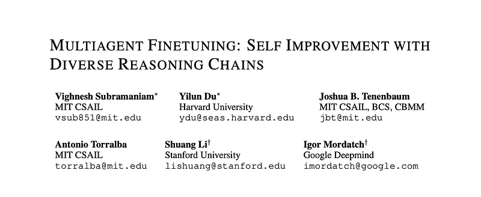
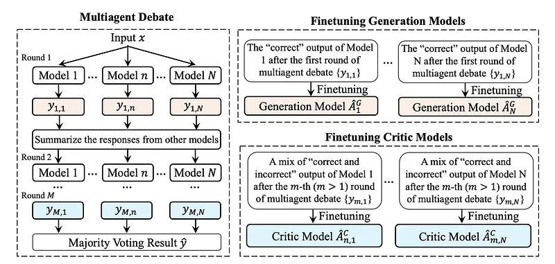
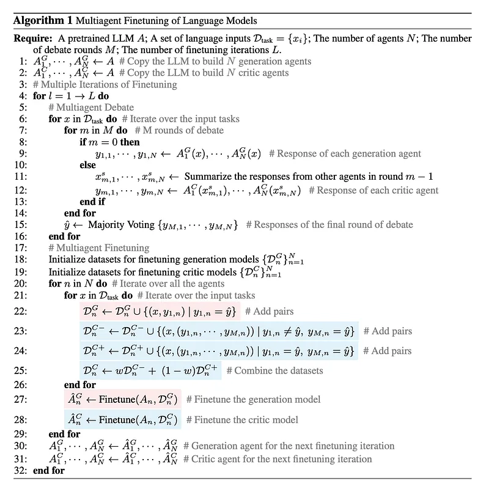
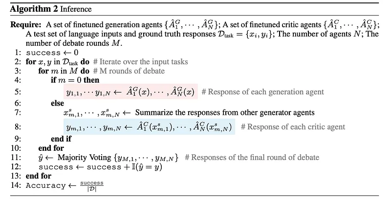
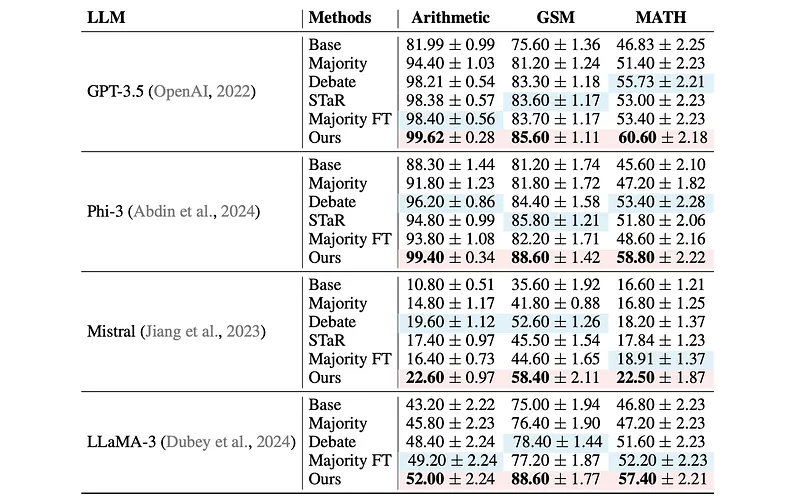
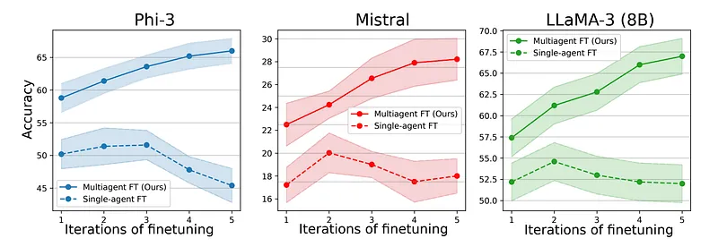
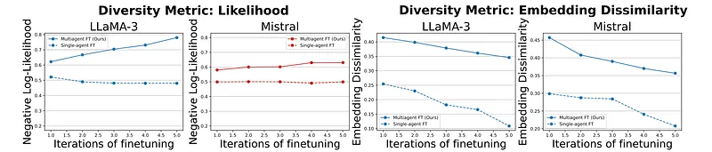

# Papers Explained 292 - Multiagent Finetuning

Multiagent Fine Tuning is a complementary approach towards self-improvement where finetuning is applied to a multiagent society of language models. A group of language models, all starting from the same base model, are independently specialized by updating each one using data generated through multi-agent interactions among the models.

This page ingests the source article into the wiki and connects it to [[Papers Explained Corpus]], [[Large Language Models]], [[Agentic AI]], [[Synthetic Data]], [[Supervised Fine-Tuning]].

## Source Metadata

- Source file: `raw/2025-01-21_Papers-Explained-292--Multiagent-Finetuning-a199fc4d8446.md`
- Source title: Papers Explained 292: Multiagent Finetuning
- Published: 2025-01-21
- Canonical: [https://medium.com/@ritvik19/papers-explained-292-multiagent-finetuning-a199fc4d8446](https://medium.com/@ritvik19/papers-explained-292-multiagent-finetuning-a199fc4d8446)

## Key Ideas

- Multiagent Fine Tuning is a complementary approach towards self-improvement where finetuning is applied to a multiagent society of language models.
- A multiagent debate method is used to construct a finetuning dataset for training models.
- Multiagent finetuning is introduced, where each LLM model is specialized by finetuning each model on its own generated data.
- Multiagent debate involves a series of N language model agents — either specific copies or finetuned versions of the same model — each tasked with generating a response to a given problem.
- Given a set of natural language inputs Dtask = {xi}, a multiagent debate method with N agents and M rounds is used to generate responses for each input in Dtask.

## Notes

Multiagent Fine Tuning is a complementary approach towards self-improvement where finetuning is applied to a multiagent society of language models. A group of language models, all starting from the same base model, are independently specialized by updating each one using data generated through multi-agent interactions among the models. By training each model on independent sets of data, this approach enables specialization across models and diversification over the set of models.

## Method

*Figure: Overview of Multiagent Finetuning.*

The method involves two components.

- A multiagent debate method is used to construct a finetuning dataset for training models.

- Multiagent finetuning is introduced, where each LLM model is specialized by finetuning each model on its own generated data.

### Multiagent Debate

Multiagent debate involves a series of N language model agents — either specific copies or finetuned versions of the same model — each tasked with generating a response to a given problem. After the initial responses are generated, a debate round is initiated among the agents. Each agent is instructed to construct a new response based on its prior response and the summarized responses from the others. The final result is determined by majority vote based on the outputs from the last round of debate.

### FineTuning Models on Generated Data

Given a set of natural language inputs Dtask = {xi}, a multiagent debate method with N agents and M rounds is used to generate responses for each input in Dtask. The final predicted output yˆi for each xi is obtained through majority voting in the last round of debate. This is used to construct a “ground truth” dataset of {(xi, yˆi)}. In the single LLM model setting, the model is then finetuned on the set of generated responses yi which match yˆi given input xi.

While the final debate results yˆi are accurate, they often similar in style and methodology. As a result, repeatedly capturing a dataset of {(xi, yˆi)} pairs for multiple rounds of finetuning often leads to a plateau of self-improvement performance.

It is proposed to create different datasets to finetune different models. A set of models are trained as generation agents and others as critic agents. The generation models produce initial responses to input questions. In contrast, the critic models assess the outputs from all generation agents and then select or generate the most effective responses.

Generation agents AGn are constructed from the N generation models which generate a response to the given input x. For each agent, its outputs yn that match the final debate results yˆ are selected and input-output pairs (x, yn) are constructed. The resulting dataset for agent AGn is DnG = {(x, yn)}. This approach generates a set of fine-tuning datasets {D1G , · · · , DNG } across all N agents. Each dataset contains different outputs, allowing for specialization and diversification of responses. Each generation model is fine-tuned with the corresponding dataset to get N correspondingly fine-tuned agents {AˆG1 ,··· ,AˆGN}.

Criticagents ACn are constructed from critic models and evaluate the outputs from all generation agents and then select or synthesize the best responses. In the multiagent debate setting, each agent’s output in the last round of debates is represented as yM,n, where M denotes the number of debate rounds. Outputs yM,n that align with the final debate results yˆ are identified. These consistent outputs, together with the previous responses, are then used to construct input-output pairs (x, (y1,n, . . . , yM,n)) for finetuning the critic models.

To enhance the model’s capability to correct incorrect answers generated early in the debate process, a subset of pairs where y1,n differs from yˆ, but yM,n matches yˆ is sampled and a dataset DC− = {(x,(y1,n ,…,y M,n ))|y1,n ̸= yˆ,y M,n = yˆ} is built. This indicates that the answer was successfully corrected by the end of the debates. Another dataset DC+ = {(x,(y1,n ,…,y M,n ))|y1,n = yˆ,y M,n = yˆ} is constructed where both y1,n yM,n matches yˆ demonstrating the agent’s ability to maintain the correct answer throughout the debates. These two datasets are combined to create a comprehensive finetuning dataset for each critic model to construct updated critic agents ACn.

The finetuned generation agents {AˆG1 , · · · , AˆGN } and critic agents {AˆC1 , · · · , AˆCN } are used to gather datasets for the next iteration through multiagent debate.

### Inference

At inference time, a multiagent debate is conducted among the finetuned agents. Each individual generation agent participates in the first round of the debate, followed by each individual critic agent in subsequent rounds. Each agent takes the responses from all other agents and generates a new response in each round of the debate. Summarizing the responses from the other agents helps eliminate redundant information while retaining the most important details, thereby further improving performance. The final result is determined by a majority vote based on the responses from the final round of the debate.

## Experiments

*Figure: Quantitative results of the proposed method and baselines.*

- The proposed multi-agent finetuning method outperforms all baselines across all datasets and language models tested.

- The method achieves better performance than the iterative self-training baseline (STaR) even though STaR uses ground truth labels and multiple finetuning iterations, while the proposed method uses only a single finetuning iteration in the initial comparison.

- Majority voting, multi-agent debate, and finetuning all contribute to improved performance compared to a single agent baseline.

*Figure: Multiagent finetuning improves reasoning performance over multiple rounds of finetuning.*

- Multiple iterations of the proposed multi-agent finetuning method further improve performance, while single-agent finetuning performance saturates and then declines, suggesting overfitting.

*Figure: Diversity is preserved and can improve across iterations of finetuning.*

- The multi-agent finetuning method maintains or improves response diversity across iterations, while single-agent finetuning reduces diversity.

## Paper

Multiagent Finetuning: Self Improvement with Diverse Reasoning Chains [2501.05707](https://arxiv.org/abs/2501.05707)

## Figures

Figures from the Medium HTML export (`raw/2025-01-21_Papers-Explained-292--Multiagent-Finetuning-a199fc4d8446.md`); local copies under `wiki/assets/papers-explained-292-multiagent-finetuning/` when download succeeded.

| Figure | Caption |
|--------|---------|
|  | Title card: Multiagent Finetuning. |
|  | Overview of Multiagent Finetuning. |
|  | Given a set of natural language inputs Dtask = {xi}, a multiagent debate method with N agents and M rounds is used to generate responses... |
|  | At inference time, a multiagent debate is conducted among the finetuned agents. |
|  | Quantitative results of the proposed method and baselines. |
|  | Multiagent finetuning improves reasoning performance over multiple rounds of finetuning. |
|  | Diversity is preserved and can improve across iterations of finetuning. |
## Related

- [[Papers Explained Corpus]]
- [[Large Language Models]]
- [[Agentic AI]]
- [[Synthetic Data]]
- [[Supervised Fine-Tuning]]
- [[Papers Explained 291 - Multiagent Debate]]
- [[Papers Explained 293 - TLDR]]

#summary #topic
