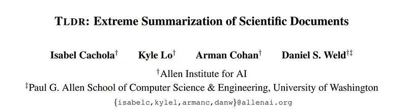
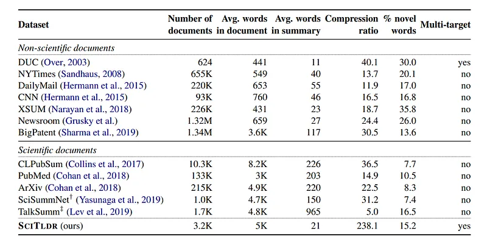
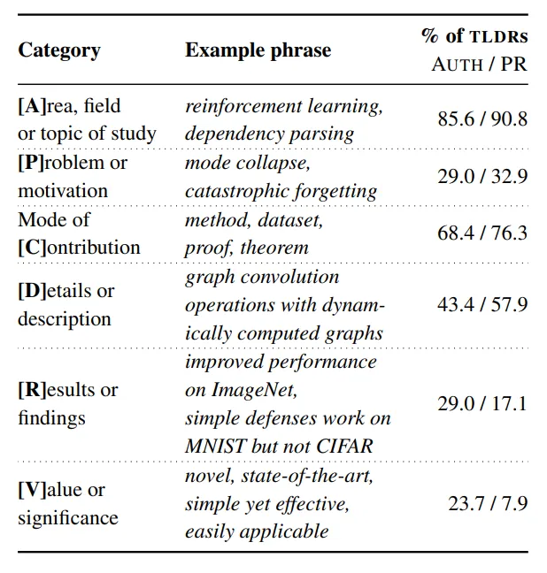
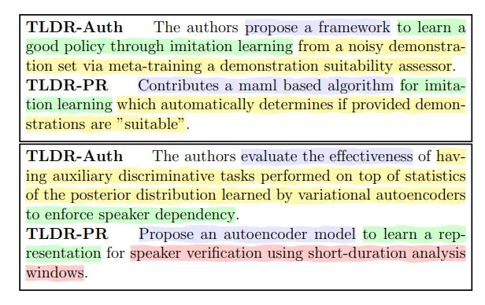
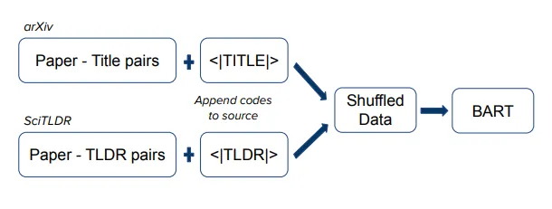
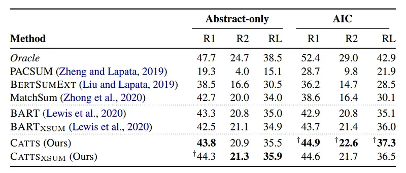
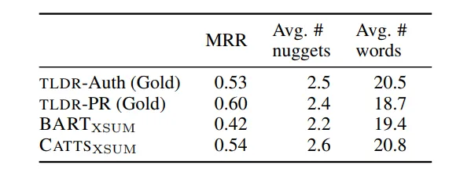
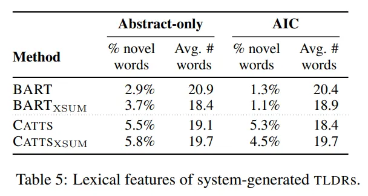

# Papers Explained 293 - TLDR

TLDR generation is a new form of extreme summarization, for scientific papers which involves high source compression and requires expert background knowledge and understanding of complex domain-specific language.

This page ingests the source article into the wiki and connects it to [[Papers Explained Corpus]], [[Model Compression and Efficiency]], [[Synthetic Data]], [[Document AI]].

## Source Metadata

- Source file: `raw/2025-01-22_Papers-Explained-293--TLDR-a31d787cd365.md`
- Source title: Papers Explained 293: TLDR
- Published: 2025-01-22
- Canonical: [https://medium.com/@ritvik19/papers-explained-293-tldr-a31d787cd365](https://medium.com/@ritvik19/papers-explained-293-tldr-a31d787cd365)

## Key Ideas

- The paper introduces SCITLDR, a new multi-target dataset of 5.4K TLDRs over 3.2K papers, containing both author-written and expert-derived TLDRs.
- It also introduces CATTS, a simple yet effective learning strategy for generating TLDRs that exploits titles as an auxiliary training signal.
- The training set of the dataset contains 1,992 papers, each with a single gold TLDR. The dev and test sets contain 619 and 618 papers each, with 1,452 and 1,967 TLDRs, respectively.
- SCITLDR has short summaries, and summarization in higher compression settings is challenging as it requires capturing more precisely the salient aspects of the document.
- SCITLDR is more abstractive compared with other scientific domain datasets but less abstractive compared with non-scientific domain datasets.

## Notes

TLDR generation is a new form of extreme summarization, for scientific papers which involves high source compression and requires expert background knowledge and understanding of complex domain-specific language.

The paper introduces SCITLDR, a new multi-target dataset of 5.4K TLDRs over 3.2K papers, containing both author-written and expert-derived TLDRs.

It also introduces CATTS, a simple yet effective learning strategy for generating TLDRs that exploits titles as an auxiliary training signal.

## SCITLDR

*Figure: Comparison of SCITLDR to existing summarization datasets.*

The training set of the dataset contains 1,992 papers, each with a single gold TLDR. The dev and test sets contain 619 and 618 papers each, with 1,452 and 1,967 TLDRs, respectively.

SCITLDR has short summaries, and summarization in higher compression settings is challenging as it requires capturing more precisely the salient aspects of the document.

SCITLDR is more abstractive compared with other scientific domain datasets but less abstractive compared with non-scientific domain datasets.

### Information content

Two computer science researchers were caked to read through a collection of TLDRs to both define a comprehensive set of categories of types of information present in TLDRs, which are referred to as nuggets. Each TLDR is labeled with all represented nuggets.

*Figure: Example categories (or nuggets) of information a TLDR might contain.*

Most TLDRs contain between two to four nuggets (never all six), and will provide some indication of their subject area (A) and the paper’s contributions (C).

TLDR-Auth tend to include results or scientific/theoretical findings (R) and often signal the value of their work (V) by describing their contributions as novel or their results as strong or state-of-the-art.

In contrast, TLDR-PR focuses more on articulating problems the paper addresses (P).

Interestingly, TLDR-PR places less emphasis on (R) and (V) in favor of further methodological details in the paper (D).

*Figure: Two example TLDR-Auth and TLDR-PR pairs.*

### Variability in TLDRs

TLDR-Auth are on average 18.9 words long, while TLDR-PR are slightly longer on average at 22.9 words.

TLDR-PR is more abstractive with a novelty score of 20.2% compared with TLDRAuth with a novelty score of 9.6%, where novelty is computed as the percentage of words in the TLDR not in the source paper.

TLDR-PR are derived from peer review comments which themselves have already gone through one stage of abstraction.

## CATTS

CATTS (Controlled Abstraction for TLDRs with Title Scaffolding), a simple yet effective method for learning to generate TLDRs.

It proposes using titles of scientific papers as additional generation targets. As titles often contain key information about a paper, It is hypothesized that training a model to generate titles will allow it to learn how to locate salient information in the paper that will be also useful for generating TLDRs.

*Figure: Training regimen for CATTS.*

Similar to multitask learning, training on heterogeneous data annotated with control codes has been shown to improve controlled generation in autoregressive language models.

In order to use title generation as a scaffold task for TLDR generation, SCITLDR is shuffled with a title generation dataset, then each source is appended with control codes |TLDR| and |TITLE|, respectively.

## Experiment Details

### Input space

Abstract only: The average length of an abstract is 159 words and resulting compression ratio is 7.6.

Abstract, introduction, and conclusion (AIC) sections: The average combined length of these contexts is 993 words and resulting compression ratio is 47.3.

### Baselines

Extractive methods

For the unsupervised baseline, PACSUM, an extension of TextRank that uses BERT as a sentence encoder is used.

For the supervised baselines, BERTSUMEXT which uses BERT as a sentence encoder augmented with inter-sentence Transformer layers to capture interactions, and MatchSum which uses a BERT Siamese network to score whole summaries are used.

Abstractive methods

BART-large and BART-large fine tuned on XSUM are used. The CATTS training method is applied to these two models, using an additional 20K paper-title pairs from arXiv for title generation. For simplicity, these referred as BART, BARTXSUM, CATTS and CATTSXSUM, respectively.

Oracle

A sentence level oracle is defined:

> “Given a paper and its multiple gold TLDRs, it selects the single sentence in the document with the highest Rouge overlap for each gold TLDR. Then it returns the single sentence that yields the maximum Rouge across all gold TLDRs.”

The full text oracle achieves 54.5 Rouge-1, 30.6 Rouge-2, and 45.0 Rouge-L on the test set.

## Evaluation Methodology

### Automated Evaluation:

- The evaluation of the summarization system involves using Rouge-1, Rouge-2, and Rouge-L metrics.

- Multiple target summaries are available for each paper, and the Rouge score is calculated for the system-generated TLDR compared to each of the gold TLDRs.

- The maximum Rouge score among the gold TLDRs is considered as the final Rouge score for the paper.

- The maximum operation is preferred over taking the mean due to the variability in TLDRs, rewarding matching any of the gold TLDRs.

### Human Evaluation:

- Human experts in computer science assess system-generated TLDRs based on informativeness and correctness.

- Informativeness is evaluated using a nugget-based analysis, comparing information content between system-generated and gold TLDRs.

- Correctness evaluation involves the original authors of papers assessing system-generated TLDRs for accuracy and is done through emails with a scoring system.

- Mean correctness across papers is compared for different system variants, with responses received from 29 unique authors covering 64 arXiv papers.

## Results

### Quantitative results

*Figure: Test set max Rouge scores of extractive and abstractive baselines and CATTS. † indicates CATTS variants that significantly (p<0.05) outperform their corresponding BART baseline.*

- MatchSum shows the highest performance among extractive methods.

- BERTSUMEXT follows MatchSum in extractive performance.

- Increasing input space from abstract-only to AIC enhances PACSUM15 but decreases BERTSUMEXT and MatchSum performance.

- The increased input space may make it harder for models to learn optimal parameters, including new position embeddings in low-resource training.

- Abstractive methods, such as BART and BARTXSUM, are not limited to exact sentence selection.

- CATTS learning strategy results in improvements for both abstract-only and AIC settings in comparison to abstractive baselines.

- CATTS and CATTSXSUM achieve higher Rouge-1 scores in both abstract-only and AIC settings.

- In the abstract-only setting, CATTS and CATTSXSUM achieve +0.5 and +1.8 Rouge-1 improvement, respectively.

- In the AIC setting, CATTS and CATTSXSUM achieve +2.0 and +0.9 Rouge-1 improvement, respectively.

### Human evaluation

*Figure: Human evaluation on informativeness of gold and system-generated TLDRs.*

- CATTSXSUM is more informative than BARTXSUM.

- CATTSXSUM is comparable to gold TLDR-Auth, but less informative than TLDR-PR.

- Content accuracy evaluated with no significant difference between BARTXSUM and CATTSXSUM.

- 42 ties observed in correctness, 10 cases where BARTXSUM is more correct, and 12 cases where CATTSXSUM is more correct.

- Both models average a rating of 2.5, indicating partially accurate to mostly correct content.

*Figure: Lexical features of system-generated TLDRs.*

- BART variants are less abstractive than CATTS variants.

- Initial training on XSUM might influence models to be slightly less abstractive.

- BART variants are more abstractive in the abstract-only setting than the longer AIC settings, while CATTS seems to have the same level of abstractiveness regardless of input space.

- All systems generate TLDRs of similar length to the average length in the ground truth.

## Paper

TLDR: Extreme Summarization of Scientific Documents [2004.15011](https://arxiv.org/abs/2004.15011)

## Figures

Figures from the Medium HTML export (`raw/2025-01-22_Papers-Explained-293--TLDR-a31d787cd365.md`); local copies under `wiki/assets/papers-explained-293-tldr/` when download succeeded.

| Figure | Caption |
|--------|---------|
|  | Title card: TLDR. |
|  | Comparison of SCITLDR to existing summarization datasets. |
|  | Example categories (or nuggets) of information a TLDR might contain. |
|  | Two example TLDR-Auth and TLDR-PR pairs. |
|  | Training regimen for CATTS. |
|  | Test set max Rouge scores of extractive and abstractive baselines and CATTS. † indicates CATTS variants that significantly (p<0.05) outperform their corresponding BART baseline. |
|  | Human evaluation on informativeness of gold and system-generated TLDRs. |
|  | Lexical features of system-generated TLDRs. |
## Related

- [[Papers Explained Corpus]]
- [[Model Compression and Efficiency]]
- [[Synthetic Data]]
- [[Document AI]]
- [[Papers Explained 292 - Multiagent Finetuning]]
- [[Papers Explained 294 - Multi-LLM Text Summarization]]

#summary #topic
