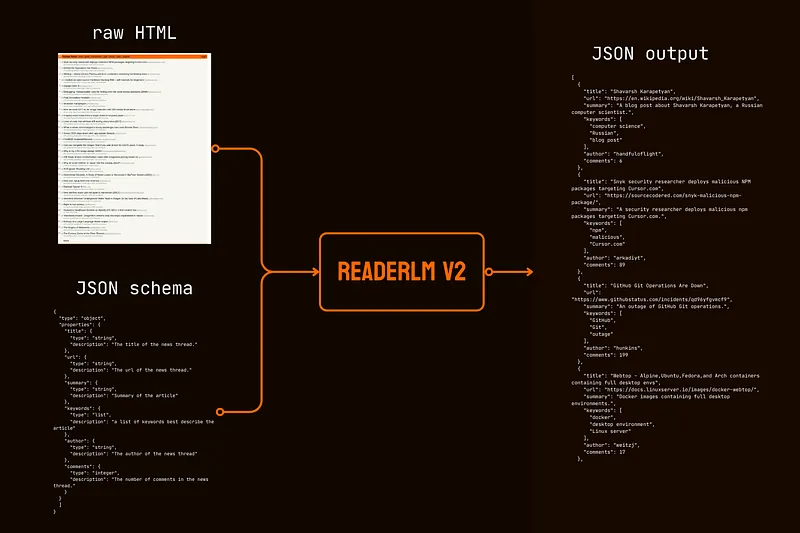
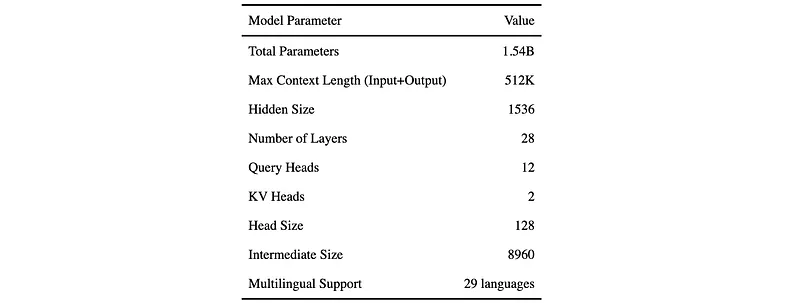
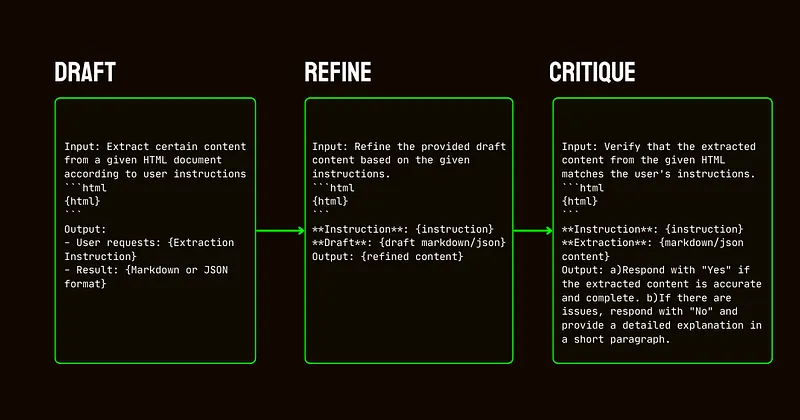
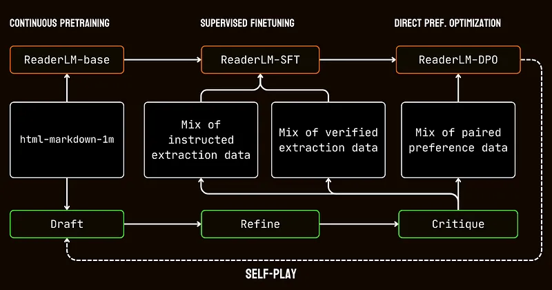
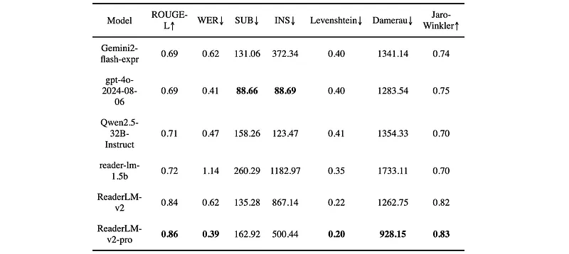
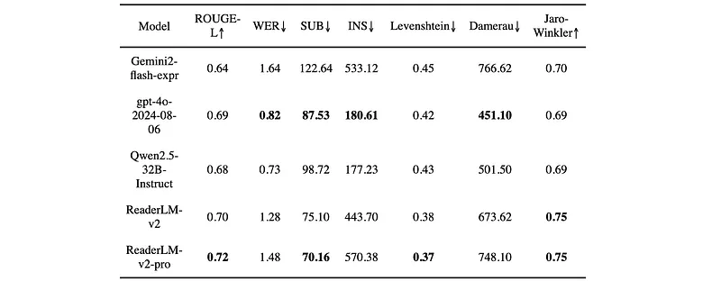
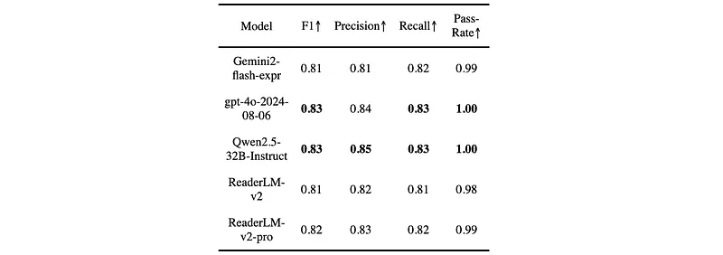

# Papers Explained 295 - ReaderLM v2

ReaderLM’s second generation is a 1.5B parameter language model that converts raw HTML into beautifully formatted markdown or JSON with superior accuracy and improved longer context handling. ReaderLM-v2 handles up to 512K tokens combined input and output length.

This page ingests the source article into the wiki and connects it to [[Papers Explained Corpus]], [[Large Language Models]], [[Synthetic Data]], [[Multilingual Models]], [[Document AI]], [[Safety and Alignment]].

## Source Metadata

- Source file: `raw/2025-01-24_Papers-Explained-295--ReaderLM-v2-7103e9b25a10.md`
- Source title: Papers Explained 295: ReaderLM v2
- Published: 2025-01-24
- Canonical: [https://medium.com/@ritvik19/papers-explained-295-readerlm-v2-7103e9b25a10](https://medium.com/@ritvik19/papers-explained-295-readerlm-v2-7103e9b25a10)

## Key Ideas

- ReaderLM’s second generation is a 1.5B parameter language model that converts raw HTML into beautifully formatted markdown or JSON with superior accuracy and improved longer context handling.
- While the first generation approached HTML-to-markdown conversion as a “selective-copy” task, v2 treats it as a true translation process.
- The model is available on [HuggingFace](https://huggingface.co/jinaai/ReaderLM-v2).
- ReaderLM-v2 is built on Qwen2.5–1.5B-Instruction, a compact base model known for its efficiency in instruction-following and long-context tasks.
- While this created a functional baseline dataset, it highlighted a critical limitation: models trained solely on these direct conversions would essentially just learn to mimic the regex patterns and heuristics used by Jina Reader.

## Notes

ReaderLM’s second generation is a 1.5B parameter language model that converts raw HTML into beautifully formatted markdown or JSON with superior accuracy and improved longer context handling. ReaderLM-v2 handles up to 512K tokens combined input and output length. The model offers multilingual support across 29 languages, including English, Chinese, Japanese, Korean, French, Spanish, Portuguese, German, Italian, Russian, Vietnamese, Thai, Arabic, and more.

While the first generation approached HTML-to-markdown conversion as a “selective-copy” task, v2 treats it as a true translation process. This shift enables the model to masterfully leverage markdown syntax, excelling at generating complex elements like code fences, nested lists, tables and LaTex equations.

The model is available on [HuggingFace](https://huggingface.co/jinaai/ReaderLM-v2).

## Training

ReaderLM-v2 is built on Qwen2.5–1.5B-Instruction, a compact base model known for its efficiency in instruction-following and long-context tasks.

The success of ReaderLM-v2 largely depended on the quality of its training data. A dataset called html-markdown-1m was created, which included one million HTML documents collected from the internet. On average, each document contained 56,000 tokens, reflecting the length and complexity of real-world web data. To prepare this dataset, HTML files were cleaned by removing unnecessary elements such as JavaScript and CSS, while preserving key structural and semantic elements. After cleaning, Jina Reader was used to convert HTML files to Markdown using regex patterns and heuristics.

While this created a functional baseline dataset, it highlighted a critical limitation: models trained solely on these direct conversions would essentially just learn to mimic the regex patterns and heuristics used by Jina Reader. This became evident with reader-lm-0.5b/1.5b, whose performance ceiling was constrained by the quality of these rule-based conversions.

To address these limitations, a three-step pipeline is developed, which relied on the Qwen2.5–32B-Instruction model, which is essential for creating a high quality synthetic dataset.

- Drafting: Initial Markdown and JSON outputs are generated based on instructions provided to the model. These outputs, while diverse, are often noisy or inconsistent.

- Refinement: The generated drafts are improved by removing redundant content, enforcing structural consistency, and aligning with desired formats. This step ensured the data is clean and aligned with task requirements.

- Critique: Refined outputs are evaluated against original instructions. Only data that passed this evaluation is included in the final dataset. This iterative approach ensured that the training data met the necessary quality standards for structured data extraction.

The training process involved multiple stages tailored to the challenges of processing long-context documents. It began with long-context pretraining, using the html-markdown-1m dataset. Techniques like ring-zag attention and rotary positional encoding (RoPE) are used to progressively expand the model’s context length from 32,768 tokens to 256,000 tokens. To maintain stability and efficiency, a gradual training approach is adopted, starting with shorter sequences and incrementally increasing the context length.

Following pretraining, supervised fine-tuning (SFT) is performed. This stage utilized the refined datasets generated in the data preparation process. These datasets included detailed instructions for Markdown and JSON extraction tasks, along with examples for refining drafts. Each dataset is carefully designed to help the model learn specific tasks, such as identifying main content or adhering to schema-based JSON structures.

Direct preference optimization (DPO) is then applied to align the model’s outputs with high-quality results. In this phase, the model is trained on pairs of draft and refined responses. By learning to prioritize the refined outputs, the model internalized the subtle distinctions that define polished and task-specific results.

Finally, self-play reinforcement tuning is implemented, an iterative process where the model generated, refined, and evaluated its own outputs. This cycle allowed the model to improve continuously without requiring additional external supervision. By leveraging its own critiques and refinements, the model gradually enhanced its ability to produce accurate and structured outputs.

A major issue in the first version was degeneration, particularly in the form of repetition and looping after generating long sequences. The model would either begin repeating the same token or get stuck in a loop, cycling through a short sequence of tokens until reaching the maximum output length. ReaderLM-v2 greatly alleviates this issue by adding contrastive loss during training — its performance remains consistent regardless of context length or the amount of tokens already generated.

## Evaluation

The models are evaluated on three tasks:

- main content HTML-to-Markdown

- instructed HTML-to-Markdown

- schema-based HTML-to-JSON.

Performance is measured using a combination of metrics assessing content accuracy and structural fidelity.

- For HTML-to-Markdown, metrics included ROUGE-L, WER, SUB, INS, Levenshtein Distance, Damerau-Levenshtein Distance, and Jaro-Winkler Similarity.

- For HTML-to-JSON, F1, Precision, Recall, and Pass-Rate are used.

- Main Content HTML-to-Markdown: ReaderLM-v2-pro achieved the best performance in five out of seven metrics, demonstrating significant improvements in content preservation and structural accuracy compared to other models, including larger ones. ReaderLM-v2 also outperformed other models on some metrics.

- Instructed HTML-to-Markdown: ReaderLM-v2 and ReaderLM-v2-pro led in ROUGE-L, substitution rate, Levenshtein distance, and Jaro-Winkler similarity. While GPT-4o performed better on WER and Damerau distance, ReaderLM-v2-pro maintained better overall content structure and accuracy.

- Schema-based HTML-to-JSON: ReaderLM-v2 and ReaderLM-v2-pro performed competitively, achieving F1 scores within a small margin of the larger models and maintaining high pass rates.

Overall, ReaderLM-v2 demonstrates significant advancements across all evaluated tasks, offering a strong balance of content accuracy and structural fidelity. The pro version further enhances performance, particularly in the HTML-to-Markdown tasks.

## Paper

[ReaderLM v2: Frontier Small Language Model for HTML to Markdown and JSON](https://jina.ai/news/readerlm-v2-frontier-small-language-model-for-html-to-markdown-and-json/)

## Figures

Figures from the Medium HTML export (`raw/2025-01-24_Papers-Explained-295--ReaderLM-v2-7103e9b25a10.md`); local copies under `wiki/assets/papers-explained-295-readerlm-v2/` when download succeeded.

| Figure | Caption |
|--------|---------|
|  | Title card: ReaderLM v2. |
|  | The model is available on HuggingFace. |
|  | ReaderLM-v2 is built on Qwen2.5–1.5B-Instruction, a compact base model known for its efficiency in instruction-following and long-context... |
|  | The training process involved multiple stages tailored to the challenges of processing long-context documents. |
|  | Finally, self-play reinforcement tuning is implemented, an iterative process where the model generated, refined, and evaluated its own... |
|  | Performance is measured using a combination of metrics assessing content accuracy and structural fidelity. |
|  | Performance is measured using a combination of metrics assessing content accuracy and structural fidelity. |
|  | Performance is measured using a combination of metrics assessing content accuracy and structural fidelity. |
## Related

- [[Papers Explained Corpus]]
- [[Large Language Models]]
- [[Synthetic Data]]
- [[Multilingual Models]]
- [[Document AI]]
- [[Safety and Alignment]]
- [[Papers Explained 294 - Multi-LLM Text Summarization]]
- [[Papers Explained 296 - MAmmoTH-VL]]

#summary #topic
