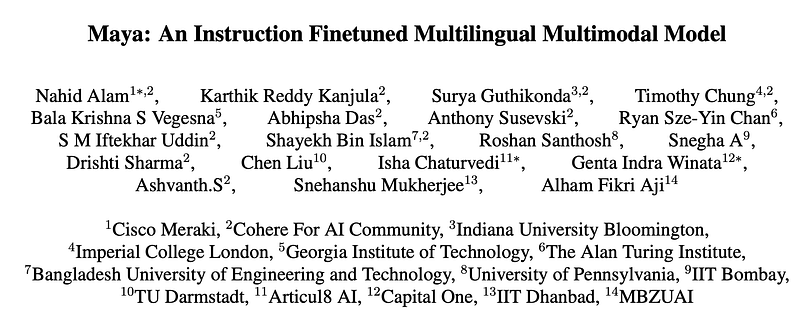
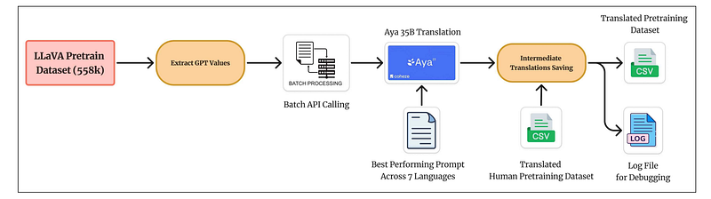
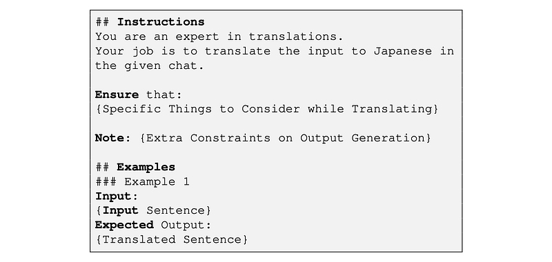
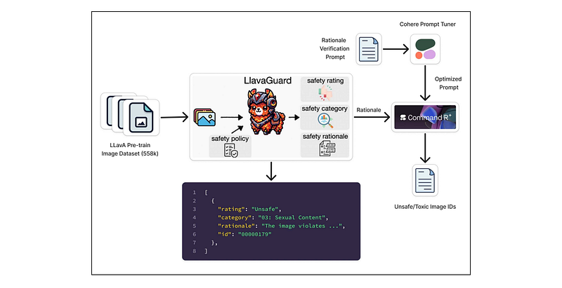
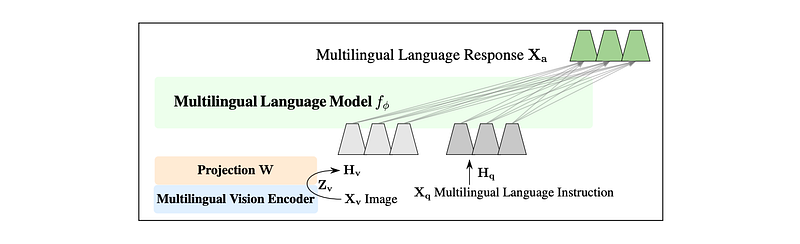
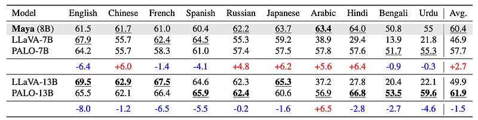
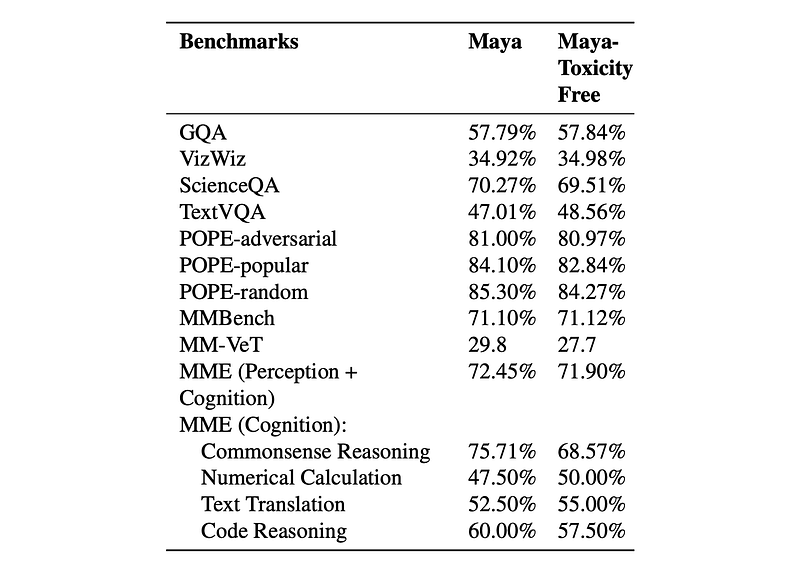
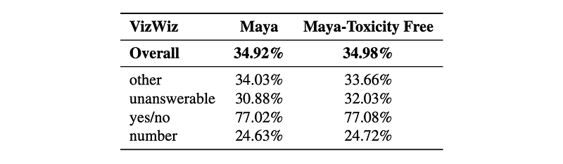
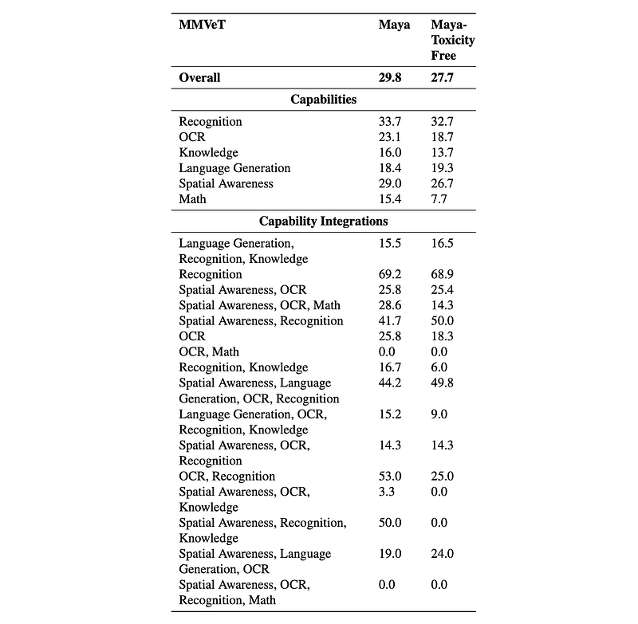

# Papers Explained 297 - Maya

Maya is an open-source Multimodal Multilingual model to address the significant gaps remaining in the ability of current VLMs to handle low-resource languages and varied cultural contexts, largely due to a lack of high-quality, diverse, and safety-vetted data. Maya tackles these limitations by introducing:

This page ingests the source article into the wiki and connects it to [[Papers Explained Corpus]], [[Synthetic Data]], [[Multilingual Models]], [[Vision Language Models]], [[Evaluation and Benchmarks]], [[Large Language Models]].

## Source Metadata

- Source file: `raw/2025-01-28_Papers-Explained-297--Maya-0a38799daa43.html`
- Source title: Papers Explained 297: Maya
- Published: 2025-01-28
- Canonical: [https://medium.com/@ritvik19/papers-explained-297-maya-0a38799daa43](https://medium.com/@ritvik19/papers-explained-297-maya-0a38799daa43)

## Key Ideas

- Maya is an open-source Multimodal Multilingual model to address the significant gaps remaining in the ability of current VLMs to handle low-resource languages and varied cultural contexts, largely due to a lack of high-quality, diverse, and safety-vetted...
- a multilingual image-text pretraining dataset in eight languages, based on the LLaVA pre training dataset
- a thorough analysis of toxicity within the LLaVA dataset, followed by the creation of a novel toxicity-free version across eight languages
- a multilingual image-text model supporting these languages, enhancing cultural and linguistic comprehension in vision-language tasks.
- The original English LLaVA dataset, containing 558,000 samples, was expanded to include seven additional languages — Chinese, French, Spanish, Russian, Hindi, Japanese, and Arabic, yielding a total of 4.4 million samples.

## Notes

Maya is an open-source Multimodal Multilingual model to address the significant gaps remaining in the ability of current VLMs to handle low-resource languages and varied cultural contexts, largely due to a lack of high-quality, diverse, and safety-vetted data. Maya tackles these limitations by introducing:

- a multilingual image-text pretraining dataset in eight languages, based on the LLaVA pre training dataset

- a thorough analysis of toxicity within the LLaVA dataset, followed by the creation of a novel toxicity-free version across eight languages

- a multilingual image-text model supporting these languages, enhancing cultural and linguistic comprehension in vision-language tasks.

## Dataset Creation

*Figure: Pretrain Dataset Preparation Process.*

The original English LLaVA dataset, containing 558,000 samples, was expanded to include seven additional languages — Chinese, French, Spanish, Russian, Hindi, Japanese, and Arabic, yielding a total of 4.4 million samples.

### Initial Dataset Processing

The pipeline is built on the LLaVA dataset, centered around image-text pairs and their corresponding GPT responses. Stratified sampling is used to select 30 representative samples per language, optimizing for linguistic diversity through Length Analysis (LA), Flesch Reading Ease (FRE), and Flesch-Kincaid Grade Level (FKGL) metrics. To ensure quality, a cascaded translation verification system is implemented. First, Google Translate is used to do initial translation. This is followed by back-translation verification. Finally, human reviewers verify it.

### Prompt Engineering and Evaluation

In the prompt engineering phase, a prompt evaluation process is employed for each language. First, a prompt evaluation dataset is created. Six sample prompts and the English text of the prompt evaluation dataset are translated to seven languages using Aya 35B. These translations are then compared with the reference translation of the prompt evaluation dataset using BLEU score and N-gram score, resulting in the following prompt template.

*Figure: Translation Instructions.*

### Translation Framework Design

First, GPT values with quality filters are extracted from the LLaVA pretrain dataset. These extracted GPT values are then passed through the Aya 35B batch-optimized API.

### Dataset Toxicity Filtering

*Figure: Dataset Toxicity Filtering Method.*

For images, the LlavaGuard 7B framework is used to spot and categorize unsafe or toxic visuals based on set guidelines. For text, the Toxic-BERT model is used to scan captions and flag anything with offensive or harmful language. Additionally, a prompt optimization pipeline is introduced to ensure precise filtering, capturing potentially harmful content while reducing false positives. Command R+ then analyzes these results to identify the truly unsafe image IDs.

LLaVAGuard and Command R+ identified 7,111 images and Toxic-BERT identified 892 images; there are in total 7,531 unique toxic images.

## Multilingual Multimodal Instruction Tuning

*Figure: Maya Architecture adapted from LLaVA.*

The Maya model architecture draws inspiration from LLaVA 1.5. The Aya-23 8B model is employed as the LLM due to its multilingual capability. Aya-23 has 8 billion parameters, an 8K context window, and is trained across 23 languages. For the vision encoder, SigLIP rather than CLIP is opted for because of strong performance, multilingual adaptability, and capacity for variable-length patch sizes. SigLIP supports scalable positional embeddings, enabling it to accept inputs of varying dimensions through positional embedding interpolation.

For image-text alignment, a projection matrix was used that brings image features closer to language features. This projection matrix is a simple 2-layer MLP with GELU activation, as in LLaVA 1.5. The pretraining process only trains the projection matrix.

Instruction-fine tuning of the Maya model is conducted using the PALO 150K instruction-tuning dataset.

## Evaluation

### Multilingual Performance

*Figure: A comparison of LLaVA and PALO with Maya on eight languages adapted from LLaVA-Bench.*

- Maya (7B) generally performs well compared to other 7B models and comparably to 13B models on the PALO multilingual benchmark.

- It outperforms LLaVA-13B on average and is slightly worse than PALO-13B. Maya performs better than PALO-7B in five out of eight common languages, likely due to Maya’s multilingual pretraining data.

- Maya also outperforms both PALO and LLaVA in Arabic. Multilingual evaluation doesn’t seem to capture content toxicity differences, as Maya and Maya-Toxicity Free have the same scores.

### English Benchmarks

*Figure: Accuracy of Maya models on English Language across multiple benchmarks.*

- Maya and Maya-Toxicity Free show comparable accuracy across most English benchmarks, suggesting that toxicity filtering doesn’t significantly impact performance on these tasks.

- Maya-Toxicity Free shows marginal gains in TextVQA, Text Translation, and Numerical Calculation. Performance decreases in Commonsense Reasoning and MM-VeT, indicating that some complex reasoning tasks might benefit from diverse, even potentially toxic, training data.

### VizWiz Analysis

*Figure: Detailed accuracy results for VizWiz.*

- Maya-Toxicity Free slightly outperforms Maya overall on VizWiz, indicating a minimal positive impact from toxicity removal.

- Maya performs slightly better in the “other” category (questions outside well-defined categories). Maya-Toxicity Free performs better on “unanswerable” questions, suggesting that cleaner data helps in identifying such questions.

- Performance is almost identical for yes/no questions.

### MMVeT Analysis

*Figure: MMVeT results including individual and integrated capabilities.*

- Maya-Toxicity Free shows some improvements in specific areas like language generation and some spatial awareness tasks.

- However, it generally performs worse, especially in math, OCR, and integrated recognition tasks.

- Toxicity removal seems to negatively impact complex reasoning and the integration of multiple capabilities.

## Paper

Maya: An Instruction Finetuned Multilingual Multimodal Model [2412.07112](https://arxiv.org/abs/2412.07112)

## Figures

Figures from the Medium HTML export (`raw/2025-01-28_Papers-Explained-297--Maya-0a38799daa43.html`); local copies under `wiki/assets/papers-explained-297-maya/` when download succeeded.

| Figure | Caption |
|--------|---------|
|  | Title card: Maya. |
|  | Pretrain Dataset Preparation Process. |
|  | Translation Instructions. |
|  | Dataset Toxicity Filtering Method. |
|  | Maya Architecture adapted from LLaVA. |
|  | A comparison of LLaVA and PALO with Maya on eight languages adapted from LLaVA-Bench. |
|  | Accuracy of Maya models on English Language across multiple benchmarks. |
|  | Detailed accuracy results for VizWiz. |
|  | MMVeT results including individual and integrated capabilities. |
## Related

- [[Papers Explained Corpus]]
- [[Synthetic Data]]
- [[Multilingual Models]]
- [[Vision Language Models]]
- [[Evaluation and Benchmarks]]
- [[Large Language Models]]
- [[Papers Explained 296 - MAmmoTH-VL]]
- [[Papers Explained 298 - Llava-Mini]]

#summary #topic
