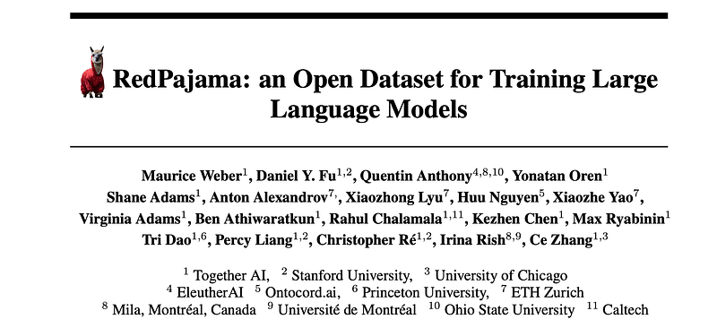
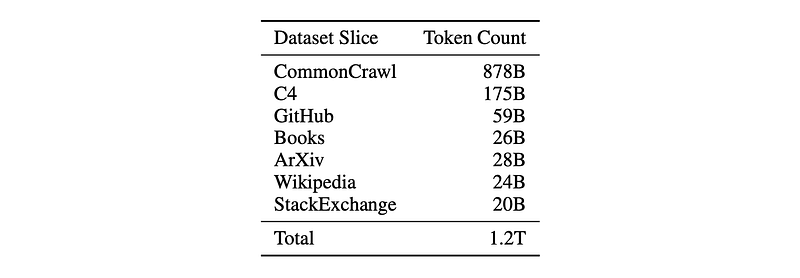
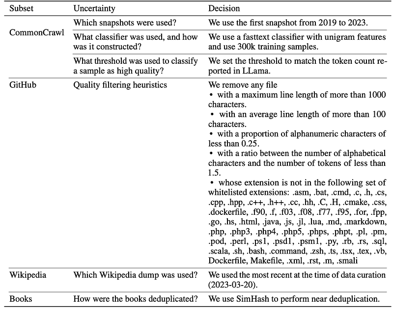
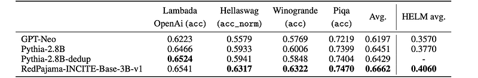
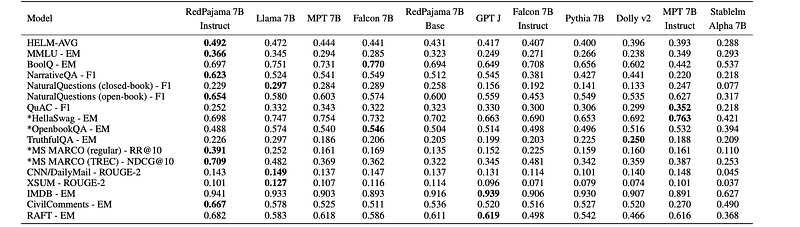
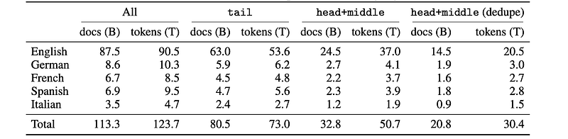
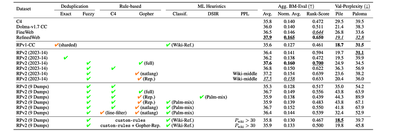
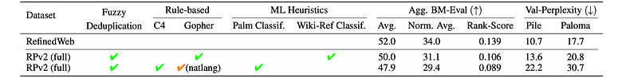

# Papers Explained 299 - Red Pajama

In the first iteration of the RedPajama datasets, the primary goal is to recreate the training data documented in the LLaMA technical report. To this end, the descriptions of the original recipes are closely followed.

This page ingests the source article into the wiki and connects it to [[Papers Explained Corpus]], [[Large Language Models]], [[Synthetic Data]].

## Source Metadata

- Source file: `raw/2025-01-30_Papers-Explained-299--Red-Pajama-4aced4a3ff72.html`
- Source title: Papers Explained 299: Red Pajama
- Published: 2025-01-30
- Canonical: [https://medium.com/@ritvik19/papers-explained-299-red-pajama-4aced4a3ff72](https://medium.com/@ritvik19/papers-explained-299-red-pajama-4aced4a3ff72)

## Key Ideas

- The pretraining data of the LLaMA training corpus are drawn from seven datasets: English CommonCrawl, C4, GitHub, Wikipedia, Books (Project Gutenberg and Books3), ArXiv, and Stack Exchange.
- Five English CommonCrawl snapshots are selected: 2019–30, 2020–05, 2021–04, 2022–5, and 2023–06. These represent the first snapshot of each year for the five years preceding the project’s start. This differs from the unspecified snapshots used in LLaMa.
- The CCNet pipeline is used for deduplication and quality classification (head, middle, tail). Only the “head” and “middle” quality buckets were retained, discarding the “tail”.
- A quality filter, trained on Wikipedia reference articles, is applied to remove low-quality documents:
- Downloading the latest English Wikipedia snapshot (by April 1, 2023).

## Notes

RedPajama-V1 is an open reproduction of the LLaMA training dataset. In addition, RedPajama-V2 is a massive web-only dataset consisting of raw, unfiltered text data together with quality signals and metadata. Together, the RedPajama datasets comprise over 100 trillion tokens spanning multiple domains and, with their quality signals, facilitate the filtering of data, aiming to inspire the development of numerous new datasets. To date, these datasets have already been used in the training of strong language models used in production, such as Snowflake Arctic, Salesforce’s XGen and AI2’s OLMo.

## RedPajama-V1

In the first iteration of the RedPajama datasets, the primary goal is to recreate the training data documented in the LLaMA technical report. To this end, the descriptions of the original recipes are closely followed.

### Data Processing Steps

The pretraining data of the LLaMA training corpus are drawn from seven datasets: English CommonCrawl, C4, GitHub, Wikipedia, Books (Project Gutenberg and Books3), ArXiv, and Stack Exchange. Each of these datasets are given a short (approximately one-paragraph) description in the LLaMA technical report, and there are some gaps in the dataset descriptions.

*Figure: Token counts for the RedPajama-V1 dataset.*

CommonCrawl

Five English CommonCrawl snapshots are selected: 2019–30, 2020–05, 2021–04, 2022–5, and 2023–06. These represent the first snapshot of each year for the five years preceding the project’s start. This differs from the unspecified snapshots used in LLaMa.

The CCNet pipeline is used for deduplication and quality classification (head, middle, tail). Only the “head” and “middle” quality buckets were retained, discarding the “tail”.

A quality filter, trained on Wikipedia reference articles, is applied to remove low-quality documents:

- Downloading the latest English Wikipedia snapshot (by April 1, 2023).

- Extracting 38 million URLs and crawling 300,000 pages from this snapshot.

- Cleaning the Wikipedia references using CCNet.

- Training a unigram classifier using fastText on this cleaned data.

- Filtering CommonCrawl documents with scores below 0.25 from the classifier. This aimed to match the approximate size of the LLaMa CommonCrawl dataset.

C4

The c4_en version of the C4 dataset from the Hugging Face Hub is used directly. This provides a diverse set of CommonCrawl data.

GitHub

Public GitHub dataset from Google BigQuery with projects only under Apache, BSD, and MIT licenses are included.

Heuristics are applied to remove low-quality files based on:

- Maximum line length (> 1000 characters).

- Average line length (> 100 characters).

- Proportion of alphanumeric characters (< 0.25).

- Ratio of alphabetic characters to tokens (< 1.5).

- File extension not in a whitelist (.asm, .bat, .c, .h, .cs, .cpp, .hpp, .c++, .h++, .cc, .hh, .C, .H, .cmake, .css, .dockerfile, .f90, .f, .f03, .f08, .f77, .f95, .for, .fpp, .go, .hs, .html, .java, .js, .jl, .lua, .md, .markdown, .php, .php3, .php4, .php5, .phps, .phpt, .pl, .pm, .pod, .perl, .ps1, .psd1, .psm1, .py, .rb, .rs, .sql, .scala, .sh, .bash, .command, .zsh, .ts, .tsx, .tex, .vb, Dockerfile, Makefile, .xml, .rst, .m, .smali).

Wikipedia

Wikipedia dump from March 20, 2023, accessed via the Hugging Face Hub, followed by removal of hyperlinks, comments, and other formatting boilerplate.

Gutenberg and Books3

Books3 was initially included but later removed due to copyright concerns. SimHash is used to remove near-duplicate entries within Project Gutenberg.

ArXiv

ArXiv data from the “arXiv” requester pays bucket on Amazon S3. Kept only LaTeX source files. Removed preambles, comments, and bibliographies. Expanded macros.

Stack Exchange

Stack Exchange data dump from the Internet Archive. Kept posts from the 28 largest sites only. Removed HTML tags.Grouped posts into question-answer pairs and sorted answers by score (highest to lowest).

*Figure: Overview over the different uncertainties and decisions made during the construction of the RedPajama-V1 dataset.*

### The RedPajama-INCITE family of LLMs

To evaluate how well RedPajama-V1 matches the original LLaMA corpus, a suite of pretrained and instruction-tuned models are trained at the 3B and 7B model sizes in collaboration with the Incite project.

The pretrained models are evaluated using HELM (classic) for few-shot performance and Eleuther AI’s LM evaluation harness for zero-shot performance. The models are compared against GPT-Neo, Pythia-2.8B, Falcon-7B, Llama-7B, and MPT-7B. An instruction-tuned version of the 7B model (RedPajama-INCITE-7B-Instruct) is also evaluated.

*Figure: Results for RedPajama-INCITE-Base-3B-v1 on a subset of lm-evaluation-harness (ZeroShot) and HELM.*

*Figure: HELM Benchmark results for RedPajama-INCITE-Base-7B-v1 and instruction tuned.*

- RedPajama-INCITE-3B: Outperforms GPT-Neo and Pythia-2.8B by 3–5 points on HELM and 2–7 points on a subset of tasks from the LM evaluation harness.

- RedPajama-INCITE-7B-Base: Scores 1.0 points lower than Falcon-7B and 4.1 points lower than Llama-7B on HELM-classic, particularly on tasks requiring logprobs. Performance is comparable on tasks directly generating answers. Lower performance is hypothesized to be due to FP16 training and dataset differences compared to Llama-1.

- RedPajama-INCITE-7B-Instruct: Outperforms Llama-7B, Falcon-7B (base and instruct), and MPT-7B (base and instruct) by 2–8 points on HELM for few-shot tasks.

## RedPajama-V2

In contrast to the first iteration of the RedPajama dataset, the second iteration focuses exclusively on web data. RedPajama V2 is a dataset that is enriched with a set of metadata that enables fast and cheap iteration for creating high quality, diverse and large datasets.

The Common Crawl Archive is a vast repository of web crawl data that is freely available to the public. The corpus contains crawling results since 2013 and is updated regularly on a (bi-) monthly basis. Next to raw web data in HTML (warc) format, the archive also provides metadata (wat) and plain text data in the wet format.

To create the RedPajama-V2 dataset, all 84 monthly snapshots between 2014 and April 2023 are used. The web-extracted text (i.e., .wet files) from these snapshots were passed through the CCNet pipeline. All perplexity buckets are kept, and in addition to the English language, French, German, Italian, and Spanish data are also kept. Unlike previous datasets that filter out low-quality content, the entire raw text corpus is retained, incorporating quality signals as additional metadata.

*Figure: Document and token counts for each partition and language of the RPv2 dataset.*

Natural Language

Text documents extracted from websites often have content that does not correspond to natural language, such as JavaScript code, menus, and other boilerplate text. To measure how natural a given text document is, simple heuristic measures are provided such as the fraction of all caps words or letters, the fraction of lines that end with an ellipsis, the fraction of unique words, whether or not a line ends in a terminal punctuation mark, and others.

Repetitiveness

Repetitious generations are a known failure mode of language models, and removing excessively repetitive content can potentially contribute to alleviating this behavior. For each document, the fraction of characters appearing in the most frequent (word) n-gram for n ∈ {2, 3, 4} is calculated. Second, the fraction of characters appearing in any duplicated n-gram for values of n ∈ {5, . . . , 10} is calculated. Characters that appear in overlapping n-grams are not counted more than once.

Content-based

Web documents can contain harmful and offensive content, which needs to be addressed. The signals used in C4 and RefinedWeb are: the number of sequences of words that are contained in the LDNOOBW blocklist. In addition, a flag indicates whether the domain of the document appears in the UT1 list of blocked urls. While these quality signals focus on NSFW content, other content-based filters such as domains or embedding clusters are also promising directions.

ML Heuristics

FastText classifiers are used, and the importance weights are provided in RPv2. While ML filters have been shown to improve the quality of datasets, they have also been reported to lead to biases or underrepresented minorities. The fastText classifier signals provided in RPv2 are unigram bag-of-word models trained to distinguish between unfiltered RPv2 data and a high-quality domain. For English data, Wikipedia, websites referenced by Wikipedia, books, and the OpenWebText dataset are used. For non-English data, only Wikipedia is used. The DSIR weights estimate the importance of individual samples to a given target domain in a reduced feature space and are based on word unigrams and bigram models. The weights are defined as the log-likelihood ratio between a language model of the target vs. the source domain, where the same domains as for the fasttext classifiers are used.

Deduplication

Removing duplicated training data has been found to improve model perplexity and reduce the amount of memorization while reducing the training data size and the required compute. MinHash signatures for fuzzy deduplication at different similarity levels, as well as IDs of documents found to be exact duplicates via a Bloom filter with the error rate set to 1%, are included in RPv2. For this document-level deduplication, a sequential process is used, starting with the most recent dump (2023–14) and successively iterating over the following dumps until we reach the oldest one (2014–15).

### Dataset Ablations

To understand how different quality filtering rules affect the downstream performance of Llama-2 models (468M and 1.6B parameter versions) trained on various subsets of the RedPajama (RPv2) dataset is evaluated.

*Figure: Evaluations for the 468M parameter LM for different dataset filters and other SOTA web datasets.*

*Figure: Aggregated evaluations for the 1.6B parameter LM for different datasets.*

- Gopher rules generally improve performance, especially when combined with fuzzy deduplication. This combination yields the highest aggregated scores across RPv2 datasets and performs consistently well across various tasks.

- Gopher-natlang filters outperform Gopher-repetition filters.

- No significant difference observed between fastText and DSIR for model-based filtering.

- C4 line-level filters reduce perplexity but have minimal impact on benchmark scores.

- Unfiltered RPv2 2023–14 has the lowest perplexity on the Paloma dataset, potentially due to Paloma’s domain diversity and inclusion of RPv1 data.

- Model trained on RPv2 filtered with the full Gopher rules outperforms the one trained with only Gopher-natlang rules and approaches the quality of a model trained on RefinedWeb.

- The quality signals in RPv2, combined with its scale, make it a valuable resource for creating high-quality web datasets for LLM pretraining.

## Paper

RedPajama: an Open Dataset for Training Large Language Models [2411.12372](https://arxiv.org/abs/2411.12372)

## Figures

Figures from the Medium HTML export (`raw/2025-01-30_Papers-Explained-299--Red-Pajama-4aced4a3ff72.html`); local copies under `wiki/assets/papers-explained-299-red-pajama/` when download succeeded.

| Figure | Caption |
|--------|---------|
|  | Title card: Red Pajama. |
|  | Token counts for the RedPajama-V1 dataset. |
|  | Overview over the different uncertainties and decisions made during the construction of the RedPajama-V1 dataset. |
|  | Results for RedPajama-INCITE-Base-3B-v1 on a subset of lm-evaluation-harness (ZeroShot) and HELM. |
|  | HELM Benchmark results for RedPajama-INCITE-Base-7B-v1 and instruction tuned. |
|  | Document and token counts for each partition and language of the RPv2 dataset. |
|  | Evaluations for the 468M parameter LM for different dataset filters and other SOTA web datasets. |
|  | Aggregated evaluations for the 1.6B parameter LM for different datasets. |
## Related

- [[Papers Explained Corpus]]
- [[Large Language Models]]
- [[Synthetic Data]]
- [[Papers Explained 298 - Llava-Mini]]
- [[Papers Explained 300 - Shiksha]]

#summary #topic
