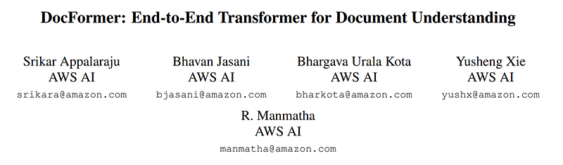
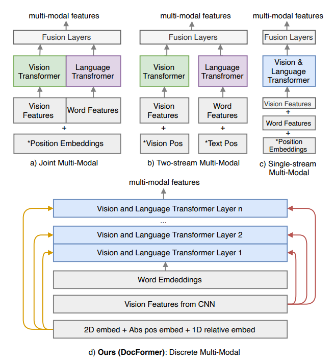
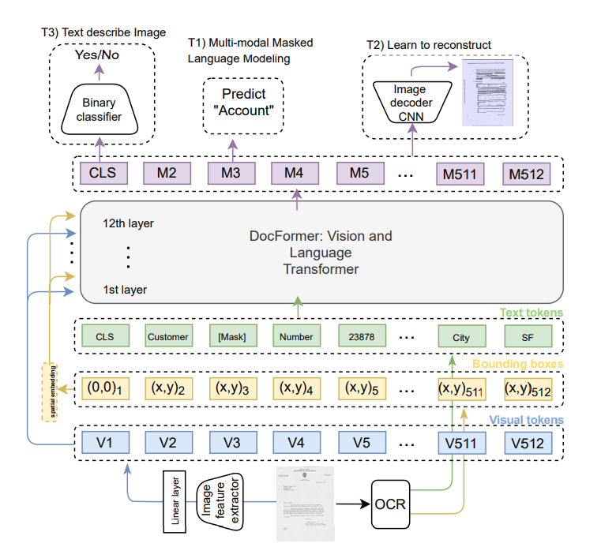

# Papers Explained 30 - DocFormer

Joint Multi-Modal: VL-BERT, LayoutLMv2, VisualBERT, MMBT]: In this type of architecture, vision and text are concatenated into one long sequence which makes transformers self-attention hard due to the cross-modality feature correlation referenced in the introduction.

This page ingests the source article into the wiki and connects it to [[Papers Explained Corpus]], [[Vision Language Models]], [[Large Language Models]], [[Long Context]], [[Embedding and Retrieval]], [[Document AI]].

## Source Metadata

- Source file: `raw/2023-02-09_Papers-Explained-30--DocFormer-228ce27182a0.html`
- Source title: Papers Explained 30: DocFormer
- Published: 2023-02-09
- Canonical: [https://medium.com/@ritvik19/papers-explained-30-docformer-228ce27182a0](https://medium.com/@ritvik19/papers-explained-30-docformer-228ce27182a0)

## Key Ideas

- Joint Multi-Modal: VL-BERT, LayoutLMv2, VisualBERT, MMBT]: In this type of architecture, vision and text are concatenated into one long sequence which makes transformers self-attention hard due to the cross-modality feature correlation referenced in the...
- Two-Stream Multi-Modal: CLIP, VilBERT: It is a plus that each modality is a separate branch which allows one to use an arbitrary model for each branch. However, text and image interact only at the end which is not ideal. It might be better to do early fusion.
- Single-stream Multi-Modal: treats vision features also as tokens (just like language) and adds them with other features.
- Discrete MultiModal: DocFormer unties visual, text and spatial features. i.e. spatial and visual features are passed as residual connections to each transformer layer.
- DocFormer is an encoder-only transformer architecture. It also has a CNN backbone for visual feature extraction. All components are trained end-to-end.

## Notes

## Conceptual Overview

Joint Multi-Modal: VL-BERT, LayoutLMv2, VisualBERT, MMBT]: In this type of architecture, vision and text are concatenated into one long sequence which makes transformers self-attention hard due to the cross-modality feature correlation referenced in the introduction.

Two-Stream Multi-Modal: CLIP, VilBERT: It is a plus that each modality is a separate branch which allows one to use an arbitrary model for each branch. However, text and image interact only at the end which is not ideal. It might be better to do early fusion.

Single-stream Multi-Modal: treats vision features also as tokens (just like language) and adds them with other features. Combining visual features with language tokens this way (simple addition) is unnatural as vision and language features are different types of data.

Discrete MultiModal: DocFormer unties visual, text and spatial features. i.e. spatial and visual features are passed as residual connections to each transformer layer. In each transformer layer, visual and language features separately undergo self-attention with shared spatial features

### Model Architecture

DocFormer is an encoder-only transformer architecture. It also has a CNN backbone for visual feature extraction. All components are trained end-to-end. DocFormer enforces deep multi-modal interaction in transformer layers using novel multi-modal self-attention.

Visual Features: Let v ∈ R 3×h×w be the image of a document, which we feed through a ResNet50 convolutional neural network fcnn(θ, v). We extract lower-resolution visual embedding at layer 4 i.e. vl4 ∈ R c×hl×wl . Typical values at this stage are c = 2048 and hl = h/32 , wl = w/32.

The transformer encoder expects a flattened sequence as input of d dimension. So we first apply a 1 × 1 convolution to reduce the channels c to d. We then flatten the ResNet features to (d, hl × wl) and use a linear transformation layer to further convert it to (d, N) where d = 768, N = 512. Therefore, we represent the visual embedding as V = linear(conv1×1(fcnn(θ, v))).

Language Features: We first tokenize text t using a word-piece tokenizer [55] to get ttok, this is then fed through a trainable embedding layer Wt.

We ensure that the text embedding, T = Wt(ttok), is of the same shape as the visual embedding V . We initialize Wt with LayoutLMv1 pre-trained weights.

Spatial Features: For each word k in the text, we also get bounding box coordinates bk = (x1, y1, x2, y2, x3, y3, x4, y4). For each word, we encode the top-left and bottom-right coordinates using separate layers Wx and Wy for x and y-coordinates respectively.

We also encode more spatial features: bounding box height h, width w, the Euclidean distance from each corner of a bounding box to the corresponding corner in the bounding box to its right and the distance between centroids of the bounding boxes, e.g. Arel = {Ak+1 num−Ak num}; A ∈ (x, y); num ∈ (1, 2, 3, 4, c), where c is the center of the bounding box. Since transformer layers are permutation-invariant, we also use absolute 1D positional encodings P abs.

We create separate spatial embeddings for visual Vs and language Ts features since spatial dependency could be modality specific. Final spatial embeddings are obtained by summing up all intermediate embeddings. All spatial embeddings are trainable.

Multi-Modal Self-Attention Layer:

Transformer outputs a multi-modal feature representation M of the same shape d = 768, N = 512 as each of the input features.

i.e. in a transformer layer l and i th input token in a feature length of L

*Figure: Eq. 1*

where

*Figure: Eq. 2*

Without loss of generality, we remove the dependency on layer l and get a simplified view of Eq. 2 as:

*Figure: Eq. 3*

We modify this attention formulation for the multimodal VDU task. DocFormer tries to infuse the following inductive bias into self-attention formulation: for most VDU tasks, local features are more important than global ones.

*Figure: Eq. 4*

*Figure: Eq. 5*

Using the visual self-attention computed using Eq. 4 in Eq. 1, gets us spatially aware, self-attended visual features Vˆ l . Similarly using Eq. 5 in Eq. 1, gets us language features Tˆ l . The multi-modal feature output is given by Ml = Vˆ l + T^ l.

## Pre Training

Multi-Modal Masked Language Modeling (MMMLM): This is a modification of the original masked language modeling. i.e. for a text sequence t, a corrupted sequence is generated et. The transformer encoder predicts tˆ and is trained with an objective to reconstruct entire sequence.

We intentionally do not mask visual regions corresponding to [MASK] text. This is to encourage visual features to supplement text features and thus minimize the text reconstruction loss.

Learn To Reconstruct (LTR): This task is similar to an auto-encoder image reconstruction but with multi-modal features. The intuition is that in the presence of both image and text features, the image reconstruction would need the collaboration of both modalities.

Text Describes Image (TDI): : In this task, we try to teach the network if a given piece of text describes a document image. For this, we pool the multi-modal features using a linear layer to predict a binary answer. In a batch, 80% of the time the correct text and image are paired, for the remaining 20% the wrong image is paired with the text.

## Fine Tuning

- Form and Receipt Understanding: FUNSD, Kleister-NDA and CORD dataset

- Document Image Classification: RVL-CDIP dataset

## Paper

DocFormer: End-to-End Transformer for Document Understanding [2106.11539](https://arxiv.org/abs/2106.11539)

## Figures

Figures from the Medium HTML export (`raw/2023-02-09_Papers-Explained-30--DocFormer-228ce27182a0.html`); local copies under `wiki/assets/papers-explained-30-docformer/` when download succeeded.

| Figure | Caption |
|--------|---------|
|  | Title card: DocFormer. |
|  | Joint Multi-Modal: VL-BERT, LayoutLMv2, VisualBERT, MMBT]: In this type of architecture, vision and text are concatenated into one long... |
|  | We create separate spatial embeddings for visual Vs and language Ts features since spatial dependency could be modality specific. |
|  | Multi-Modal Self-Attention Layer. |
|  | Multi-Modal Self-Attention Layer. |
|  | Eq. 1. |
|  | Eq. 2. |
|  | Eq. 3. |
|  | Eq. 4. |
|  | Eq. 5. |
## Related

- [[Papers Explained Corpus]]
- [[Vision Language Models]]
- [[Large Language Models]]
- [[Long Context]]
- [[Embedding and Retrieval]]
- [[Document AI]]
- [[Papers Explained 29 - ConvMixer]]
- [[Papers Explained 31 - Single Shot MultiBox Detector]]

#summary #topic
