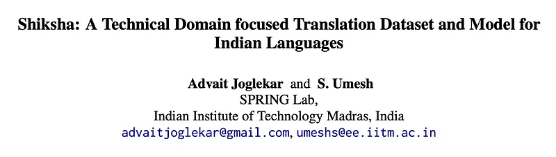
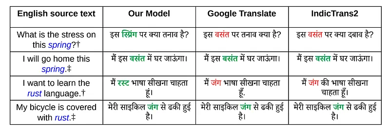

# Papers Explained 300 - Shiksha

Contextual Understanding: Models often struggle to grasp the context of a sentence, leading to incorrect translations.

This page ingests the source article into the wiki and connects it to [[Papers Explained Corpus]], [[Multilingual Models]], [[Model Compression and Efficiency]], [[Synthetic Data]], [[Safety and Alignment]].

## Source Metadata

- Source file: `raw/2025-01-31_Papers-Explained-300--Shiksha-ad09f6db7f38.md`
- Source title: Papers Explained 300: Shiksha
- Published: 2025-01-31
- Canonical: [https://medium.com/@ritvik19/papers-explained-300-shiksha-ad09f6db7f38](https://medium.com/@ritvik19/papers-explained-300-shiksha-ad09f6db7f38)

## Key Ideas

- Polysemy: Words with multiple meanings (like “rust” in the example) can be misinterpreted, resulting in drastically different translations.
- Domain Specificity: Models trained on general text data may not perform well on specialized domains like science and technology.
- NPTEL provides a list of 10,669 videos and their corresponding transcriptions and related metadata.
- A Python script is written to extract the meaningful text data from it while avoiding any timestamp references.
- SentAlign which incorporates LABSE and optimized alignment algorithms is used for efficient and accurate bitext mining.

## Notes

This research paper tackles the challenge of training machine translation models that effectively handle scientific and technical language, particularly for low-resource Indian languages. This is achieved by creating a multilingual parallel corpus containing more than 2.8 million rows of English-to-Indic and Indic-to-Indic high-quality translation pairs across 8 Indian languages. The corpus is created by bitext mining human-translated transcriptions of NPTEL (National Programme on Technology En- hanced Learning) video lectures.

NPTEL offers a vast library of over 56,000 hours of free video lectures across various disciplines. It has translated over 12,000 hours of video content into multiple Indian languages, providing captions that are translations of the original English transcriptions. This translation effort has resulted in a valuable parallel textual resource spanning various scientific, engineering, and humanities domains. The research leverages this resource to develop machine translation (MT) models specifically for Indian languages in order to create competitive MT models that can assist human translators and accelerate the process of providing accurate subtitles for all NPTEL video lectures in Indian languages.

## Where does Present-day MT fail?

*Figure: Example translations from English to Hindi in the Scientific/Technical domain.*

- Contextual Understanding: Models often struggle to grasp the context of a sentence, leading to incorrect translations.

- Polysemy: Words with multiple meanings (like “rust” in the example) can be misinterpreted, resulting in drastically different translations.

- Domain Specificity: Models trained on general text data may not perform well on specialized domains like science and technology.

## The Dataset

NPTEL provides a list of 10,669 videos and their corresponding transcriptions and related metadata. These transcriptions are bilingual documents spanning 8 languages(Bengali, Gujarati, Hindi, Kannada, Malayalam, Marathi, Tamil and Telugu), featuring alternating English and Indic text, interspersed with reference timestamps and video snapshots.

A Python script is written to extract the meaningful text data from it while avoiding any timestamp references. Regex patterns were used to filter out the timestamps and simple paragraph segmenting tools from nltk and indic-nlp libraries to identify and separate English and Indic sentences.

SentAlign which incorporates LABSE and optimized alignment algorithms is used for efficient and accurate bitext mining.

After post-processing with deduplication, a corpus of roughly 2.8 million sentence-pairs is curated.

## The Model

The NLLB-3.3B is used as the base model for fine tuning using lora on all 36 language-pair combinations supported by the aforementioned dataset.

Training Strategies:

- Model 1: Training solely on the newly created dataset in one direction.

- Model 2: Utilized Curriculum Learning (CL) with a cleaned subset of the BPCC corpus (8 Indian languages, 4 million rows) before incorporating the new dataset.

- Model 3: Training on a massive dataset of 12 million samples, combining the cleaned BPCC corpus and the new dataset in both directions.

## Evaluation

The performance of the model is compared to baseline models (NLLB and IndicTrans2) is evaluated on two test sets:

- An in-domain test set consisting of the top 1000 rows (by LABSE score) from the held-out test set for each language.

- The Flores+ (Previously Flores-200) devtest set.

*Figure: Results (bleu/chrf++).*

- The trained model outperformed both the NLLB and IndicTrans2 models on the in-domain test set, demonstrating its effectiveness for technical domain translations.

- The trained model also generalized well, as evidenced by improvements on the baseline scores for the Flores+ devtest set.

- Despite being trained on a smaller corpus than IndicTrans2, the new model’s performance came close to IndicTrans2.

This research goes beyond just experiments. The models are now built into a tool called Translingua, that is being widely used by human annotators across India to translate NPTEL lecture transcripts into more languages than ever before, with far better speed and accuracy.

## Paper

Shiksha: A Technical Domain focused Translation Dataset and Model for Indian Languages [2412.09025](https://arxiv.org/abs/2412.09025)

## Figures

Figures from the Medium HTML export (`raw/2025-01-31_Papers-Explained-300--Shiksha-ad09f6db7f38.md`); local copies under `wiki/assets/papers-explained-300-shiksha/` when download succeeded.

| Figure | Caption |
|--------|---------|
|  | Title card: Shiksha. |
|  | Example translations from English to Hindi in the Scientific/Technical domain. |
|  | Results (bleu/chrf++). |
## Related

- [[Papers Explained Corpus]]
- [[Multilingual Models]]
- [[Model Compression and Efficiency]]
- [[Synthetic Data]]
- [[Safety and Alignment]]
- [[Papers Explained 299 - Red Pajama]]
- [[Papers Explained 301 - ReST]]

#summary #topic
