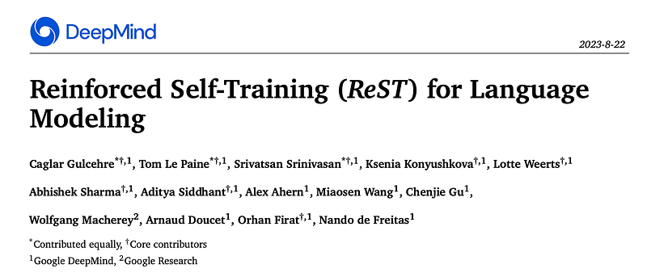
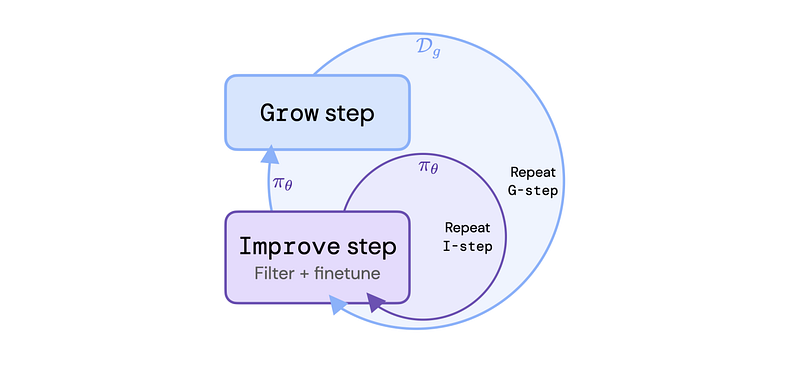
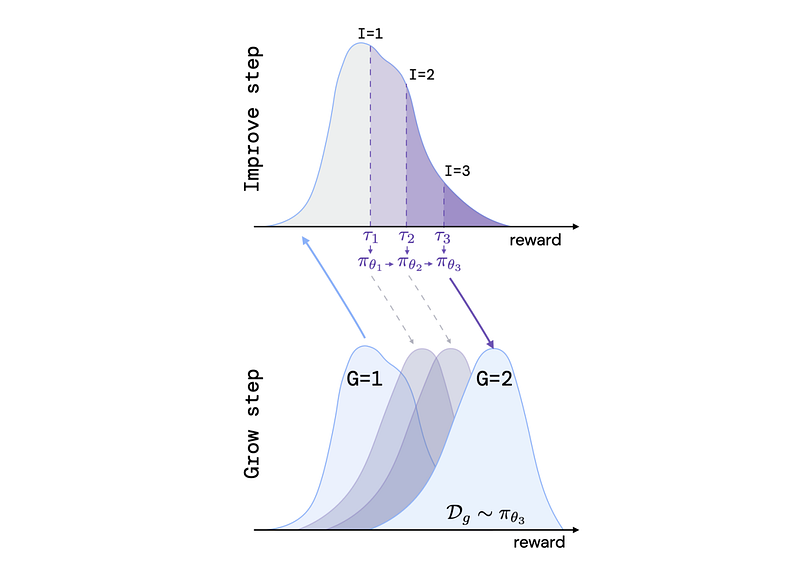
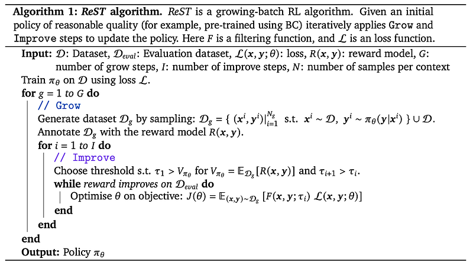
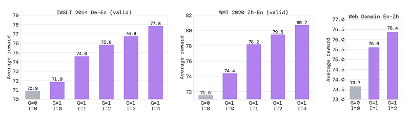
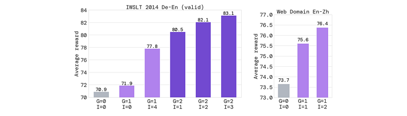
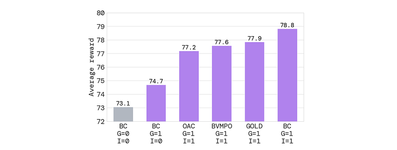
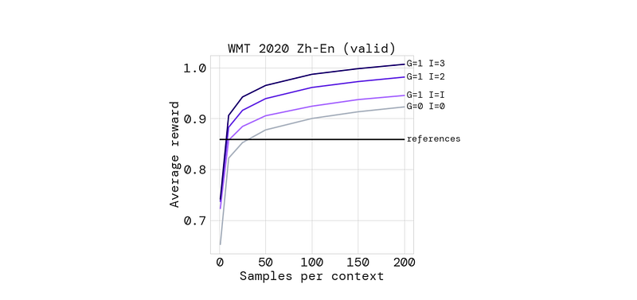
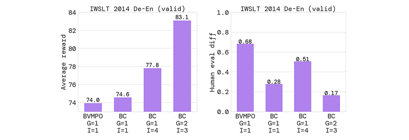

# Papers Explained 301 - ReST

Reinforced Self-Training (ReST) is a simple algorithm for aligning LLMs with human preferences inspired by growing batch reinforcement learning (RL). Given an initial LLM policy, ReST produces a dataset by generating samples from the policy. These samples are then used to improve the LLM policy using offline RL algorithms.

This page ingests the source article into the wiki and connects it to [[Papers Explained Corpus]], [[Safety and Alignment]], [[Synthetic Data]], [[Large Language Models]], [[Reinforcement Learning Topic]], [[Reinforcement Learning]].

## Source Metadata

- Source file: `raw/2025-02-03_Papers-Explained-301--ReST-6389371a68ac.html`
- Source title: Papers Explained 301: ReST
- Published: 2025-02-03
- Canonical: [https://medium.com/@ritvik19/papers-explained-301-rest-6389371a68ac](https://medium.com/@ritvik19/papers-explained-301-rest-6389371a68ac)

## Key Ideas

- Reinforced Self-Training (ReST) is a simple algorithm for aligning LLMs with human preferences inspired by growing batch reinforcement learning (RL). Given an initial LLM policy, ReST produces a dataset by generating samples from the policy.
- ReST provides several advantages over typical RLHF methods with online or offline RL:
- The computational burden is significantly reduced compared to online RL thanks to the output of Grow step being exploited across several Improve steps.
- The quality of the policy is not restricted by the quality of the original dataset (as in offline RL) since new training data is sampled from an improved policy during the Grow step.
- It is easy to inspect the data quality and potentially diagnose alignment issues, e.g., reward hacking, as the Grow and Improve steps are decoupled.

## Notes

Reinforced Self-Training (ReST) is a simple algorithm for aligning LLMs with human preferences inspired by growing batch reinforcement learning (RL). Given an initial LLM policy, ReST produces a dataset by generating samples from the policy. These samples are then used to improve the LLM policy using offline RL algorithms.

*Figure: ReST method.*

ReST provides several advantages over typical RLHF methods with online or offline RL:

- The computational burden is significantly reduced compared to online RL thanks to the output of Grow step being exploited across several Improve steps.

- The quality of the policy is not restricted by the quality of the original dataset (as in offline RL) since new training data is sampled from an improved policy during the Grow step.

- It is easy to inspect the data quality and potentially diagnose alignment issues, e.g., reward hacking, as the Grow and Improve steps are decoupled.

- The approach is simple, stable and has only a small number of hyperparameters to tune.

## Reinforced Self-Training (ReST)

ReST includes two loops: an inner loop (Improve) and an outer loop (Grow). In the inner loop (Improve), the policy is improved on a fixed dataset. In the outer loop (Grow), the dataset is grown by sampling from the latest policy. The steps of ReST are as follows:

- Grow (G): The language model policy (initially, a supervised policy) is used to generate multiple output predictions for each context to augment the training dataset.

- Improve (I): The augmented dataset is ranked and filtered with a scoring function. A learned reward model trained on human preferences is used as the scoring function in the experiments. Then, the language model is fine-tuned on the filtered dataset with an offline RL objective. This step can be repeated with an increasing filtering threshold. The final policy is then used in the next Grow step.

*Figure: ReST algorithm.*

The ReST algorithm decouples the dataset growth and policy improvement of a typical RL pipeline into separate offline stages. We start by training an initial model 𝜋𝜃(𝒚|𝒙) to map input sequences 𝒙 to output sequences 𝒚 on a given dataset of sequence pairs D using the NLL loss. Next, the Grow step creates a new dataset D𝑔, which augments the initial training dataset with samples from the model.

- The Grow step corresponds to the acting or data-generation step in RL. We create an augmented dataset of trajectories D𝑔 by sampling many output sequences from the current policy 𝜋𝜃, i.e., 𝒚 ∼ 𝜋𝜃(𝒚|𝒙) for 𝒙 ∼ D. The new dataset of sequences is then scored with a reward function 𝑅(𝒙, 𝒚). The datapoints with the reward above a threshold score are used to update the policy. Once the policy is improved, a new dataset of better quality samples can be created once again.

- At the Improve step, the goal is to use the new dataset D𝑔 to fine-tune the policy 𝜋𝜃. We start by defining a filtering function that includes only samples with rewards higher than a certain threshold 𝜏.

Next, the current best policy is finetuned with either the supervised learning loss or an offline RL loss L(𝒙, 𝒚;𝜃) on the filtered data.

When iterating over Improve steps, we increase the filtering thresholds: 𝜏1 < · · · < 𝜏𝑁 −1 < 𝜏𝑁. This filtering with the growing threshold results in data subsets of increasing quality but of decreasing size. As LLMs overfit to small datasets quickly, we fine-tune every new policy from the previous policy with a lower learning rate. Consecutive fine-tuning of policies {𝜋𝜃𝑘 }𝑘≥1 on higher quality data subsets ensures policy improvement with a fixed dataset D𝑔. If we were to sample from policies {𝜋𝜃𝑘 }𝑘≥1, the average reward of the generated samples would be increasing. As sampling from a policy in the Grow step is computationally expensive, after each such step we perform several Improve steps. Thus, the cost of a single dataset generation is amortised over multiple Improve steps.

## Experiments

ReST is applied to machine translation tasks using three datasets: IWSLT 2014, WMT 2020, and a Web Domain dataset. The performance is evaluated using average reward scores on validation sets and human evaluations. Different offline RL losses are tested within the ReST framework.

*Figure: ReST with multiple Improve steps.*

- Multiple improve steps in ReST consistently increase reward model scores across all datasets.

*Figure: ReST with two Grow steps.*

- Additional grow steps further improve reward model scores, demonstrating the benefit of iteratively expanding the training data.

*Figure: WMT 2020 zh-en (test)*

- ReST significantly outperforms supervised learning across different datasets and language pairs, even after just one grow step.

- BC loss generally performs better than other offline RL losses within the ReST framework.

*Figure: Best-of-N sampling at inference time.*

- ReST benefits from best-of-N sampling at inference time, similar to supervised models, indicating that it maintains sample diversity.

*Figure: Online RL for IWSLT 2014.*

- ReST achieves higher rewards than online RL (PPO) with a similar amount of training data and avoids the significant drop in BLEU score observed with online RL, suggesting less “reward hacking.”

*Figure: Comparison of performance based on learned reward and on human evaluation.*

- Human evaluation shows that all ReST variants outperform the baseline BC model, but the ranking of models based on human evaluation differs from the ranking based on reward model scores. This suggests that the learned reward model is an imperfect proxy for human preferences, especially as the policy diverges further from the behavior model with increasing grow/improve steps.

## Paper

Reinforced Self-Training (ReST) for Language Modeling [2308.08998](https://arxiv.org/abs/2308.08998)

## Figures

Figures from the Medium HTML export (`raw/2025-02-03_Papers-Explained-301--ReST-6389371a68ac.html`); local copies under `wiki/assets/papers-explained-301-rest/` when download succeeded.

| Figure | Caption |
|--------|---------|
|  | Title card: ReST. |
|  | ReST method. |
|  | ReST algorithm. |
|  | When iterating over Improve steps, we increase the filtering thresholds: 𝜏1 < · · · < 𝜏𝑁 −1 < 𝜏𝑁. |
|  | ReST with multiple Improve steps. |
|  | ReST with two Grow steps. |
|  | WMT 2020 zh-en (test). |
|  | Best-of-N sampling at inference time. |
|  | Online RL for IWSLT 2014. |
|  | Comparison of performance based on learned reward and on human evaluation. |
## Related

- [[Papers Explained Corpus]]
- [[Safety and Alignment]]
- [[Synthetic Data]]
- [[Large Language Models]]
- [[Reinforcement Learning Topic]]
- [[Reinforcement Learning]]
- [[Papers Explained 300 - Shiksha]]
- [[Papers Explained 302 - ReST^EM]]

#summary #topic
