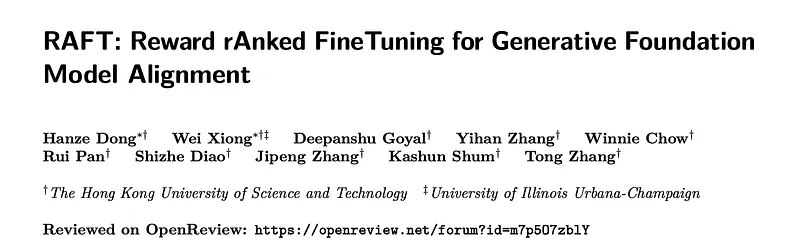
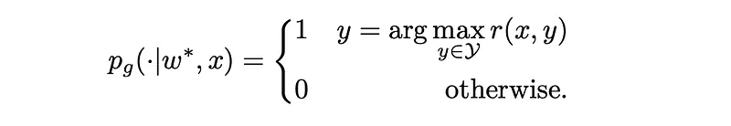
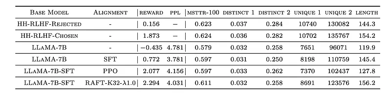
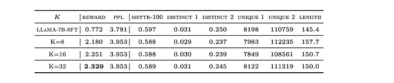
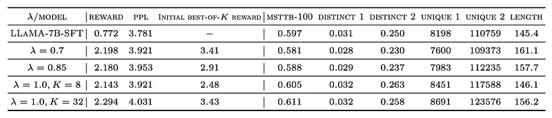
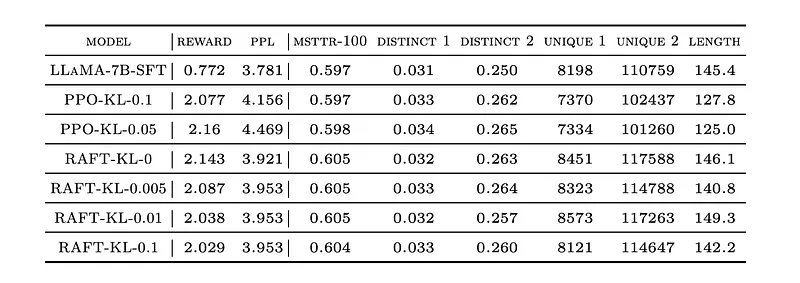
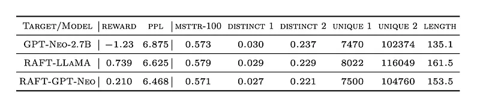
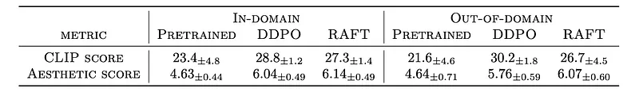
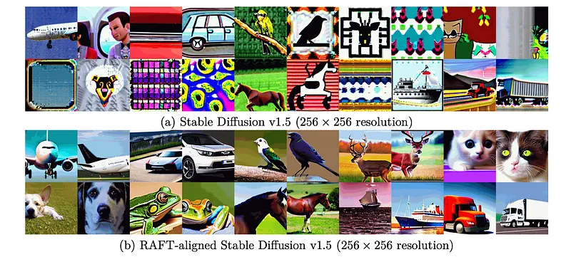
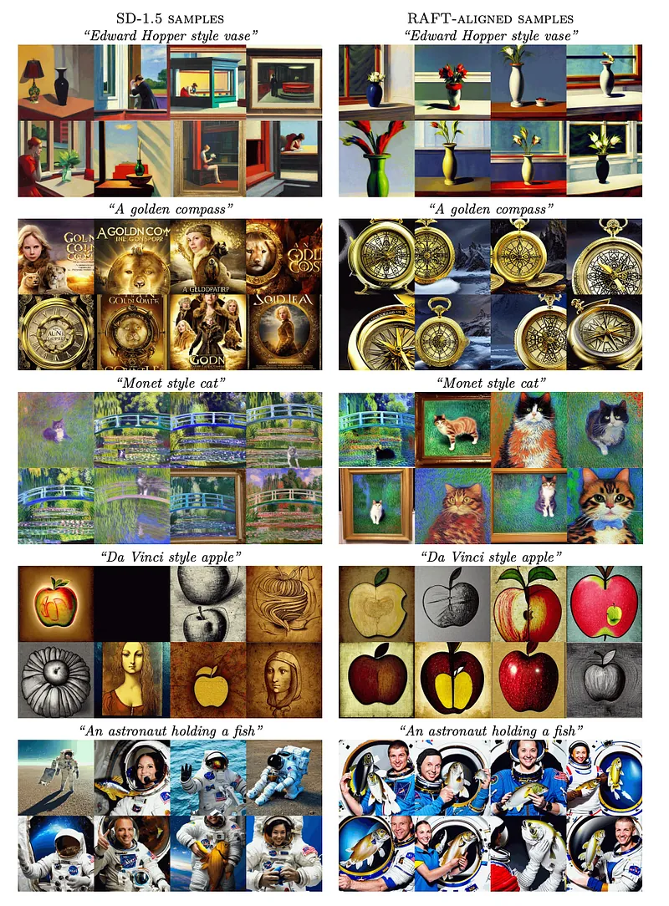

# Papers Explained 303 - Reward rAnked FineTuning (RAFT)

Generative foundation models can inherit implicit biases from their extensive unsupervised training data, leading to suboptimal samples, skewed outcomes, and unfairness. Reinforcement Learning from Human Feedback (RLHF) has been primarily used to address this alignment challenge.

This page ingests the source article into the wiki and connects it to [[Papers Explained Corpus]], [[Reinforcement Learning Topic]], [[Synthetic Data]], [[Safety and Alignment]], [[Agentic AI]], [[Reinforcement Learning]], [[Supervised Fine-Tuning]].

## Source Metadata

- Source file: `raw/2025-02-05_Papers-Explained-303--Reward-rAnked-FineTuning--RAFT--791154585908.md`
- Source title: Papers Explained 303: Reward rAnked FineTuning (RAFT)
- Published: 2025-02-05
- Canonical: [https://medium.com/@ritvik19/papers-explained-303-reward-ranked-finetuning-raft-791154585908](https://medium.com/@ritvik19/papers-explained-303-reward-ranked-finetuning-raft-791154585908)

## Key Ideas

- Generative foundation models can inherit implicit biases from their extensive unsupervised training data, leading to suboptimal samples, skewed outcomes, and unfairness.
- To this end, Reward rAnked FineTuning (RAFT) is designed to align generative models effectively.
- If the generative model is powerful enough to achieve the maximum at each prompt x, then the solution of [EQ 1] is
- In practice, it is generally infeasible to search the entire output space to find the optimal policy. However, our policy can be enhanced by fine-tuning our models using a high-reward dataset.
- The idea is to utilize the trained generative model, to generate additional samples and reinforcing the dataset. For each prompt, we may sample K responses from the model and take the response with the highest reward.

## Notes

Generative foundation models can inherit implicit biases from their extensive unsupervised training data, leading to suboptimal samples, skewed outcomes, and unfairness. Reinforcement Learning from Human Feedback (RLHF) has been primarily used to address this alignment challenge. However, RL algorithms can be inefficient and unstable, hindering successful alignment.

To this end, Reward rAnked FineTuning (RAFT) is designed to align generative models effectively. Utilizing a reward model and a sufficient number of samples, the approach selects the high-quality samples, discarding those that exhibit undesired behavior, and subsequently enhancing the model by fine-tuning on these filtered samples.

## Reward rAnked FineTuning

Consider an initial generative model G0 = g(w0, x) with model parameter w0. This model can take input x and generate an output y according to a distribution p_G0¹/λ. λ is a temperature parameter to control the diversity. A reward function r(x, y) is also assumed, which returns a reward for any input-output pair (x, y). This reward function is used to guide the model g(w,x). If pg(y|w,x) is denoted as the conditional distribution given x associated with w and consider a distribution D of the training input x, the objective is:

If the generative model is powerful enough to achieve the maximum at each prompt x, then the solution of [EQ 1] is

In practice, it is generally infeasible to search the entire output space to find the optimal policy. However, our policy can be enhanced by fine-tuning our models using a high-reward dataset. One natural choice is to do so with a pre-determined high-quality dataset. Unfortunately, previous studies have shown that SFT with a pre-determined dataset is usually of inferior performance. model’s performance in offline learning heavily depends on the coverage of the offline dataset.

The idea is to utilize the trained generative model, to generate additional samples and reinforcing the dataset. For each prompt, we may sample K responses from the model and take the response with the highest reward. Then, we can fine-tune our model with these best-of-K samples to improve the model. This process can be iterated for multiple times as the improved generative model in turn provides a better approximation of Eq. (2), leading to further enhancements for the model.

The learning process of RAFT can be divided into three steps. For each stage t + 1:

- Data collection: A batch of prompts Dt = {xt1, · · · , xtb} is sampled and y1, . . . , yK is generated for each xti.

- Data ranking: The reward model is used to compute {r(x, y1), · · · , r(x, yK )} for each x. Then, y := argmaxyj∈{y1,···,yK} r(x,yj) is taken for all prompts.

- Model fine-tuning: The current model is fine-tuned.

These three steps are iteratively alternated until the reward converges.

## LLM Experiments

LLaMA-7B is used as the base LLM. Open-LLaMA-3B is used for the reward model. GPT-Neo-2.7B is used in a distillation experiment. HH-RLHF (Helpful and Harmless) dataset, containing 112K training samples and 12.5K test samples, each with a prompt and “chosen” and “rejected” responses. The training follows three stages: Supervised Fine-Tuning (SFT), reward modeling, and RLHF. RAFT iteratively samples K responses from the current model, ranks them based on the reward model, and fine-tunes the model on the highest-ranked response. PPO is used as a baseline comparison.

*Figure: Complete table of results on HH-RLHF dataset.*

- RAFT achieves higher mean reward (2.294) compared to PPO and the SFT baseline, while maintaining reasonable perplexity (4.031).

- RAFT shows better preservation of perplexity and diversity compared to PPO, suggesting a reduction in alignment tax.

*Figure: GPT-4 and Human evaluation results on the HH-RLHF dataset.*

- GPT-4 and Human Evaluation: Both GPT-4 and human evaluations support the superiority of RAFT over PPO.

*Figure: Test results on the hand-out set under different K.*

- Impact of K: Larger K in RAFT leads to higher reward but increased computational cost.

*Figure: Test results on the hand-out set under different temperatures λ.*

- Impact of Temperature: Higher sampling temperature (λ) increases diversity but slightly reduces reward.

*Figure: Test results on the hand-out set under different choices of the KL coefficient β.*

- Impact of KL Penalty: KL penalty helps control the divergence from the initial model but can also affect reward learning.

*Figure: Test results on the hand-out set under different learning objectives.*

- RAFT allows for efficient distillation, where a smaller model (GPT-Neo-2.7B) can be aligned using data generated by a larger model (LLaMA-7B), achieving improved performance.

## Diffusion Model Experiments

Stable-diffusion v1.5 (SD-1.5) is finetuned using the RAFT. LoRA is used for efficient fine-tuning. CLIP is used as a reward function, leveraging both aesthetic scores and text-image matching. Experiments compare RAFT against DDPO (Decentralized Distributed Proximal Policy Optimization).

*Figure: Resolution adaptation.*

*Figure: Resolution Adaptation. (RAFT-aligned models can generate proper 256 × 256 samples).*

- Resolution Adaptation (256x256): RAFT successfully restores SD-1.5’s ability to generate images at 256x256 resolution. RAFT significantly improves image quality at this resolution, both for in-domain (CIFAR-10 labels) and out-of-domain (CIFAR-100 labels) prompts. While DDPO achieves similar performance, RAFT is approximately 50x faster.

*Figure: Text-Image Alignment with RAFT. (512×512 resolution).*

- RAFT improves the alignment between generated images and text prompts at 512x512 resolution, addressing the issue of SD-1.5 prioritizing style information over object representation in prompts.

## Paper

RAFT: Reward rAnked FineTuning for Generative Foundation Model Alignment [2304.06767](https://arxiv.org/abs/2304.06767)

## Figures

Figures from the Medium HTML export (`raw/2025-02-05_Papers-Explained-303--Reward-rAnked-FineTuning--RAFT--791154585908.md`); local copies under `wiki/assets/papers-explained-303-reward-ranked-finetuning-raft/` when download succeeded.

| Figure | Caption |
|--------|---------|
|  | Title card: Reward rAnked FineTuning (RAFT). |
|  | Consider an initial generative model G0 = g(w0, x) with model parameter w0. |
|  | If the generative model is powerful enough to achieve the maximum at each prompt x, then the solution of [EQ 1] is. |
|  | Complete table of results on HH-RLHF dataset. |
|  | GPT-4 and Human evaluation results on the HH-RLHF dataset. |
|  | Test results on the hand-out set under different K. |
|  | Test results on the hand-out set under different temperatures λ. |
|  | Test results on the hand-out set under different choices of the KL coefficient β. |
|  | Test results on the hand-out set under different learning objectives. |
|  | Resolution adaptation. |
|  | Resolution Adaptation. (RAFT-aligned models can generate proper 256 × 256 samples). |
|  | Text-Image Alignment with RAFT. (512×512 resolution). |
## Related

- [[Papers Explained Corpus]]
- [[Reinforcement Learning Topic]]
- [[Synthetic Data]]
- [[Safety and Alignment]]
- [[Agentic AI]]
- [[Reinforcement Learning]]
- [[Supervised Fine-Tuning]]
- [[Papers Explained 302 - ReST^EM]]
- [[Papers Explained 304 - Constrained Generative Policy Optimization (Mixture of Judges)]]

#summary #topic
