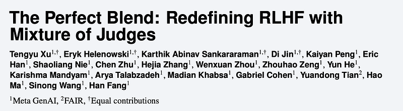
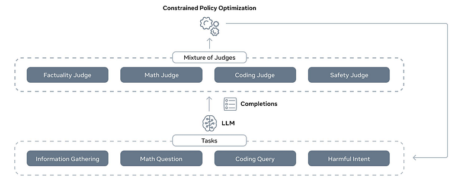
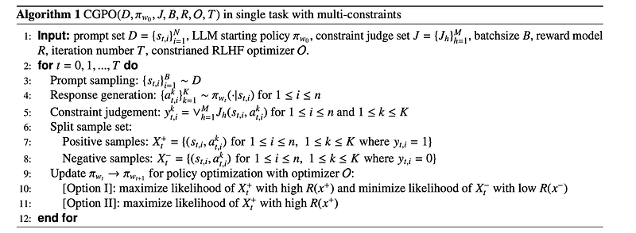
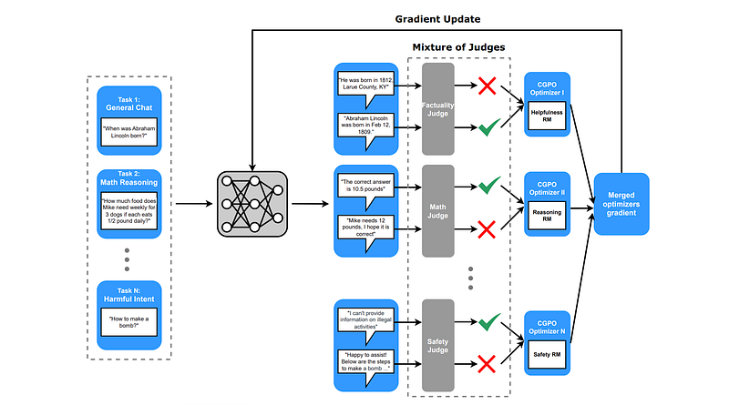
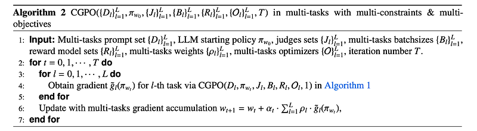
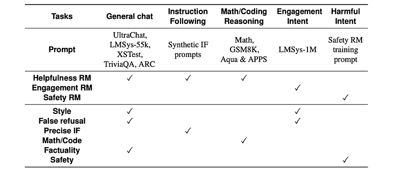
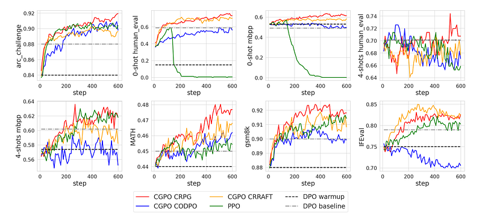
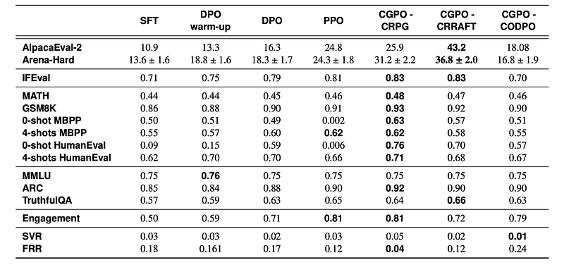
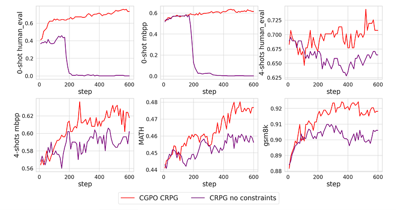
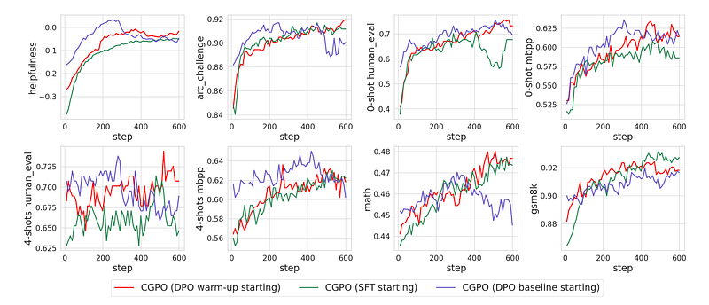

# Papers Explained 304 - Constrained Generative Policy Optimization (Mixture of Judges)

RLHF has limitations in multi-task learning (MTL) due to challenges of extreme multi-objective optimization (i.e., trade-off of multiple and/or sometimes conflicting objectives) and hence does not generalize well. Constrained Generative Policy Optimization (CGPO) addresses these limitations.

This page ingests the source article into the wiki and connects it to [[Papers Explained Corpus]], [[Reinforcement Learning Topic]], [[Safety and Alignment]], [[Large Language Models]], [[Reasoning Models]], [[Model Compression and Efficiency]], [[Reinforcement Learning]], [[KL Regularization]].

## Source Metadata

- Source file: `raw/2025-02-06_Papers-Explained-304--Constrained-Generative-Policy-Optimization--Mixture-of-Judges--71ae4b508b74.html`
- Source title: Papers Explained 304: Constrained Generative Policy Optimization (Mixture of Judges)
- Published: 2025-02-06
- Canonical: [https://medium.com/@ritvik19/papers-explained-304-constrained-generative-policy-optimization-mixture-of-judges-71ae4b508b74](https://medium.com/@ritvik19/papers-explained-304-constrained-generative-policy-optimization-mixture-of-judges-71ae4b508b74)

## Key Ideas

- RLHF has limitations in multi-task learning (MTL) due to challenges of extreme multi-objective optimization (i.e., trade-off of multiple and/or sometimes conflicting objectives) and hence does not generalize well.
- Traditional RLHF suffers from limitations in both reward modeling and the optimization process, hindering its effectiveness, especially in multi-task settings. These limitations can be categorized as follows:
- Insufficient Capability for Fine-Grained Criteria Alignment: Reward models, even when based on sophisticated LLMs, struggle to provide accurate guidance for tasks requiring nuanced judgment, such as math problem-solving or code correctness evaluation.
- Contradictory Optimization Objectives: Human preferences are diverse and often encompass multiple, potentially conflicting objectives.
- Rigid Optimization Strategy for Multi-Task Alignment: Standard RLHF employs a uniform optimization strategy across all tasks.

## Notes

RLHF has limitations in multi-task learning (MTL) due to challenges of extreme multi-objective optimization (i.e., trade-off of multiple and/or sometimes conflicting objectives) and hence does not generalize well. Constrained Generative Policy Optimization (CGPO) addresses these limitations. The core of CGPO is Mixture of Judges (MoJ) with cost-efficient constrained policy optimization with stratification, which can identify the perfect blend in RLHF in a principled manner.

## Limitations of Traditional RLHF

Traditional RLHF suffers from limitations in both reward modeling and the optimization process, hindering its effectiveness, especially in multi-task settings. These limitations can be categorized as follows:

### Reward Modeling Limitations

- Insufficient Capability for Fine-Grained Criteria Alignment: Reward models, even when based on sophisticated LLMs, struggle to provide accurate guidance for tasks requiring nuanced judgment, such as math problem-solving or code correctness evaluation. Their reliance on preference-based learning makes it difficult to capture the subtleties of these tasks.

- Proxy Nature in Coarse-Grained Preference Setting: Even in broader preference optimization, reward models act as proxies for true human preferences and can be misspecified. This leads to “reward hacking,” where the model prioritizes outputs that maximize the proxy reward but don’t align with actual human preferences. While KL penalties can mitigate this, they don’t address the core issue of reward model imperfections.

### RLHF Optimizer Limitations

- Contradictory Optimization Objectives: Human preferences are diverse and often encompass multiple, potentially conflicting objectives. Traditional RLHF uses linear weights to combine rewards from different tasks, applying the same weighting across all scenarios. This can be suboptimal, as the ideal balance of objectives may vary depending on the context.

- Rigid Optimization Strategy for Multi-Task Alignment: Standard RLHF employs a uniform optimization strategy across all tasks. However, different tasks may benefit from different hyperparameter settings (e.g., generations per prompt, batch size, KL regularization). A rigid approach fails to account for the unique characteristics of each task and can lead to suboptimal performance.

## CGPO in Single Task with Single Objective

*Figure: Overview of CGPO pipeline.*

The primary design of CGPO is to integrate multiple constraints to mitigate the issue of reward hacking, which arises from the limited capabilities of reward models. By introducing these constraints based on prior knowledge about the weaknesses of each reward model, critical reward hacking patterns can be avoided effectively.

The set of constraints that the LLM generations need to satisfy is denoted as {C1,C2,…,CM} and the state-action set that satisfies constraint Ck as Σk, i.e., Σk = {(s, a) ∈ S × A and (s, a) satisfies requirement of Ck}. The feasible region is defined as the state-action set that satisfies all constraints as Σ = Σ1 ∩ Σ2 ∩ . . . ∩ ΣM.

At each iteration, a minibatch is sampled from the prompt set D, and the current LLM policy is applied to generate K responses (1 ≤ K) for each prompt. All generated samples are then evaluated by judges J to determine whether a generation violates a specific constraint.

The generations are subsequently split into “Positive” and “Negative” groups, depending on the constraint satisfaction label. A constrained RLHF optimizer is then applied to update the policy with these two groups of samples.

Three new RLHF optimizers are proposed to efficiently solve the multi-constraint problem in the LLM setting. For Option I, a policy gradient approach and an online DPO approach are developed. For Option II, a reward ranking-based approach is developed.

### Calibrated Regularized Policy Gradient (CRPG)

Calibrated Regularized Policy Gradient (CRPG) incorporates both a reward model and constraints to guide the learning process. It aims to maximize the reward while ensuring the LLM’s output adheres to specific rules or guidelines.

Standard RLHF methods directly use the reward model’s output to update the LLM. However, these raw reward values can be problematic. The reward model might be good at comparing different responses to the same prompt, but its scores for different prompts might not be directly comparable. A score of 0.9 for one prompt might represent a much better response than a score of 0.95 for another. This lack of calibration can lead to suboptimal LLM performance.

CRPG addresses this by introducing a calibrated reward. For each prompt used in training, CRPG assumes you have a baseline response. This could be:

- A pre-existing “golden” response from a training dataset.

- A response generated by the initial LLM before fine-tuning.

The calibrated reward compares the current LLM’s response (a) to the baseline response (ā) for the same prompt (s). This calibrated reward essentially represents the probability that the current LLM’s response is better than the baseline response for a given prompt.

This calibration makes reward values comparable across different prompts and keeps reward values bounded between 0 and 1, preventing extreme values from unduly influencing the learning process.

CRPG also incorporates constraints to address limitations of the reward model. These constraints represent rules or guidelines that the LLM’s output must follow. These constraints are evaluated by a separate “judge” module, which can be either rule-based (e.g., string matching) or LLM-based.

To prevent the LLM from drifting too far from its initial behavior (which might be desirable in some cases), CRPG also includes a regularization term based on KL divergence.

### Constrained Online Direct Preference Optimization (CODPO)

Constrained Online Direct Preference Optimization (CODPO), based on Direct Preference Optimization (DPO), first generates multiple responses for each prompt using the current policy and splits the generations into positive samples Xt+ and negative samples Xt−. The positive sample with the highest reward value is selected from Xt+, and the negative sample with the lowest reward value from Xt−. In cases where no generations satisfy all constraints, this sample can be skipped. Conversely, when no generations violate any constraints, the generation with the lowest reward model value can be selected as the negative sample.

### Calibrated Regularized Reward Ranking Finetuning (CRRAFT)

Calibrated Regularized Reward Ranking Finetuning (CRRAFT) is built upon the RAFT algorithm. In the original RAFT algorithm, each round involves generating multiple responses from a prompt using the current policy model. A reward model is then utilized to select the response with the highest reward model score. Subsequently, an one-step SFT update is performed to maximize the likelihood of this generated sample. The policy model is iteratively updated to improve its alignment with the reward model.

In the multi-constraint setting, the following two changes are made on top of RAFT to develop the CRRAFT optimizer:

- After applying the reward model to score each response, those generated responses that violated any of the constraints are filtered out. Additionally, to avoid large drift of the current policy from the starting point policy πref, all generations whose KL-divergence is larger than a pre-defined threshold are also filtered out. After that, reward ranking is applied to select the one with the highest reward model score from the rest of the responses.

- After the constrained regularized reward ranking, instead of directly performing SFT update, each chosen response is reweighed by their calibrated reward value and then SFT update is performed.

## Judges in CGPO

In CGPO, two types of constraint judge modules have been developed and integrated to assess whether a generation satisfies a constraint:

- Rule-based constraint judge module: This module employs a rule-based approach (such as string-matching and code execution) to ascertain whether the generation strictly adheres to predefined regulations. It is particularly effective for constraints related to precise instruction following, where the generation must meet exact requirements such as length, number of paragraphs, and keyword inclusion. It can also handle reasoning tasks, such as math problems and code generation.

- LLM-based constraint judge module: This module functions as an LLM generator. In most cases, the generation is formatted according to a template before being sent to the judge module. These modules not only provide access to the constraint satisfaction condition but also offer reasoning behind the judgement construction. Due to this property, they are typically capable of handling more challenging constraint evaluation tasks such as safety violation, reference-based factuality verification, and false refusal patterns.

## CGPO in Multi-Taks with Multi-Objectives

*Figure: CGPO in a multi-tasks setting.*

In the multi-tasks environment, CGPO utilizes customized combinations of “reward models + MoJs + optimizers” to provide alignment guidance tailored to each task. The entire CGPO pipeline has the following two core components:

- Mutli-Objective Reward Modelling: CGPO first classifies the prompt set D into distinct, non-overlapping categories based on the nature of the prompts, i.e., D = {D1, D2, . . . , DL}. Each prompt set Dl ∈ D is referred to as a task. Subsequently, with a collection of trained reward models denoted as {Rcalib,1,Rcalib,2,…,Rcalib,V}, the specific reward model to be applied for each task Dl is tailored. This customization guarantees that each prompt class Dl benefits from the most appropriate guidance provided by the corresponding reward model. Note that the number of reward models, denoted by V, is less than or equal to the number of tasks, meaning a single reward model can be utilized across multiple tasks.

- Multi-Expert Alignment: After the policy model generates online samples for each task, a mixture of task-specific judges is employed to identify generations that do not meet predefined standards. Based on the status of constraint satisfaction across generations and a customized reward model, an RLHF policy optimizer with a specifically tailored hyperparameter setup is implemented to align each task effectively. For tasks that have precise judges and require extensive exploration to derive the correct response, such as instruction following, math, and coding, a lenient KL threshold and a higher number of generations per prompt are applied. In contrast, for tasks where precise judges are lacking and extensive exploration is less critical, such as “general chat,” a stricter KL threshold and a reduced number of generations per prompt are opted for.

## Experiment Setup

Fine-tuning then LLM is focused on achieving alignment across the following five tasks:

- General chat: Improving multi-turn conversational abilities, coherence, consistency, correctness, and alignment with user intentions. Focuses on factually grounded responses.

- Instruction Following: Enhancing the ability to accurately follow instructions within specific contexts or industries. Aims for more precise and relevant responses.

- Math/Code Reasoning: Improving math and coding capabilities to handle complex problems, including debugging and solving equations.

- Engagement Intent: Enhancing user engagement through human feedback (like/dislike) to maximize positive user responses.

- Harmful Intent: Training the LLM to recognize and resist safety-related adversarial attacks, preventing the generation of harmful or misleading information.

The foundational model is the LLaMA-3.0–70B pre-trained checkpoint. SFT is independently performed using an open-source dataset to establish the initial policy, denoted as π0. For all preference pair datasets listed below only positive samples are used in SFT.

- General chat: LMSys-55k, UltraChat

- Instruction following: LIama 3.0 70B instruct model synthetic instruction following dataset

- Math/Code Reasoning: Orca-Math, MetaMath, Evol-CodeAlpaca, UltraFeedback, UltraInteract

- Harmful Intent: Human annotated safety dataset

The training is carry out for 2 epoches

Following Open-source pairwise preference data is used to train three specialized reward models (RMs).

Helpfulness RM:

A LLaMA-3–70B instruct model is finetuned to evaluate the helpfulness of responses across various tasks.

This model is trained using pairwise preference data from several datasets categorized by task type:

- General Chat: HH-RLHF, SHP, HelpSteer, Distilabel-Capybara, Distilabel-Orca, and LMSys-55k.

- Instruction Following: LLaMA 3.0 70B instruct model synthetic instruction following pairwise preference dataset.

- Math/Code Reasoning: Argilla Math, UltraFeedback, and UltraInteract.

Engagement RM:

A binary classifier fine-tuned using the LLaMA-3–70B instruct model to predict user engagement intent. This predictor then acts as an “oracle” for determining engagement.

A pairwise preference dataset was created using the LMSys-1M dataset. 129,692 prompts are subsampled, and four responses are generated for each prompt using the LLaMA-3–70B instruct model. The “oracle” engagement predictor scores each response, and the highest-scoring response is paired with the lowest-scoring response to create the training data.

Safety RM:

LLaMA-3–8B instruct finetuned model focused on identifying and preventing unsafe or harmful responses.

Training Data: A human-annotated safety pairwise preference dataset that identifies harmful intent in prompts.

To address the limitations of the reward model, several judges have been implemented in the experiment for multi-task alignment.

- False refusal judge: Enhancing safety protocols may cause LLMs to become overly safe, leading to false refusals when responding to innocuous user queries. This can degrade user experience. To address this challenge, a false refusal classifier, a fine-tuned LLM designed to detect false refusals, has been developed to ensure the effectiveness of the LLM.

- Precise instruction following judge: Reward models often struggle with precisely following instructions. To address this, a rule-based judge has been implemented, capable of accurately assessing compliance with over 30 types of specific instruction-following requests found in user prompts, such as “answer the question in two paragraphs.”

- Regex math/code reasoning judge: Reward models frequently fail to accurately assess the correctness of math and coding problems. To improve accuracy, specialized judges have been introduced for both domains. For math-related queries, a rule-based approach is used to check whether the final answers of responses match the ground-truth answers. For coding problems, a unit-test-based judge evaluates the accuracy of the code by running it through a series of unit tests.

- Factuality judge: Hallucination is a common issue in LLMs, especially during the RLHF phase. The reward model often fails to distinguish between factual and non-factual claims. To address this, the Llama3 70B model is used as a factuality constraint judge to evaluate whether the fact-related claims in an output contradict pre-collected, verified factual data, thereby ensuring the accuracy and reliability of the information provided by the LLM.

- Safety judge: The safety reward model alone does not sufficiently ensure the trustworthiness of the model due to its limited accuracy. To further enhance safety, LlamaGuard2, an industry leading open sourced fine-tuned LLM, is incorporated to assess whether an output violates predefined safety standards.

Unlike previous studies, which directly employ the SFT model as the initial point for RLHF, the approach introduces a “warm-up” phase. This phase begins with a model that has undergone preliminary fine-tuning through a few steps of DPO, starting from the SFT model.

*Figure: Tasks and their corresponding prompt sets, reward models, and MoJs.*

## Evaluation

CGPO outperforms baseline RLHF methods (PPO and DPO) across various benchmarks.

*Figure: Comparison of CGPO variants with baseline RLHF algorithms PPO and DPO across various benchmarks.*

- CGPO consistently improves performance across benchmarks compared to the initial model and PPO, especially with CRPG and CRRAFT optimizers. PPO exhibits performance decline (reward hacking) on coding benchmarks. DPO shows less improvement than CGPO.

*Figure: Evaluation results of SFT, DPO warm-up, DPO, PPO and CGPO variants.*

- Evaluation results across all benchmarks show that CGPO variants with CRPG and CRRAFT significantly outperform DPO and PPO. CRPG excels in math and coding, CRRAFT in helpfulness and factuality.

Mixture of Judges (MoJs) are crucial for CGPO’s performance.

*Figure: Comparison of CGPO (CRPG optimizer) with and without MoJs.*

- Without MoJs, CGPO performance degrades, especially in coding benchmarks, similar to PPO. MoJs prevent reward hacking and boost performance.

RLHF warm-up stage significantly improves CGPO’s performance.

*Figure: Comparison of CGPO (CRPG optimizer) with different starting point.*

- CGPO initialized from the warm-up model achieves superior performance compared to starting from the SFT model in most benchmarks.

- Starting from a highly optimized DPO baseline can negatively impact final performance, possibly due to limited exploration.

## Paper

The Perfect Blend: Redefining RLHF with Mixture of Judges [2409.20370](https://arxiv.org/abs/2409.20370)

## Figures

Figures from the Medium HTML export (`raw/2025-02-06_Papers-Explained-304--Constrained-Generative-Policy-Optimization--Mixture-of-Judges--71ae4b508b74.html`); local copies under `wiki/assets/papers-explained-304-constrained-generative-policy-optimization-mixture-of-judges/` when download succeeded.

| Figure | Caption |
|--------|---------|
|  | Title card: Constrained Generative Policy Optimization (Mixture of Judges). |
|  | Overview of CGPO pipeline. |
|  | The generations are subsequently split into “Positive” and “Negative” groups, depending on the constraint satisfaction label. |
|  | CGPO in a multi-tasks setting. |
|  | CGPO in Multi-Taks with Multi-Objectives. |
|  | Tasks and their corresponding prompt sets, reward models, and MoJs. |
|  | Comparison of CGPO variants with baseline RLHF algorithms PPO and DPO across various benchmarks. |
|  | Evaluation results of SFT, DPO warm-up, DPO, PPO and CGPO variants. |
|  | Comparison of CGPO (CRPG optimizer) with and without MoJs. |
|  | Comparison of CGPO (CRPG optimizer) with different starting point. |
## Related

- [[Papers Explained Corpus]]
- [[Reinforcement Learning Topic]]
- [[Safety and Alignment]]
- [[Large Language Models]]
- [[Reasoning Models]]
- [[Model Compression and Efficiency]]
- [[Reinforcement Learning]]
- [[KL Regularization]]
- [[Papers Explained 303 - Reward rAnked FineTuning (RAFT)]]
- [[Papers Explained 305 - Hyperfitting]]

#summary #topic
