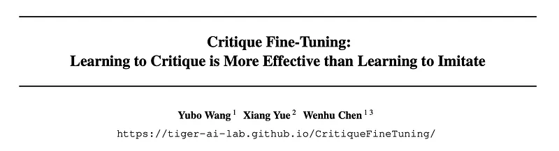
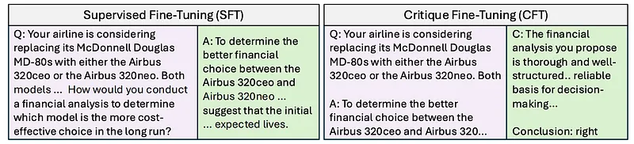
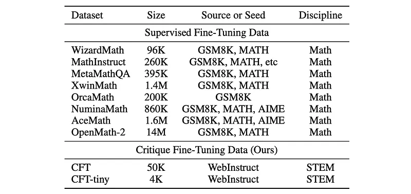
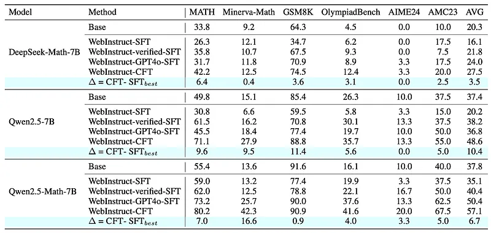
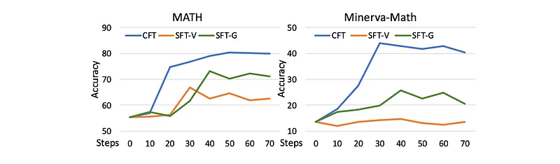
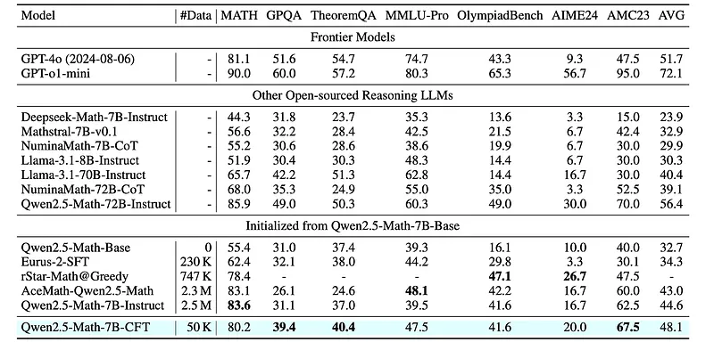
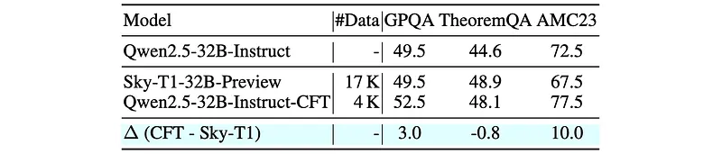
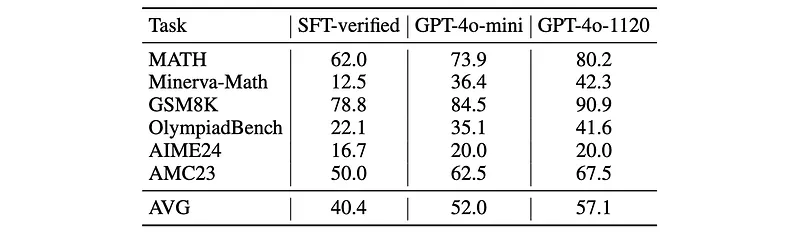

# Papers Explained 306 - Critique Fine-Tuning

Critique Fine-Tuning (CFT) is a strategy where models learn to critique noisy responses rather than simply imitate correct ones. Inspired by human learning processes that emphasize critical thinking, CFT encourages deeper analysis and nuanced understanding.

This page ingests the source article into the wiki and connects it to [[Papers Explained Corpus]], [[Large Language Models]], [[Synthetic Data]], [[Reasoning Models]], [[Mixture of Experts]], [[Evaluation and Benchmarks]], [[Supervised Fine-Tuning]], [[Verifier-Bounded Learning]].

## Source Metadata

- Source file: `raw/2025-02-10_Papers-Explained-306--Critique-Fine-Tuning-738b25d1b51c.md`
- Source title: Papers Explained 306: Critique Fine-Tuning
- Published: 2025-02-10
- Canonical: [https://medium.com/@ritvik19/papers-explained-306-critique-fine-tuning-738b25d1b51c](https://medium.com/@ritvik19/papers-explained-306-critique-fine-tuning-738b25d1b51c)

## Key Ideas

- The project is available on [GitHub](https://tiger-ai-lab.github.io/CritiqueFineTuning/).
- Most experiments are based on WebInstruct, an instruction dataset collected from online educational resources and quiz websites.
- The following subsets are curated from WebInstruct:
- WebInstruct-SFT: A 50K subset directly sampled from the original WebInstruct dataset. This subset has a very high error ratio (over 50%).
- WebInstruct-verified: Samples from WebInstruct are adopted and GPT-4o-1120 is prompted to judge whether the original answers are correct or not. The top 50K samples are retained as ”verified” SFT data.

## Notes

Critique Fine-Tuning (CFT) is a strategy where models learn to critique noisy responses rather than simply imitate correct ones. Inspired by human learning processes that emphasize critical thinking, CFT encourages deeper analysis and nuanced understanding. It challenges the commonly used Supervised Fine-Tuning (SFT) paradigm,which imitates annotated responses for given instructions.

The project is available on [GitHub](https://tiger-ai-lab.github.io/CritiqueFineTuning/).

## Method & Dataset

*Figure: Comparison between CFT and SFT.*

Most experiments are based on WebInstruct, an instruction dataset collected from online educational resources and quiz websites. WebInstruct spans a wide range of topics, including Mathematics (65%), Physics (8%), Chemistry (4%), Business (10%), Humanities (4%), and more. The responses in WebInstruct are extracted and refined by large language models such as Qwen-72B and Mixtral, making them highly prone to noise due to the lack of verification or quality control.

The following subsets are curated from WebInstruct:

- WebInstruct-SFT: A 50K subset directly sampled from the original WebInstruct dataset. This subset has a very high error ratio (over 50%).

- WebInstruct-verified: Samples from WebInstruct are adopted and GPT-4o-1120 is prompted to judge whether the original answers are correct or not. The top 50K samples are retained as ”verified” SFT data.

- WebInstruct-GPT-4o: A 50K subset that reuses questions from WebInstruct-SFT but replaces the answers with those generated by GPT-4o-1120.

- WebInstruct-CFT: A 50K subset derived from WebInstruct-SFT, where GPT-4o-1120 provides detailed critiques of the original responses. Approximately 56% of the responses in this subset are judged as ”correct,” while the rest are considered ”wrong.” Despite containing some critique errors introduced by GPT-4o, this dataset is comparable in quality to WebInstruct-GPT-4o.

- WebInstruct-CFT-Tiny: A smaller version of WebInstruct-CFT, containing only 4K examples, designed for training our 32B model.

*Figure: Comparison of CFT datasets with existing SFT datasets.*

### Training Objective

The training objective of the approach is straightforward. Question x and noisy response y are concatenated as input, and the model parameters are optimized to generate the critique c. Formally, the training loss is:

### Experiment Setup

Three different SFT settings and one CFT setting are evaluated in the experiments.

- SFT: directly training on original noisy responses

- SFT-verified: training on responses validated by GPT-4o

- SFT-gpt4o: training on responses generated by GPT-4o. For CFT, the model is trained using curated CFT datasets.

MATH-500 is used as the validation set and the best-performing checkpoint after training on the entire dataset for 1 epoch is selected.

## Evaluation

*Figure: Performance comparison of SFT and CFT on different base models.*

- CFT consistently outperforms all SFT baselines across different base models on mathematical reasoning benchmarks.

- For example, CFT achieved a 3.5% absolute improvement over SFT-GPT4o on DeepSeek-Math-7B.

- CFT showed a substantial 10.4% improvement over SFT-verified on Qwen2.5–7B.

- CFT surpassed SFT-GPT4o by 6.7% on Qwen2.5-Math-7B.

- Qwen2.5-Math-7B is found to be a stronger base model, and when enhanced with CFT, it achieved the best performance among the tested 7B models.

*Figure: Training dynamics comparison of different methods on Qwen2.5-Math-7B across MATH and Minerva-Math.*

- CFT demonstrates faster convergence and maintains higher performance throughout training compared to SFT variants.

- CFT achieves approximately 80% accuracy on MATH and 40% on Minerva-Math, compared to lower accuracies for SFT-V and SFT-G.

*Figure: Performance comparison of CFT models vs. other reasoning-specialized models.*

- The 7B CFT model (Qwen2.5-Math-7B-CFT) achieves the highest average performance (48.1%) among 7B-scale models with significantly less training data (50K samples).

- It outperforms other specialized math models like Deepseek-Math-7B-Instruct, Mathstral-7B, and NuminaMath-7B-CoT.

- The 7B CFT model shows competitive performance compared to much larger models like Qwen2.5-Math-72B-Instruct, despite having significantly fewer parameters and less training data.

*Figure: Performance Comparison of 32B Models across Mathematical Reasoning Benchmarks.*

- The 32B CFT model (Qwen2.5–32B-Instruct-CFT) is highly data-efficient, achieving optimal performance with only 4K training samples, compared to 17K for Sky-T1–32B-Preview.

*Figure: Performance comparison of CFT using different teacher critique models on Qwen2.5-Math-7B.*

- CFT is effective even with a modest critique model (GPT-4o-mini), and performance improves further with a stronger critique model (GPT-4o-1120).

## Paper

Critique Fine-Tuning: Learning to Critique is More Effective than Learning to Imitate [2501.17703](https://arxiv.org/abs/2501.17703)

## Figures

Figures from the Medium HTML export (`raw/2025-02-10_Papers-Explained-306--Critique-Fine-Tuning-738b25d1b51c.md`); local copies under `wiki/assets/papers-explained-306-critique-fine-tuning/` when download succeeded.

| Figure | Caption |
|--------|---------|
|  | Title card: Critique Fine-Tuning. |
|  | Comparison between CFT and SFT. |
|  | Comparison of CFT datasets with existing SFT datasets. |
|  | The training objective of the approach is straightforward. |
|  | Performance comparison of SFT and CFT on different base models. |
|  | Training dynamics comparison of different methods on Qwen2.5-Math-7B across MATH and Minerva-Math. |
|  | Performance comparison of CFT models vs. other reasoning-specialized models. |
|  | Performance Comparison of 32B Models across Mathematical Reasoning Benchmarks. |
|  | Performance comparison of CFT using different teacher critique models on Qwen2.5-Math-7B. |
## Related

- [[Papers Explained Corpus]]
- [[Large Language Models]]
- [[Synthetic Data]]
- [[Reasoning Models]]
- [[Mixture of Experts]]
- [[Evaluation and Benchmarks]]
- [[Supervised Fine-Tuning]]
- [[Verifier-Bounded Learning]]
- [[Papers Explained 305 - Hyperfitting]]
- [[Papers Explained 307 - Diverse Preference Optimization]]

#summary #topic
