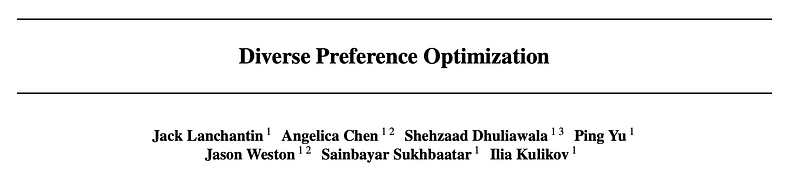
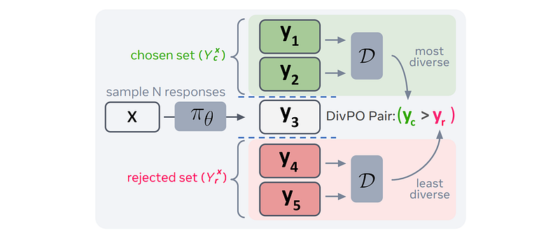
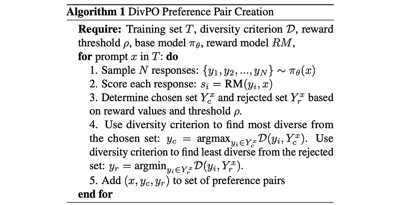
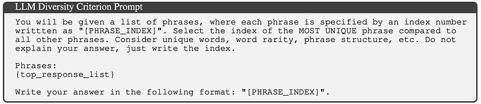
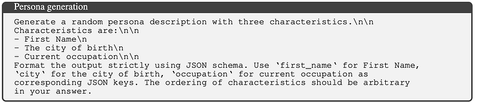
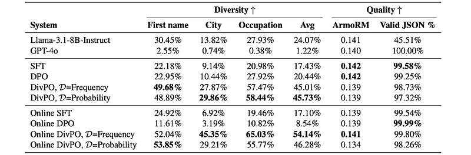
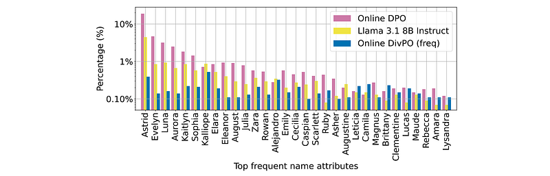
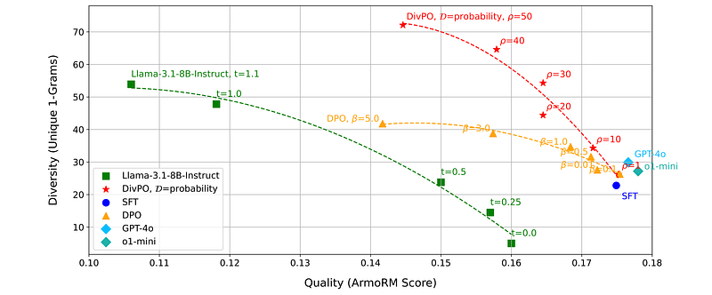
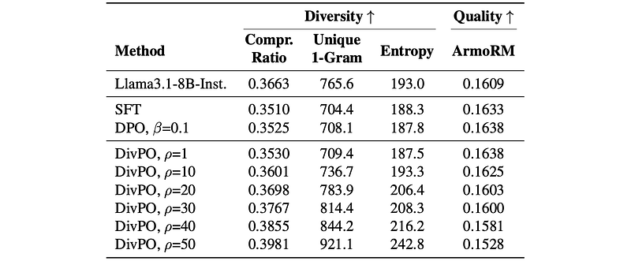

# Papers Explained 307 - Diverse Preference Optimization

Diverse Preference Optimization (DivPO) is an online optimization method which learns to generate much more diverse responses than standard pipelines, while maintaining the quality of the generations. In DivPO, preference pairs are selected by first considering a pool of responses, and a measure of diversity among them.

This page ingests the source article into the wiki and connects it to [[Papers Explained Corpus]], [[Reinforcement Learning Topic]], [[Evaluation and Benchmarks]], [[Large Language Models]], [[Safety and Alignment]], [[KL Regularization]], [[Reinforcement Learning]].

## Source Metadata

- Source file: `raw/2025-02-11_Papers-Explained-307--Diverse-Preference-Optimization-7f99326e264c.html`
- Source title: Papers Explained 307: Diverse Preference Optimization
- Published: 2025-02-11
- Canonical: [https://medium.com/@ritvik19/papers-explained-307-diverse-preference-optimization-7f99326e264c](https://medium.com/@ritvik19/papers-explained-307-diverse-preference-optimization-7f99326e264c)

## Key Ideas

- Diverse Preference Optimization (DivPO) is an online optimization method which learns to generate much more diverse responses than standard pipelines, while maintaining the quality of the generations.
- Language models are initially trained on diverse text corpora, learning a distribution that reflects this data. The subsequent RLHF stage aims to optimize cumulative future reward (R).
- To address this, a KL divergence term is often added to the RL loss, regularizing the model against a reference model (πref): L = -∑ rt — βKL(π||πref). However, the effectiveness depends on the β parameter.
- Furthermore, common evaluation metrics like accuracy, pass@N, and win rate focus on response quality, often ignoring diversity. These metrics can be optimized even with homogenous outputs, as long as the single output is high quality.
- Rather than selecting the highest rewarded response for the chosen, the most diverse response that meets a certain reward threshold is desired. Similarly, the least diverse response that is below a reward threshold should be rejected.

## Notes

Diverse Preference Optimization (DivPO) is an online optimization method which learns to generate much more diverse responses than standard pipelines, while maintaining the quality of the generations. In DivPO, preference pairs are selected by first considering a pool of responses, and a measure of diversity among them. Chosen examples are more rare but high quality, while rejected examples are more common, but low quality.

## The Collapse Problem

Language models are initially trained on diverse text corpora, learning a distribution that reflects this data. The subsequent RLHF stage aims to optimize cumulative future reward (R). The RL loss function (L = -∑t rt = -R, where rt is the reward for generating a token at time step t) encourages the model to concentrate probability mass on the highest-reward outputs. Even if multiple outputs have the same high reward, the model tends to select just one, leading to a collapse in diversity.

To address this, a KL divergence term is often added to the RL loss, regularizing the model against a reference model (πref): L = -∑ rt — βKL(π||πref). However, the effectiveness depends on the β parameter. A low β still allows high-reward generations to dominate, while a high β forces the model to stay too close to the less-aligned reference model.

Furthermore, common evaluation metrics like accuracy, pass@N, and win rate focus on response quality, often ignoring diversity. These metrics can be optimized even with homogenous outputs, as long as the single output is high quality.

## Diverse Preference Optimization

*Figure: Diverse Preference Optimization (DivPO).*

Rather than selecting the highest rewarded response for the chosen, the most diverse response that meets a certain reward threshold is desired. Similarly, the least diverse response that is below a reward threshold should be rejected. A response is considered more “diverse” if it differs substantially from other responses generated by the same model. This set of diverse chosen and rejected responses is used to fit a Bradley-Terry model and update model πθ.

Here β is used to control the deviation from a reference model πref (β=0.1 is used for all DivPO experiments).

Reward Threshold ρ:To determine the chosen set Ycx and rejected set Yrx, a hyperparameter ρ is introduced which represents the percentage range from the lowest to the highest reward value.

Diversity Criterion D: Three different methods are used to determine the most and least diverse from a set:

- Model Probability: If a response yi have a higher probability under the model, that means it is more likely to be generated again, hence less diverse. Thus D(yi) = − log πθ(yi|x) so that less likely responses are considered more diverse.

- Word Frequency: Given a pool of responses, a response with more frequent words is likely to be similar to other responses sharing the same words, Hence D is defined as inverse word frequency.

- LLM-as-a-diversity-judge: A language model is prompted to select the most and least diverse responses from the chosen and rejected sets.

DivPO Training

DivPO can be used in both offline (off-policy) and online (on-policy) training. For online training the for loop in Alg. 1 is executed at every training step, but only over the current batch of prompts.

Compared to an offline setup, online training in other optimization approaches has shown performance improvements at the cost of computational efficiency.

In standard methods however online training is known to be more prone to collapse because as the model generation becomes less diverse, simultaneously so does the model’s response training data.

The Llama-3.1–8b Instruct model is used as the baseline model and as initialization checkpoint in the experiments.

## Experiments

### Persona Generation Task

Diversity is encouraged using either “Word Frequency” or “Probability” criteria. A rule-based reward (1 for valid JSON, 0 otherwise) is used for training and evaluation.

*Figure: Persona Generation Task Results.*

- DivPO significantly improves diversity compared to SFT, DPO, and even strong baselines like Llama-3.1–8B-Instruct and GPT-4o.

- Online DivPO achieves the best diversity improvements (up to 30.07% over Instruct, 45.6% over online DPO) while maintaining or improving quality.

- Both “Word Frequency” and “Probability” diversity criteria perform well.

*Figure: Persona Generation Statistics.*

- Standard DPO suffers from diversity collapse, especially in the online setting.

- DivPO not only increases the number of unique attributes but also leads to a more uniform distribution of generated attributes.

### Keyword Story Generation Task

Diversity is encouraged using probability-based, frequency-based, and LLM as a diversity judge approaches

*Figure: Keyword Story Generation Results.*

- DivPO significantly improves diversity compared to baseline models (SFT, DPO, GPT-4o, o1-mini) while maintaining comparable quality.

- DivPO allows for control over the diversity-quality trade-off by adjusting the ρ parameter (reward threshold).

- DivPO consistently achieves higher diversity at similar quality levels compared to baselines.

### Full Story Generation Task

Diversity metrics (same as in keyword story generation task) are used to evaluate the stories.

ArmoRM model evaluates story quality using a prompt without keyword specification.

*Figure: Full Story Generation Results.*

- Similar tradeoff between quality and diversity is observed when varying the ρ parameter in DivPO, as seen in previous tasks.

- Around ρ=10, DivPO shows similar quality to SFT but higher diversity.

- For larger ρ values, DivPO’s diversity further improves over the base model, with a slight drop in quality.

## Paper

Diverse Preference Optimization [2501.18101](https://arxiv.org/abs/2501.18101)

## Figures

Figures from the Medium HTML export (`raw/2025-02-11_Papers-Explained-307--Diverse-Preference-Optimization-7f99326e264c.html`); local copies under `wiki/assets/papers-explained-307-diverse-preference-optimization/` when download succeeded.

| Figure | Caption |
|--------|---------|
|  | Title card: Diverse Preference Optimization. |
|  | Diverse Preference Optimization (DivPO). |
|  | Rather than selecting the highest rewarded response for the chosen, the most diverse response that meets a certain reward threshold is... |
|  | Here β is used to control the deviation from a reference model πref (β=0.1 is used for all DivPO experiments). |
|  | Diversity Criterion D: Three different methods are used to determine the most and least diverse from a set. |
|  | The Llama-3.1–8b Instruct model is used as the baseline model and as initialization checkpoint in the experiments. |
|  | Persona Generation Task Results. |
|  | Persona Generation Statistics. |
|  | Diversity is encouraged using either “Word Frequency” or “Probability” criteria. |
|  | Keyword Story Generation Results. |
|  | Diversity is encouraged using probability-based, frequency-based, and LLM as a diversity judge approaches. |
|  | Full Story Generation Results. |
## Related

- [[Papers Explained Corpus]]
- [[Reinforcement Learning Topic]]
- [[Evaluation and Benchmarks]]
- [[Large Language Models]]
- [[Safety and Alignment]]
- [[KL Regularization]]
- [[Reinforcement Learning]]
- [[Papers Explained 306 - Critique Fine-Tuning]]
- [[Papers Explained 308 - SFT Memorizes, RL Generalizes]]

#summary #topic
