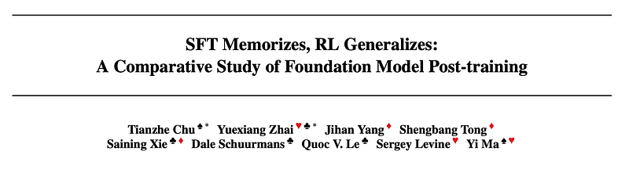
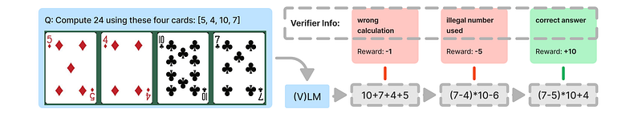
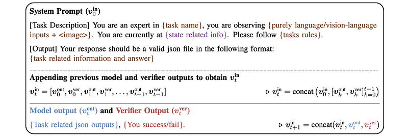
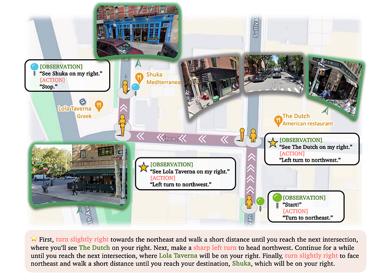
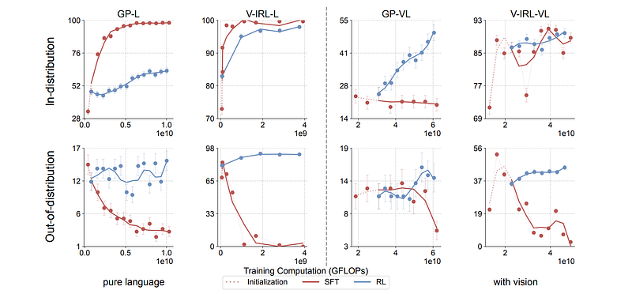
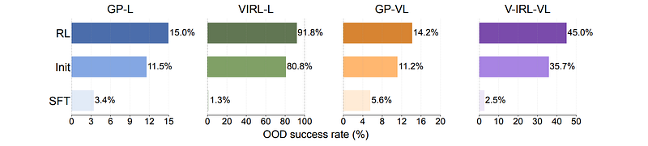
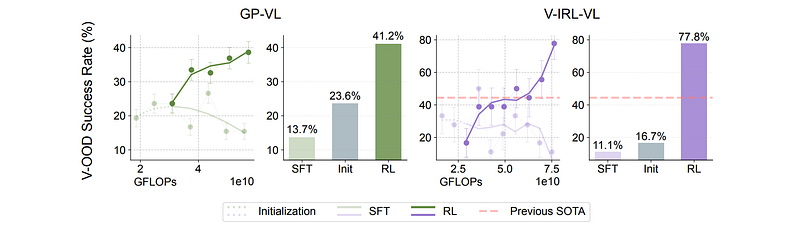

# Papers Explained 308 - SFT Memorizes, RL Generalizes

This paper studies the comparative effect of SFT and RL on generalization and memorization, focusing on text-based and visual environments. It shows that:

This page ingests the source article into the wiki and connects it to [[Papers Explained Corpus]], [[Reasoning Models]], [[Evaluation and Benchmarks]], [[Supervised Fine-Tuning]].

## Source Metadata

- Source file: `raw/2025-02-12_Papers-Explained-308--SFT-Memorizes--RL-Generalizes-f51c5c66ea05.html`
- Source title: Papers Explained 308: SFT Memorizes, RL Generalizes
- Published: 2025-02-12
- Canonical: [https://medium.com/@ritvik19/papers-explained-308-sft-memorizes-rl-generalizes-f51c5c66ea05](https://medium.com/@ritvik19/papers-explained-308-sft-memorizes-rl-generalizes-f51c5c66ea05)

## Key Ideas

- RL, especially when trained with an outcome-based reward, generalizes in both the rule-based textual and visual environments. SFT, in contrast, tends to memorize the training data and struggles to generalize out-of-distribution in either scenario.
- Despite RL’s superior generalization, SFT is still helpful for effective RL training: SFT stabilizes the model’s output format, enabling subsequent RL to achieve its performance gains.
- To evaluate the generalization of different post-training methods, two tasks are selected that each offer rule and visual variations. The first task, GeneralPoints, is a new environment designed to allow assessment of arithmetic reasoning abilities.
- The GeneralPoints environment, instantiated on top of the Points24 environment, is designed to evaluate generalization of arithmetic reasoning.
- Rule variations: To study whether the model learns arithmetic operations or simply memorizes the post-training data, rule variations are introduced in GeneralPoints.

## Notes

This paper studies the comparative effect of SFT and RL on generalization and memorization, focusing on text-based and visual environments. It shows that:

- RL, especially when trained with an outcome-based reward, generalizes in both the rule-based textual and visual environments. SFT, in contrast, tends to memorize the training data and struggles to generalize out-of-distribution in either scenario.

- Despite RL’s superior generalization, SFT is still helpful for effective RL training: SFT stabilizes the model’s output format, enabling subsequent RL to achieve its performance gains.

## Evaluation Tasks

To evaluate the generalization of different post-training methods, two tasks are selected that each offer rule and visual variations. The first task, GeneralPoints, is a new environment designed to allow assessment of arithmetic reasoning abilities. The second task, V-IRL, is chosen to examine the model’s reasoning capabilities in an open-world visual navigation domain.

### The General Points Environment

*Figure: An example of the sequential revision formulation with a verifier.*

The GeneralPoints environment, instantiated on top of the Points24 environment, is designed to evaluate generalization of arithmetic reasoning. Each state s of the environment contains 4 cards, described as text (in the GP-L variant) or presented as an image (in the GP-VL variant). The goal is to produce an equation that equals a target number (24 by default) using all 4 numbers from the cards exactly once.

Rule variations: To study whether the model learns arithmetic operations or simply memorizes the post-training data, rule variations are introduced in GeneralPoints. These variations consist of interpreting the symbols ‘J’, ‘Q’, and ‘K’ either as ‘11’, ‘12’, and ‘13’, respectively, or all as the same number ‘10’. Each rule is specified as text in the input prompt. For studying rule based generalization, the model is post-trained using one rule, then evaluated using a different rule.

Visual variations: The major visual challenge is to recognize the number of each card, agnostic to the color of the cards. Cards with different colors are considered visual variants of the task. In the visual generalization setting, the model is trained using cards of one color, then tested out-of-distribution (OOD) performance using the other color.

### The V-IRL Environment

*Figure: Demonstration of one navigation task in V-IRL.*

The V-IRL environment is utilized to study spatial reasoning ability in an open-world navigation domain that uses realistic visual input. The major visual challenge in V-IRL involves recognizing different landmarks from the visual observation before taking an action. The goal is to navigate to a target location by following a set of instructions that contain spatial information.

Rule variations: To evaluate whether the model possesses spatial knowledge or simply memorizes post-training data, two distinct action space configurations are considered. The first variant utilizes an absolute orientation action space, which includes {‘north’, ‘northeast’, ‘east’, ‘southeast’, ‘south’, ‘southwest’, ‘west’, ‘northwest’}. The second variant employs a relative orientation action space, containing {‘left’, ‘right’, ‘slightly left’, ‘slightly right’}. This relative configuration adjusts the current orientation by 90 degrees or 45 degrees to the left or right, respectively.

Visual variations: The key visual challenge in V-IRL is to recognize landmarks from the visual observations. Since the V-IRL environment contains visual observations from different cities, visual generalization in V-IRL can be assessed by training the model to navigate in one location and then evaluating its performance in different locations.

## Experiments

Llama-3.2-Vision-11B is used as the backbone model.

### Generalization across Rules

Trained RL and SFT models on a single rule for each task (GeneralPoints and V-IRL, both language-only -L and vision-language -VL variants). Assessed performance on the trained rule (in-distribution — ID) and on unseen rules (out-of-distribution — OOD) to measure generalization.

- GeneralPoints: ID treats ‘J’, ‘Q’, ‘K’ as 10; OOD treats them as 11, 12, and 13.

- V-IRL: ID uses absolute orientation coordinates; OOD uses relative orientation action space.

*Figure: Success rate (%) — GFLOPs trendlines for RL and SFT on GeneralPoints and V-IRL.*

*Figure: Comparison of out-of-distribution performance under rule variants.*

- RL consistently improves OOD performance on all tasks (GP-L, GP-VL, V-IRL-L, V-IRL-VL) for both unimodal (LLM) and multimodal (VLM) settings.

- SFT consistently exhibits performance degradation across all OOD evaluations on all tasks.

- RL generalizes better than SFT, which tends to memorize the training rule.

### Generalization in Visual Out-of-Distribution Tasks

- GeneralPoints (GP-VL): Trained on black suits (♠, ♣) and tested on red suits (♥, ♦).

- V-IRL: Trained on routes collected in New York City and evaluated on the original V-IRL VLN mini benchmark containing routes from various cities worldwide.

*Figure: Comparison of out-of-distribution performance under visual variants.*

- RL generalizes well in visual OOD tasks, while SFT performance degrades.

- The multi-turn RL formulation improves the state-of-the-art results on the V-IRL mini benchmark by +33.8% (44.0% → 77.8%).

- The end-to-end RL approach enables an open-sourced model to achieve superior performance compared to a two-stage VLM-LLM collaboration technique and tailored prompt engineering on a closed-sourced model.

### The Role of SFT for RL Training

End-to-end RL is directly applied to the base Llama3.2 model (without prior SFT) using GeneralPoints in a purely language setting.

*Figure: RL experiments on GP-L without SFT initialization.*

- SFT is necessary for RL training when the backbone model (Llama3.2 in this case) does not follow instructions well.

- Without SFT, end-to-end RL training fails to improve performance.

- The base Llama3.2 model, without SFT, exhibits poor instruction following, generating long, tangential, and unstructured responses. This makes it difficult to retrieve task-related information and rewards for RL training.

## Paper

SFT Memorizes, RL Generalizes: A Comparative Study of Foundation Model Post-training [2501.17161](https://arxiv.org/abs/2501.17161)

## Figures

Figures from the Medium HTML export (`raw/2025-02-12_Papers-Explained-308--SFT-Memorizes--RL-Generalizes-f51c5c66ea05.html`); local copies under `wiki/assets/papers-explained-308-sft-memorizes-rl-generalizes/` when download succeeded.

| Figure | Caption |
|--------|---------|
|  | Title card: SFT Memorizes, RL Generalizes. |
|  | An example of the sequential revision formulation with a verifier. |
|  | Visual variations: The major visual challenge is to recognize the number of each card, agnostic to the color of the cards. |
|  | Demonstration of one navigation task in V-IRL. |
|  | Success rate (%) — GFLOPs trendlines for RL and SFT on GeneralPoints and V-IRL. |
|  | Comparison of out-of-distribution performance under rule variants. |
|  | Comparison of out-of-distribution performance under visual variants. |
|  | RL experiments on GP-L without SFT initialization. |
## Related

- [[Papers Explained Corpus]]
- [[Papers Explained: SFT Conflicts, RL Coexists]]
- [[Task Coexistence]]
- [[Reasoning Models]]
- [[Evaluation and Benchmarks]]
- [[Supervised Fine-Tuning]]
- [[Papers Explained 307 - Diverse Preference Optimization]]
- [[Papers Explained - AceCoder]]

#summary #topic
