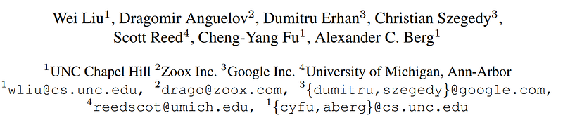
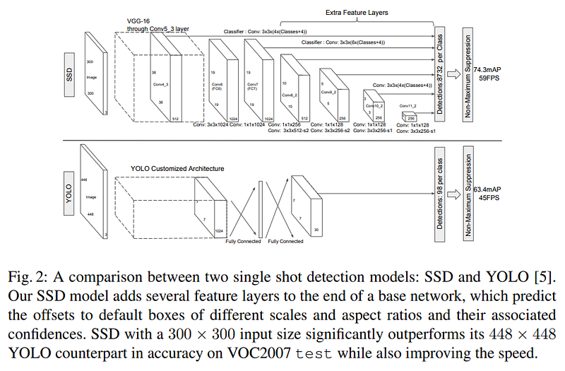
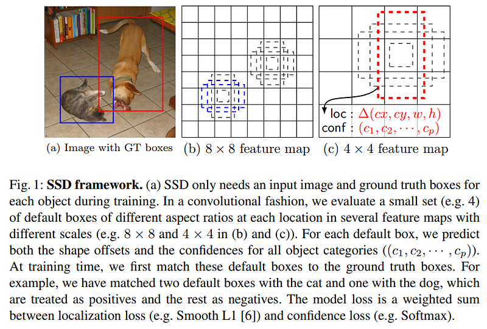

# Papers Explained 31 - Single Shot MultiBox Detector

The SSD approach is based on a feed-forward convolutional network that produces a fixed-size collection of bounding boxes and scores for the presence of object class instances in those boxes, followed by a non-maximum suppression step to produce the final detections.

This page ingests the source article into the wiki and connects it to [[Papers Explained Corpus]], [[Computer Vision]].

## Source Metadata

- Source file: `raw/2023-02-14_Papers-Explained-31--Single-Shot-MultiBox-Detector-14b0aa2f5a97.html`
- Source title: Papers Explained 31: Single Shot MultiBox Detector
- Published: 2023-02-14
- Canonical: [https://medium.com/@ritvik19/papers-explained-31-single-shot-multibox-detector-14b0aa2f5a97](https://medium.com/@ritvik19/papers-explained-31-single-shot-multibox-detector-14b0aa2f5a97)

## Key Ideas

- The SSD approach is based on a feed-forward convolutional network that produces a fixed-size collection of bounding boxes and scores for the presence of object class instances in those boxes, followed by a non-maximum suppression step to produce the final...
- We add convolutional feature layers to the end of the truncated base network. These layers decrease in size progressively and allow predictions of detections at multiple scales.
- Each added feature layer can produce a fixed set of detection predictions using a set of convolutional filters.
- For a feature layer of size m × n with p channels, the basic element for predicting parameters of a potential detection is a 3 × 3 × p small kernel that produces either a score for a category, or a shape offset relative to the default box coordinates.
- We associate a set of default bounding boxes with each feature map cell, for multiple feature maps at the top of the network.

## Notes

The SSD approach is based on a feed-forward convolutional network that produces a fixed-size collection of bounding boxes and scores for the presence of object class instances in those boxes, followed by a non-maximum suppression step to produce the final detections.

Multi-scale feature maps for detection

We add convolutional feature layers to the end of the truncated base network. These layers decrease in size progressively and allow predictions of detections at multiple scales.

Convolutional predictors for detection

Each added feature layer can produce a fixed set of detection predictions using a set of convolutional filters.

For a feature layer of size m × n with p channels, the basic element for predicting parameters of a potential detection is a 3 × 3 × p small kernel that produces either a score for a category, or a shape offset relative to the default box coordinates. At each of the m × n locations where the kernel is applied, it produces an output value. The bounding box offset output values are measured relative to a default box position relative to each feature map location.

Default boxes and aspect ratios

We associate a set of default bounding boxes with each feature map cell, for multiple feature maps at the top of the network. The default boxes tile the feature map in a convolutional manner, so that the position of each box relative to its corresponding cell is fixed. At each feature map cell, we predict the offsets relative to the default box shapes in the cell, as well as the per-class scores that indicate the presence of a class instance in each of those boxes.

Our default boxes are similar to the anchor boxes used in Faster R-CNN, however we apply them to several feature maps of different resolutions. Allowing different default box shapes in several feature maps let us efficiently discretize the space of possible output box shapes.

Matching strategy

During training we need to determine which default boxes correspond to a ground truth detection and train the network accordingly. For each ground truth box we are selecting from default boxes that vary over location, aspect ratio, and scale. We begin by matching each ground truth box to the default box with the best jaccard overlap.

Hard negative mining

After the matching step, most of the default boxes are negatives, especially when the number of possible default boxes is large. This introduces a significant imbalance between the positive and negative training examples. Instead of using all the negative examples, we sort them using the highest confidence loss for each default box and pick the top ones so that the ratio between the negatives and positives is at most 3:1. We found that this leads to faster optimization and a more stable training.

Base network

Our experiments are all based on VGG16, which is pre-trained on the ILSVRC CLS-LOC dataset.

## Paper

SSD: Single Shot MultiBox Detector [1512.02325](https://arxiv.org/abs/1512.02325)

## Figures

Figures from the Medium HTML export (`raw/2023-02-14_Papers-Explained-31--Single-Shot-MultiBox-Detector-14b0aa2f5a97.html`); local copies under `wiki/assets/papers-explained-31-single-shot-multibox-detector/` when download succeeded.

| Figure | Caption |
|--------|---------|
|  | Title card: Single Shot MultiBox Detector. |
|  | Multi-scale feature maps for detection: Multi-scale feature maps for detection. |
|  | Our default boxes are similar to the anchor boxes used in Faster R-CNN, however we apply them to several feature maps of different... |
## Related

- [[Papers Explained Corpus]]
- [[Computer Vision]]
- [[Papers Explained 30 - DocFormer]]
- [[Papers Explained 32 - ColD Fusion]]
- [[Object Detection Part 4]] — Lilian Weng SSD tutorial (anchors, pyramid, loss).

#summary #topic
