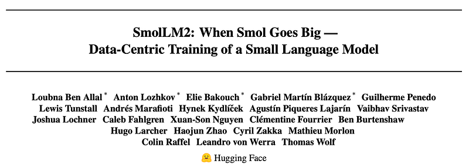
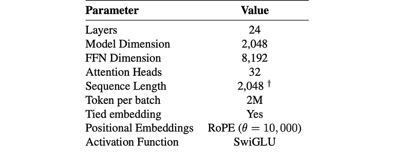
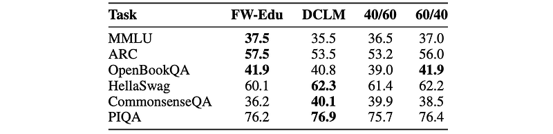
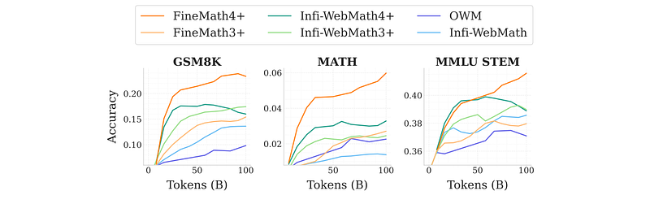
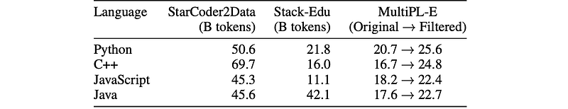
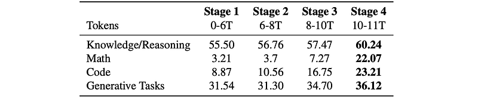
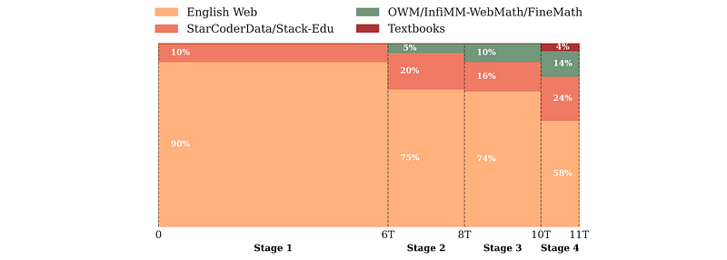
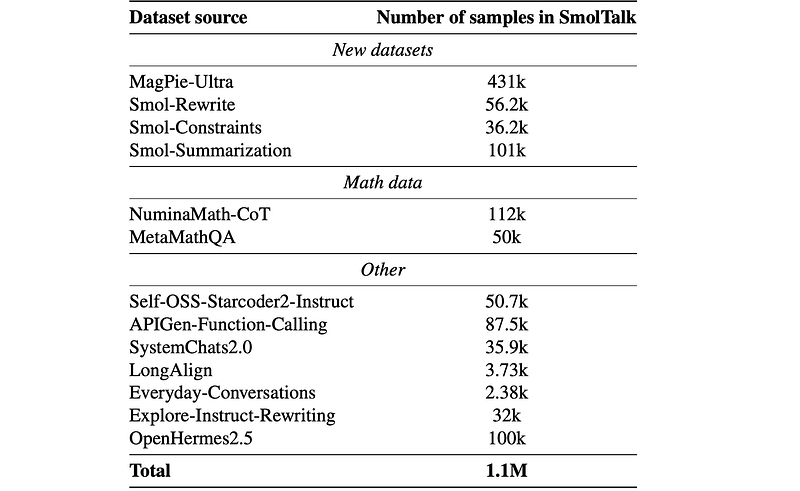
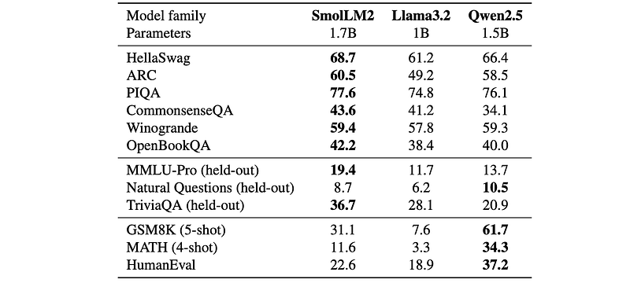
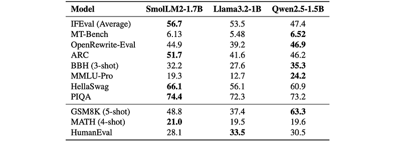

# Papers Explained 310 - SmolLM2

SmolLM2 is a 1.7B parameter language model overtrained on ~11 trillion tokens of data using a multi-stage training process that mixes web text with specialized math, code, and instruction-following data.

This page ingests the source article into the wiki and connects it to [[Papers Explained Corpus]], [[Synthetic Data]], [[Reasoning Models]], [[Large Language Models]], [[Code Models]], [[Evaluation and Benchmarks]].

## Source Metadata

- Source file: `raw/2025-02-14_Papers-Explained-310--SmolLM2-53991a485d7b.html`
- Source title: Papers Explained 310: SmolLM2
- Published: 2025-02-14
- Canonical: [https://medium.com/@ritvik19/papers-explained-310-smollm2-53991a485d7b](https://medium.com/@ritvik19/papers-explained-310-smollm2-53991a485d7b)

## Key Ideas

- The models and datasets are available on [HuggingFace](https://huggingface.co/collections/HuggingFaceTB/smollm2-6723884218bcda64b34d7db9).
- To compare English web datasets and find the best mixture for training models, 1.7B models are trained on each dataset under identical conditions with a sequence length of 2048.
- Math and code capabilities typically emerge only after extensive training. So, when evaluating math and code datasets, the annealing approach is followed on a mid-training checkpoint of SmolLM2 at 3T tokens, trained primarily on web data.
- For math, annealing is performed on a mixture of 60B tokens of the dataset under evaluation and 40B from the pre-checkpoint mixture.
- FineWeb-Edu consists of 1.3T tokens that are deemed “educational” by a classifier trained on annotations generated by Llama3–70B-Instruct.

## Notes

SmolLM2 is a 1.7B parameter language model overtrained on ~11 trillion tokens of data using a multi-stage training process that mixes web text with specialized math, code, and instruction-following data. Additionally, new specialized datasets (Fine-Math, Stack-Edu, and SmolTalk) are introduced at stages where existing datasets were found to be problematically small or low-quality.

The models and datasets are available on [HuggingFace](https://huggingface.co/collections/HuggingFaceTB/smollm2-6723884218bcda64b34d7db9).

*Figure: Overview of the architecture of SmolLM2.*

## PreTraining Datasets

To compare English web datasets and find the best mixture for training models, 1.7B models are trained on each dataset under identical conditions with a sequence length of 2048. Each dataset ablation model is trained on 350B tokens randomly sampled from the full dataset.

Math and code capabilities typically emerge only after extensive training. So, when evaluating math and code datasets, the annealing approach is followed on a mid-training checkpoint of SmolLM2 at 3T tokens, trained primarily on web data.

For math, annealing is performed on a mixture of 60B tokens of the dataset under evaluation and 40B from the pre-checkpoint mixture. For code ablations, annealing is performed on 200B tokens, uniformly distributed across 15 of the most commonly used programming languages (~14B tokens each).

### English web data

*Figure: Evaluation of models trained on FineWeb-Edu and DCLM for 350B tokens.*

FineWeb-Edu consists of 1.3T tokens that are deemed “educational” by a classifier trained on annotations generated by Llama3–70B-Instruct. DCLM comprises 3.8T tokens filtered using a fastText classifier trained on instruction-following data from OpenHermes 2.5 and high-scoring posts from the r/ExplainLikeImFive (ELI5) subreddit.

FineWeb-Edu achieves higher scores on the educational benchmarks MMLU, ARC, and OpenBookQA, while DCLM performs better on HellaSwag and Common-senseQA. These results align with the datasets’ content: FineWeb-Edu prioritizes educational material, while DCLM captures more diverse, conversational styles.

Given the complementary strengths of FineWeb-Edu and DCLM, a 60% FineWeb-Edu and 40% DCLM mix is explored and found to work well, Combining these datasets yields 5.1T tokens of (English) text.

### Math data

OpenWebMath (OWM) consists of 12B tokens, built by filtering math-specific content from Common Crawl and using a specialized text extraction pipeline to preserve mathematical formatting and equations. InfiMM-WebMath contains 40B text tokens. InfiMM-WebMath achieves a peak accuracy of 14% on GSM8K compared to OWM’s 10%, while OWM slightly outperforms InfiMM-WebMath on MATH. Further analysis highlighted two key limitations: insufficient dataset sizes, and insufficient focus on step-by-step mathematical reasoning, along with an overrepresentation of academic papers that focus on advanced concepts.

Hence, FineMath, a collection of up to 54B tokens of math data focusing on mathematical deduction and reasoning through classifier-based filtering, is created.

*Figure: . Performance of models trained on different subsets of FineMath and other math datasets.*

Text is extracted from Common Crawl WARC files, focusing on all 5.8B unique URLs from the FineWeb dataset. The FineWeb-Edu filtering approach is employed, using Llama-3.1–70B-Instruct with a prompt that scores content on a 3-point scale, where 1 indicates some mathematical content and 3 indicates step-by-step problem solutions at an appropriate level. After training a classifier on these silver labels, domains containing at least 10 pages with a quality score of 2 or higher are identified. Domain coverage is expanded by including domains with at least 10 URLs from either OWM or InfiMM-WebMath. From the Common Crawl index, a total of 7.7B URLs belonging to this list of domains are retrieved: 5.7B identified by the classifier, 0.6B from OWM, and 1.3B from InfiWebMath. All identified pages are re-extracted using the OWM pipeline, preserving LaTeX formatting and removing all-boilerplate pages, yielding 7.1B pages containing 6.5T tokens.

To retain only high-quality math content, a classifier trained on Llama-3.1–70B-Instruct annotations using a 5-point scale prompt specifically targeting pages with reasoning and middle- to high-school- level content is reapplied. After classification, deduplication is performed using single-band MinHash LSH with 10 hashes and fastText language classification is applied to retain only English content.

Multiple variants of FineMath are developed, including FineMath4+ (10B tokens, 6.7M documents) which retains only samples with scores of 4–5 and FineMath3+ (34B tokens, 21.4M documents) which includes scores 3–5. The same classifier is also applied to InfiMM-WebMath, creating Infi-WebMath4+ (8.5B tokens, 6.3M documents) and Infi-WebMath3+ (20.5B tokens, 13.9M documents).

### Code data

The Stack datasets are state-of-the-art open code datasets. These include Stack v1, ~3TB of source code from public GitHub repositories; StarCoderData, a filtered subset of 250B tokens across 80 programming languages; Stack v2, with ~32TB of data sourced from the Software Heritage code archive; and StarCoder2Data, the training corpus for StarCoder2 models with 900B tokens spanning more than 600 programming languages.

*Figure: Stack-Edu dataset statistics and MultiPL-E scores for the top 4 programming languages.*

A filtered variant of StarCoder2Data, called Stack-Edu, is constructed focusing on educational and well-documented code, selecting the 15 largest programming languages from StarCoder2Data. This subset has ~450 billion tokens. 15 language-specific classifiers are trained using the StarEncoder model on synthetic annotations generated by Llama3–70B-Instruct rating the educational quality on a scale from 0 to 5. A threshold of 3 is used based on qualitative analysis. The resulting Stack-Edu dataset contains ~125B tokens across its 15 languages.

## Pretraining

*Figure: Average model performance on different benchmark categories after each training stage.*

For building SmolLM2, 11 trillion tokens (approximately two epochs on collected datasets) are used for training, employing a multi-stage training approach instead of a fixed dataset mixture throughout pretraining. This design is guided by four key principles:

- Performance-driven interventions, where evaluation metrics on key benchmarks are monitored and dataset mixtures are adapted to address specific capability bottlenecks

- Upsampling high-quality math and code during the annealing phase, reserving datasets like FineMath and parts of Stack-Edu for the final stages to maximize their impact

- Strategic introduction of medium-sized datasets, such as OWM, InfiMM-WebMath, and Stack-Edu, mid-training to avoid dilution by larger datasets early on

- Avoiding excessive data repetition, staying close to the recommended 4–5 epoch threshold for most datasets.

*Figure: Dataset mixtures across training stages.*

### Stable phase: stage 1 (0 to 6T tokens)

Data Mixture:

- 60% FineWeb-Edu (educational web data)

- 40% DCLM (diverse, real-world Q&A-style web data)

- 10% StarCoder-Data (code data across 80 programming languages, limited to ~4 epochs)

- No math data included due to dataset size limitations.

Knowledge and reasoning performance is aligned with expectations from English web ablation studies. Poor coding and mathematics performance are observed.

### Stable phase: stage 2 (6T to 8T tokens)

Data Mixture:

- 75% English web data (maintained 60/40 FineWeb-Edu to DCLM ratio from Stage 1)

- 20% StarCoder-Data (increased proportion from Stage 1)

- 5% OWM (math data introduced at a low percentage)

Code performance improved across most languages. No significant impact on math performance from OWM integration. Above-random (>25%) MMLU accuracy with multiple-choice formulation (MCF) observed, suggesting acquisition of abilities typically associated with larger models.

Further ablation studies showed increasing DCLM relative to FineWeb-Edu slightly improved MMLU MCF.

### Stable phase: stage 3 (8T to 10T tokens)

Data Mixture:

- English web data with adjusted FineWeb-Edu to DCLM ratio of 40/60.

- ~10% Math data (OWM and the text-only English portion of InfiMM-WebMath)

- Code data switched from StarCoderData to Stack-Edu. StarCoder2Data subsets used for languages with <4B tokens in Stack-Edu (TypeScript, Shell, Swift, Go, Rust, and Ruby).

- Jupyter Notebooks from StarCoder2 added for contextual code examples.

Improvements across multiple benchmarks are observed. Noticeable loss spike occurred, cause undetermined, but most evaluation metrics recovered.

### Decay phase: stage 4 (10T to 11T tokens)

Data Mixture:

- 58% English web data (maintained higher DCLM to FineWeb-Edu ratio)

- 24% Stack-Edu (expanded to include additional programming languages)

- 14% Math data (InfiWebMath-3+, FineMath 4+, 0.08% OWM, and 0.02% AugGSM8K)

- 4% Cosmopedia v2 (high-quality synthetic text data)

Improvements across all benchmark tasks. Substantial gains in coding and math performance.

### Context Length extension (Post 10T tokens, before final 75B tokens of Stage 4)

Took an intermediate checkpoint from Stage 4 (before the final 75 billion tokens) and continued training. Extended context length from 2k to 8k tokens. Used a RoPE value of 130k.

Data Mixture:

- 40% Long-context documents (8k tokens or more) from DCLM (10%), FineWeb-Edu (10%), and Dolma’s books subset (20%).

- 60% Maintained the Stage 4 mixture.

This step produced the final SmolLM2 base model.

## Post-training

For post-training, existing datasets are leveraged in addition to a new instruction tuning dataset called SmolTalk.

### SmolTalk

SmolTalk is a new instruction-following dataset that carefully combines selected existing datasets with new synthetic datasets. The dataset includes the Magpie-Ultra conversational dataset as well as other specialized datasets that address specific capabilities like Smol-Constraint, Smol-Rewrite, and Smol-Summarization. All datasets were generated using Distilabel.

Conversational Data

MagPie-Ultra: A multi-turn conversational dataset is created using a two-step prompting method.

- Llama-3.1–405B-Instruct-FP8 is used with specific system prompts to generate 1M samples of three-turn conversations.

- The dataset is filtered using smaller Llama models (Llama-3.1–8B-Instruct and Llama-Guard-3–8B) for quality and safety.

- ArmoRM is used to score conversations for quality-based filtering.

- gte-large-en-v1.5 is used to deduplicate semantically similar conversations.

Task Specific Data

Smol-Constraint: 36k instructions with detailed constraints are generated.

- 550k instructions and responses are generated using Qwen2.5–72B-Instruct with a targeted system prompt.

- Generated instructions with conflicting constraints or incorrect responses are filtered out, resulting in 56.3k instruction-response pairs.

- These pairs are decontaminated against IFEval (10 n-gram overlap), yielding 36k pairs.

Smol-Summarization and Smol-Rewrite:

- High-quality source texts (emails, tweets, LinkedIn posts, and notes) are synthesized using PersonaHub and personas from the FinePersonas dataset.

- Qwen2.5–72B-Instruct is prompted with specific system prompts and persona descriptions to generate diverse content.

- Qwen2.5–72B-Instruct is then prompted to summarize and rewrite the given texts, resulting in approximately 1M summaries and 600k rewritten texts.

Math Data

- Public math instruction datasets are evaluated by fine-tuning on mixtures with 80% general instruction data (MagPie Ultra + Smol-Constraint, Smol-Rewrite, Smol-Summarization) and 20% math data.

- NuminaMath-CoT and Meta-MathQA are incorporated into SmolTalk based on their performance on MATH, MT-Bench, and GSM8K.

Other Specialised Data

- Code Generation: Self-OSS-Starcoder2-Instruct (50k high-quality Python instruction-response pairs) is used.

- System Prompts: 30k randomly selected samples from SystemChats2.0 are included.

- Function Calling: 80k samples from APIGen-Function-Calling are added.

- Long-Context Tasks: An English subset of LongAlign (3.7k samples with 8k–16k tokens) is incorporated.

- Knowledge and Everyday Conversations: 100k randomly selected OpenHermes2.5 samples are added.

- Rewriting: Explore-Instruct is used for rewriting.

### Supervised fine-tuning (SFT)

*Figure: Composition of the SmolTalk dataset.*

Supervised fine-tuning of the base SmolLM2 is performed on SmolTalk for 2 epochs, using a sequence length of 8192.

### Alignment

For preference learning, Direct Preference Optimization (DPO) is used. Experiments are conducted with various public synthetic feedback datasets including UltraFeedback, UltraInteract, Capybara, and ORCA. UltraFeedback proved the most consistently effective across benchmarks, improving MT-Bench, MMLU-Pro, and MATH. Training occurred for 2 epochs. After this final stage of DPO training, the instruct SmolLM2 model was obtained.

## Evaluation

### Base model evaluation

*Figure: Performance comparison of SmolLM2 and other 1–2B base models across benchmarks.*

- SmolLM2 outperforms Qwen2.5 base model on HellaSwag and ARC, and Llama3.2–1B on GSM8K, MATH, and HumanEval. It also demonstrates strong performance on held-out benchmarks like MMLU-Pro, TriviaQA, and NQ. Specifically, it surpasses Qwen2.5–1.5B by almost 6 percentage points on MMLU-Pro.

- SmolLM2 shows competitive performance on math and coding benchmarks. While slightly behind Qwen2.5–1.5B in some areas, it generally performs well.

- Context Length Extension did not significantly degrade performance.

- Strong performance on HELMET and Needle in the Haystack (NIAH) benchmarks.

### Instruct Model Evaluation

*Figure: Comparison of 1–2B instruction-tuned models across benchmarks.*

- SmolLM2- Instruct shows strong instruction following capabilities, strongly outperforming Qwen2.5–1.5B-Instruct on IFEval

- The model is competitive on MT-Bench and OpenRewrite- Eval for text rewriting, and demonstrates strong mathematical capabilities as evidenced by the GSM8K and MATH scores.

## SmolLM2 135M and 360M

In addition to SmolLM2–1.7B, two smaller models are trained: SmolLM2–360M (360M parameters, trained on 4T tokens) and SmolLM2–135M (135M parameters, trained on 2T tokens).

Given their smaller capacity and reduced training cost, data ablations are re-run at the target training length to determine the most effective data mixture. Filtering DCLM with the FineWeb-Edu classifier, removing samples with score 0, and downsampling those with scores 1 and 2 worked best.

Unlike SmolLM2–1.7B, where a multi-stage training strategy was leveraged, these smaller models benefited from a single-stage training approach with consistently high-quality data. Stack-Edu is incorporated from the start, alongside InfiMM-WebMath, FineMath, and Cosmopedia.

These models share the same architecture as SmolLM2–1.7B but use Grouped Query Attention (GQA). For post-training, SFT is applied using a filtered version of SmolTalk3, removing complex instruction-following tasks (e.g., function calling) and hard examples from MagPie-Ultra to better align with the models’ capacity.

Finally, DPO training is performed using UltraFeedback, optimizing the models for instruction-following while preserving coherence and helpfulness.

## Paper

SmolLM2: When Smol Goes Big — Data-Centric Training of a Small Language Model [2502.02737](https://arxiv.org/abs/2502.02737)

## Figures

Figures from the Medium HTML export (`raw/2025-02-14_Papers-Explained-310--SmolLM2-53991a485d7b.html`); local copies under `wiki/assets/papers-explained-310-smollm2/` when download succeeded.

| Figure | Caption |
|--------|---------|
|  | Title card: SmolLM2. |
|  | Overview of the architecture of SmolLM2. |
|  | Evaluation of models trained on FineWeb-Edu and DCLM for 350B tokens. |
|  | Performance of models trained on different subsets of FineMath and other math datasets. |
|  | Stack-Edu dataset statistics and MultiPL-E scores for the top 4 programming languages. |
|  | Average model performance on different benchmark categories after each training stage. |
|  | Dataset mixtures across training stages. |
|  | Composition of the SmolTalk dataset. |
|  | Performance comparison of SmolLM2 and other 1–2B base models across benchmarks. |
|  | Comparison of 1–2B instruction-tuned models across benchmarks. |
## Related

- [[Papers Explained Corpus]]
- [[Synthetic Data]]
- [[Reasoning Models]]
- [[Large Language Models]]
- [[Code Models]]
- [[Evaluation and Benchmarks]]
- [[Papers Explained - AceCoder]]
- [[Papers Explained - SelfCite]]

#summary #topic
