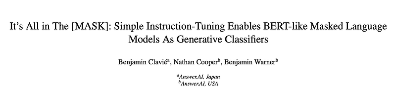
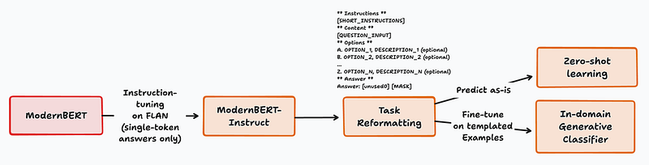
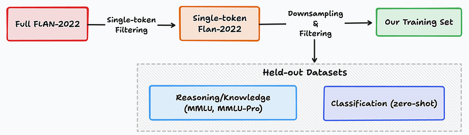
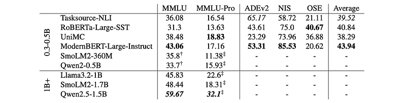
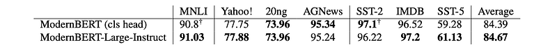

# Papers Explained 312 - It’s All in The MASK

This paper introduces ModernBERT-Large-Instruct, a 0.4B-parameter encoder model that leverages its masked language modeling (MLM) head for generative classification. This model exhibits strong zero-shot performance on both classification and knowledge-based tasks, outperforming similarly sized LLMs on MMLU.

This page ingests the source article into the wiki and connects it to [[Papers Explained Corpus]], [[Large Language Models]], [[Evaluation and Benchmarks]], [[Embedding and Retrieval]].

## Source Metadata

- Source file: `raw/2025-02-18_Papers-Explained-312--It-s-All-in-The--MASK--8c010744924e.html`
- Source title: Papers Explained 312: It’s All in The [MASK]
- Published: 2025-02-18
- Canonical: [https://medium.com/@ritvik19/papers-explained-312-its-all-in-the-mask-8c010744924e](https://medium.com/@ritvik19/papers-explained-312-its-all-in-the-mask-8c010744924e)

## Key Ideas

- This paper introduces ModernBERT-Large-Instruct, a 0.4B-parameter encoder model that leverages its masked language modeling (MLM) head for generative classification.
- ModernBERT is chosen because it is an 8k context-length model using a modernized architecture and trained on a large-scale, modern data mix.
- In order to leverage the Masked Language Modeling head for various tasks At training time, our goal is to maximize the number of template variations seen, while at inference time we use simple templates that require minimal modification for new tasks.
- A single templating step is applied to all training examples. The [MASK] token, representing the expected answer, is prepended with a previously untrained token that serves as an anchor, indicating that the following token is the model’s final prediction.
- MMLU: ModernBERT-Large-Instruct outperforms similarly sized encoder and decoder models, achieving performance closer to models four times its size.

## Notes

This paper introduces ModernBERT-Large-Instruct, a 0.4B-parameter encoder model that leverages its masked language modeling (MLM) head for generative classification. This model exhibits strong zero-shot performance on both classification and knowledge-based tasks, outperforming similarly sized LLMs on MMLU. When fine-tuned, the generative approach using the MLM head matches or even surpasses traditional classification-head methods across diverse NLU tasks.

## Method

*Figure: High level overview of the process.*

ModernBERT is chosen because it is an 8k context-length model using a modernized architecture and trained on a large-scale, modern data mix.

The aim of this work is to functionally instruct-tune the Masked Language Modeling head of an MLM model to use its generative capabilities to perform a wide array of downstream tasks, in a way similar to sequence-to-sequence models. An immediate limitation of this method is that, unlike causal language modeling, masked language modeling generates its outputs in a single forward pass — replacing all [MASK] tokens simultaneously. Consequently, the data must be formatted so that the model is expected to predict only a single token for a given task.

Hence, A simple variant, inspired by large language models’ instruction tuning pipeline, is proposed: answer token prediction. This objective is a very simple tweak to the normal MLM objective. Rather than masking multiple tokens throughout the input text, a single token, which is the verbalizer for a label or answer, is masked. This can be considered a restricted form of sequence-to-sequence learning, akin to the way generative models such as LLMs perform tasks. Effectively, this means that all tasks are reframed in the format of a Cloze question, where the input is formatted so answering the question requires generating a single verbalizer token.

## Training Data

*Figure: High level overview of our data processing pipeline.*

Since MLM models are not pretrained in a generative fashion but rather to fill all [MASK] tokens, adding multiple [MASK] tokens could bias the model to consistently predict the longest possible answer. This led to the reformulation of the instruction tuning data and downstream tasks to require a single [MASK] token response. This severely constrains the data selection process, as many of the newer instruction-tuning sets are explicitly constructed to train helpful instruct-tuned assistants. The expected model outputs are noticeably longer than a single token. As a result, many of the most popular instruction-tuning datasets are not suitable for this exploratory work, as they would require considerable pre-processing to be usable.

Older instruction-tuning datasets which predate the spread of assistant-style models ushered in by ChatGPT, such as the FLAN-2022 collection, contain a large proportion of examples where the expected model answer is a single token. This multi-task fine-tuning data has previously been shown to allow sequence-to-sequence models to achieve improved downstream performance across all tasks, including previously unseen tasks. The FLAN collection, in total, contains 396 million examples, of which 120 million are single-token answers. However, a large proportion of those examples come from just a handful of large datasets. The traditional approach to training on FLAN involves downsampling the data to cap the number of examples from a single dataset. The FLAN authors originally filtered MMLU and BBH from the data, to serve as held-out test sets. We follow their example and additionally filter out certain classification datasets which we use as downstream evaluation tasks.

### Templating

In order to leverage the Masked Language Modeling head for various tasks At training time, our goal is to maximize the number of template variations seen, while at inference time we use simple templates that require minimal modification for new tasks.

A single templating step is applied to all training examples. The [MASK] token, representing the expected answer, is prepended with a previously untrained token that serves as an anchor, indicating that the following token is the model’s final prediction. This is inspired by the use of prefix tokens in the neural information retrieval literature to help the model distinguish between queries and corpus documents.

## Evaluation

### Zero-Shot Performance

*Figure: Result for the models across the zero-shot tasks.*

- MMLU: ModernBERT-Large-Instruct outperforms similarly sized encoder and decoder models, achieving performance closer to models four times its size.

- MMLU-Pro: ModernBERT-Large-Instruct performs well but is second to UniMC among sub-1B models. UniMC’s custom attention masks are hypothesized to contribute to its superior performance on this benchmark. This supports the hypothesis that encoder-only models with MLM heads are well-suited for zero-shot tasks.

- Classification: ModernBERT-Large-Instruct excels on ADEv2 and NIS but lags on OSE. UniMC and Self-Supervised-Tuned RoBERTa perform better on OSE, likely due to their specialized mechanisms (generative head with custom attention masks and next-sentence prediction, respectively).

- Overall: ModernBERT-Large-Instruct demonstrates strong average zero-shot performance but has specific weaknesses. Different encoder-based methods exhibit varying strengths across datasets. The results suggest the potential of “non-traditional” classification heads for zero-shot tasks with encoder models and warrant further research into combining these methods.

### Full-Finetune: Can One Head Do It All?

*Figure: Results comparing the proposed approach with a traditional classification head when fully fine-tuned on downstream NLU tasks.*

- ModernBERT-Large-Instruct generally outperforms ModernBERT-Large with a classification head on average across the tasks.

- Both models perform comparably on individual tasks, with each showing slight advantages on certain datasets.

- ModernBERT-Large-Instruct performs better on more complex tasks like SST-5 (fine-grained sentiment classification) and MNLI (textual entailment) compared to simpler tasks like SST-2 (binary sentiment classification) where the traditional classification head performs better.

- The results suggest the strong potential of MLM-head based downstream tasks compared to traditional classification-head approaches, especially with further optimization.

### Are Older Encoders Also Generative Classifiers?

*Figure: Downstream results of using different backbone with the same instruction-tuning process.*

- RoBERTa-Large performed poorly in all zero-shot contexts using the MLM head, despite having a similar parameter count to ModernBERT and being competitive in traditional classification tasks.

- GTE-en-MLM-Large performed better than RoBERTa-Large in most zero-shot tasks but still significantly worse than ModernBERT-Large-Instruct.

- The strong generalization potential of ModernBERT’s MLM head is likely due to its large-scale, varied pre-training data, with architecture playing a secondary role.

## Paper

It’s All in The [MASK]: Simple Instruction-Tuning Enables BERT-like Masked Language Models As Generative Classifiers [2502.03793](https://arxiv.org/abs/2502.03793)

## Figures

Figures from the Medium HTML export (`raw/2025-02-18_Papers-Explained-312--It-s-All-in-The--MASK--8c010744924e.html`); local copies under `wiki/assets/papers-explained-312-it-s-all-in-the-mask/` when download succeeded.

| Figure | Caption |
|--------|---------|
|  | Title card: It’s All in The MASK. |
|  | High level overview of the process. |
|  | High level overview of our data processing pipeline. |
|  | Result for the models across the zero-shot tasks. |
|  | Results comparing the proposed approach with a traditional classification head when fully fine-tuned on downstream NLU tasks. |
|  | Downstream results of using different backbone with the same instruction-tuning process. |
## Related

- [[Papers Explained Corpus]]
- [[Large Language Models]]
- [[Evaluation and Benchmarks]]
- [[Embedding and Retrieval]]
- [[Papers Explained - SelfCite]]
- [[Papers Explained 313 - Document Screenshot Embedding]]

#summary #topic
