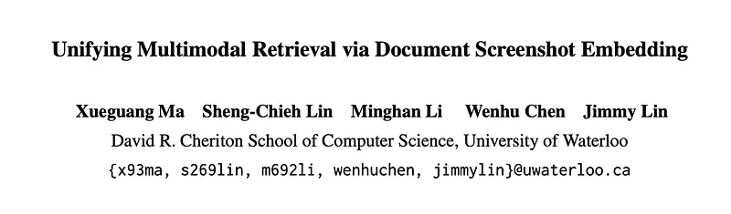
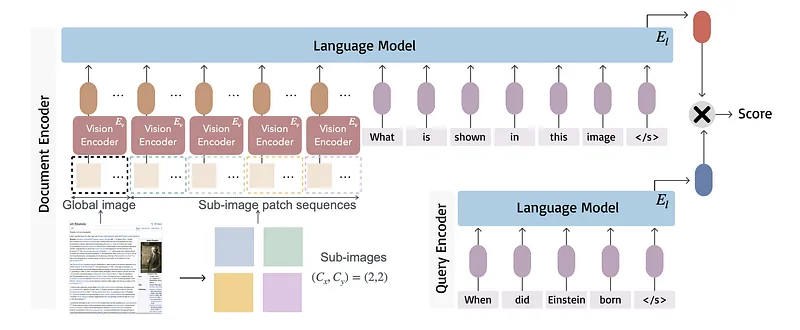
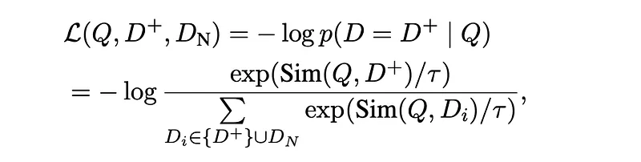
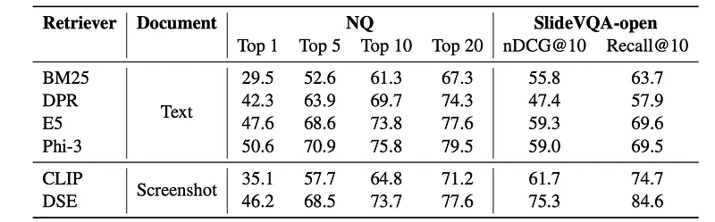
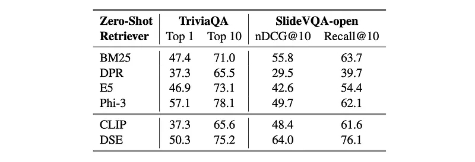
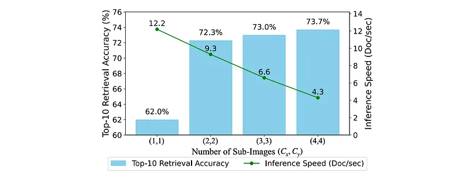

# Papers Explained 313 - Document Screenshot Embedding

Document Screenshot Embedding (DSE) is a novel retrieval paradigm that regards document screenshots as a unified input format. DSE does not require any content extraction preprocess and preserves all the information in a document (e.g., text, image and layout).

This page ingests the source article into the wiki and connects it to [[Papers Explained Corpus]], [[Document AI]], [[Embedding and Retrieval]], [[Large Language Models]], [[Vision Language Models]], [[Computer Vision]].

## Source Metadata

- Source file: `raw/2025-02-19_Papers-Explained-313--Document-Screenshot-Embedding-792cb286643c.md`
- Source title: Papers Explained 313: Document Screenshot Embedding
- Published: 2025-02-19
- Canonical: [https://medium.com/@ritvik19/papers-explained-313-document-screenshot-embedding-792cb286643c](https://medium.com/@ritvik19/papers-explained-313-document-screenshot-embedding-792cb286643c)

## Key Ideas

- Document Screenshot Embedding (DSE) is a novel retrieval paradigm that regards document screenshots as a unified input format.
- Given a query Q and a corpus C consisting of documents {D1,D2,…,Dn}, the task of document retrieval is to identify the k documents that are most relevant to the query Q, with k ≪ n. This relevance is determined using a similarity metric Sim(Q, D) ∈ R.
- A bi-encoder architecture is adopted, where a document screenshot and user text query are encoded into dense vectors using a vision and text encoder, respectively.
- Visual Encoder: The length of the sequence is determined by the image tokenizer of the vision encoder.
- For example, using clip-vit-large-patch14–336, a screenshot is converted to 336 x 336 pixels and divided into 24x24 patches (576 total), each 14x14 pixels. Each patch is flattened, mapped to a patch embedding, and then encoded into latent representations.

## Notes

Document Screenshot Embedding (DSE) is a novel retrieval paradigm that regards document screenshots as a unified input format. DSE does not require any content extraction preprocess and preserves all the information in a document (e.g., text, image and layout). DSE leverages a large vision-language model to directly encode document screenshots into dense representations for retrieval.

### Task Definition

Given a query Q and a corpus C consisting of documents {D1,D2,…,Dn}, the task of document retrieval is to identify the k documents that are most relevant to the query Q, with k ≪ n. This relevance is determined using a similarity metric Sim(Q, D) ∈ R.

## Document Screenshot Embedding

*Figure: Overview of DSE encoder architecture.*

A bi-encoder architecture is adopted, where a document screenshot and user text query are encoded into dense vectors using a vision and text encoder, respectively. While CLIP encoders could be used, the vision encoder is replaced with a large vision language model (Phi-3-vision) to capture more fine-grained information.

Visual Encoder: The length of the sequence is determined by the image tokenizer of the vision encoder.

For example, using clip-vit-large-patch14–336, a screenshot is converted to 336 x 336 pixels and divided into 24x24 patches (576 total), each 14x14 pixels. Each patch is flattened, mapped to a patch embedding, and then encoded into latent representations. However, 576 patches may not capture fine-grained textual information in screenshots with a lot of text.

Vision Language Model:

To address the above issue, a large vision language model, Phi-3-vision, is used.

Phi-3-vision uses the same image tokenizer but can represent an image with more patches by cropping it into sub-images.

A screenshot can be divided into (Cx * 24) x (Cy * 24) patches. The screenshot is converted to (Cx * 336) x (Cy * 336) pixels and cropped into Cx * Cy sub-images, each 336 x 336 pixels. Each sub-image is encoded into 576 patch latent representations independently. The whole screenshot is also converted to 336 x 336 pixels and encoded into an additional 576 patch latent representations to capture global information. This results in (Cx * Cy + 1) * 576 patch latent representations in total.

Every four patch latent representations are concatenated and projected into one embedding for language model inputs. This yields (Cx * Cy + 1) * 576 / 4 patch latent embeddings as input for the language model (El).

Increasing Cx and Cy helps capture more fine-grained information but reduces encoding efficiency.

The encoded patch latent embeddings are concatenated with a text prompt: “<s> What is shown in this image?</s>”. The  token is a placeholder replaced by the patch latent embeddings. The embedding of the end-of-sequence token </s> from the last hidden state is used as the document screenshot embedding

Contrastive Learning: The similarity between the query and the document is computed as the cosine similarity between their embeddings:

during training, the embedding model is optimized using the InfoNCE loss:

where D+ denotes the positive document. DN represents a set of negative documents that are irrelevant to the query Q, including hard negatives and in-batch negatives. τ is a temperature parameter set to 0.02 in experiments.

## Experiment Setup

### Web-Page Retrieval

A dataset called Wiki-SS is constructed using the Selenium Python toolkit to access English Wikipedia pages through URLs and automatically take screenshots. The screenshots are taken with a window size of 980 × 980 pixels to ensure adequate coverage of the core content. To make Wiki-SS more manageable for research purposes, the corpus is downsized by filtering out the web pages which are considered “easy negative samples” for all the questions in the train, dev and test sets from Natural Questions. Specifically, a BM25 search is performed for each question to retrieve the top 50 documents over the text corpus. The retrieved documents are pooled together as the final corpus. As a result, a collection of 1,267,874 Wikipedia screenshots is obtained for experiments.

To compare with text-based retrieval baselines, a text version Wikipedia collection is created which mirrors the collection of Wiki-SS. For each document in the text corpus, the first 500 words of each document are used, mirroring the corpus in Wiki-SS, where each screenshot covers only the first-page content.

### Slide Retrieval

The original SlideVQA data is designed for document visual question answering. To support the evaluation of document retrieval, SlideVQA is modified to an open-domain retrieval task. The task is to retrieve k most relevant slides from the entire pool of slide images. A corresponding text-based corpus is also created for comparison with text retrievers using the pytesseract OCR toolkit to extract text from every slide deck.

### Implementation Details

DSE is implemented with a model initialized using Phi-3-vision with 4 billion parameters. Memory-efficient techniques such as LoRA, FlashAttention, and Deep-Speed are employed to train the model. The model weights are shared between the language models for document screenshot and query encoding. (Cx,Cy) is set to (4,4) by default; that is, the document screenshots are resized to 1344 × 1344 pixels and cropped into 4 × 4 sub-images.

## Evaluation

### Supervised Retrieval Effectiveness

*Figure: Supervised retrieval effectiveness comparison.*

- DSE outperforms traditional text retrieval: DSE significantly outperformed BM25 on both webpage and slide retrieval tasks.

- DSE performs competitively with neural text retrieval: DSE achieved comparable performance to E5 and slightly lower performance than Phi-3 on web page retrieval.

- DSE effectively handles mixed-modality content: DSE significantly outperformed all text retrieval baselines on the slide retrieval task, which contains both text and visual content.

- DSE outperforms CLIP: DSE showed better performance than CLIP on both NQ and SlideVQA, suggesting the benefits of the large vision-language model encoder.

### Zero-Shot Retrieval Effectiveness

*Figure: Zero-shot retrieval effectiveness comparison.*

- DSE demonstrates reasonable zero-shot performance: DSE showed better zero-shot performance than BM25 on TriviaQA and significantly outperformed all other methods on SlideVQA in a zero-shot setting.

### Impacts of Patch Sequence Length

*Figure: Trade-off between effectiveness and efficiency of DSE with varying numbers of crops for input images.*

- Finer-grained patches improve retrieval effectiveness but reduce encoding speed: Increasing the number of crops (and thus patch sequence length) improved retrieval accuracy but decreased encoding speed.

- A moderate number of crops offers a good balance: Using 2x2 or 3x3 crops provides a good trade-off between effectiveness and efficiency.

## Paper

Unifying Multimodal Retrieval via Document Screenshot Embedding [2406.11251](https://arxiv.org/abs/2406.11251)

## Figures

Figures from the Medium HTML export (`raw/2025-02-19_Papers-Explained-313--Document-Screenshot-Embedding-792cb286643c.md`); local copies under `wiki/assets/papers-explained-313-document-screenshot-embedding/` when download succeeded.

| Figure | Caption |
|--------|---------|
|  | Title card: Document Screenshot Embedding. |
|  | Overview of DSE encoder architecture. |
|  | Contrastive Learning: The similarity between the query and the document is computed as the cosine similarity between their embeddings. |
|  | Contrastive Learning: The similarity between the query and the document is computed as the cosine similarity between their embeddings. |
|  | during training, the embedding model is optimized using the InfoNCE loss. |
|  | Supervised retrieval effectiveness comparison. |
|  | Zero-shot retrieval effectiveness comparison. |
|  | Trade-off between effectiveness and efficiency of DSE with varying numbers of crops for input images. |
## Related

- [[Papers Explained Corpus]]
- [[Document AI]]
- [[Embedding and Retrieval]]
- [[Large Language Models]]
- [[Vision Language Models]]
- [[Computer Vision]]
- [[Papers Explained 312 - It’s All in The MASK]]
- [[Papers Explained 314 - vdr Embeddings]]

#summary #topic
