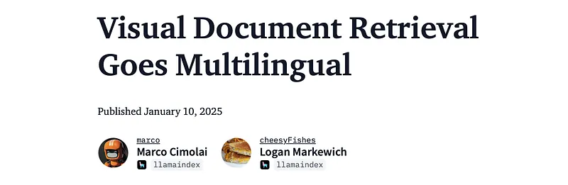
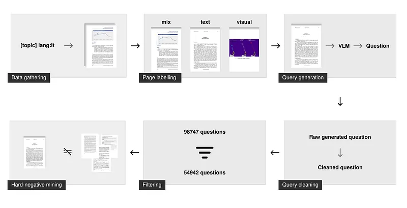
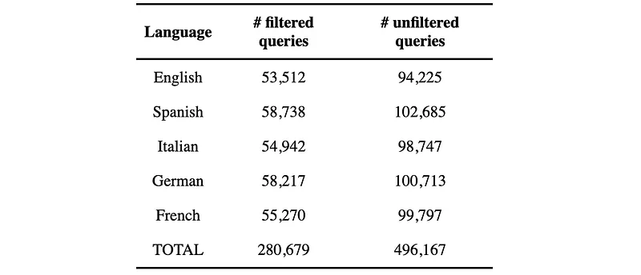
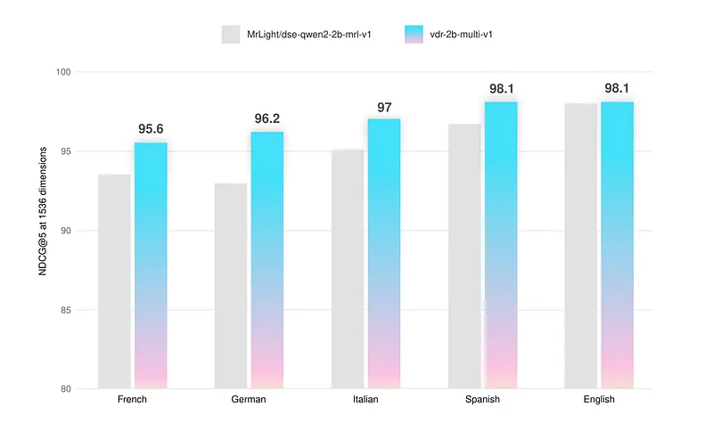
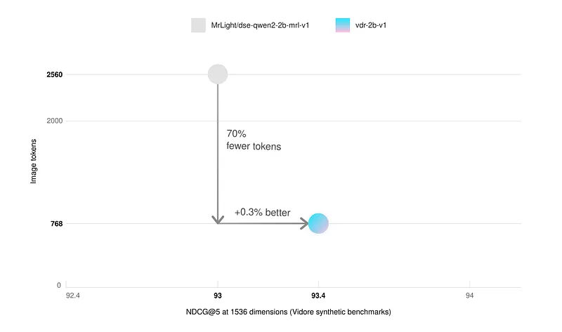
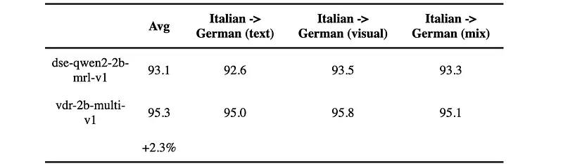
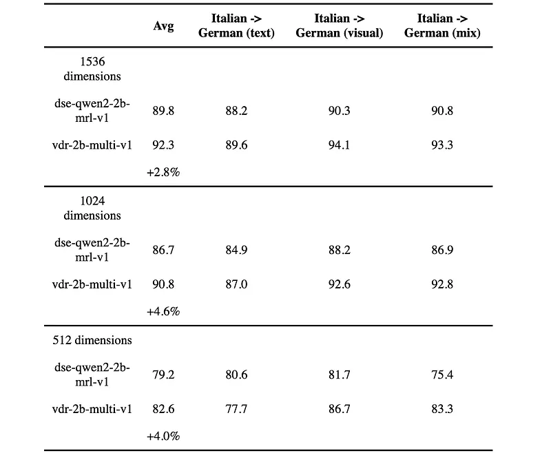

# Papers Explained 314 - vdr Embeddings

The models and datasets are available at [HuggingFace](https://huggingface.co/collections/llamaindex/visual-document-retrieval-678151d19d2758f78ce910e1).

This page ingests the source article into the wiki and connects it to [[Papers Explained Corpus]], [[Document AI]], [[Embedding and Retrieval]], [[Agentic AI]], [[Synthetic Data]], [[Large Language Models]].

## Source Metadata

- Source file: `raw/2025-02-20_Papers-Explained-314--vdr-Embeddings-1482b79e12a4.md`
- Source title: Papers Explained 314: vdr Embeddings
- Published: 2025-02-20
- Canonical: [https://medium.com/@ritvik19/papers-explained-314-vdr-embeddings-1482b79e12a4](https://medium.com/@ritvik19/papers-explained-314-vdr-embeddings-1482b79e12a4)

## Key Ideas

- The vdr-2b-multi-v1 and vdr-2b-v1 models are based on the MrLight/dse-qwen2–2b-mrl-v1 architecture. This architecture is a transformer-based model that is fine-tuned for visual document retrieval tasks.
- The models are trained on a large, custom-built dataset of query-image pairs. The dataset is designed to be high-quality and diverse, covering a wide range of topics and document types.
- Multilingual Search: For each language (Italian, Spanish, English, French, and German), a list of search queries covering various topics is generated. These queries are used to search for PDFs using language-specific filtering capabilities of search engines.
- Document Layout Analysis: Each page of the scraped PDFs is analyzed using a document layout analysis model to determine whether the page contained more textual or visual elements. Pages were classified as text-only, visual-only, or mixed.
- Balanced Sampling: Approximately 100k pages are sampled, ensuring an even distribution across the three page types (text-only, visual-only, and mixed).

## Notes

vdr embeddings are dense, single-vector representations of document page screenshots. These embeddings are designed to capture the visual and textual content of a document page, allowing for efficient search and retrieval of visually rich documents without relying on Optical Character Recognition (OCR) or complex data extraction pipelines. The key advantage of VDR embeddings is their ability to perform semantic search directly on document images, enabling users to query documents based on their content and visual layout, regardless of the language.

The models and datasets are available at [HuggingFace](https://huggingface.co/collections/llamaindex/visual-document-retrieval-678151d19d2758f78ce910e1).

## Architecture

The vdr-2b-multi-v1 and vdr-2b-v1 models are based on the MrLight/dse-qwen2–2b-mrl-v1 architecture. This architecture is a transformer-based model that is fine-tuned for visual document retrieval tasks. The models take document page screenshots as input and output a fixed-size vector representation.

## Training Data

The models are trained on a large, custom-built dataset of query-image pairs. The dataset is designed to be high-quality and diverse, covering a wide range of topics and document types.

## Data Gathering

- Multilingual Search: For each language (Italian, Spanish, English, French, and German), a list of search queries covering various topics is generated. These queries are used to search for PDFs using language-specific filtering capabilities of search engines.

- Document Layout Analysis: Each page of the scraped PDFs is analyzed using a document layout analysis model to determine whether the page contained more textual or visual elements. Pages were classified as text-only, visual-only, or mixed.

- Balanced Sampling: Approximately 100k pages are sampled, ensuring an even distribution across the three page types (text-only, visual-only, and mixed).

## Synthetic Generation

- Query Generation: Queries are generated using Gemini-1.5-Pro and Qwen2-VL-72B. The models are tasked to generate both specific and general questions related to the document page. Only the specific questions were used for training.

- Query Cleaning: The generated queries are cleaned to ensure they are suitable for training. This included:

- Ensuring the language is correct.

- Fixing formatting problems.

- Removing markdown.

- Ensuring only one question was posed.

- Removing grounding phrases.

## Filtering and Hard-Negative Mining

- Query Filtering: To filter out bad questions, each broad query is embedded and indexed using the voyage-3 embedding model. For each specific question, the index is searched. A query is marked as ‘good’ if its associated broad question appeared in the top 100 results.

- Hard-Negative Mining: Hard negatives are mined using voyage-3 on specific questions with a fixed threshold of 0.75.

## Dataset Statistics

The training dataset, vdr-multilingual-train, consists of 496,167 PDF pages, with 280,679 associated with filtered queries. The dataset is divided into five language subsets:

## Training Methodology

The models are trained using the DSE (Document Similarity Embedding) approach. Hard-mined negatives are used during training to improve the model’s ability to distinguish between similar documents.

Matryoshka Representation Learning (MRL): The loss function is calibrated to track performance across all dimensions, leading the model to frontload the most important identifying information. This allows for shrinking the embedding dimensions according to scale and budget.

## Evaluation

The models are evaluated using the ViDoRe benchmark.

- The multilingual model outperforms the base model in every language and every page type, on average by +2.3%. On the ViDoRe benchmark, it also performs slightly better (+0.5%).

- The fine-tuned vdr-2b-multi-v1 makes big leaps in performance, especially in non-English visual-only or mixed pages. For example the +6.33% NDCG@5 improvement for German visual-only retrieval over the base model.

### Faster Inference

- The English-only vdr-2b-v1 model also matches the performance of the base model on the ViDoRe benchmark synthetic datasets, while only using 30% of the image tokens (768 vs. 2560).

### Cross-Lingual Retrieval

- The model is significantly better across all document types, with an average improvement of +2.3%.

- These retrieval capabilities are essential for real-world use cases, especially in linguistically fragmented continents such as Europe.

### MRL and Binary Embeddings

*Figure: NDCG@5 (float).*

*Figure: NDCG@5 (binary).*

- 1024 dimension float vectors offer a very good balance between quality and size. They are ~30% smaller but still retain 99% of the retrieval performance.

- This is also true for the 1536 dimensions binary vectors, which have 10x fewer bytes per vector but still retain 97% of their retrieval quality.

- It’s also interesting to see that 1536 binary vectors almost match the performance of the base model 1536 float vectors.

## Paper

[Visual Document Retrieval Goes Multilingual](https://huggingface.co/blog/vdr-2b-multilingual)

## Figures

Figures from the Medium HTML export (`raw/2025-02-20_Papers-Explained-314--vdr-Embeddings-1482b79e12a4.md`); local copies under `wiki/assets/papers-explained-314-vdr-embeddings/` when download succeeded.

| Figure | Caption |
|--------|---------|
|  | Title card: vdr Embeddings. |
|  | The vdr-2b-multi-v1 and vdr-2b-v1 models are based on the MrLight/dse-qwen2–2b-mrl-v1 architecture. |
|  | The training dataset, vdr-multilingual-train, consists of 496,167 PDF pages, with 280,679 associated with filtered queries. |
|  | The models are evaluated using the ViDoRe benchmark. |
|  | The models are evaluated using the ViDoRe benchmark. |
|  | The models are evaluated using the ViDoRe benchmark. |
|  | NDCG@5 (float). |
|  | NDCG@5 (binary). |
## Related

- [[Papers Explained Corpus]]
- [[Document AI]]
- [[Embedding and Retrieval]]
- [[Agentic AI]]
- [[Synthetic Data]]
- [[Large Language Models]]
- [[Papers Explained 313 - Document Screenshot Embedding]]
- [[Papers Explained 315 - mmE5]]

#summary #topic
