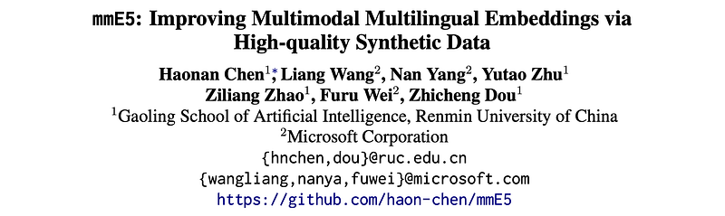
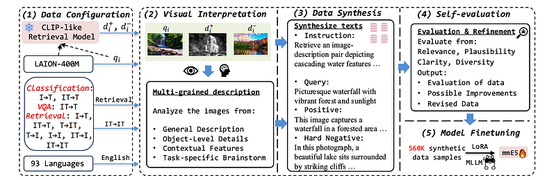
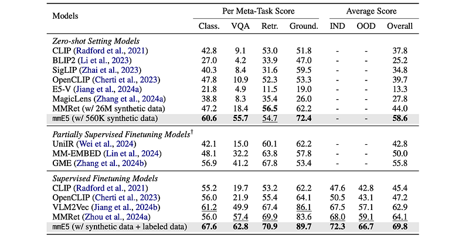
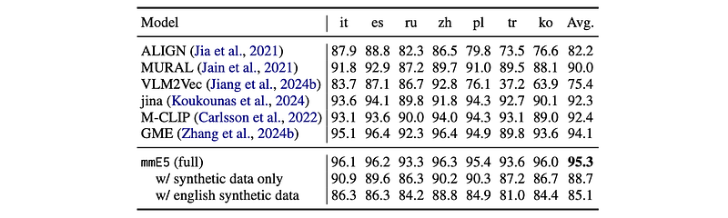
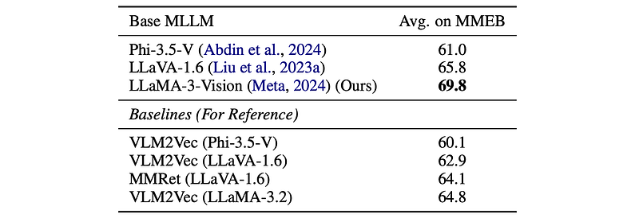

# Papers Explained 315 - mmE5

broad scope ensures that the generated data covers diverse tasks and modalities, making it applicable to various downstream scenarios.

This page ingests the source article into the wiki and connects it to [[Papers Explained Corpus]], [[Synthetic Data]], [[Large Language Models]], [[Vision Language Models]], [[Evaluation and Benchmarks]], [[Safety and Alignment]].

## Source Metadata

- Source file: `raw/2025-02-21_Papers-Explained-315--mmE5-3839eed789fe.html`
- Source title: Papers Explained 315: mmE5
- Published: 2025-02-21
- Canonical: [https://medium.com/@ritvik19/papers-explained-315-mme5-3839eed789fe](https://medium.com/@ritvik19/papers-explained-315-mme5-3839eed789fe)

## Key Ideas

- This work identifies three criteria for high- quality synthetic multimodal data.
- robust cross-modal alignment makes different modalities semantically consistent.
- high fidelity ensures that the synthetic data maintains realistic details to enhance its reliability.
- Guided by these principles, datasets are synthesized that:
- cover a wide range of tasks, modality combinations, and languages

## Notes

This work identifies three criteria for high- quality synthetic multimodal data.

- broad scope ensures that the generated data covers diverse tasks and modalities, making it applicable to various downstream scenarios.

- robust cross-modal alignment makes different modalities semantically consistent.

- high fidelity ensures that the synthetic data maintains realistic details to enhance its reliability.

Guided by these principles, datasets are synthesized that:

- cover a wide range of tasks, modality combinations, and languages

- are generated via a deep thinking process within a single pass of a multimodal large language model

- incorporate real-world images with accurate and relevant texts, ensuring fidelity through self-evaluation and refinement.

Leveraging these high-quality synthetic and labeled datasets, a multimodal multilingual E5 model mmE5 is trained.

The project is available at [GitHub](https://github.com/haon-chen/mmE5).

## Methodology: mmE5

The method consists of five stages.

- Initially, for each data sample to be synthesized, the specifics of the task, modality combination, language, and input images are configured.

- An MLLM is employed to generate multi-grained descriptions for the input images, ensuring that the synthesized texts are well-aligned with the images.

- Utilizing this MLLM, text data is synthesized based on both the images and their descriptions.

- The MLLM then evaluates its synthesized data from multiple perspectives, offering revised data to enhance cross-modal alignment and fidelity.

- Finally, the synthesized texts and images are used to finetune an MLLM specifically for embedding tasks.

To minimize potential information loss, stages (2), (3), and (4) are executed within a single pass of the MLLM.

Each data sample is a quadruple of (task instruction, query, positive document, hard negative document), denoted as (t, q, d+, d−). For each data piece, images are first sampled from the LAION-400M image corpus as the query image, positive image, and hard negative image (qi, d+i , d−i ). With these three images as input, an MLLM πθ can synthesize a multimodal embedding data sample y=(t,qt,d+t,d−t). As a result, the synthetic data can have a maximum of seven elements: {t, (qt, qi), (d+t , d+i), (d−t , d−i )}.

## Data Synthesis Framework

The data covers three key multimodal embedding tasks: classification, VQA, and retrieval. Data is synthesized of modality types included in the MMEB benchmark, which can cover most scenarios.

- Image: First, a query image is sampled from the corpus (qi ∈ I). Then, for the modality types involving images on the document side (e.g., IT→IT), a small embedding model, jina-clip-v2, is used to retrieve a similar positive image d+i and a hard negative image d−i efficiently.

- Language: To synthesize multilingual data, languages are sampled from the language list of XLM-R. High-source languages are given higher weights in order to facilitate the common usage scenarios. Note that the generated task instruction will always be in English for effective instruction tuning.

With the data configuration ready, a deep thinking process is introduced that involves interpreting input images, generating data, and performing self-evaluation.

Multi-aspect Visual Interpretation

To obtain a comprehensive understanding of the images, the MLLM πθ first analyzes them from multiple perspectives:

- the general information

- a detailed description of the objects present

- contextual background information

- potential connections between the image and the text that may be synthesized.

The deep understanding of the images enables πθ to produce texts that are closely aligned with the visual content, thereby enhancing the cross-modal alignment.

Synthesizing Data

Using the images and their descriptions as input, πθ is prompted to synthesize texts (t, qt, d+t , d−t ). Specifically, the text instruction t is expected to connect qi with d+i. The query and document texts should be relevant to their respective images.

Self-evaluation

In order to further enhance the quality of the synthetic data, πθ evaluates the data it synthesizes from:

- the relevance of the texts to their corresponding images

- the plausibility of hard negatives, the clarity of t

- the diversity (creativity) of the synthesized data.

Following this evaluation, πθ provides suggestions for potential improvements. Finally, a revised version of each data sample is produced and utilized for the subsequent contrastive training phase.

## Finetuning Embedding Model mmE5

An instruction template is applied on each query: [IMAGE] {t} \n {qt} {qi}. Each query and document is then appended with an “[EOS]” token. The representation of each input in an MLLM is derived from the output of the “[EOS]” token from the final layer. The InfoNCE loss is utilized to perform the standard contrastive learning objective on the synthetic data.

A total of 560K multimodal embedding data samples are synthesized. The MLLM utilized for data synthesis is GPT-4o-2024–08–06. The backbone model for mmE5 is Llama-3.2–11B-Vision. For finetuning mmE5, LoRA with a rank of 8 is employed. The synthetic dataset is distributed among classification, VQA, and retrieval tasks in a 1:1:2 ratio. More retrieval data is synthesized since this type contains more kinds of modality combinations.

## Evaluation

### MMEB Benchmark

*Figure: Results on MMEB benchmark.*

- mmE5 achieves state-of-the-art performance on MMEB in both zero-shot and supervised settings. (Table 2) Generalizes well across all four task types. Outperforms MMRet (using 26M data) with only 560K synthetic data, demonstrating the quality of the synthetic data.

### XTD Benchmark

*Figure: Results on XTD benchmark.*

- mmE5 outperforms other models on the XTD benchmark across all seven languages, demonstrating superior multilingual multimodal embedding capability.

- Multilingual performance is highly dependent on the foundational model. Performance declines when labeled data is omitted. Multilingual synthetic data improves performance compared to the same amount of English-only synthetic data.

### Other Base MLLMs

*Figure: Performances of mmE5 with different MLLMs.*

- The synthetic data and training paradigm effectively transforms other foundation MLLMs (LLaVA-1.6 and Phi-3.5-V) into embedding models, outperforming baselines.

## Paper

mmE5: Improving Multimodal Multilingual Embeddings via High-quality Synthetic Data [2502.08468](https://arxiv.org/abs/2502.08468)

## Figures

Figures from the Medium HTML export (`raw/2025-02-21_Papers-Explained-315--mmE5-3839eed789fe.html`); local copies under `wiki/assets/papers-explained-315-mme5/` when download succeeded.

| Figure | Caption |
|--------|---------|
|  | Title card: mmE5. |
|  | The project is available at GitHub. |
|  | Results on MMEB benchmark. |
|  | Results on XTD benchmark. |
|  | Performances of mmE5 with different MLLMs. |
## Related

- [[Papers Explained Corpus]]
- [[Synthetic Data]]
- [[Large Language Models]]
- [[Vision Language Models]]
- [[Evaluation and Benchmarks]]
- [[Safety and Alignment]]
- [[Papers Explained 314 - vdr Embeddings]]
- [[Paper Explained 316 - NuminaMath]]

#summary #topic
