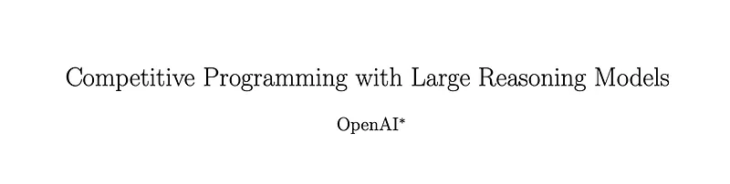
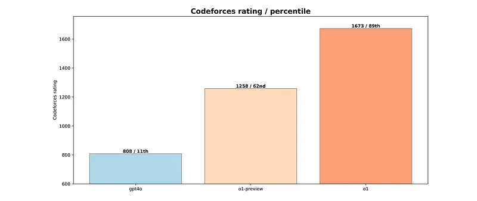
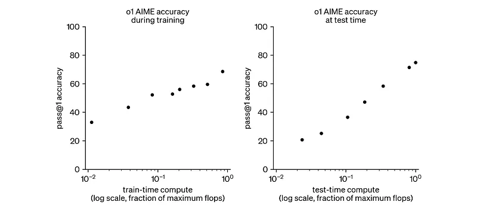
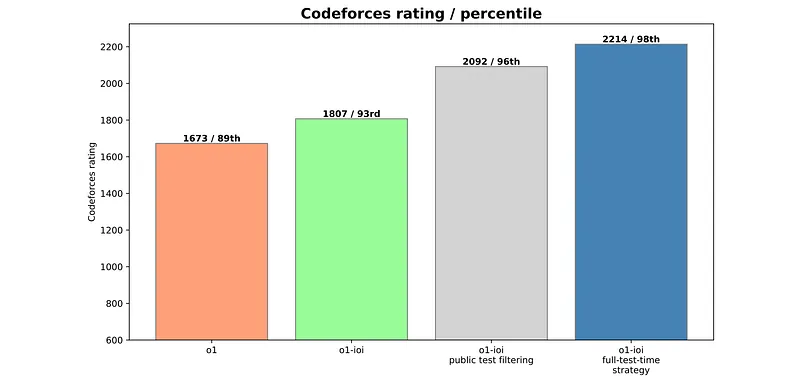
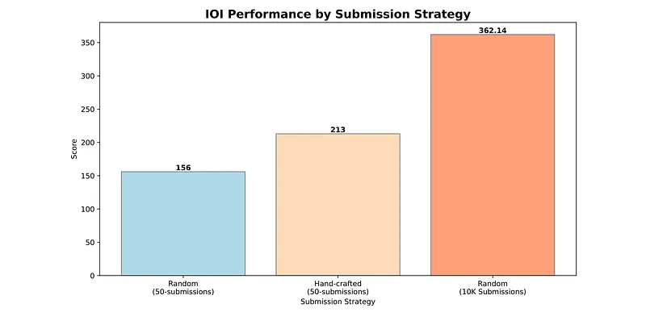
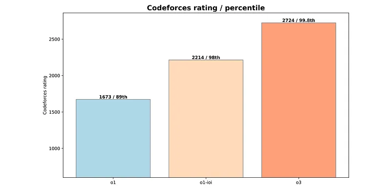
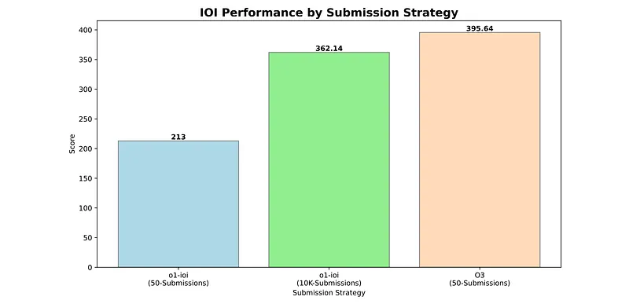
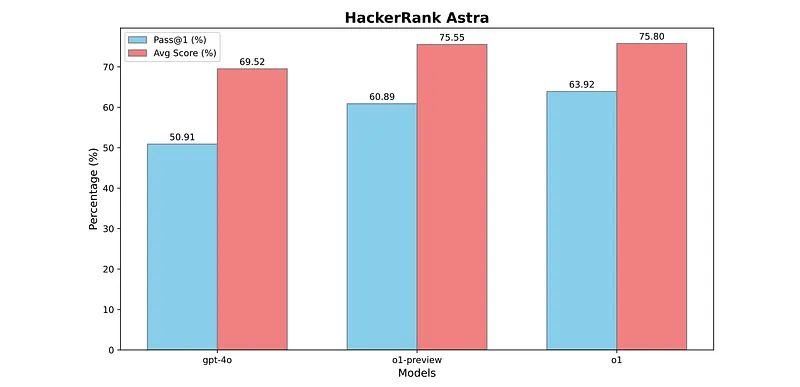
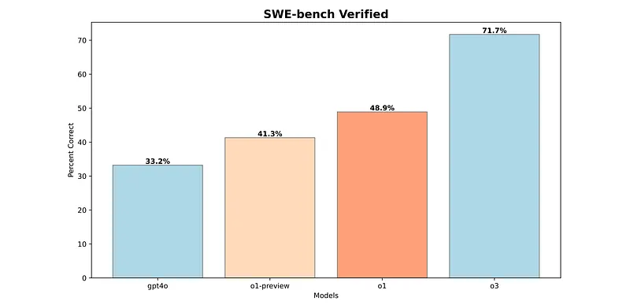

# Papers Explained 317 - Competitive Programming with Large Reasoning Models

This paper explores how reinforcement learning significantly improves large language models’ (LLMs) performance on complex coding and reasoning tasks, specifically within the domain of competitive programming. It compares three OpenAI models: o1, o1-ioi, and o3.

This page ingests the source article into the wiki and connects it to [[Papers Explained Corpus]], [[Reasoning Models]], [[Code Models]], [[Large Language Models]], [[Reinforcement Learning Topic]], [[Reinforcement Learning]].

## Source Metadata

- Source file: `raw/2025-02-25_Papers-Explained-317--Competitive-Programming-with-Large-Reasoning-Models-51836dbf584e.md`
- Source title: Papers Explained 317: Competitive Programming with Large Reasoning Models
- Published: 2025-02-25
- Canonical: [https://medium.com/@ritvik19/papers-explained-317-competitive-programming-with-large-reasoning-models-51836dbf584e](https://medium.com/@ritvik19/papers-explained-317-competitive-programming-with-large-reasoning-models-51836dbf584e)

## Key Ideas

- This paper explores how reinforcement learning significantly improves large language models’ (LLMs) performance on complex coding and reasoning tasks, specifically within the domain of competitive programming.
- o1: Represents the first large reasoning model, utilizing general-purpose methods to enhance programming performance.
- o1-ioi: A fine-tuned version of o1, specifically designed for the 2024 International Olympiad in Informatics (IOI).
- o3 (early checkpoints): A more advanced model demonstrating significantly improved reasoning capabilities. Unlike o1-ioi and AlphaCode, o3 doesn’t rely on human-defined coding-specific test-time strategies.
- o1 utilizes reinforcement learning to refine its internal chain-of-thought reasoning process, similar to a human working through a problem step-by-step. This allows it to identify and correct errors, decompose complex tasks, and explore alternative solutions.

## Notes

This paper explores how reinforcement learning significantly improves large language models’ (LLMs) performance on complex coding and reasoning tasks, specifically within the domain of competitive programming. It compares three OpenAI models: o1, o1-ioi, and o3.

- o1: Represents the first large reasoning model, utilizing general-purpose methods to enhance programming performance.

- o1-ioi: A fine-tuned version of o1, specifically designed for the 2024 International Olympiad in Informatics (IOI). It employed hand-crafted test-time strategies similar to AlphaCode, resulting in substantial performance gains on the IOI and platforms like CodeForces.

- o3 (early checkpoints): A more advanced model demonstrating significantly improved reasoning capabilities. Unlike o1-ioi and AlphaCode, o3 doesn’t rely on human-defined coding-specific test-time strategies. Instead, complex test-time reasoning strategies emerged through end-to-end reinforcement learning.

## OpenAI o1

o1 utilizes reinforcement learning to refine its internal chain-of-thought reasoning process, similar to a human working through a problem step-by-step. This allows it to identify and correct errors, decompose complex tasks, and explore alternative solutions. It is trained to use external tools, particularly for writing and executing code in a secure environment. This enables it to verify code compilation, test case passage, and other correctness checks, iteratively improving solutions.

### CodeForces Benchmark

CodeForces is a programming competition website that hosts live contests. It is internationally competitive and frequented by some of the best competitive programmers in the world. To assess the models’ competitive programming abilities, simulated CodeForces contests were conducted under conditions that closely mirrored real competitions.

*Figure: Comparing reasoning LLMs OpenAI o1-preview and o1 to gpt-4o on CodeForces.*

o1 is compared against gpt-4o (a non-reasoning LLM) and o1-preview (an earlier reasoning model).

- gpt-4o: Achieved a CodeForces rating of 808 (11th percentile).

- o1-preview: Achieved a rating of 1258 (62nd percentile), demonstrating the effectiveness of reinforcement learning for complex reasoning.

- o1: Achieved a rating of 1673 (89th percentile), setting a new benchmark for AI in competitive programming.

## OpenAI o1-ioi

OpenAI o1-ioi is a specialized version of the o1 large language model designed for the 2024 International Olympiad in Informatics (IOI). It is trained by Resuming RL training from the o1 checkpoint, specifically emphasizing challenging programming problems and the IOI submission format. This enhanced o1-ioi’s C++ generation, runtime checks, and overall problem-solving abilities.

*Figure: Additional RL training and additional test-time compute improves competitive mathematics performance.*

A sophisticated strategy is implemented to maximize performance under IOI constraints. This involves:

- Problem Decomposition: Dividing each IOI problem into subtasks.

- Solution Sampling: Generating 10,000 solutions per subtask using o1-ioi.

- Clustering: Grouping solutions based on their outputs on model-generated test inputs (256 per subtask, validated by model-generated validators).

- Reranking: Scoring clusters based on a learned scoring function, performance on model-generated tests, and results on public test cases. Weights for these factors were tuned using random search on previous IOI problems.

- Submission: Submitting up to 50 solutions (the IOI limit) in a round-robin fashion across subtasks, starting with the hardest. Solutions for superset subtasks were filtered based on performance on solved constituent subtasks.

### CodeForces Benchmark

*Figure: Further training OpenAI o1 on coding tasks and incorporating test-time strategies improves performance.*

- Achieved a rating of 1807 (93rd percentile) under full competition conditions.

- Filtering solutions that failed public tests increased the rating to 2092 (96th percentile).

- Employing the full test-time strategy further boosted the rating to 2214 (98th percentile).

### IOI 2024 Live Competition

The o1-ioi system participated in the 2024 International Olympiad in Informatics (IOI) under the same conditions as human contestants. It had ten hours to solve six challenging algorithmic problems and was allowed up to 50 submissions per problem.

*Figure: Performance of o1-ioi competing at IOI 2024.*

- Scored 213 points, placing in the 49th percentile.

- The test-time strategy contributed approximately 60 points compared to random submission selection.

- With a relaxed submission limit of 10,000 (vs. 50), o1-ioi achieved 362.14 points without the test-time strategy, exceeding the gold medal threshold.

## OpenAI o3

Unlike o1-ioi, which relied on human-engineered test-time strategies, o3 is trained to autonomously develop and execute its own reasoning strategies through extensive RL. This approach aims to explore the limits of RL training without human intervention.

### CodeForces Benchmark

*Figure: Performance of OpenAI o3 on the CodeForces benchmark.*

- o3 achieves a CodeForces rating of 2724 (99.8th percentile), significantly outperforming both o1 (1673) and o1-ioi with its full test-time strategy (2214). This demonstrates a substantial improvement in problem-solving capabilities, approaching the level of top human competitors.

- o3 exhibits insightful chain-of-thought reasoning, including writing and executing code for validation. Notably, it developed a strategy of writing simpler, brute-force solutions to cross-check the outputs of its optimized algorithms, enhancing solution reliability IOI 2024 Benchmark

### IOI 2024 Benchmark

o3 is retrospectively evaluated on the IOI 2024 problems under the official rules (50 submissions per problem). A later, more trained version of o3 than the one used for CodeForces is used here. Contamination checks were performed.

Unlike o1-ioi’s subtask-based sampling, o3 used a single prompt for the entire problem and generated 1,000 solutions (vs. 10,000 per subtask for o1-ioi).

o3 employed a simpler selection strategy, submitting the top 50 solutions with the highest test-time compute, without the complex heuristics of o1-ioi.

*Figure: IOI 2024 scores under different submission strategies.*

- o1-ioi: 213 points (50 submissions), 362.14 points (10,000 submissions — exceeding the gold medal threshold).

- o3: 395.64 points (50 submissions), surpassing the gold medal threshold without relaxed submission limits.

o3’s performance demonstrates that large-scale RL training alone can achieve state-of-the-art results. Its emergent test-time strategies, like generating brute-force solutions for verification, proved highly effective, eliminating the need for human-designed strategies.

## Software Engineering Evaluations

To evaluate the impact of reasoning on real-world coding tasks, models were tested on two datasets: the HackerRank Astra dataset and SWE-bench verified.

### HackerRank Astra

65 project-oriented coding challenges simulating real-world software development. Covers various frameworks (React.js, Django, Node.js) and focuses on complex, multi-file, long-context scenarios. Lacks public test cases, preventing reliance on hand-crafted test-time strategies.

*Figure: HackerRank Astra evaluation.*

- gpt-4o: Baseline model without reasoning capabilities.

- o1-preview: Demonstrated a 9.98% improvement in pass@1 and a 6.03-point increase in average score compared to gpt-4o, highlighting the impact of chain-of-thought reasoning.

- o1: Further improved with reinforcement learning, achieving a pass@1 of 63.92% and an average score of 75.80% (a 3.03% increase in pass@1 over o1-preview).

### SWE-Bench Verified

A human-validated subset of SWE-bench, addressing issues like incorrect grading and under-specified problems, providing a more reliable evaluation of real-world software problem-solving. Contains 500 tasks.

Models receive 5 attempts per task. Failure after 5 attempts is considered incorrect. System failures are retried. Results are averaged over 3 trials.

*Figure: SWE-bench evaluation.*

- o1-preview: Achieved an 8.1% improvement over gpt-4o.

- o1: Further improved by 8.6% over o1-preview due to additional reinforcement learning.

- o3 (early checkpoint): Showed a substantial 22.8% improvement over o1, benefiting from significantly more compute resources during training.

## Paper

Competitive Programming with Large Reasoning Models [2502.06807](https://arxiv.org/abs/2502.06807)

## Figures

Figures from the Medium HTML export (`raw/2025-02-25_Papers-Explained-317--Competitive-Programming-with-Large-Reasoning-Models-51836dbf584e.md`); local copies under `wiki/assets/papers-explained-317-competitive-programming-with-large-reasoning-models/` when download succeeded.

| Figure | Caption |
|--------|---------|
|  | Title card: Competitive Programming with Large Reasoning Models. |
|  | Comparing reasoning LLMs OpenAI o1-preview and o1 to gpt-4o on CodeForces. |
|  | Additional RL training and additional test-time compute improves competitive mathematics performance. |
|  | Further training OpenAI o1 on coding tasks and incorporating test-time strategies improves performance. |
|  | Performance of o1-ioi competing at IOI 2024. |
|  | Performance of OpenAI o3 on the CodeForces benchmark. |
|  | IOI 2024 scores under different submission strategies. |
|  | HackerRank Astra evaluation. |
|  | SWE-bench evaluation. |
## Related

- [[Papers Explained Corpus]]
- [[Reasoning Models]]
- [[Code Models]]
- [[Large Language Models]]
- [[Reinforcement Learning Topic]]
- [[Reinforcement Learning]]
- [[Paper Explained 316 - NuminaMath]]
- [[Papers Explained 318 - Autoregressive Image Models (AIM)]]

#summary #topic
