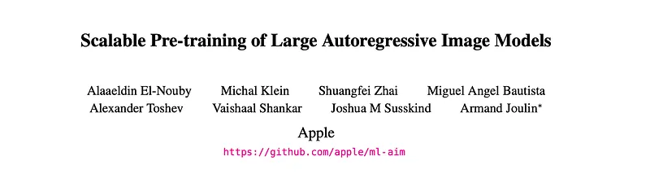
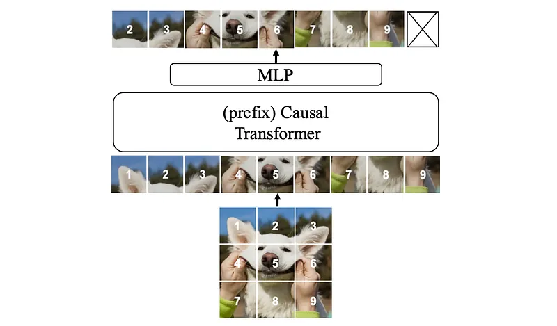
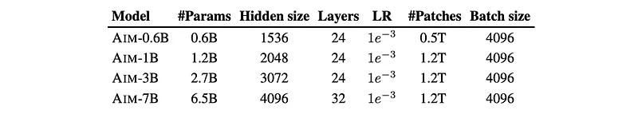
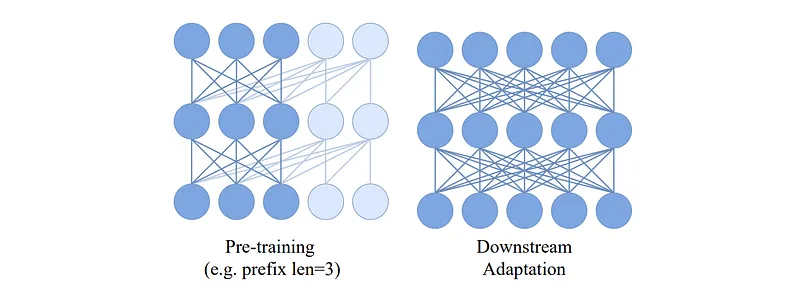
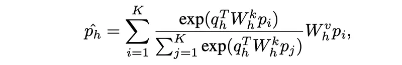
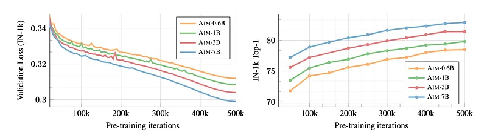
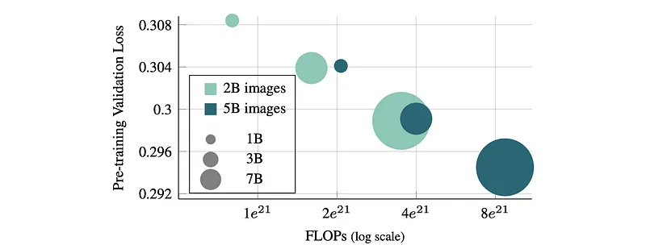
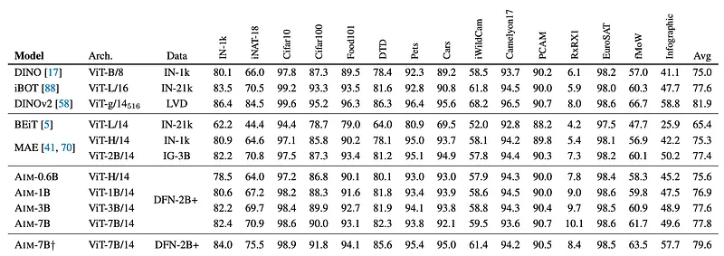

# Papers Explained 318 - Autoregressive Image Models (AIM)

Autoregressive Image Models (AIM) are a collection of vision models pre-trained with an autoregressive objective. These models are inspired by their textual counterparts, i.e., Large Language Models (LLMs), and exhibit similar scaling properties. Similar to LLMs, AIM predicts the next element in a sequence, but applied to image data.

This page ingests the source article into the wiki and connects it to [[Papers Explained Corpus]], [[Large Language Models]], [[Computer Vision]], [[Embedding and Retrieval]].

## Source Metadata

- Source file: `raw/2025-02-26_Papers-Explained-318--Autoregressive-Image-Models--AIM--d6a90f93876f.md`
- Source title: Papers Explained 318: Autoregressive Image Models (AIM)
- Published: 2025-02-26
- Canonical: [https://medium.com/@ritvik19/papers-explained-318-autoregressive-image-models-aim-d6a90f93876f](https://medium.com/@ritvik19/papers-explained-318-autoregressive-image-models-aim-d6a90f93876f)

## Key Ideas

- Autoregressive Image Models (AIM) are a collection of vision models pre-trained with an autoregressive objective. These models are inspired by their textual counterparts, i.e., Large Language Models (LLMs), and exhibit similar scaling properties.
- The project is available at [GitHub](https://github.com/apple/ml-aim).
- As the backbone, the Vision Transformer architecture (ViT) is adopted. For scaling in the model capacity, expanding width rather than depth is prioritized.
- N blocks of MLP are used on top of the final transformer layer, processing each patch independently. This design strikes a good balance between performance and the additional costs incurred during pre-training.
- Sinusoidal positional embeddings are added to the input patches before the transformer and before the MLP head.

## Notes

Autoregressive Image Models (AIM) are a collection of vision models pre-trained with an autoregressive objective. These models are inspired by their textual counterparts, i.e., Large Language Models (LLMs), and exhibit similar scaling properties. Similar to LLMs, AIM predicts the next element in a sequence, but applied to image data. Like LLMs, AIM demonstrates improved performance with increased model size and training data.

The project is available at [GitHub](https://github.com/apple/ml-aim).

## Architecture

*Figure: AIM overview.*

As the backbone, the Vision Transformer architecture (ViT) is adopted. For scaling in the model capacity, expanding width rather than depth is prioritized.

- N blocks of MLP are used on top of the final transformer layer, processing each patch independently. This design strikes a good balance between performance and the additional costs incurred during pre-training.

- Sinusoidal positional embeddings are added to the input patches before the transformer and before the MLP head.

- A standard expansion ratio of 4 is used for all the MLP blocks in the trunk and the head.

- The bias term is dropped for simplicity.

- Unlike the original ViT, a classification token is not appended to the input.

- Pixel targets are normalized per patch before the loss computation.

### Prefix Transformer

*Figure: Prefix causal attention.*

The autoregressive objective in pre-training requires a causal mask in the self-attention operation. However, this differs from the standard usage of ViT models in downstream tasks, where bidirectional self-attention is employed. This discrepancy leads to a decrease in performance, irrespective of whether the causal mask is retained during downstream adaptation or not. To address this issue, the initial patches of the sequence, referred to as the prefix, are considered as a context for predicting the remaining patches following the PrefixLM formulation. The prefix patches are excluded from the autoregressive prediction and therefore are not constrained to be causal. More precisely, a prefix length of size S ∈ [1, K − 1], and the causal mask is removed, i.e., ai,k > 0 for k < S. This modification helps the model to work in the absence of causal masking, allowing it to be removed during downstream adaptation. This approach improves the performance of the model in downstream tasks and eliminates the need for architectural changes to ViT.

### Downstream adaptation

This research focuses on scenarios where all model weights are fixed for downstream tasks. Only a classification head is trained in this context, which mitigates the risk of overfitting on small downstream datasets and significantly reduces the adaptation cost.

Unlike contrastive learning, the loss is computed independently for each patch. This means that pre-training does not incorporate any notion of global image descriptors, and hence, there is no image level token. While some methods rely on global average pooling to build a global feature from the patch features, this approach, along with other generative approaches like MAE, benefit more from an attention pooling operation placed before the linear classifier.

Specifically, given a set of patch features P = {pi | 1 ≤ i ≤ K}, a global descriptor pˆ is computed through multi- head attention pooling over the patch features as:

The obtained pooled feature, denoted as pˆ, serves as the input to the linear classifier. Including this attention pooling makes the entire operation not strictly linear, therefore it is referred to as “Attentive Probe”.

## Training Objective

The training objective follows that of a standard autoregressive model applied on a sequence of image patches. An image x is split into a grid of K non-overlapping patches xk, k ∈ [1, K], which collectively form a sequence of tokens. As opposed to language modeling, the sequences have a fixed length of K.

Given the raster (row-major) ordering, the probability of an image can be factorized as a product of patch conditional probabilities:

where x<k denotes the set of the first k − 1 patches, and is the context used to predict the kth patch.

The training loss over a set X of images is then defined as the negative log-likelihood (NLL):

By default, a normalized pixel-level regression loss is adopted. This loss corresponds to setting P(xk | x<k) as Gaussian distributions with a constant variance. Namely, given xˆk(θ) as the prediction of the kth patch from a network parameterized with θ, and xk as its corresponding ground-truth value, the objective is to minimize the sum l2 squared distance between the prediction and the ground-truth:

## Pre-training Dataset

The models are pre-trained on the DFN dataset, a collection of 12.8B image-text pairs filtered from Common Crawl. The data has been pre-processed to remove NSFW content, blur faces, and reduce contamination by deduplicating against the evaluation sets. A data filtering network ranks the samples in the 12.8B collection according to the alignment score between images and their corresponding caption. A subset of 2B images, called DFN-2B, has been extracted from the DataComp 12.8B dataset by keeping the top 15% samples.

Motivated by the common practice in LLM pre-training of oversampling high-quality data sources such as Wikipedia and Books, during pre-training, images are sampled from DFN-2B with a probability of p = 0.8 and images from ImageNet-1k with a probability of p = 0.2. Such a dataset is referred to as DFN-2B+.

## Results and Analysis

### Impact of scaling

Models of varying capacities are trained on different datasets (IN-1k, DFN-2B, and DFN-2B+) and their performance is evaluated on downstream tasks. The pre-training loss and downstream classification accuracy are tracked during training. Different training schedules (number of iterations) are also explored.

*Figure: AIM pre-training across model sizes.*

- Optimizing the pre-training objective directly results in better downstream performance.

- Scaling the model capacity (number of parameters) improves both the loss value and downstream task accuracy, consistent with trends observed in LLMs.

*Figure: Scaling in FLOPs.*

- Using a mixture of curated and uncurated data (DFN-2B+) results in the best downstream performance.

- Extending the pre-training schedule (increasing the number of training iterations) significantly reduces validation loss, suggesting that longer training can improve performance.

- Lower-capacity models trained for longer schedules can achieve comparable performance to higher-capacity models trained for shorter schedules, using a similar amount of FLOPs, suggesting potential scaling laws similar to those observed in other models.

### Pre-training objective

The AIM architecture is trained using both an autoregressive objective and a masking objective. The masking objective is implemented in the same setting as AIM to isolate the impact of the pre-training objective.

*Figure: Autoregressive vs. Masking.*

- AIM performs better with an autoregressive objective than with a masking objective.

### Comparison with other methods

The AIM method is evaluated on 15 diverse benchmarks and compared against other methods, including BEiT, MAE, DINO, iBOT, and DINOv2. The performance is measured using attentive probing. Additionally, the quality of features extracted from different layers of the AIM model is analyzed.

*Figure: Downstream evaluation with a frozen trunk.*

- AIM outperforms BEiT by a large margin and performs better than MAE-H (with equivalent capacity) on average across all benchmarks.

- AIM-3B and AIM-7B outperform MAE-2B (pre-trained on a larger, private dataset).

- AIM provides competitive performance with joint embedding methods like DINO and iBOT, even outperforming them in average accuracy. However, it falls behind DINOv2, which uses higher-resolution inputs.

*Figure: Feature extraction.*

- Higher-quality features can be extracted from shallower layers of the AIM model compared to the last layer.

## Paper

Scalable Pre-training of Large Autoregressive Image Models [2401.08541](https://arxiv.org/abs/2401.08541)

## Figures

Figures from the Medium HTML export (`raw/2025-02-26_Papers-Explained-318--Autoregressive-Image-Models--AIM--d6a90f93876f.md`); local copies under `wiki/assets/papers-explained-318-autoregressive-image-models-aim/` when download succeeded.

| Figure | Caption |
|--------|---------|
|  | Title card: Autoregressive Image Models (AIM). |
|  | AIM overview. |
|  | As the backbone, the Vision Transformer architecture (ViT) is adopted. |
|  | Prefix causal attention. |
|  | The obtained pooled feature, denoted as pˆ, serves as the input to the linear classifier. |
|  | Given the raster (row-major) ordering, the probability of an image can be factorized as a product of patch conditional probabilities. |
|  | The training loss over a set X of images is then defined as the negative log-likelihood (NLL). |
|  | By default, a normalized pixel-level regression loss is adopted. |
|  | AIM pre-training across model sizes. |
|  | Scaling in FLOPs. |
|  | Autoregressive vs. Masking. |
|  | Downstream evaluation with a frozen trunk. |
|  | Feature extraction. |
## Related

- [[Papers Explained Corpus]]
- [[Large Language Models]]
- [[Computer Vision]]
- [[Embedding and Retrieval]]
- [[Papers Explained 317 - Competitive Programming with Large Reasoning Models]]
- [[Papers Explained 319 - Autoregressive Image Models V2 (AIM V2)]]

#summary #topic
