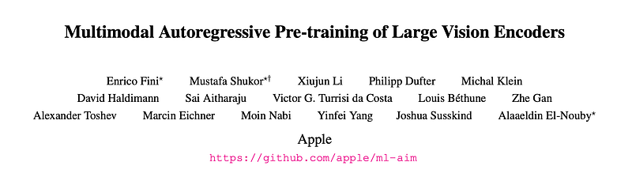
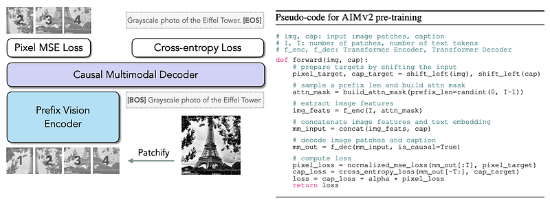
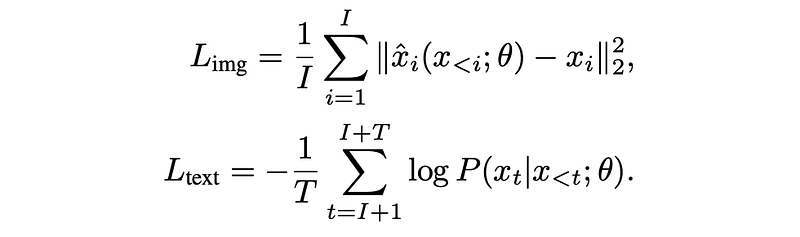
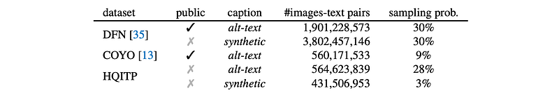
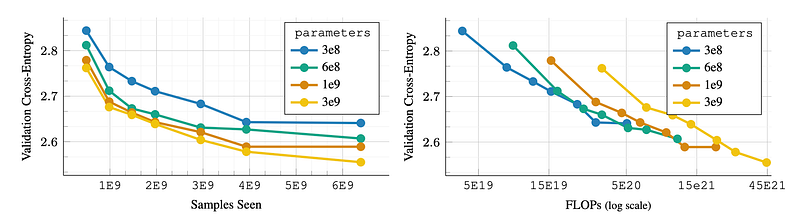
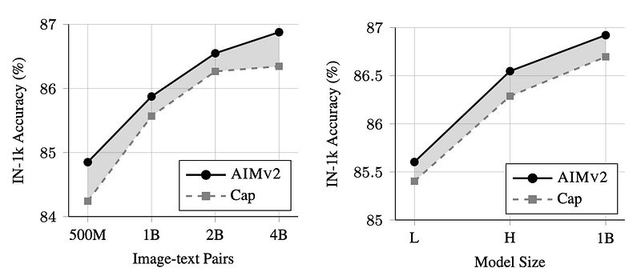
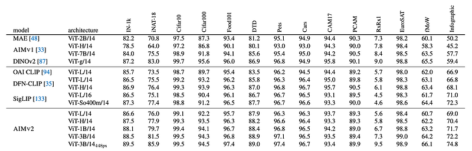

# Papers Explained 319 - Autoregressive Image Models V2 (AIM V2)

Autoregressive Image Models V2 (AIM V2) extends the Autoregressive Image Models (AIM) framework to a multimodal setting, i.e., images and text. This is achieved by pairing the vision encoder with a multimodal decoder that autoregressively generates raw image patches and text tokens.

This page ingests the source article into the wiki and connects it to [[Papers Explained Corpus]], [[Computer Vision]], [[Vision Language Models]], [[Large Language Models]].

## Source Metadata

- Source file: `raw/2025-02-27_Papers-Explained-319--Autoregressive-Image-Models-V2--AIM-V2--e28eadf5ba9b.html`
- Source title: Papers Explained 319: Autoregressive Image Models V2 (AIM V2)
- Published: 2025-02-27
- Canonical: [https://medium.com/@ritvik19/papers-explained-319-autoregressive-image-models-v2-aim-v2-e28eadf5ba9b](https://medium.com/@ritvik19/papers-explained-319-autoregressive-image-models-v2-aim-v2-e28eadf5ba9b)

## Key Ideas

- Autoregressive Image Models V2 (AIM V2) extends the Autoregressive Image Models (AIM) framework to a multimodal setting, i.e., images and text.
- The project is available at [GitHub](https://github.com/apple/ml-aim).
- For the vision encoder of AIMV2, the Vision Transformer (ViT) architecture is adopted.
- A prefix attention mask constrains the self-attention mechanism within the vision encoder. This strategy facilitates the use of bidirectional attention during inference without additional tuning.
- The vision encoder and multimodal decoder incorporate SwiGLU as the feed-forward network (FFN) and replace all normalization layers with RMSNorm.

## Notes

Autoregressive Image Models V2 (AIM V2) extends the Autoregressive Image Models (AIM) framework to a multimodal setting, i.e., images and text. This is achieved by pairing the vision encoder with a multimodal decoder that autoregressively generates raw image patches and text tokens.

The project is available at [GitHub](https://github.com/apple/ml-aim).

## Architecture

For the vision encoder of AIMV2, the Vision Transformer (ViT) architecture is adopted.

A prefix attention mask constrains the self-attention mechanism within the vision encoder. This strategy facilitates the use of bidirectional attention during inference without additional tuning.

The vision encoder and multimodal decoder incorporate SwiGLU as the feed-forward network (FFN) and replace all normalization layers with RMSNorm.

*Figure: AIMV2 family of models.*

A unified multimodal decoder performs autoregressive generation for both image and text modalities concurrently. Image features and raw text tokens are each linearly projected and embedded into Rddec. The decoder receives concatenated sequences of image and text features as input and employs causal attention in the self-attention operations. The outputs of the decoder are processed through two separate linear heads — one for image tokens and another for text tokens — to predict the next token in each modality respectively. The same decoder capacity is used for all the AIMV2 variants.

## Pre-Training

*Figure: AIMV2 pre-training Overview.*

The model extends the standard unimodal autoregressive framework to multimodal settings that integrate both images and text into a unified sequence.

Specifically, an image x is partitioned into I non-overlapping patches xi, i ∈ [1, I ], forming a sequence of tokens. Similarly, a text sequence is broken down into subwords xt, t ∈ [I, I + T ]. These sequences are then concatenated, allowing text tokens to attend to image tokens. While both concatenation directions (image → text and text → image) are possible, the model focuses on training a strong vision encoder by always prepending the image first, thereby enabling stronger conditioning on the visual features.

The decoder subsequently performs next-token prediction on the combined sequence, following the factorization above. To support the autoregressive generation process, the vision encoder and multimodal decoder employ prefix and causal self-attention operations, respectively.

Separate loss functions are defined for the image and text domains as follows:

The overall objective is to minimize Ltext + α ∗ Limg with respect to model parameters θ. For the text domain, Ltext is a standard cross-entropy loss that measures the negative log-likelihood of the ground truth token at each step. For the image domain, Limg is an l2 pixel-level regression loss, where the model’s predicted patch xˆi(θ) is compared to the true patch xi. The image patches are normalized before loss computation.

### Data

*Figure: Pre-training data mixture.*

AIMV2 models are pre-trained on 12 billion image-text samples obtained through a combination of public and private datasets containing paired images and text. Publicly available DFN-2B and COYO datasets, along with a proprietary dataset of High Quality Image-Text Pairs (HQITP), are utilized. In addition to alt-text, synthetic captions are used.

## Post-Training

While the initial pre-training stage of AIMV2 yields highly performant models, we explore methods to further enhance the capabilities through various post-training strategies.

### High-resolution Adaptation

In the initial pre-training stage, image data with a fixed resolution of 224px is used. AIMV2 models are finetuned for 336 and 448 pixel resolutions. The high-resolution adaptation stage utilizes 2 billion image-text pairs sampled from the same pool as the pre-training stage, except that synthetic captions are not used at this stage. Weight decay of zero is found to be important for maintaining stable optimization.

### Native Resolution Fine-tuning

Training models for a dedicated resolution and aspect ratio can be inflexible for many applications that require processing images in their original shapes. Totackle this limitation, Bi is defined as the number of images in a mini-batch, Ai as the number of patches per image, and C as the total number of image patches in the mini-batch. For a mini-batch i, an area A is randomly sampled and the images are resized to fit within this area while maintaining their aspect ratios. The mini-batch size Bi is then adjusted such that C = Ai × Bi.

## Results and Analysis

### Scaling AIMv2

AIMv2 models with varying model capacities (300M to 3B parameters) are trained with varied number of image-text pairs seen during pre-training (500M to 6.4B). All models are trained to convergence without early stopping,

*Figure: Scaling properties of AIMV2.*

- Performance consistently improves with scaling data or parameters.

- Diminishing returns appear when scaling data for lower-capacity models.

- The optimal model size changes with the compute budget; larger models underperform at smaller budgets due to undertraining.

### AIMv2 vs. Captioning

A ViT-H backbone models are pre-trained using either the multimodal autoregressive objective (AIMv2) or only language supervision (captioning) on 2B image-text pairs were used for pre-training.

*Figure: AIMV2 vs. Captioning.*

*Figure: Frozen trunk evaluation for recognition benchmarks.*

- Both approaches (AIMv2 and captioning) improve with increased data size or model capacity.

- Captioning baselines show signs of plateauing with scaling data, which is not observed with AIMv2.

## Paper

Multimodal Autoregressive Pre-training of Large Vision Encoders [2411.14402](https://arxiv.org/abs/2411.14402)

## Figures

Figures from the Medium HTML export (`raw/2025-02-27_Papers-Explained-319--Autoregressive-Image-Models-V2--AIM-V2--e28eadf5ba9b.html`); local copies under `wiki/assets/papers-explained-319-autoregressive-image-models-v2-aim-v2/` when download succeeded.

| Figure | Caption |
|--------|---------|
|  | Title card: Autoregressive Image Models V2 (AIM V2). |
|  | AIMV2 family of models. |
|  | AIMV2 pre-training Overview. |
|  | Separate loss functions are defined for the image and text domains as follows. |
|  | Pre-training data mixture. |
|  | Scaling properties of AIMV2. |
|  | AIMV2 vs. Captioning. |
|  | Frozen trunk evaluation for recognition benchmarks. |
## Related

- [[Papers Explained Corpus]]
- [[Computer Vision]]
- [[Vision Language Models]]
- [[Large Language Models]]
- [[Papers Explained 318 - Autoregressive Image Models (AIM)]]
- [[Papers Explained 320 - SigLIP 2]]

#summary #topic
