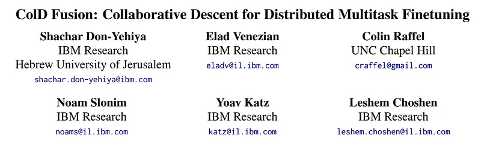
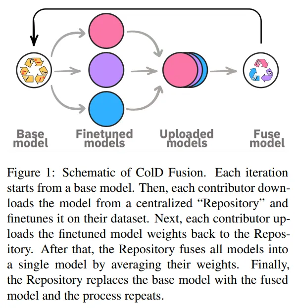
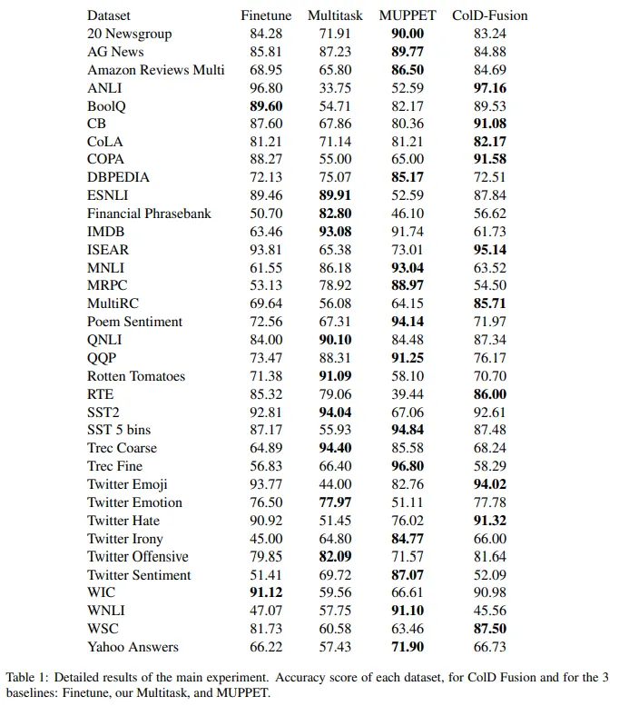

# Papers Explained 32 - ColD Fusion

Improving a pretrained model has the potential to improve every model finetuned on it. However, pretraining is often computationally expensive, so practitioners rarely seek to pretrain new and improved models. In contrast, finetuning is typically dramatically cheaper, and a given pretrained model may therefore be finetuned many times.

This page ingests the source article into the wiki and connects it to [[Papers Explained Corpus]], [[Synthetic Data]], [[Supervised Fine-Tuning]].

## Source Metadata

- Source file: `raw/2023-02-27_Papers-Explained-32--ColD-Fusion-452f33101a91.md`
- Source title: Papers Explained 32: ColD Fusion
- Published: 2023-02-27
- Canonical: [https://medium.com/@ritvik19/papers-explained-32-cold-fusion-452f33101a91](https://medium.com/@ritvik19/papers-explained-32-cold-fusion-452f33101a91)

## Key Ideas

- Improving a pretrained model has the potential to improve every model finetuned on it. However, pretraining is often computationally expensive, so practitioners rarely seek to pretrain new and improved models.
- In multitask learning, a single model is trained over multiple datasets at once, to fulfill one of two goals:
- to single-handedly perform the tasks, that would otherwise require multiple dedicated models.
- to provide a better starting point than the pretrained.
- Given the availability of many finetuned models, our aim is to obtain the benefits of multitask learning by mixing multiple models rather than multiple datasets.

## Notes

Improving a pretrained model has the potential to improve every model finetuned on it. However, pretraining is often computationally expensive, so practitioners rarely seek to pretrain new and improved models. In contrast, finetuning is typically dramatically cheaper, and a given pretrained model may therefore be finetuned many times. Motivated by this, we study whether finetuned models can be “recycled” to create better pretrained models.

In multitask learning, a single model is trained over multiple datasets at once, to fulfill one of two goals:

- to single-handedly perform the tasks, that would otherwise require multiple dedicated models.

- to provide a better starting point than the pretrained.

Given the availability of many finetuned models, our aim is to obtain the benefits of multitask learning by mixing multiple models rather than multiple datasets.

Collaborative multitask learning involves performing multitask learning in a constrained environment: We assume that multiple contributors each finetune a model on a single dataset. The contributors do not share their datasets with one another or change the way they finetune, but they do agree to share their produced models. This setting fits preexisting finetuning pipelines typically used by practitioners.

However, by requiring only the finetuned model to be shared, the finetuning step can be recast as a training step for the collective’s benefit. In doing so, our method allows reusing compute and data consumed by practitioners and researchers. We call this method Collaborative Descent, or ColD for short.

## ColD Fusion

ColD (Collaborative Descent) Fusion, is an iterative process that aims to perform multitask learning in the constrained setting listed above. Specifically, ColD Fusion involves an iterative process where each contributor finetunes the current model on their dataset, communicates the resulting model back to the Repository, and the Repository fuses all of the contributor’s models and sets it as the current model.

For experiments in the main text, we use RoBERTa-base as our initial model θ0. To demonstrate the generality of our approach, we additionally replicate some results on T5.

For baseline pre-trained models, we consider RoBERTa-base as well as RoBERTa-base multitask finetuned on all datasets. The multitask variant trains a dedicated classification head for each dataset. In addition, we
consider the MUPPET model, a highly optimized multitask model trained
on more datasets than we consider. MUPPET is the current state-of-the-art base pretrained model that uses the RoBERTa-base architecture.

During finetuning, we use the following hyperparameters: learning rate of
5e-5 with linear decay 0.0006 and batch size 256. Early stopping is performed on the development sets if the accuracy improvement after 256K training examples is less than 0.001.

## Paper

ColD Fusion: Collaborative Descent for Distributed Multitask Finetuning [2212.01378](https://arxiv.org/abs/2212.01378)

## Figures

Figures from the Medium HTML export (`raw/2023-02-27_Papers-Explained-32--ColD-Fusion-452f33101a91.md`); local copies under `wiki/assets/papers-explained-32-cold-fusion/` when download succeeded.

| Figure | Caption |
|--------|---------|
|  | Title card: ColD Fusion. |
|  | However, by requiring only the finetuned model to be shared, the finetuning step can be recast as a training step for the collective’s... |
|  | During finetuning, we use the following hyperparameters: learning rate of 5e-5 with linear decay 0.0006 and batch size 256. |
## Related

- [[Papers Explained Corpus]]
- [[Synthetic Data]]
- [[Supervised Fine-Tuning]]
- [[Papers Explained 31 - Single Shot MultiBox Detector]]
- [[Papers Explained Review 04 - Tabular Deep Learning]]

#summary #topic
