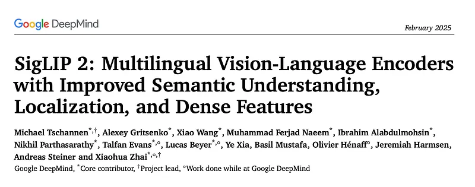
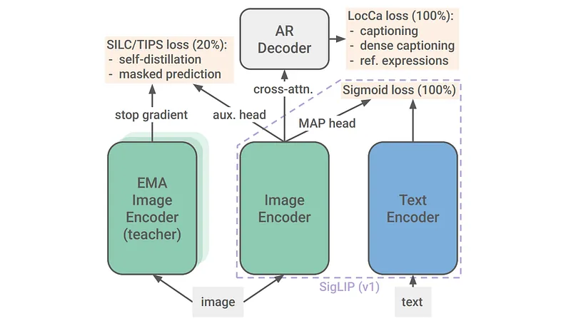
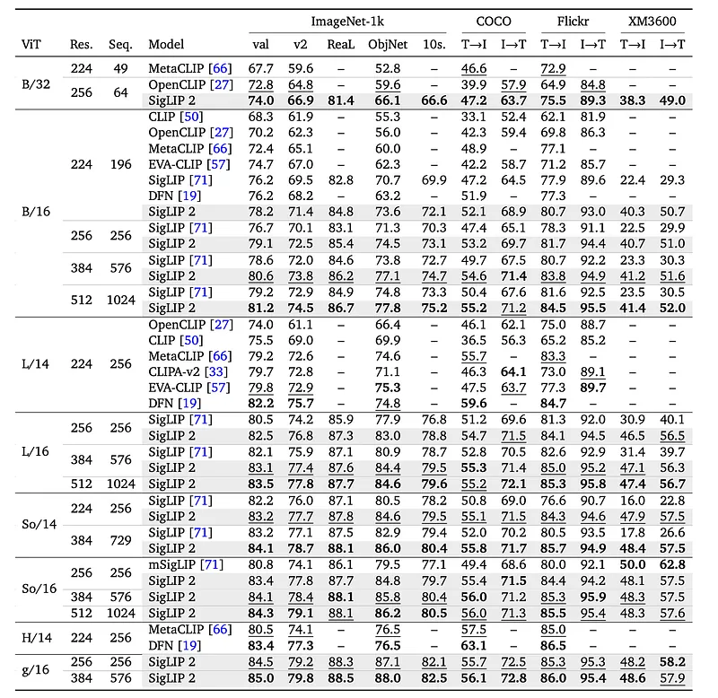
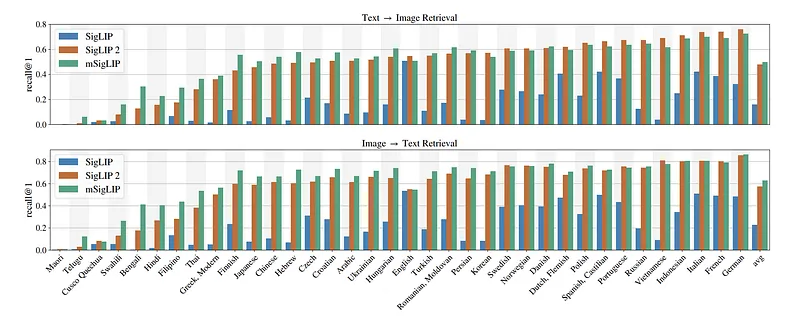
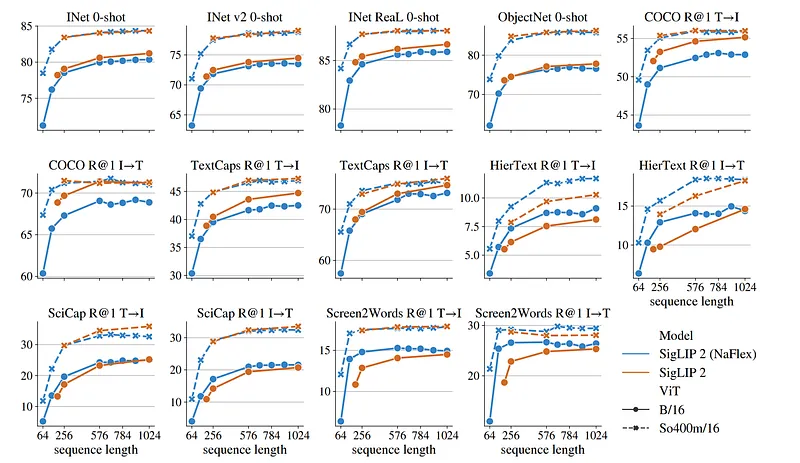
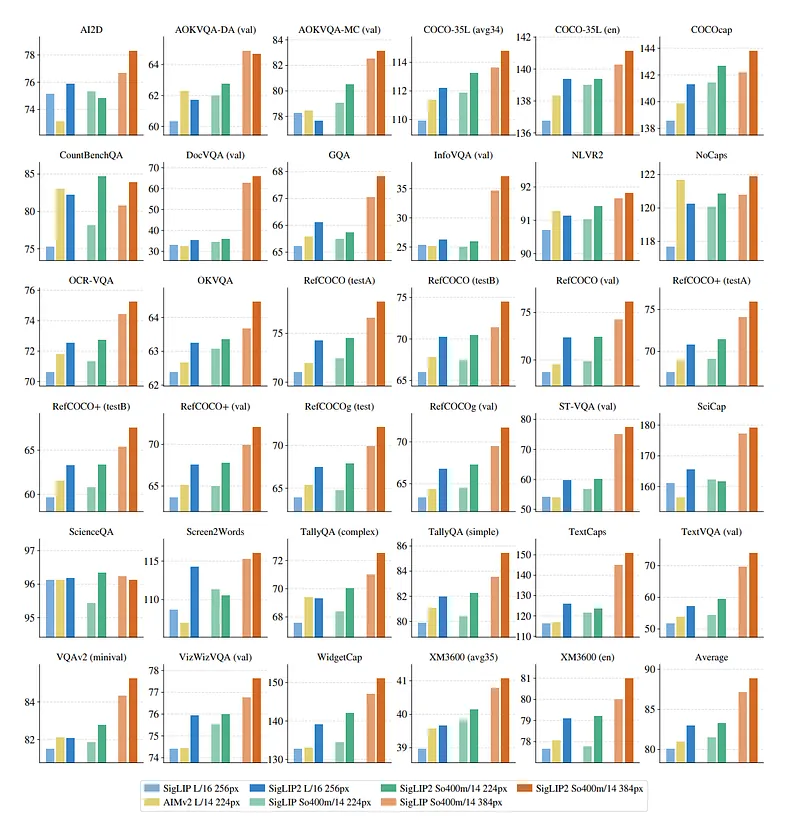
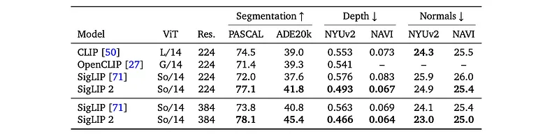
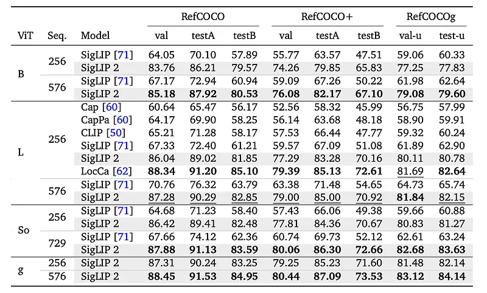
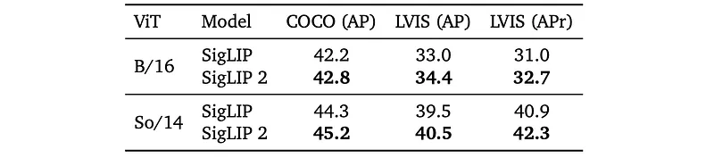

# Papers Explained 320 - SigLIP 2

In addition to training a set of models and adapting each model separately to different resolutions while distorting the aspect ratio, variants which process images while largely preserving their native aspect ratio like NaViT and support different sequence lengths as FlexiViT are also trained. This variant is called NaFlex.

This page ingests the source article into the wiki and connects it to [[Papers Explained Corpus]], [[Vision Language Models]], [[Embedding and Retrieval]], [[Multilingual Models]], [[Model Compression and Efficiency]], [[Synthetic Data]], [[On-Policy Self-Distillation]], [[Model Distillation]].

## Source Metadata

- Source file: `raw/2025-02-28_Papers-Explained-320--SigLIP-2-dba08ff09559.md`
- Source title: Papers Explained 320: SigLIP 2
- Published: 2025-02-28
- Canonical: [https://medium.com/@ritvik19/papers-explained-320-siglip-2-dba08ff09559](https://medium.com/@ritvik19/papers-explained-320-siglip-2-dba08ff09559)

## Key Ideas

- In addition to training a set of models and adapting each model separately to different resolutions while distorting the aspect ratio, variants which process images while largely preserving their native aspect ratio like NaViT and support different sequence...
- The WebLI dataset containing 10 billion images and 12 billion alt-texts covering 109 languages is used.
- In the first step of pretraining, SigLIP is combined with LocCa by combining the two losses with equal weight.
- For all model sizes, the vision encoder patch size is set to 16 and the image resolution to 256.
- The training setup is augmented with local-to-global correspondence learning with self-distillation and masked prediction losses to improve the local semantics of the (un-pooled) feature representation.

## Notes

SigLIP 2 is a family of new multilingual vision-language encoders that build on SigLIP. The original image-text training objective is extended with several prior, independently developed techniques into a unified recipe. This includes captioning-based pretraining, self-supervised losses (self-distillation, masked prediction) and online data curation. Variants which support multiple resolutions and preserve the input’s native aspect ratio are also trained. The models are trained on a more diverse data-mixture that includes de-biasing techniques. Model checkpoints are released at four sizes: ViT-B (86M), L (303M), So400m (400M), and g (1B).

## Training Recipe

The original SigLIP training recipe is combined with decoder-based pretraining, in addition to self-distillation and masked prediction. Pretraining an image encoder with a language decoder for captioning and referring expression comprehension was shown to improve OCR capabilities and localization, whereas self-distillation and masked prediction leads to better features for dense prediction tasks, zero-shot classification and retrieval. Rather than combining all these techniques in a single run, a staged approach is followed.

In addition to training a set of models and adapting each model separately to different resolutions while distorting the aspect ratio, variants which process images while largely preserving their native aspect ratio like NaViT and support different sequence lengths as FlexiViT are also trained. This variant is called NaFlex.

### Architecture and Training Data

For the architecture, SigLIP is followed so that existing users can simply swap out the encoder weights. Specifically, the fixed-resolution variant relies on the standard ViT architecture with learned positional embedding. The same architecture is used for the image and text tower, except for the g-sized vision encoder which is paired with an So400m-sized text encoder. Vision and text representations are pooled using a MAP head (attention pooling). The text length is set to 64 and the multilingual Gemma tokenizer with vocabulary size 256k is used, transforming the text to lower case before tokenization.

The WebLI dataset containing 10 billion images and 12 billion alt-texts covering 109 languages is used. To strike a good balance between quality on English and multilingual vision-language benchmarks, the mixture is composed such that 90% of the training image-text pairs is sourced from English web pages, and the remaining 10% from non-English web pages.

### Training with Sigmoid loss and decoder

In the first step of pretraining, SigLIP is combined with LocCa by combining the two losses with equal weight. Unlike CLIP, which relies on a contrastive loss, SigLIP creates binary classification problems by combining every image embedding with every text embedding in the mini-batch and trains the embeddings to classify matching and non-matching pairs via sigmoid loss.

For LocCa, a standard transformer decoder with cross-attention is attached to the un-pooled vision encoder representation. The decoder follows the shapes of the text encoder except that cross-attention layers are added and the number of layers is reduced by a factor of two. Besides image captioning, LocCa also trains for automatic referring expression prediction and grounded captioning. Referring expression prediction amounts to predicting bounding box coordinates for captions describing specific image regions, whereas grounded captioning involves predicting region-specific captions given bounding box coordinates.

For all model sizes, the vision encoder patch size is set to 16 and the image resolution to 256.

### Training with self-distillation and masked prediction

The training setup is augmented with local-to-global correspondence learning with self-distillation and masked prediction losses to improve the local semantics of the (un-pooled) feature representation. This representation is typically used for dense prediction tasks like segmentation, depth estimation etc. Concretely, two terms are added to the losses described above.

The first term is the local-to-global consistency loss, in which the vision encoder becomes the student network, which gets a partial (local) view of the training image, and is trained to match the teacher’s representation, derived from the full image. This auxiliary matching task is performed in a high-dimensional feature space computed with a separate MLP head. As is common in the literature, the teacher parameters are obtained as an exponential moving average of the student parameters over the previous iterations.

The second loss term is the masked prediction objective. 50% of the embedded image patches in the student network are replaced with mask tokens and the student is trained to match the features of the teacher at masked locations. The loss is then defined identically to the first term (consistency loss), but applied to per-patch features rather than the pooled, image-level representation.

These losses are added at 80% of training completion, initializing the teacher with the student parameters and the remaining additional parameters (heads, mask token and corresponding optimizer parameters) randomly. The weights of the first and the second loss terms are set to 1 and 0.25. Further, to balance model quality on global/semantic and dense tasks, the two loss terms are re-weighted by another factor of 0.25, 0.5, 1.0, and 0.5 for the B, L, So400m and g, model sizes, respectively.

### Adaptation to different resolutions

Fixed-resolution variant

To obtain fixed-resolution checkpoints at multiple resolutions, checkpoints are resumed at 95% of training. The positional embedding is resized to the target sequence length and training is resumed at the target resolution with all losses.

Variable aspect and resolution (NaFlex)

NaFlex combines ideas from FlexiViT, i.e. sup- porting multiple, predefined sequence lengths with a single ViT model, and NaViT, namely processing images at their native aspect ratio.

Given a patch size and target sequence length, NaFlex preprocesses the data by first resizing the input image such that the height and width after resizing are multiples of the patch size, while keeping the aspect ratio distortion as small as possible and producing a sequence length of at most the desired target sequence length. The resulting distortion in width and height is at most (patch_size-1)/width and (patch_size-1)/height, respectively, which tends to be small for common resolutions and aspect ratios.

After resizing, the image is split into a sequence of patches, and patch coordinates as well as a mask with padding information is added (to handle the case where the actual sequence length is smaller than the target length).

### Distillation via active data curation

To maximize performance of the smallest fixed-resolution models (ViT-B/16 and ViT-B/32), knowledge is distilled from a teacher model during a short fine-tuning stage. These models are continued training for an additional 4B examples using just the sigmoid image-text loss. During this stage, implicit “distillation through data” using the ACID method is performed at every training step. At every training step, the teacher model and the current learner model are used to score examples by their learnability.

## Evaluation

### Zero-shot classification and retrieval

*Figure: Zero-shot classification, 10-shot (10s) classification (on the validation set), and retrieval
performance (recall@1).*

- SigLIP 2 outperforms SigLIP and other open-weight baselines on common zero-shot classification and retrieval benchmarks. This improvement is particularly noticeable for B-sized models due to distillation.

*Figure: Per-language image-text retrieval performance on Crossmodal-3600.*

- SigLIP 2 demonstrates strong multilingual retrieval performance on the Crossmodal-3600 benchmark, significantly exceeding SigLIP’s recall and approaching mSigLIP’s performance.

*Figure: Comparing the NaFlex and the standard square-input SigLIP 2 variants.*

- The NaFlex variant of SigLIP 2 generally outperforms the standard variant on retrieval benchmarks, especially for shorter sequence lengths and resolutions where aspect ratio distortion is more impactful.

- On benchmarks with predominantly natural images, the standard B-sized SigLIP 2 performs better than the NaFlex variant, likely due to distillation, while the two variants perform similarly for the So400m architecture.

### SigLIP 2 as a vision encoder for VLMs

Vision encoders are combined with the Gemma 2 2B LLM. The LLM is trained on 50M examples of a multimodal dataset involving various vision-language tasks (captioning, OCR, grounded captioning, visual question answering, detection, and instance segmentation). The vision encoder is kept frozen during training. Experiments are conducted with input resolutions of 224/256px and 384px. Stage 1 training is repeated at 384px. The resulting VLM was fine-tuned on a range of downstream tasks.

*Figure: Comparison of different vision encoders after training a Gemma 2 LLM.*

- SigLIP 2 outperforms SigLIP across different resolutions and model sizes.

- SigLIP 2 (L-sized) also outperforms the AIMv2 model.

### Dense prediction tasks

The frozen SigLIP 2 representation is probed with a linear layer or a DPT decoder on six benchmarks for semantic segmentation, monocular depth estimation, and surface normal estimation. The output embedding of the MAP head is concatenated to each patch feature vector.

*Figure: Probing the frozen SigLIP 2 representation for a range of dense prediction tasks.*

- SigLIP 2 outperforms several previous open, CLIP-style vision encoders, including SigLIP, often by a significant margin.

### Open-Vocabulary Segmentation

Cat-Seg framework is used to train on COCO-Stuff-164k with 172 classes. Tested on ADE20k (847 or 150 classes), Pascal Context (459 or 59 classes), and Pascal VOC (20 or 21 classes).

- SigLIP 2 at L/16 improves upon SigLIP and surpasses the larger OpenCLIP G/14 model.

### Localization tasks

A 6-layer transformer decoder is attached to the frozen vision encoder of SigLIP 2 and trained on a mix of RefCOCO variants.

Referring Expression Comprehension

*Figure: Comparison on referring expression comprehension (Acc@0.5).*

- SigLIP 2 significantly outperforms SigLIP, CLIP, and a captioning-based pretraining approach (Cap) across resolutions and model sizes.

- This improvement is attributed to the decoder-based pretraining.

- SigLIP 2 is only outperformed by LocCa, potentially due to SigLIP 2’s multilingual pretraining data compared to LocCa’s English-only training data.

Open-vocabulary Detection

*Figure: Fine-tuned SigLIP and SigLIP 2 for openvocabulary detection via OWL-ViT.*

- SigLIP 2 achieves better performance than SigLIP on COCO and LVIS benchmarks.

- The improvement is particularly noticeable for LVIS rare categories.

- SigLIP 2 also outperforms the results in OWL-ViT, likely because OWL-ViT used CLIP instead of SigLIP.

## Paper

SigLIP 2: Multilingual Vision-Language Encoders with Improved Semantic Understanding, Localization, and Dense Features [2502.14786](https://arxiv.org/abs/2502.14786)

## Figures

Figures from the Medium HTML export (`raw/2025-02-28_Papers-Explained-320--SigLIP-2-dba08ff09559.md`); local copies under `wiki/assets/papers-explained-320-siglip-2/` when download succeeded.

| Figure | Caption |
|--------|---------|
|  | Title card: SigLIP 2. |
|  | SigLIP 2 is a family of new multilingual vision-language encoders that build on SigLIP. |
|  | Zero-shot classification, 10-shot (10s) classification (on the validation set), and retrieval performance (recall@1). |
|  | Per-language image-text retrieval performance on Crossmodal-3600. |
|  | Comparing the NaFlex and the standard square-input SigLIP 2 variants. |
|  | Comparison of different vision encoders after training a Gemma 2 LLM. |
|  | Probing the frozen SigLIP 2 representation for a range of dense prediction tasks. |
|  | Cat-Seg framework is used to train on COCO-Stuff-164k with 172 classes. |
|  | Comparison on referring expression comprehension (Acc@0.5). |
|  | Fine-tuned SigLIP and SigLIP 2 for openvocabulary detection via OWL-ViT. |
## HF Blog Cross-References

- [SigLIP 2: A better multilingual vision language encoder](https://huggingface.co/blog/siglip2) (2025-02-21) — Hugging Face's explainer walks through the same additions covered above (decoder-based captioning, self-distillation with global-local loss, masked prediction, and the NaFlex variable-resolution variant) as an incremental "what did SigLIP 1 lack?" narrative, plus `transformers` code for zero-shot classification and image encoding.

## Related

- [[Papers Explained Corpus]]
- [[Vision Language Models]]
- [[Embedding and Retrieval]]
- [[Multilingual Models]]
- [[Model Compression and Efficiency]]
- [[Synthetic Data]]
- [[On-Policy Self-Distillation]]
- [[Model Distillation]]
- [[Papers Explained 319 - Autoregressive Image Models V2 (AIM V2)]]
- [[Papers Explained 321 - Persona Hub]]

#summary #topic
