# Papers Explained 321 - Persona Hub

This work proposes a novel persona-driven data synthesis methodology that leverages various perspectives within a LLM to create diverse synthetic data.

This page ingests the source article into the wiki and connects it to [[Papers Explained Corpus]], [[Synthetic Data]], [[Large Language Models]].

## Source Metadata

- Source file: `raw/2025-03-03_Papers-Explained-321--Persona-Hub-a1b496192a4c.md`
- Source title: Papers Explained 321: Persona Hub
- Published: 2025-03-03
- Canonical: [https://medium.com/@ritvik19/papers-explained-321-persona-hub-a1b496192a4c](https://medium.com/@ritvik19/papers-explained-321-persona-hub-a1b496192a4c)

## Key Ideas

- The project is available at [GitHub](https://github.com/tencent-ailab/persona-hub/).
- The dataset is available at [HuggingFace](https://huggingface.co/datasets/proj-persona/PersonaHub/).
- Two scalable approaches are proposed to derive diverse personas to construct Persona Hub from massive web data: Text-to-Persona and Persona-to-Persona.
- A person with specific professional experiences and cultural backgrounds will have unique interests in reading and writing. Therefore, from a specific text, a specific persona who is likely to read, write, like, or dislike the text can be inferred.
- In practice, LLMs are asked to output persona descriptions as specifically as possible. The granularity of persona descriptions can be influenced by specifying it in the prompt. Input texts can also influence the granularity of persona descriptions.

## Notes

This work proposes a novel persona-driven data synthesis methodology that leverages various perspectives within a LLM to create diverse synthetic data. To fully exploit this methodology at scale, Persona Hub is introduced — a collection of 1 billion (∼13% of the world’s total population) diverse personas automatically curated from web data.

The project is available at [GitHub](https://github.com/tencent-ailab/persona-hub/).

The dataset is available at [HuggingFace](https://huggingface.co/datasets/proj-persona/PersonaHub/).

## Persona Hub

Two scalable approaches are proposed to derive diverse personas to construct Persona Hub from massive web data: Text-to-Persona and Persona-to-Persona.

### Text-to-Persona

A person with specific professional experiences and cultural backgrounds will have unique interests in reading and writing. Therefore, from a specific text, a specific persona who is likely to read, write, like, or dislike the text can be inferred. Given that text data on the web is virtually unlimited and all-encompassing, a wide-ranging collection of personas can be obtained simply by prompting an LLM with these web texts.

In practice, LLMs are asked to output persona descriptions as specifically as possible. The granularity of persona descriptions can be influenced by specifying it in the prompt. Input texts can also influence the granularity of persona descriptions.

### Persona-to-Persona

To supplement the personas that Text-to-Persona might hardly reach, Persona-to-Persona is proposed. Persona-to-Persona derives personas with interpersonal relationships from those obtained through Text-to-Persona. This can be easily achieved by prompting the LLM “Who is in close relationship with the given persona?”

According to the six degrees of separation theory (any two people on Earth can be connected through a chain of no more than five intermediaries (or six steps in total) , six iterations of persona relationship expansion are performed for each persona obtained through Text-to-Persona, thereby enriching the persona collection even further.

### Deduplication

First, Text-to-Persona is run on the RedPajama v2 dataset and then Persona-to-Persona is performed. To ensure the diversity of Persona Hub, billions of personas are deduplicated in two ways:

- MinHash-based Deduplication: 1-gram and a signature size of 128 for MinHash deduplication are used. Deduplication is performed at a similarity threshold of 0.9.

- Embedding-based Deduplication: a text embedding model (e.g., the text-embedding-3-small model from OpenAI) is used to compute an embedding for each persona, and then personas with a cosine semantic similarity greater than 0.9 are filtered out.

After deduplication and using simple heuristic methods to filter out low-quality persona descriptions, a total of 1,015,863,523 personas to form Persona Hub.

## Persona-driven Synthetic Data Creation

Just as zero-shot or few-shot methods can be used to prompt an LLM, the persona-driven methodology is also flexible and compatible with various forms of prompts to create synthetic data. Three persona-driven data synthesis prompting methods are proposed:

- Zero-shot prompting does not leverage any existing examples (i.e., demonstrations), thereby fully exploiting the model’s creativity without being constrained by specific examples.

- Few-shot prompting can better ensure that the synthesized data meets the requirements by providing some demonstrations.

- Persona-enhanced few-shot prompting is more effective in enhancing the LLM’s persona-driven data synthesis capabilities. However, its drawback is that it requires deriving the corresponding persona for each demonstration in the few-shot prompt beforehand.

*Figure: 0-shot, few-shot and persona-enhanced few-shot prompting methods.*

## Use Cases

The persona-driven approach is versatile and adaptable to different data synthesis scenarios by adjusting the data synthesis prompt.

### Math Problem Synthesis

- Adding a persona to a math problem creation prompt leads the LLM to generate problems related to that persona.

- The prompt’s flexibility isn’t hindered; focus and difficulty can still be specified.

- Using personas of math professionals results in more challenging problems requiring advanced mathematical knowledge.

### Logical Reasoning Problems

- Logical reasoning problems can be synthesized using the persona-driven methodology.

- Ruozhiba-style logical reasoning problems can also be created with personas.

### Instructions (User Prompts):

- Persona Hub can simulate users to understand their requests for LLM assistance, resulting in diverse instructions.

- Zero-shot and persona-enhanced few-shot prompting methods can be used.

- The persona-enhanced few-shot method involves inferring personas from existing instruction datasets.

- Simulated user-LLM conversations can be generated to enhance instruction-following and conversational abilities.

### Knowledge-rich Texts:

- The persona-driven methodology can create knowledge-rich plain text for pre-training and post-training of LLMs.

- LLMs can be prompted to write Quora articles using personas.

### Game NPCs:

- Persona Hub can create diverse NPCs for games by projecting personas into characters within the game’s world.

### Tool (Function) Development:

- Persona Hub can predict the tools users might need, allowing for pre-building these tools.

- LLMs can call these pre-built tools to return results without building them from scratch.

- Interface definitions can be converted into code implementations.

## Paper

Scaling Synthetic Data Creation with 1,000,000,000 Personas [2406.20094](https://arxiv.org/abs/2406.20094)

## Figures

Figures from the Medium HTML export (`raw/2025-03-03_Papers-Explained-321--Persona-Hub-a1b496192a4c.md`); local copies under `wiki/assets/papers-explained-321-persona-hub/` when download succeeded.

| Figure | Caption |
|--------|---------|
| 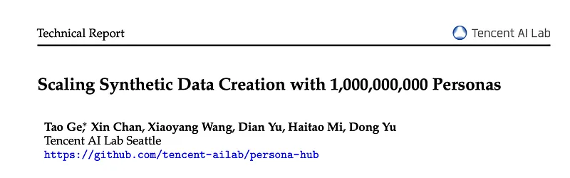 | Title card: Persona Hub. |
| 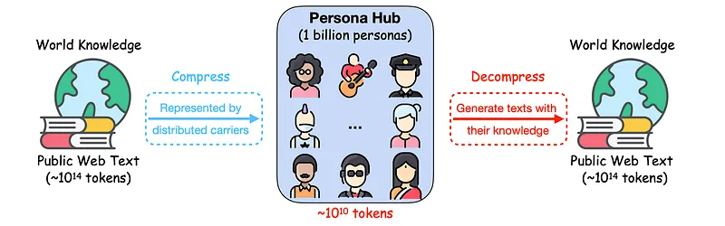 | The dataset is available at HuggingFace. |
| 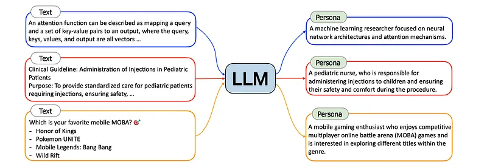 | A person with specific professional experiences and cultural backgrounds will have unique interests in reading and writing. |
| 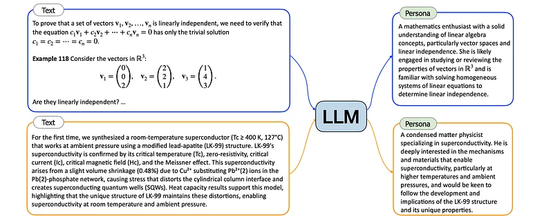 | In practice, LLMs are asked to output persona descriptions as specifically as possible. |
| 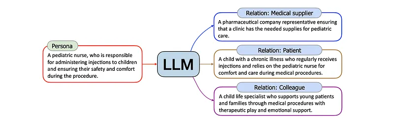 | To supplement the personas that Text-to-Persona might hardly reach, Persona-to-Persona is proposed. |
| 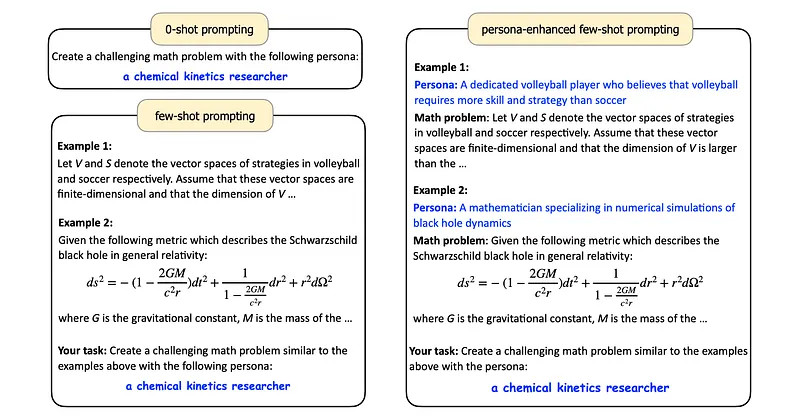 | 0-shot, few-shot and persona-enhanced few-shot prompting methods. |
| 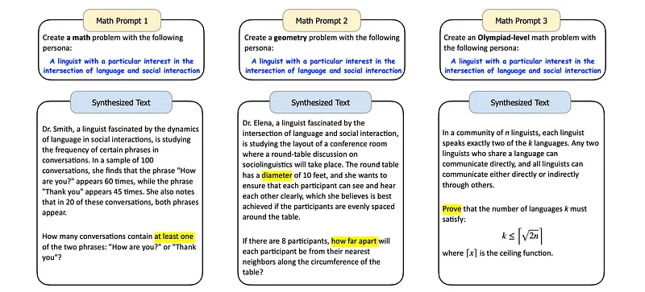 | The persona-driven approach is versatile and adaptable to different data synthesis scenarios by adjusting the data synthesis prompt. |
| 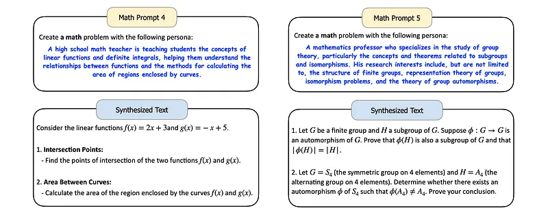 | The persona-driven approach is versatile and adaptable to different data synthesis scenarios by adjusting the data synthesis prompt. |
| 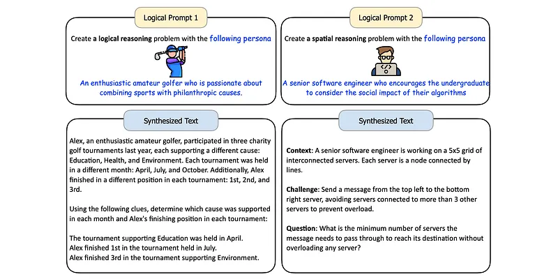 | The persona-driven approach is versatile and adaptable to different data synthesis scenarios by adjusting the data synthesis prompt. |
| 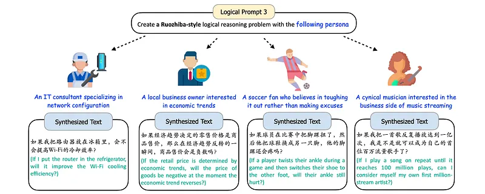 | The persona-driven approach is versatile and adaptable to different data synthesis scenarios by adjusting the data synthesis prompt. |
| 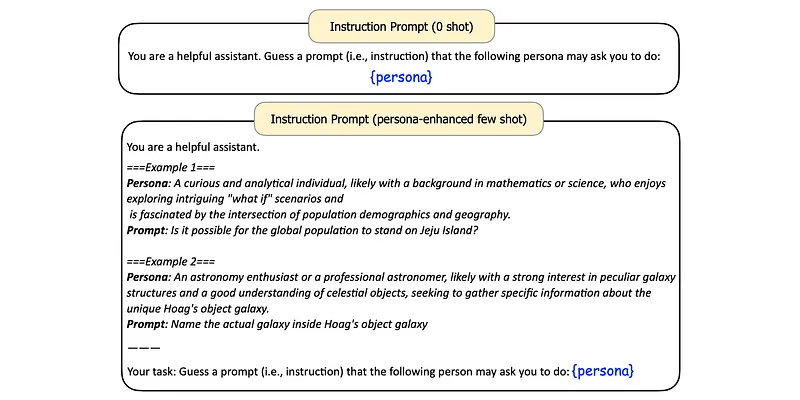 | The persona-driven approach is versatile and adaptable to different data synthesis scenarios by adjusting the data synthesis prompt. |
| 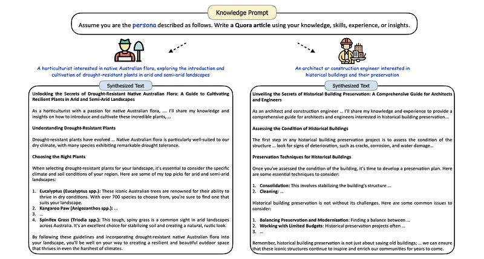 | The persona-driven approach is versatile and adaptable to different data synthesis scenarios by adjusting the data synthesis prompt. |
| 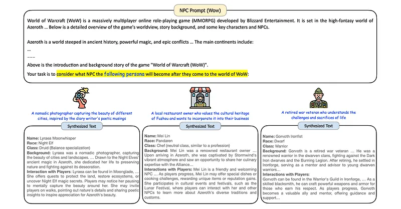 | The persona-driven approach is versatile and adaptable to different data synthesis scenarios by adjusting the data synthesis prompt. |
| 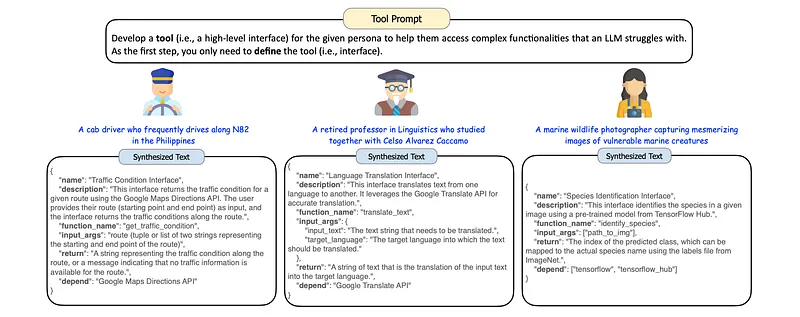 | The persona-driven approach is versatile and adaptable to different data synthesis scenarios by adjusting the data synthesis prompt. |
## Related

- [[Papers Explained Corpus]]
- [[Synthetic Data]]
- [[Large Language Models]]
- [[Papers Explained 320 - SigLIP 2]]
- [[Papers Explained 322 - Phi 4 Mini, Phi 4 Multimodal]]

#summary #topic
