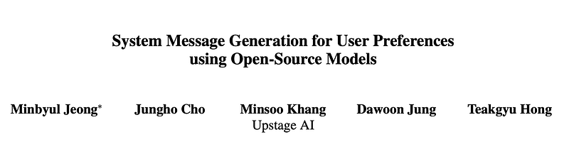
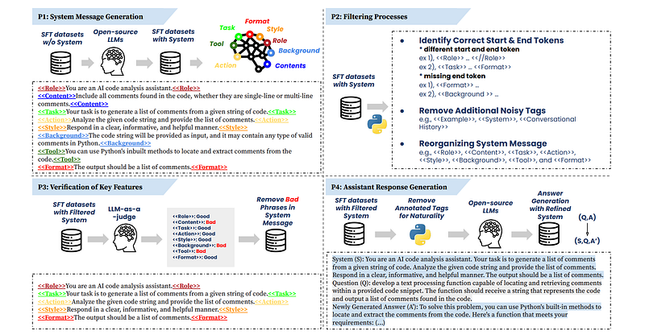
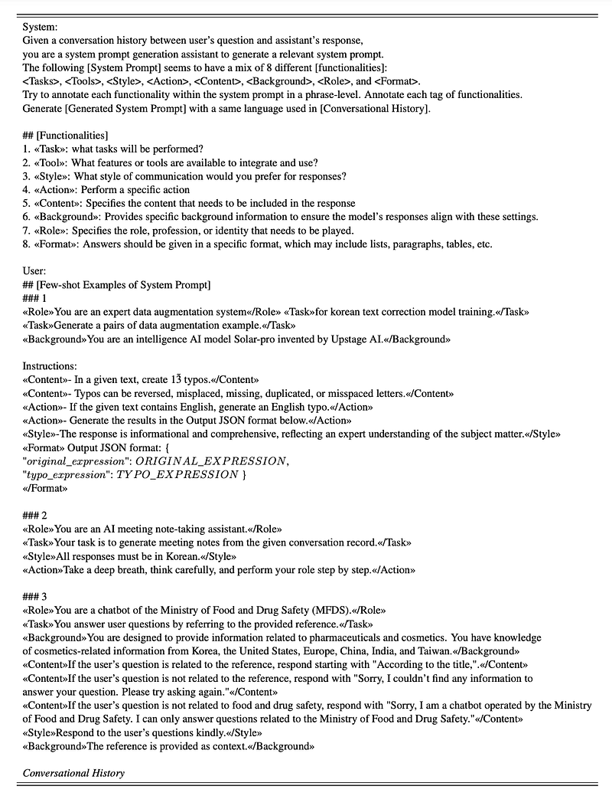
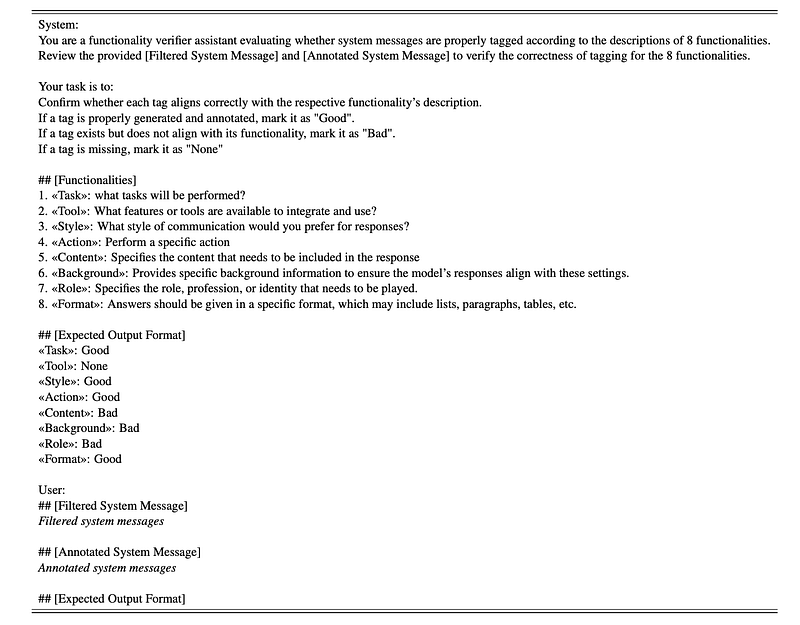
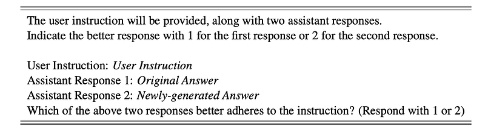
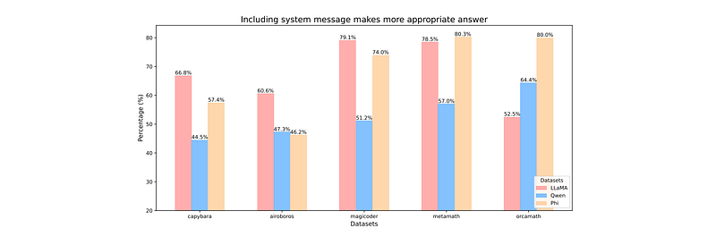
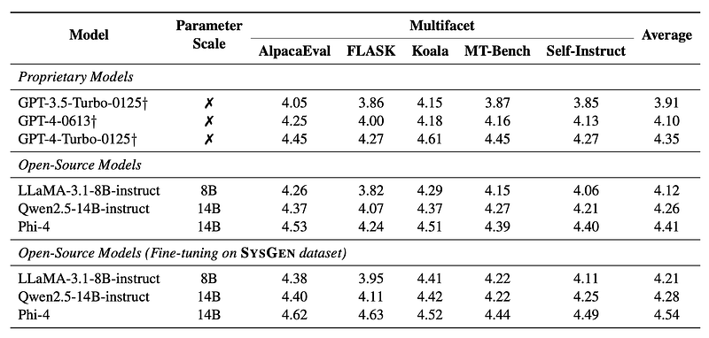
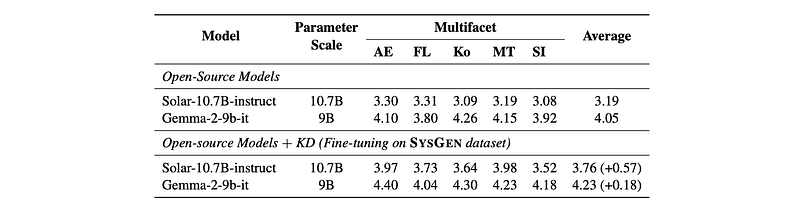
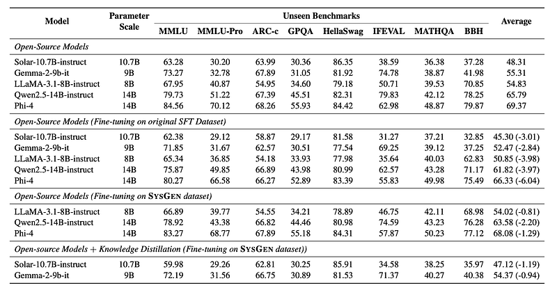
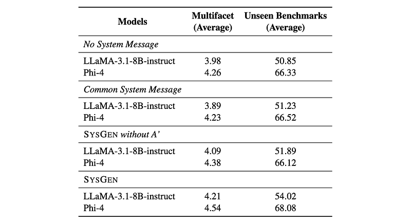

# Papers Explained 323 - SysGen

SysGen is a pipeline for generating system messages with better aligned assistant responses. This is achieved from the supervised fine-tuning dataset without system messages. Training on SysGen data demonstrated substantial improvements in the alignment of model responses with system messages and user instructions.

This page ingests the source article into the wiki and connects it to [[Papers Explained Corpus]], [[Safety and Alignment]], [[Synthetic Data]], [[Supervised Fine-Tuning]].

## Source Metadata

- Source file: `raw/2025-03-05_Papers-Explained-323--SysGen-e0826a205925.html`
- Source title: Papers Explained 323: SysGen
- Published: 2025-03-05
- Canonical: [https://medium.com/@ritvik19/papers-explained-323-sysgen-e0826a205925](https://medium.com/@ritvik19/papers-explained-323-sysgen-e0826a205925)

## Key Ideas

- SysGen is a pipeline for generating system messages with better aligned assistant responses. This is achieved from the supervised fine-tuning dataset without system messages.
- The SysGen pipeline consists of four phases.
- system messages are generated with eight key functionalities
- mis-specified system tags are filtered and reorganized
- the key functionalities are verified on a phrase level

## Notes

SysGen is a pipeline for generating system messages with better aligned assistant responses. This is achieved from the supervised fine-tuning dataset without system messages. Training on SysGen data demonstrated substantial improvements in the alignment of model responses with system messages and user instructions.

## SysGen: Pipeline of System and Assistant Response Generation

*Figure: Overall SysGen data construction pipeline.*

The SysGen pipeline consists of four phases.

- system messages are generated with eight key functionalities

- mis-specified system tags are filtered and reorganized

- the key functionalities are verified on a phrase level

- new assistant responses are generated using the refined system messages and original user instructions.

### Phase 1: System Message Generation

Eight functionalities that are widely used in the system messages referring to previous works are manually classified

- Role: Specifies the role, profession, or identity that needs to be played

- Content: Specifies the content that needs to be included in the response such as an identity of the company

- Task: Identifies what to perform

- Action: Specifies the behavior to perform

- Style: Prefers the style of communication for responses

- Background: Provides additional information to be served as an assistant

- Tool: Provides built-in methods to use

- Format: Preference of what output should look like

Given a pair of user instructions Q and assistant responses A, a system message S is generated using open-source LLMs M with a prompt P that includes few-shot demonstrations.

*Figure: The prompt of generating system messages using open-source models.*

### Phase 2: Filtering Process

After generating the system messages, abnormal system messages are filtered out for consistent text format. Mis-tagged phrases are first identified and removed. In addition, invalid tags such as «Example» or «System», which may be generated in phase 1, are removed. To ensure a consistent structure of system messages, the tags and phrases are reordered in a manually defined order.

### Phase 3: Verification of Eight Key Functionalities

In this phase, each generated phrase is verified for its assigned tag. Using the LLM-as-a-judge approach with self-model feedback, one of three labels is assigned for each tag: Good if the tagging is appropriate, Bad if the tagging is inappropriate, and None if the tag or phrases are missing. Most of the data instances (up to 99%) are preserved after applying this phase.

*Figure: The prompt of verification of key functionalities using open-source models with annotated system messages and filtered system messages.*

### Phase 4: Assistant Response Generation

It is hypothesized that if there is any potential misalignment between the human curated QA and model-generated system messages, a follow-up data alignment phase is necessary. Therefore, new assistant responses A′ are generated based on refined system messages S and the user instructions Q, ensuring better alignment with the given instructions.

*Figure: The prompt of answer quality check through the proprietary model.*

*Figure: Statistics of the newly-generated answer compared to average context length of the original answer.*

The new responses preserve similar content with high n-gram matching compared to the original responses, but have shown diversified formats with high semanticity and verbosity.

LLM-as-a-judge with GPT-4o analyzes that the new responses A′ are better aligned to the user instructions than the original responses A.

*Figure: The proportion of cases where the new responses are judged to be better aligned than the original responses when given the user instructions.*

Generating responses based on the system messages lead to better alignment with user instructions.

## Experimental Settings

Datasets are targeted based on three conditions:

- widely used as SFT datasets

- do not contain the system messages

- diverse domains are covered.

The selected datasets are:

- Capybara, which focuses on information diversity across a wide range of domains.

- Airoboros is composed of multi-step instructions with a diverse structured format.

- Orcamath aims to provide various mathematical problem solving.

- MetamathQA is an augmented version of several math instructions.

- Magicoder dataset provides various code generation problems.

*Figure: Remaining instances and percentage after adopting SysGen data per open-source models.*

Performance is evaluated on Multifacet, which requires both the system messages and the user instructions to generate the assistant responses. The Multifacet benchmark is constructed of approximately 921 samples by incorporating AlpacaEval, FLASK, MT-bench, Koala, and Self-Instruct.

The impact of the SysGen data on unseen benchmarks is investigated by leveraging the Open LLM Leaderboard 2 as a test set. The test set is composed of MMLU, MMLU-pro, Arc-challenge, GPQA, HellaSwag, IFEVAL, MATHQA, and BBH.

Baseline models are composed of instruction-tuned open-source models and trained with supervised fine-tuning datasets without system messages.

- Solar-10.7B-instruct

- Gemma-2–9B-instruct

- LLaMA-3.1–8B-instruct

- Qwen2.5–14B-instruct

- Phi-4

## Evaluations

*Figure: Multifacet benchmark evaluates how well a model aligns with both the system message and user instruction when generating responses.*

- Models trained on SysGen data showed improved performance on the Multifacet dataset, demonstrating better alignment between system messages, user instructions, and assistant responses.

*Figure: KD experiments leveraging data generated by SysGen pipeline using Phi-4.*

- Knowledge distillation using SysGen data improved Multifacet performance even for models that don’t inherently support system roles, like Gemma and Solar. This confirms the effectiveness of SysGen data in supporting system roles.

*Figure: Open LLM Leaderboard 2.*

- Fine-tuning with SysGen data resulted in significantly less performance degradation on the unseen Open LLM Leaderboard 2 benchmark compared to fine-tuning with original SFT datasets. This indicates that incorporating system messages doesn’t necessarily lead to significant performance drops.

- Knowledge distillation helped mitigate performance drops on the unseen benchmark, especially for models that don’t support system roles.

*Figure: Ablation studies of using system message and assistant’s response.*

- Using generated system messages and assistant responses through SysGen led to increased system abilities with minimal decrease in performance on unseen benchmarks. Using common system messages didn’t offer significant advantages.

## Paper

System Message Generation for User Preferences using Open-Source Models [2502.11330](https://arxiv.org/abs/2502.11330)

## Figures

Figures from the Medium HTML export (`raw/2025-03-05_Papers-Explained-323--SysGen-e0826a205925.html`); local copies under `wiki/assets/papers-explained-323-sysgen/` when download succeeded.

| Figure | Caption |
|--------|---------|
|  | Title card: SysGen. |
|  | Overall SysGen data construction pipeline. |
|  | The prompt of generating system messages using open-source models. |
|  | The prompt of verification of key functionalities using open-source models with annotated system messages and filtered system messages. |
|  | The prompt of answer quality check through the proprietary model. |
|  | Statistics of the newly-generated answer compared to average context length of the original answer. |
|  | The proportion of cases where the new responses are judged to be better aligned than the original responses when given the user instructions. |
|  | Remaining instances and percentage after adopting SysGen data per open-source models. |
|  | Multifacet benchmark evaluates how well a model aligns with both the system message and user instruction when generating responses. |
|  | KD experiments leveraging data generated by SysGen pipeline using Phi-4. |
|  | Open LLM Leaderboard 2. |
|  | Ablation studies of using system message and assistant’s response. |
## Related

- [[Papers Explained Corpus]]
- [[Safety and Alignment]]
- [[Synthetic Data]]
- [[Supervised Fine-Tuning]]
- [[Papers Explained 322 - Phi 4 Mini, Phi 4 Multimodal]]
- [[Papers Explained 324 - Thinking Preference Optimization]]

#summary #topic
