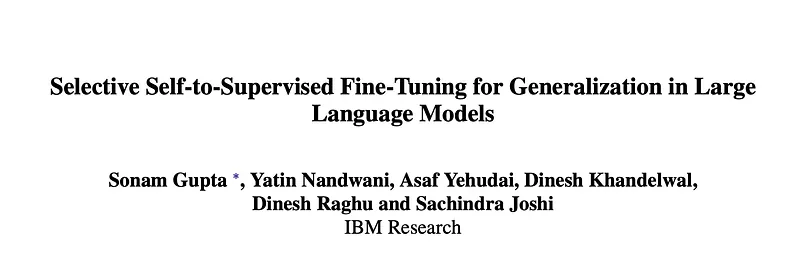
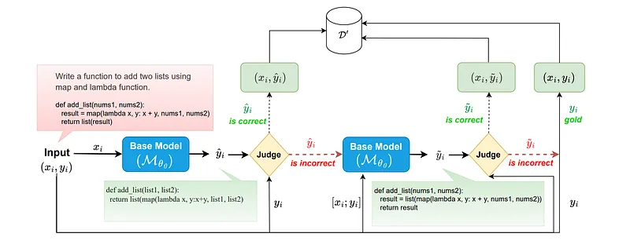
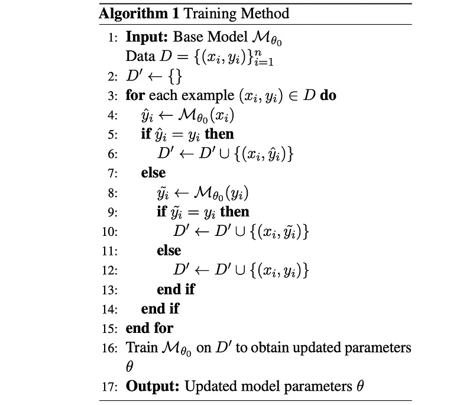
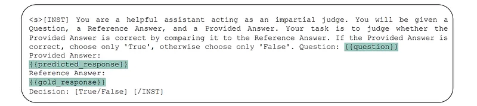
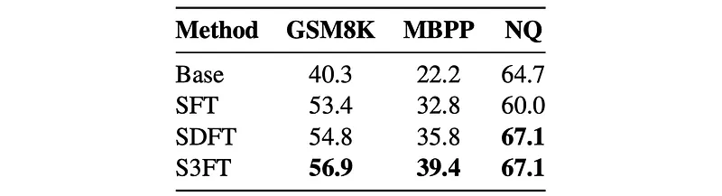
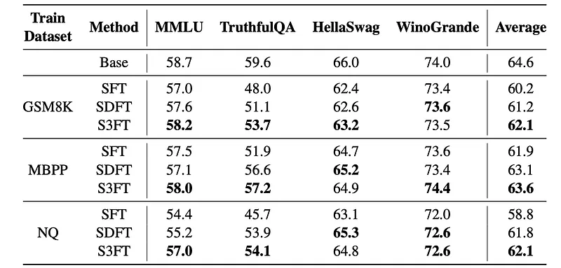
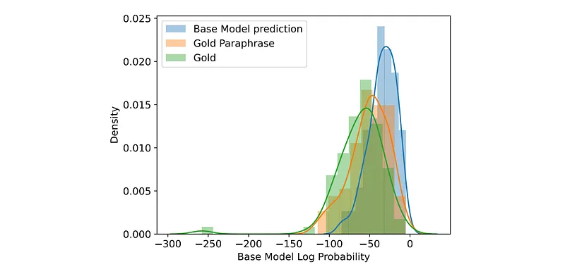

# Papers Explained 325 - Selective Self-to-Supervised Fine-Tuning (S3FT)

S3FT (Self-Supervised Self-Training Fine-Tuning) aims to fine-tune large language models (LLMs) for specific tasks while minimizing the degradation of their general capabilities, a common issue with standard Supervised Fine-Tuning (SFT). It leverages two key observations:

This page ingests the source article into the wiki and connects it to [[Papers Explained Corpus]], [[Large Language Models]], [[Evaluation and Benchmarks]], [[Supervised Fine-Tuning]].

## Source Metadata

- Source file: `raw/2025-03-07_Papers-Explained-325--Selective-Self-to-Supervised-Fine-Tuning--S3FT--b2602400d938.md`
- Source title: Papers Explained 325: Selective Self-to-Supervised Fine-Tuning (S3FT)
- Published: 2025-03-07
- Canonical: [https://medium.com/@ritvik19/papers-explained-325-selective-self-to-supervised-fine-tuning-s3ft-b2602400d938](https://medium.com/@ritvik19/papers-explained-325-selective-self-to-supervised-fine-tuning-s3ft-b2602400d938)

## Key Ideas

- S3FT (Self-Supervised Self-Training Fine-Tuning) aims to fine-tune large language models (LLMs) for specific tasks while minimizing the degradation of their general capabilities, a common issue with standard Supervised Fine-Tuning (SFT).
- Multiple Valid Responses: Many NLP tasks can have multiple correct answers for the same input.
- Self-Learning Preservation: Teaching the model using its own generated language helps preserve its original distribution and mitigate catastrophic forgetting (losing previously learned knowledge).
- Given a training example (input xi, gold answer yi), the base model Mθ0 (pre-trained and instruction-tuned) generates a prediction ˆyi = Mθ0(xi).
- The method checks if ˆyi is equivalent to the gold answer yi. This can be done using:

## Notes

Selective Self-to-Supervised Fine-Tuning (S3FT) is a fine- tuning approach that first identifies the correct model responses from the training set by deploying an appropriate judge. Then, it fine-tunes the model using the correct model responses and the gold response (or its paraphrase) for the remaining samples. S3FT achieves better performance than the standard supervised fine-tuning (SFT) while improving generalization. By utilizing the model’s correct responses, S3FT reduces model specialization during the fine-tuning stage.

## Selective Self-to-Supervised Fine-Tuning (S3FT)

*Figure: An overview of the proposed approach.*

S3FT (Self-Supervised Self-Training Fine-Tuning) aims to fine-tune large language models (LLMs) for specific tasks while minimizing the degradation of their general capabilities, a common issue with standard Supervised Fine-Tuning (SFT). It leverages two key observations:

- Multiple Valid Responses: Many NLP tasks can have multiple correct answers for the same input.

- Self-Learning Preservation: Teaching the model using its own generated language helps preserve its original distribution and mitigate catastrophic forgetting (losing previously learned knowledge).

Initial Prediction:

Given a training example (input xi, gold answer yi), the base model Mθ0 (pre-trained and instruction-tuned) generates a prediction ˆyi = Mθ0(xi).

Equivalence Check:

The method checks if ˆyi is equivalent to the gold answer yi. This can be done using:

- Heuristics: Simple checks like comparing key information or overall agreement.

- LLM Judge: A more powerful LLM assesses the semantic equivalence between ˆyi and yi.

Training Data Selection:

- If ˆyi is equivalent to yi: The pair (xi, ˆyi) is used for training. This reinforces the model’s existing knowledge and helps preserve its original distribution.

- If ˆyi is NOT equivalent to yi: The base model Mθ0 rephrases the gold answer yi in its own language, generating ˜yi = Mθ0([xi; yi]). This attempts to bridge the gap between the gold answer and the model’s own language style.

Second Equivalence Check:

If rephrasing was necessary, the method checks if ˜yi is equivalent to yi.

Final Training Data Selection:

- If ˜yi is equivalent to yi: The pair (xi, ˜yi) is used for training. This teaches the model the desired output while still using its own “language” and minimizing drift from its original distribution.

- If ˜yi is NOT equivalent to yi: The original pair (xi, yi) is used for training. This is a fallback to standard SFT when the model cannot generate a suitable paraphrase.

Mistral-instruct-v2 (7B) is used as the base model and the judge model. For all fine-tuning, Low-Rank Adaptation (LoRA) with a rank of 8, a scaling factor of 16 and a dropout of 0.1 is used.

## Evaluation

*Figure: Performance comparison of various fine tuning techniques using Accuracy(%) as the metric.*

- Improved In-Domain Performance: S3FT significantly outperforms the base model and SFT on in-domain datasets (GSM8K, MBPP, NQ). It achieves comparable performance to SDFT on NQ (reading comprehension).

*Figure: Generalization over other benchmarks.*

- Mitigated Catastrophic Forgetting: S3FT demonstrates better generalization capabilities compared to SFT, showing significantly less performance degradation on out-of-domain benchmarks after fine-tuning. SFT suffers from substantial performance drops on these benchmarks, indicating catastrophic forgetting.

*Figure: : Histogram of the log probability assigned by Mistral-7B-Instruct-v0.2 to the gold responses, paraphrase of gold responses and model’s own predictions.*

- Impact of Gold Response Paraphrasing: Using the model’s own correct responses as training targets (as in S3FT) leads to better performance and generalization. This is attributed to the fact that model-generated responses are often closer to the model’s own distribution than gold responses or even paraphrased gold responses. Training on gold responses can shift the model’s distribution, negatively impacting generalization.

## Paper

Selective Self-to-Supervised Fine-Tuning for Generalization in Large Language Models [2502.08130](https://arxiv.org/abs/2502.08130)

## Figures

Figures from the Medium HTML export (`raw/2025-03-07_Papers-Explained-325--Selective-Self-to-Supervised-Fine-Tuning--S3FT--b2602400d938.md`); local copies under `wiki/assets/papers-explained-325-selective-self-to-supervised-fine-tuning-s3ft/` when download succeeded.

| Figure | Caption |
|--------|---------|
|  | Title card: Selective Self-to-Supervised Fine-Tuning (S3FT). |
|  | An overview of the proposed approach. |
|  | Final Training Data Selection. |
|  | Mistral-instruct-v2 (7B) is used as the base model and the judge model. |
|  | Performance comparison of various fine tuning techniques using Accuracy(%) as the metric. |
|  | Generalization over other benchmarks. |
|  | Histogram of the log probability assigned by Mistral-7B-Instruct-v0.2 to the gold responses, paraphrase of gold responses and model’s own predictions. |
## Related

- [[Papers Explained Corpus]]
- [[Large Language Models]]
- [[Evaluation and Benchmarks]]
- [[Supervised Fine-Tuning]]
- [[Papers Explained 324 - Thinking Preference Optimization]]
- [[Papers Explained 326 - olmOCR]]

#summary #topic
