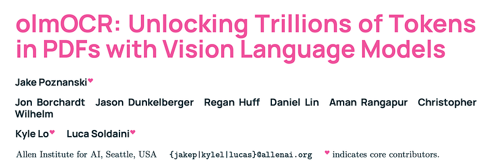
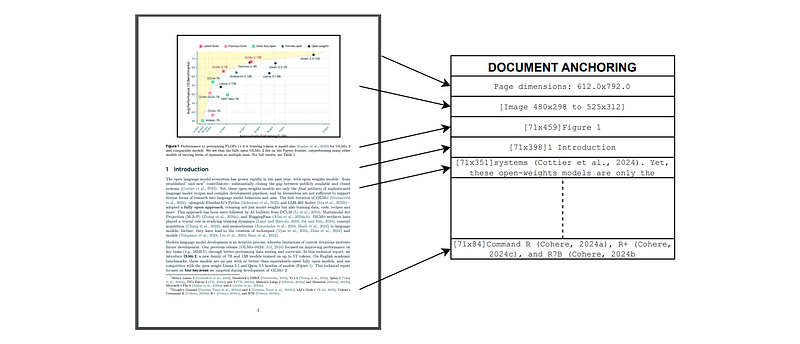
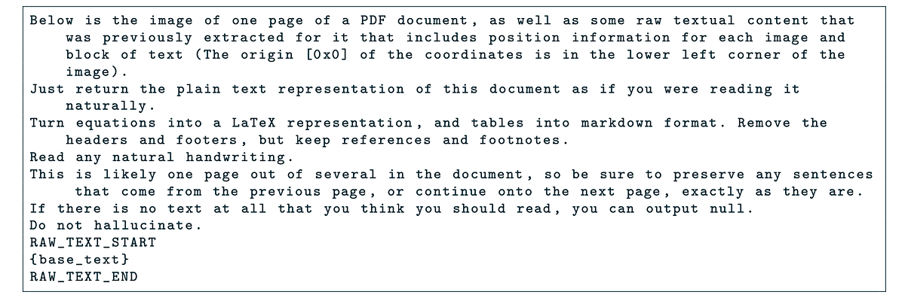
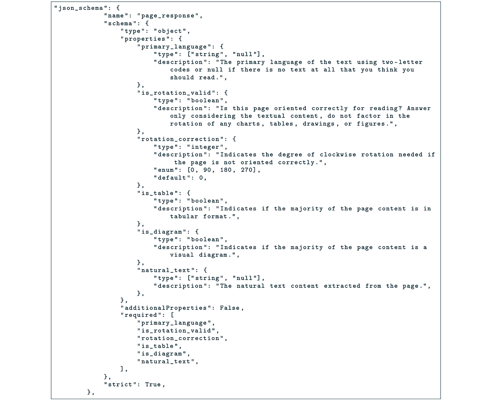
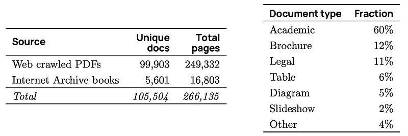
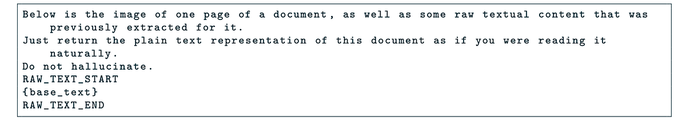
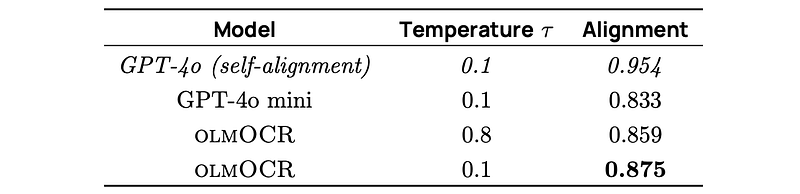
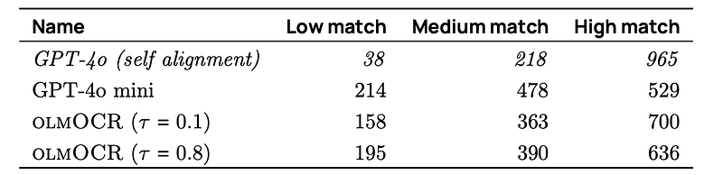
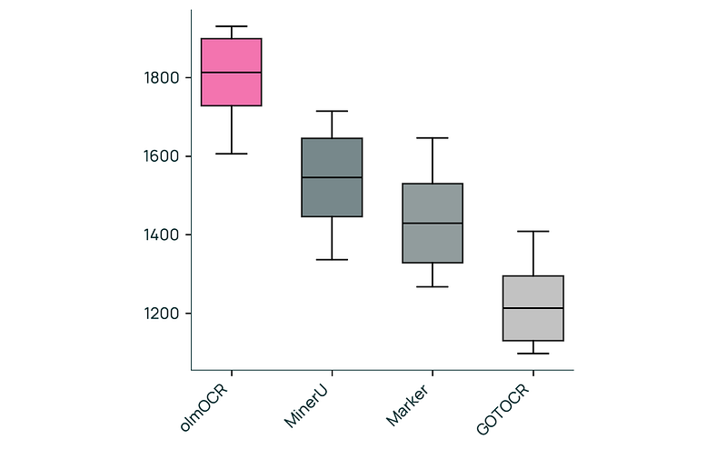
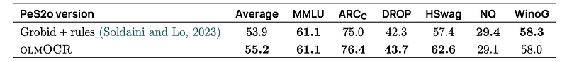

# Papers Explained 326 - olmOCR

olmOCR is an open-source Python toolkit for processing PDFs into clean, linearized plain text in natural reading order while preserving structured content like sections, tables, lists, equations, and more.

This page ingests the source article into the wiki and connects it to [[Papers Explained Corpus]], [[Document AI]], [[Vision Language Models]], [[Large Language Models]], [[Evaluation and Benchmarks]].

## Source Metadata

- Source file: `raw/2025-03-10_Papers-Explained-326--olmOCR-bc9158752901.html`
- Source title: Papers Explained 326: olmOCR
- Published: 2025-03-10
- Canonical: [https://medium.com/@ritvik19/papers-explained-326-olmocr-bc9158752901](https://medium.com/@ritvik19/papers-explained-326-olmocr-bc9158752901)

## Key Ideas

- The toolkit runs a fine-tuned 7B vision language model trained on a sample of 260,000 pages from over 100,000 crawled PDFs with diverse properties, including graphics, handwritten text and poor quality scans.
- Document-anchoring, a technique to extract text and layout information from born-digital PDF documents, is developed. Document-anchoring can be used to prompt VLMs alongside images of document pages to significantly improve extraction.
- Many end-to-end OCR models, such as GOT Theory 2.0 and Nougat, exclusively rely on rasterized pages to convert documents to plain text; that is, they process images of the document pages as input to autoregressively decode text tokens.
- The olmOCR pipeline leverages document text and metadata using Document Anchoring. Document Anchoring extracts coordinates of salient elements in each page (e.g., text blocks and images) and injects them alongside raw text extracted from the PDF binary file.
- Document Anchoring processes PDF document pages via the pypdf library to extract a representation of the page’s structure from the underlying PDF.

## Notes

olmOCR is an open-source Python toolkit for processing PDFs into clean, linearized plain text in natural reading order while preserving structured content like sections, tables, lists, equations, and more.

The toolkit runs a fine-tuned 7B vision language model trained on a sample of 260,000 pages from over 100,000 crawled PDFs with diverse properties, including graphics, handwritten text and poor quality scans. It uses Markdown to represent structured content, such as sections, lists, equations and tables.

Document-anchoring, a technique to extract text and layout information from born-digital PDF documents, is developed. Document-anchoring can be used to prompt VLMs alongside images of document pages to significantly improve extraction.

## Methodology

Many end-to-end OCR models, such as GOT Theory 2.0 and Nougat, exclusively rely on rasterized pages to convert documents to plain text; that is, they process images of the document pages as input to autoregressively decode text tokens. This approach, while offering great compatibility with image-only digitization pipelines, misses the fact that most PDFs are born-digital documents, thus already contain either digitized text or other metadata that would help in correctly linearizing the content.

*Figure: Example of how document-anchoring works for a typical page.*

The olmOCR pipeline leverages document text and metadata using Document Anchoring. Document Anchoring extracts coordinates of salient elements in each page (e.g., text blocks and images) and injects them alongside raw text extracted from the PDF binary file. Crucially, the anchored text is provided as input to any VLM alongside a rasterized image of the page.

Document Anchoring processes PDF document pages via the pypdf library to extract a representation of the page’s structure from the underlying PDF. Starting with the most relevant text blocks and images, these are sampled and added to the prompt of the VLM, up to a defined maximum character limit. This extra information is then available to the model when processing the document.

Overall, using prompts constructed using document-anchoring results in significantly fewer hallucinations. Prompting with just the page image was prone to models completing unfinished sentences, or to invent larger texts when the image data was ambiguous. Finally, while document-anchoring helps with quality on born-digital documents, the pipeline maintains high performance on documents that do not have any digital metadata encoded in them. In these cases, the model will not have the benefit of seeing the internal structure of the PDF document, instead relying on just the rasterized image of a page to process the underlying document.

## Fine-tuning Models for olmOCR

### Choice of teacher mode

Several open-weights and API models were evaluated to label training data. The analysis relied on a qualitative assessment of linearization performance on a small collection of PDF pages with moderately complicated layout. Model outputs were visually assessed across a set of several PDF documents that were known to cause problems for traditional PDF content extraction tools, and contained varied elements such as equations, tables, multi-column layouts, and born-analog documents captured in poor lighting conditions.

- Gemini was discarded because a high proportion of prompts returned RECITATION errors, meaning that the output was too similar to Gemini’s own training data.

- GPT-4o mini produced too many hallucinations

- Claude Sonnet 3.5 was found to be cost prohibitive.

- Ultimately, gpt-4o-2024–08–06 was chosen due to its high performance and relatively low cost in batch mode.

### Choice of PDF tools

olmOCR leverages two tools for PDF rasterization and metadata manipulation: Poppler transforms pages in a PDF to images; PyPDF extracts text blocks, images, and their positions as part of document-anchoring.

### Prompting strategy

A PDF page image is presented to GPT-4o. Each page is rendered using Poppler’s pdftoppm tool at a resolution where the longest edge is 2048 pixels, the largest supported by the GPT-4o model.

Finally, GPT-4o is instructed to respond with structured output to requests.

### Data acquisition and page sampling

To generate the primary training dataset, 100,000 PDFs are sampled from an internal dataset of 240 million PDFs crawled from public internet sites. Using the Lingua package, documents that were not in English are identified and filtered out. Documents that failed to be parsed by pypdf, contain spam keywords, are fillable forms, or whose text is too short are removed. At most 3 pages are then sampled uniformly at random from each PDF. This resulted in approximately 249,332 PDF pages. 5,601 PDFs are also sampled from a dataset of public domain scanned books from the Internet Archive, and processed similarly.

### Model Training

olmOCR-7B-0225-preview is fine-tuned from a Qwen2-VL-7B-Instruct checkpoint.

During fine-tuning, the prompt used for dataset labeling is slightly altered. Some of the additional instructions are removed from the prompt. The image size is shrunk so that PDF pages get rendered to a maximum dimension of 1024 pixels on the longest edge.

The prompt is capped to 6,000 characters, so a typical prompt uses about 1,000 tokens to encode a page image, 1,800 tokens for the anchor text, for about 3,000 total input tokens. Each training example was truncated to 8,192 tokens to cover cases when the prompt was unusually large, and the loss was masked so only the final response tokens participated in the loss calculation.

## Evaluation

### Alignment with Teacher Model

olmOCR’s output is compared to GPT-4o’s output using a document similarity metric based on word alignment with Hirschberg’s algorithm. The alignment score represents the proportion of matching words. GPT-4o’s self-alignment score is also calculated for comparison. Alignment scores are categorized into low, medium, and high buckets.

Low match indicates < 70% alignment, Medium match is 70–95% alignment, High match is >95% alignment.

*Figure: Page-weighted alignment.*

*Figure: Match-up between olmOCR and different models compared to the olmOCR-mix-0225 dataset.*

- olmOCR achieves an average alignment score of 0.875 with GPT-4o, demonstrating good faithfulness.

- This is better than GPT-4o mini’s alignment with GPT-4o.

- Most documents processed with olmOCR have medium to high alignment with GPT-4o.

### Intrinsic Human Evaluation

olmOCR is compared to other PDF linearization tools (Marker, MinerU, GOT-OCR 2.0) through pairwise human evaluations. Human judges assess the quality of the extracted text, focusing on reading order, comprehensiveness, and representation of structured information. ELO ratings are calculated based on these judgments.

*Figure: ELO ranking of olmOCR vs other popular PDF content extraction tools.*

- olmOCR achieves an ELO score over 1800, significantly outperforming other PDF linearization tools (Marker, MinerU, GOT-OCR 2.0). This suggests that olmOCR produces higher quality text extractions.

### Downstream Evaluation

The impact of olmOCR on language model pre training is evaluated by continuing the pretraining of OLMo-2–1124–7B with text extracted using olmOCR and comparing its performance to pretraining with text extracted using existing methods (peS2o, based on Grobid). Performance is measured on standard NLP benchmarks.

- Using olmOCR-extracted text for language model pretraining leads to a 1.3 percentage point improvement on average across several benchmark tasks compared to using peS2o-extracted text. The largest improvements are observed in ARC Challenge and DROP.

## Paper

olmOCR: Unlocking Trillions of Tokens in PDFs with Vision Language Models [2502.18443](https://arxiv.org/abs/2502.18443)

## Figures

Figures from the Medium HTML export (`raw/2025-03-10_Papers-Explained-326--olmOCR-bc9158752901.html`); local copies under `wiki/assets/papers-explained-326-olmocr/` when download succeeded.

| Figure | Caption |
|--------|---------|
|  | Title card: olmOCR. |
|  | Example of how document-anchoring works for a typical page. |
|  | A PDF page image is presented to GPT-4o. |
|  | Finally, GPT-4o is instructed to respond with structured output to requests. |
|  | To generate the primary training dataset, 100,000 PDFs are sampled from an internal dataset of 240 million PDFs crawled from public... |
|  | During fine-tuning, the prompt used for dataset labeling is slightly altered. |
|  | Page-weighted alignment. |
|  | Match-up between olmOCR and different models compared to the olmOCR-mix-0225 dataset. |
|  | ELO ranking of olmOCR vs other popular PDF content extraction tools. |
|  | Downstream Evaluation. |
## Related

- [[Papers Explained Corpus]]
- [[Document AI]]
- [[Vision Language Models]]
- [[Large Language Models]]
- [[Evaluation and Benchmarks]]
- [[Papers Explained 325 - Selective Self-to-Supervised Fine-Tuning (S3FT)]]
- [[Papers Explained 327 - NeoBERT]]

#summary #topic
