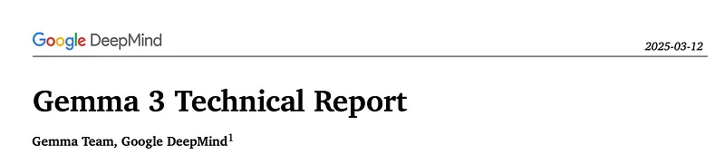
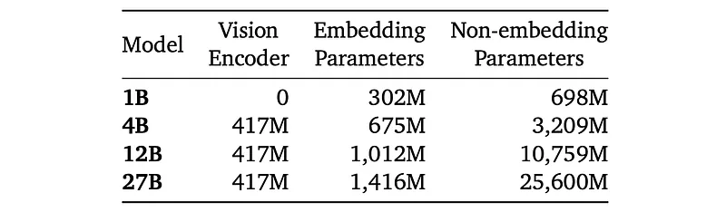
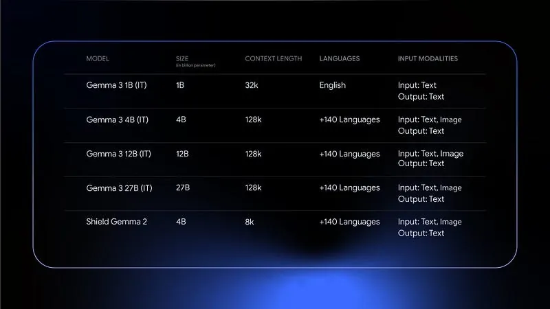
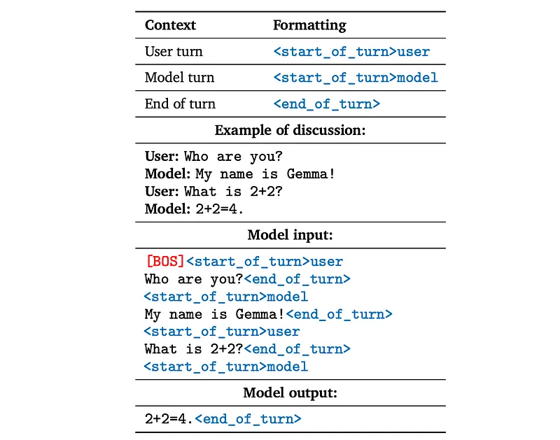
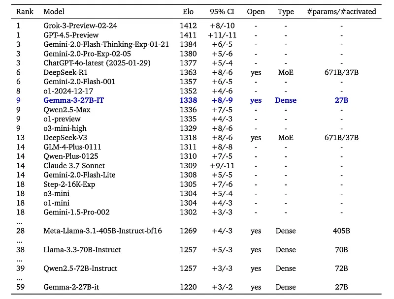
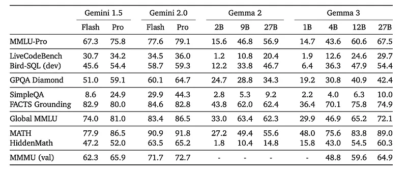
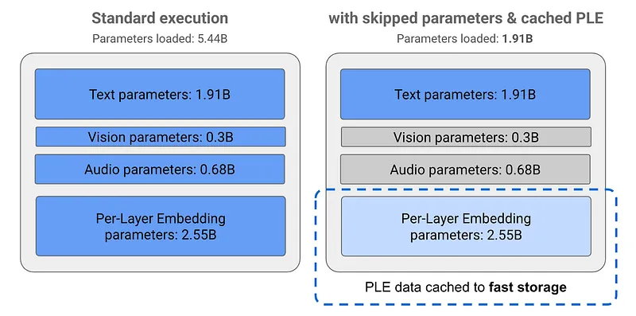
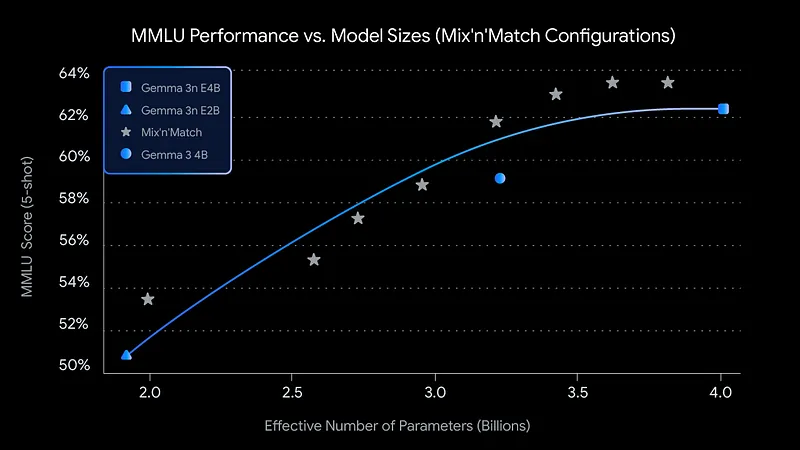

# Papers Explained 329 - Gemma 3

Gemma 3 is a multimodal addition to the Gemma family, ranging in scale from 1 to 27 billion parameters. This version introduces vision understanding abilities, a wider coverage of languages and longer context — at least 128K tokens.

This page ingests the source article into the wiki and connects it to [[Papers Explained Corpus]], [[Large Language Models]], [[Vision Language Models]], [[Multilingual Models]], [[Long Context]], [[Model Compression and Efficiency]], [[Model Distillation]].

## Source Metadata

- Source file: `raw/2025-03-13_Papers-Explained-329--Gemma-3-153803a2c591.md`
- Source title: Papers Explained 329: Gemma 3
- Published: 2025-03-13
- Canonical: [https://medium.com/@ritvik19/papers-explained-329-gemma-3-153803a2c591](https://medium.com/@ritvik19/papers-explained-329-gemma-3-153803a2c591)

## Key Ideas

- Gemma 3 models follow the same general decoder-only transformer architecture as previous iterations. Grouped-Query Attention (GQA) with post-norm and pre-norm with RMSNorm are used. The soft-capping of Gemma 2 is replaced with QK-norm.
- A 5:1 interleaving of local/global layers is implemented. This alternates between a local sliding window self-attention and global self attention with a pattern of 5 local layers for every global layer, starting with a local layer as the first layer of the...
- Gemma 3 models support a context length of 128K tokens, with the exception of the 1B model that has 32K. The RoPE base frequency is increased from 10k to 1M on global self-attention layers, and the frequency of the local layers is kept at 10k.
- A 400M variant of the SigLIP encoder, which is fine-tuned on data from visual assistant tasks, is used. This vision encoder is shared across the 4B, 12B, and 27B models and kept frozen during training.
- The pre-training process follows a similar recipe as in Gemma 2, utilizing knowledge distillation.

## Notes

Gemma 3 is a multimodal addition to the Gemma family, ranging in scale from 1 to 27 billion parameters. This version introduces vision understanding abilities, a wider coverage of languages and longer context — at least 128K tokens. The architecture of the model is changed to reduce the KV-cache memory that tends to explode with long context. This is achieved by increasing the ratio of local to global attention layers, and keeping the span on local attention short.

## Model Architecture

*Figure: Parameter counts for the Gemma 3 models.*

Gemma 3 models follow the same general decoder-only transformer architecture as previous iterations. Grouped-Query Attention (GQA) with post-norm and pre-norm with RMSNorm are used. The soft-capping of Gemma 2 is replaced with QK-norm.

A 5:1 interleaving of local/global layers is implemented. This alternates between a local sliding window self-attention and global self attention with a pattern of 5 local layers for every global layer, starting with a local layer as the first layer of the model.

Gemma 3 models support a context length of 128K tokens, with the exception of the 1B model that has 32K. The RoPE base frequency is increased from 10k to 1M on global self-attention layers, and the frequency of the local layers is kept at 10k.

A 400M variant of the SigLIP encoder, which is fine-tuned on data from visual assistant tasks, is used. This vision encoder is shared across the 4B, 12B, and 27B models and kept frozen during training.

The Gemma vision encoder takes as input square images resized to 896 x 896. This results in artifacts when processing non-square aspect ratios and high-resolution images, leading to unreadable text, or small objects disappearing. An adaptive windowing algorithm during inference addresses this issue. This algorithm segments images into non-overlapping crops of equal size, covering the whole image, and resizes them to 896×896 pixels to pass them to the encoder. This windowing is applied only when necessary, and control is maintained for the maximum number of crops. It is an inference-time only optimization and can be disabled for faster inference.

## Pre-training

The pre-training process follows a similar recipe as in Gemma 2, utilizing knowledge distillation.

Training data for Gemma 3 is slightly larger than Gemma 2:

- 14T tokens for the 27B

- 12T tokens for the 12B

- 4T tokens for the 4B

- 2T tokens for the 1B.

The increase accounts for the mix of images and text used during pre-training. Additionally, the amount of multilingual data is increased to improve language coverage. Both monolingual and parallel data are added.

The same tokenizer as Gemma 2.0 is used: a SentencePiece tokenizer with split digits, preserved whitespace, and byte-level encodings. The resulting vocabulary has 262k entries. This tokenizer is more balanced for non-English languages.

During distillation, 256 logits per token are sampled, weighted by teacher probabilities. The student learns the teacher’s distribution within these samples via cross-entropy loss. The teacher’s target distribution is set to zero probability for non-sampled logits, and renormalized.

## Instruction-Tuning

The post-training approach relies on an improved version of knowledge distillation from a large IT teacher, along with a RL finetuning phase based on improved versions of BOND, WARM, and WARP.

For post-training, Gemma 3 uses 4 components:

- Distillation from a larger instruct model into the Gemma 3 pre-trained checkpoints.

- Reinforcement Learning from Human Feedback (RLHF) to align model predictions with human preferences.

- Reinforcement Learning from Machine Feedback (RLMF) to enhance mathematical reasoning.

- Reinforcement Learning from Execution Feedback (RLEF) to improve coding capabilities.

*Figure: Formatting for Gemma IT models.*

The [BOS] token needs to explicitly added after tokenization, or the `add_bos=True` option is to be used in the tokenizer. Do not tokenize the text “[BOS]”.

## Evaluation

### LMSYS Chatbot Arena

*Figure: Evaluation of Gemma 3 27B IT model in the Chatbot Arena.*

- Gemma 3 27B IT achieved an Elo score of 1338, placing it among the top 10 models on the leaderboard.

- This score surpasses larger non-thinking open models like DeepSeek-V3 (1318), LLaMA 3 405B (1257), and Qwen2.5–70B (1257).

- Gemma 3’s Elo score (1338) shows significant improvement over Gemma 2 (1220).

- The Elo scores used for this evaluation do not factor in visual abilities, which none of the compared models possess.

### Standard benchmarks

*Figure: Performance of instruction fine-tuned (IT) models compared to Gemini 1.5, Gemini 2.0, and Gemma 2 on zero-shot benchmarks across different abilities.*

- Gemma3- 4B-IT is competitive with Gemma2–27B-IT and Gemma3–27B-IT is comparable to Gemini-1.5-Pro across benchmarks.

## Gemma 3n

Gemma 3n is a generative AI model optimized for use in everyday devices, such as phones, laptops, and tablets. This model includes innovations in parameter-efficient processing, including Per-Layer Embedding (PLE) parameter caching and a MatFormer model architecture that provides the flexibility to reduce compute and memory requirements.

Gemma 3n includes the following key features:

- Audio input: Process sound data for speech recognition, translation, and audio data analysis.

- Visual and text input: Multimodal capabilities let you handle vision, sound, and text to help you understand and analyze the world around.

- Wide language support: Wide linguistic capabilities, trained in over 140 languages.

- 32K token context: Substantial input context for analyzing data and handling processing tasks.

### Model parameters and effective parameters

Gemma 3n models are listed with parameter counts (e.g., E2B, E4B) that are lower than the total number of parameters. The “E” prefix indicates that these models can operate with a reduced set of “Effective” parameters. This is achieved through flexible parameter technology built into Gemma 3n, allowing them to run efficiently on lower-resource devices. The parameters are divided into text, visual, audio, and per-layer embedding (PLE) parameters. With standard execution of the E2B model, over 5 billion parameters are loaded when executing the model. However, using parameter skipping and PLE caching techniques, this model can be operated with an effective memory load of just under 2 billion (1.91B) parameters.

### PLE caching

Gemma 3n models include Per-Layer Embedding (PLE) parameters. These parameters are used during model execution to enhance the performance of each model layer. The PLE data can be generated separately, outside the operating memory of the model, cached to fast storage, and then added to the model inference process as each layer runs. This reduces resource consumption while still improving model response quality.

### MatFormer architecture

Gemma 3n models use a Matryoshka Transformer (MatFormer) model architecture. This architecture contains nested, smaller models within a single, larger model. The nested sub-models can be used for inferences without activating the parameters of the enclosing models. This reduces compute cost, response time, and energy footprint. The E4B model contains the parameters of the E2B model. This architecture also lets you select parameters and assemble models in intermediate sizes between 2B and 4B.

### Conditional parameter loading

In Gemma 3n, you can skip loading some parameters into memory, such as audio or visual parameters, to reduce memory load. These parameters can be dynamically loaded at runtime if the device has the required resources. This further reduces the required operating memory, enabling execution on a wider range of devices and allowing developers to increase resource efficiency for less demanding tasks.

## Paper

[Gemma 3 Technical Report](https://storage.googleapis.com/deepmind-media/gemma/Gemma3Report.pdf)

## Figures

Figures from the Medium HTML export (`raw/2025-03-13_Papers-Explained-329--Gemma-3-153803a2c591.md`); local copies under `wiki/assets/papers-explained-329-gemma-3/` when download succeeded.

| Figure | Caption |
|--------|---------|
|  | Title card: Gemma 3. |
|  | Parameter counts for the Gemma 3 models. |
|  | Gemma 3 models support a context length of 128K tokens, with the exception of the 1B model that has 32K. |
|  | Formatting for Gemma IT models. |
|  | Evaluation of Gemma 3 27B IT model in the Chatbot Arena. |
|  | Performance of instruction fine-tuned (IT) models compared to Gemini 1.5, Gemini 2.0, and Gemma 2 on zero-shot benchmarks across different abilities. |
|  | Gemma 3n models are listed with parameter counts (e.g., E2B, E4B) that are lower than the total number of parameters. |
|  | In Gemma 3n, you can skip loading some parameters into memory, such as audio or visual parameters, to reduce memory load. |
## HF Blog Cross-References

- [Welcome Gemma 3: Google's all new multimodal, multilingual, long context open LLM](https://huggingface.co/blog/gemma3) (2025-03-12) — Hugging Face's integration walkthrough (Transformers, MLX, llama.cpp, Hugging Face Endpoints) with the same three headline advances covered above (128K context via RoPE base 10k→1M, SigLIP-based multimodality with pan-and-scan cropping, and doubled multilingual pretraining data with a 262K-entry tokenizer).

## Related

- [[Papers Explained Corpus]]
- [[Large Language Models]]
- [[Vision Language Models]]
- [[Multilingual Models]]
- [[Long Context]]
- [[Model Compression and Efficiency]]
- [[Model Distillation]]
- [[Papers Explained 328 - LIMO]]
- [[Papers Explained 330 - Gemini Embedding]]

#summary #topic
