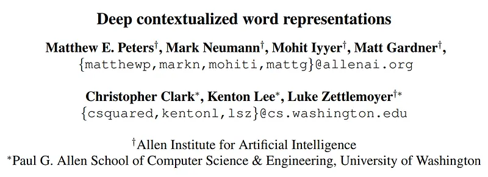
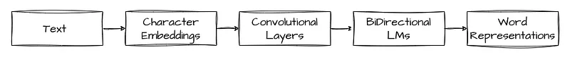

# Papers Explained 33 - ELMo

Pre-trained word representations should ideally model both: complex characteristics of word use (e.g., syntax and semantics), and how these uses vary across linguistic contexts (i.e., to model polysemy).

This page ingests the source article into the wiki and connects it to [[Papers Explained Corpus]], [[Embedding and Retrieval]], [[Synthetic Data]].

## Source Metadata

- Source file: `raw/2023-03-06_Papers-Explained-33--ELMo-76362a43e4.md`
- Source title: Papers Explained 33: ELMo
- Published: 2023-03-06
- Canonical: [https://medium.com/@ritvik19/papers-explained-33-elmo-76362a43e4](https://medium.com/@ritvik19/papers-explained-33-elmo-76362a43e4)

## Key Ideas

- ELMo is a new type of deep contextualized word representation that directly addresses both challenges, can be easily integrated into existing models, and significantly improves the state of the art in every considered case across a range of challenging...
- ELMo representations differ from traditional word type embeddings in that each token is assigned a representation that is a function of the entire input sentence.
- ELMo word representations are computed on top of two-layer biLMs with character convolutions, as a linear function of the internal network states.
- The Elmo model consists of three main components:
- Character-based word representations:
Elmo starts by generating character-based word representations.

## Notes

Pre-trained word representations should ideally model both: complex characteristics of word use (e.g., syntax and semantics), and how these uses vary across linguistic contexts (i.e., to model polysemy).

ELMo is a new type of deep contextualized word representation that directly addresses both challenges, can be easily integrated into existing models, and significantly improves the state of the art in every considered case across a range of challenging language understanding problems.

ELMo representations differ from traditional word type embeddings in that each token is assigned a representation that is a function of the entire input sentence.

ELMo word representations are computed on top of two-layer biLMs with character convolutions, as a linear function of the internal network states.

The Elmo model consists of three main components:

Character-based word representations:
Elmo starts by generating character-based word representations. Each word is broken down into a sequence of characters, and a character-level embedding is computed for each character using a convolutional neural network (CNN). These character-level embeddings are then combined to form a word-level representation. By using character-level embeddings, Elmo can handle out-of-vocabulary words and generate better representations for rare or misspelled words.

Bidirectional LSTM network:
The next component of Elmo is a bidirectional LSTM network. The LSTM network processes the input sequence of word representations in both the forward and backward directions. This allows the model to capture the contextual dependencies of each word with respect to its preceding and succeeding words. At each layer, the LSTM cells take as input the current word representation and the output of the previous layer and produce a hidden state vector for the current word. The output of the last LSTM layer is then used to compute the final contextualized word representation.

Task-specific layers:
The final component of Elmo is the task-specific layers. These layers are added on top of the bidirectional LSTM network and are trained for a specific downstream task such as sentiment analysis, named entity recognition, or machine translation. The task-specific layers can be as simple as a linear layer for classification or a more complex neural network for sequence labeling. The task-specific layers are trained on top of the Elmo embeddings, which capture the contextual information of the input text.

### Evaluation

ELMo has been evaluated on various NLP tasks and datasets, including:

- Question answering: ELMo has been evaluated on the Stanford Question Answering Dataset (SQuAD) and achieved state-of-the-art performance on this task.

- Sentiment analysis: ELMo has been evaluated on the Stanford Sentiment Treebank (SST) dataset and achieved state-of-the-art results.

- Named entity recognition (NER): ELMo has been evaluated on the CoNLL-2003 NER dataset and achieved state-of-the-art results.

- Natural Language Inference (NLI): ELMo has been evaluated on the Stanford Natural Language Inference (SNLI) dataset and achieved state-of-the-art results.

- Semantic Role Labeling (SRL): ELMo has been evaluated on the CoNLL-2005 SRL dataset and achieved state-of-the-art results.

In addition to these datasets and tasks, ELMo has also been evaluated on other datasets such as the GLUE benchmark, the Multi-Genre Natural Language Inference (MNLI) dataset, and the Common Crawl dataset, among others.

Overall, ELMo has shown to be highly effective in a wide range of NLP tasks, achieving state-of-the-art results on many benchmark datasets.

## Paper

Deep contextualized word representations [1802.05365](https://arxiv.org/abs/1802.05365)

## Figures

Figures from the Medium HTML export (`raw/2023-03-06_Papers-Explained-33--ELMo-76362a43e4.md`); local copies under `wiki/assets/papers-explained-33-elmo/` when download succeeded.

| Figure | Caption |
|--------|---------|
|  | Title card: ELMo. |
|  | The Elmo model consists of three main components. |
## Related

- [[Papers Explained Corpus]]
- [[Embedding and Retrieval]]
- [[Synthetic Data]]
- [[Papers Explained Review 04 - Tabular Deep Learning]]
- [[Papers Explained 34 - TransformerXL]]

#summary #topic
