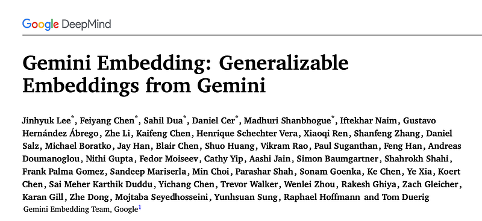
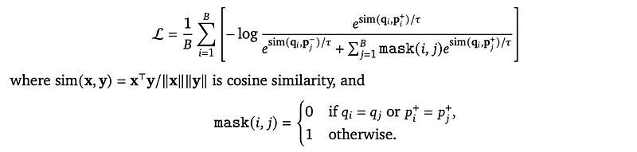
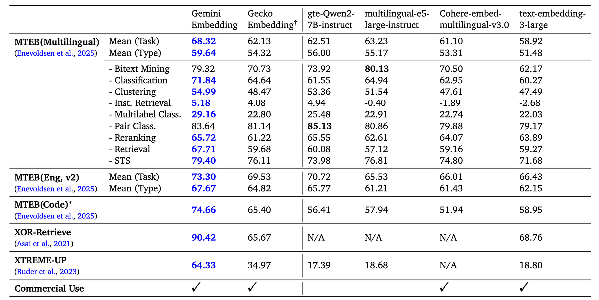
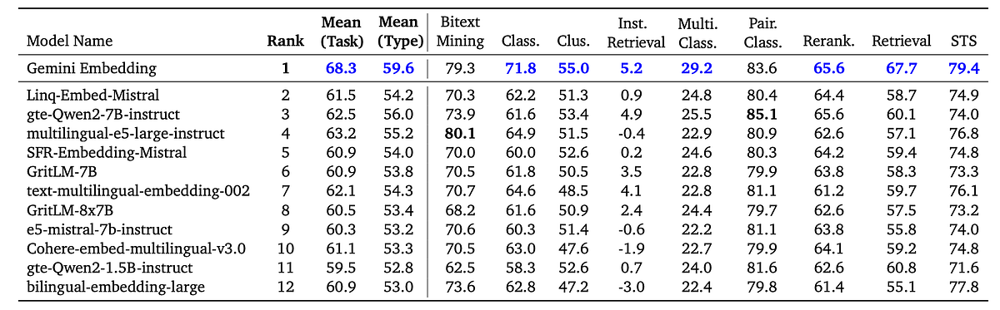
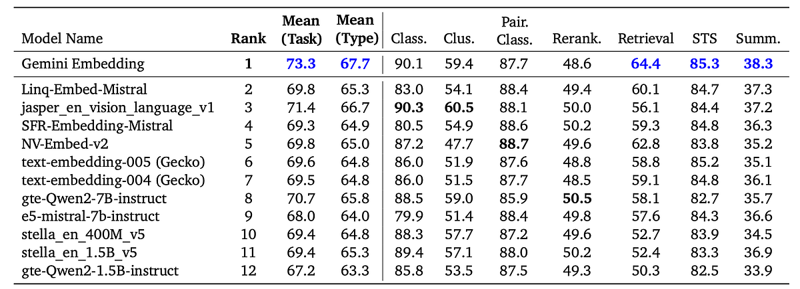
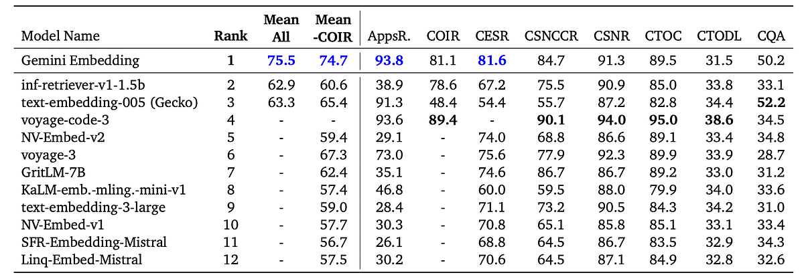
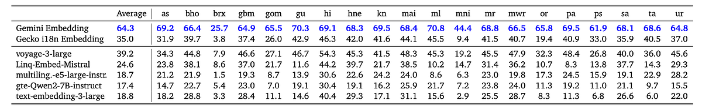
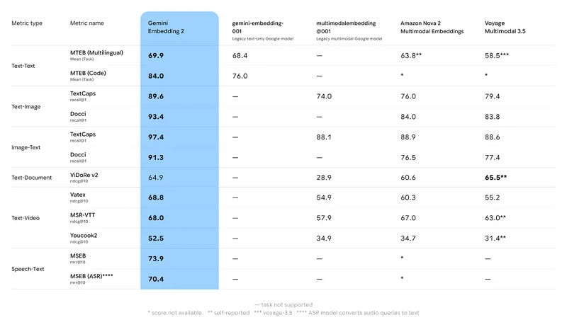

# Papers Explained 330 - Gemini Embedding

Gemini Embedding leverages the power of Gemini to produce highly generalizable embeddings for text spanning numerous languages and textual modalities.

This page ingests the source article into the wiki and connects it to [[Papers Explained Corpus]], [[Embedding and Retrieval]], [[Large Language Models]], [[Synthetic Data]], [[Supervised Fine-Tuning]].

## Source Metadata

- Source file: `raw/2025-03-14_Papers-Explained-330--Gemini-Embedding-324982aeb756.html`
- Source title: Papers Explained 330: Gemini Embedding
- Published: 2025-03-14
- Canonical: [https://medium.com/@ritvik19/papers-explained-330-gemini-embedding-324982aeb756](https://medium.com/@ritvik19/papers-explained-330-gemini-embedding-324982aeb756)

## Key Ideas

- The Gemini Embedding model is trained with a noise-contrastive estimation (NCE) loss with in-batch negatives. The exact loss differs slightly depending on the stage of training.
- Given a batch of size 𝐵 the loss applied to these embeddings is as follows:
- This masking term is particularly relevant for classification tasks, where the number of targets (labels) is small. The first term in the denominator is omitted if no hard negative is provided.
- In order to support different dimensions of embeddings with a single model, the above loss is adapted using MRL, which adapts the loss above into 𝑘 separate losses across 𝑘 overlapping sub-dimensions of the embedding (e.g.
- Pre-training: Initializing the embedding model from the Gemini parameters is a good starting point that leverages the language model power. This initialization can be considered a “pre-training” of the embedding model.

## Notes

Gemini Embedding leverages the power of Gemini to produce highly generalizable embeddings for text spanning numerous languages and textual modalities.

## Model Architecture

The embedding model is initialized from Gemini and further refined. This allows Gemini Embedding to build representations on top of the vast knowledge already present in Gemini’s parameters. This can be seen as the “pre-training” of the Gemini Embedding model. An input sequence T of 𝐿 tokens is processed by M, a transformer with bidirectional attention initialized from Gemini, producing a sequence of token embeddings Tembed = M(T). To generate a single embedding representing all the information in the input, a pooler P is applied, Pembed = P(Tembed). Mean pooling is used to simply average the token embeddings along the sequence axis. Finally, a randomly initialized linear projection f is applied to scale the embedding to the target dimension, E = f(Pembed).

## Training Objective

The Gemini Embedding model is trained with a noise-contrastive estimation (NCE) loss with in-batch negatives. The exact loss differs slightly depending on the stage of training. In general, a training example includes a query 𝑞, a positive target 𝑝+ and (optionally) a hard negative target 𝑝−. Each example also has a prescribed task string 𝑡, describing the nature of the task.

Given a batch of size 𝐵 the loss applied to these embeddings is as follows:

This masking term is particularly relevant for classification tasks, where the number of targets (labels) is small. The first term in the denominator is omitted if no hard negative is provided.

In order to support different dimensions of embeddings with a single model, the above loss is adapted using MRL, which adapts the loss above into 𝑘 separate losses across 𝑘 overlapping sub-dimensions of the embedding (e.g. multi-loss training with one loss for the first 768 embedding dimensions, another for the first 1,536 dimensions, and so on). Gemini Embedding provides 𝑑 = 3, 072 dimensional embeddings, with the MRL support on 768 and 1,536 dimensions.

## Training Recipe

Pre-training: Initializing the embedding model from the Gemini parameters is a good starting point that leverages the language model power. This initialization can be considered a “pre-training” of the embedding model.

Pre-finetuning: First, the model is “pre-finetuned” on a large number of potentially noisy (query, target) pairs, omitting the hard-negative term from the loss function. It is beneficial to use a large batch size, as the primary objective is to adapt the parameters from autoregressive generation to encoding.

Finetuning: Next, the model is fine-tuned on a large mixture of task-specific datasets which contain (query, target, hard negative target) triples. For this phase of training smaller batch sizes (e.g., less than 1024) are beneficial, and furthermore, each batch is limited to a single dataset. Distinguishing a given positive target from in-batch targets from the same task provides greater signal than discerning (say) a retrieval target from a classification label.

Model Soup: To obtain additional generalization performance, the parameters obtained from individual fine-tuning runs are averaged. The final set of ingredient checkpoints were obtained through a combination of intentional data variation as well as manual checkpoint selection and experimentation.

## Datasets

### Training Data Mixture

The pre-finetuning stage aims to maximize the exposure of diverse training datasets to Gemini Embedding models. A billion-scale web corpus is leveraged and title and passage pairs are used as input and positive target pairs. This technique is consistently found to be effective even when the embedding model is initialized from an LLM.

For fine-tuning, three different mixtures are prepared aiming for task diversity, language diversity, and coding capability. For task diversity, a subset of academic datasets used by Gecko as well as several synthetic datasets are used. Unlike existing models on the classic MTEB, many in-domain MTEB datasets are excluded. The training mixture rate is decided based on a fine-grained grid search, initialized from the optimal number of training steps to converge on each training dataset.

### Improving Data Quality with Gemini

The training mixture is diversified and improved by adding synthetically generated datasets for two task types: retrieval and classification. For retrieval, prior work on synthetic data generation is extended using Gemini enhanced adaptations of FRet and SWIM-IR. Few-shot prompting is used, first employing Gemini to generate synthetic queries for web passages followed by a Gemini auto-rater to filter lower-quality examples (e.g., unrealistic search queries). For classification, synthetic counterfactual, sentiment, and review classification datasets in English are generated. To increase the quality of these synthetic datasets, multi-stage prompting strategies are developed, such as conditioning on synthetic user, product, or movie generations in a hierarchical manner and sampling from the tail of longer lists of generations, as diversity naturally increases with generation length.

Gemini is used to filter bad examples. Based on few-shot prompting for data quality assessment, low quality examples are removed.

Hard negatives for retrieval datasets are mined using Gemini. A Gemini-initialized embedding model is first trained without using any hard negatives. Based on this initial embedding model, the top 𝑘 nearest neighbors for each query are retrieved. Each nearest neighbor is then scored by Gemini along with the query. Two different prompting strategies — graded classification and query likelihood — are employed, combining the scores with Reciprocal Rank Fusion (RRF). The lowest-scoring nearest neighbors, (the 𝑘-th neighbor after being sorted by Gemini scores) serve as the best hard negatives.

## Evaluation

*Figure: Comparison of embedding models on Massive Multilingual Embedding Benchmark: MTEB(Multilingual), MTEB(Eng, v2), and MTEB(Code).*

- Gemini Embedding achieved state-of-the-art performance across multiple benchmarks (MTEB Multilingual, English v2, Code, XOR-Retrieve, and XTREME-UP), demonstrating its strength as a general-purpose and cross-lingual embedding model. It ranked #1 on MTEB Multilingual, English v2, and Code leaderboards.

*Figure: Performance of top leaderboard models on MTEB(Multilingual).*

- On MTEB Multilingual, Gemini Embedding achieved the highest Borda rank and showed significant improvements in Classification (+9.6), Clustering (+3.7), and Retrieval (+9.0) compared to the second-best model.

*Figure: Performance of top leaderboard models on MTEB(Eng, v2).*

- On MTEB (English v2), Gemini Embedding achieved the highest Borda rank and demonstrated substantial improvements in Classification (+7.1), Clustering (+5.3), and Retrieval (+4.3) compared to the second-best model.

*Figure: Performance of top leaderboard models on MTEB(Code).*

- On MTEB (Code), Gemini Embedding achieved the highest Borda rank and the best mean performance across all eight tasks, as well as the best mean performance excluding the COIRCodeSearchNetRetrieval task.

*Figure: Performance of top multilingual models on XTREME-UP (MRR@10).*

- On XTREME-UP, Gemini Embedding showed significant improvement in cross-lingual retrieval, effectively mapping queries in 20 underrepresented languages to English passages.

## Gemini Embedding 2

Gemini Embedding 2 is google’s first natively multimodal embedding model that maps text, images, video, audio and documents into a single embedding space, enabling multimodal retrieval and classification across different types of media and captures semantic intent across over 100 languages

- Text: supports an expansive context of up to 8192 input tokens

- Images: capable of processing up to 6 images per request, supporting PNG and JPEG formats

- Videos: supports up to 120 seconds of video input in MP4 and MOV formats

- Audio: natively ingests and embeds audio data without needing intermediate text transcriptions

- Documents: directly embed PDFs up to 6 pages long

Beyond processing one modality at a time, this model natively understands interleaved input so you can pass multiple modalities of input in a single request.

Gemini Embedding 2 incorporates Matryoshka Representation Learning (MRL), a technique that “nests” information by dynamically scaling down dimensions. This enables flexible output dimensions scaling down from the default 3072 to 536 and 768.

## Paper

Gemini Embedding: Generalizable Embeddings from Gemini [2503.07891](https://arxiv.org/abs/2503.07891)

[Gemini Embedding 2: Our first natively multimodal embedding model](https://blog.google/innovation-and-ai/models-and-research/gemini-models/gemini-embedding-2/)

## Figures

Figures from the Medium HTML export (`raw/2025-03-14_Papers-Explained-330--Gemini-Embedding-324982aeb756.html`); local copies under `wiki/assets/papers-explained-330-gemini-embedding/` when download succeeded.

| Figure | Caption |
|--------|---------|
|  | Title card: Gemini Embedding. |
|  | Given a batch of size 𝐵 the loss applied to these embeddings is as follows. |
|  | Comparison of embedding models on Massive Multilingual Embedding Benchmark: MTEB(Multilingual), MTEB(Eng, v2), and MTEB(Code). |
|  | Performance of top leaderboard models on MTEB(Multilingual). |
|  | Performance of top leaderboard models on MTEB(Eng, v2). |
|  | Performance of top leaderboard models on MTEB(Code). |
|  | Performance of top multilingual models on XTREME-UP (MRR@10). |
|  | Gemini Embedding 2 incorporates Matryoshka Representation Learning (MRL), a technique that “nests” information by dynamically scaling down... |
## Related

- [[Papers Explained Corpus]]
- [[Embedding and Retrieval]]
- [[Large Language Models]]
- [[Synthetic Data]]
- [[Supervised Fine-Tuning]]
- [[Papers Explained 329 - Gemma 3]]
- [[Papers Explained 331 - MAmmoTH-VL 2]]

#summary #topic
