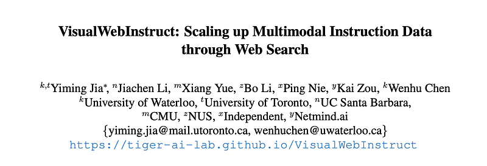
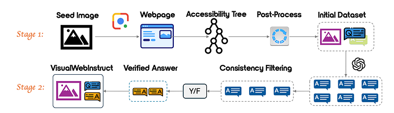
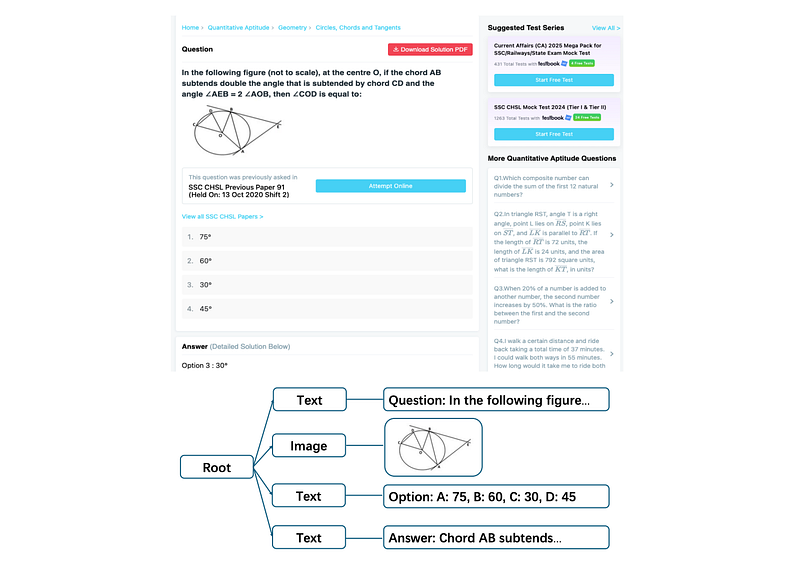
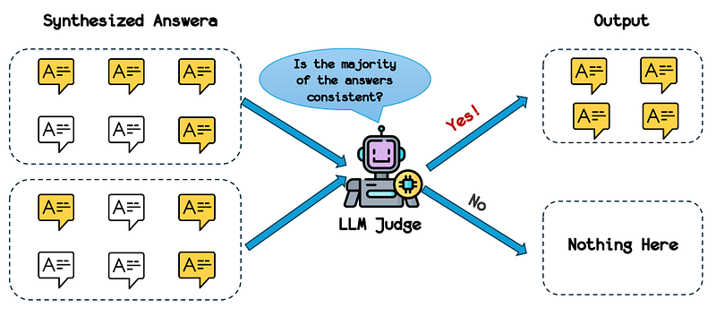
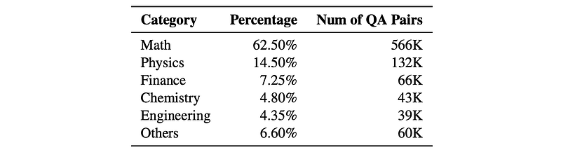
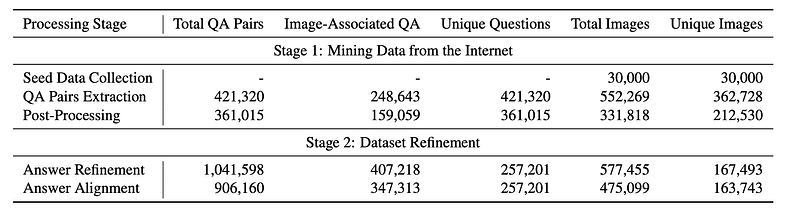
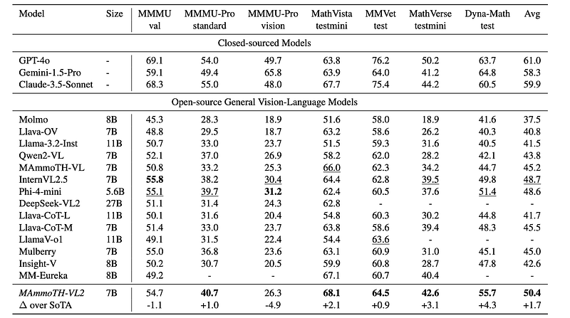

# Papers Explained 331 - MAmmoTH-VL 2

The project is available on [GitHub](https://tiger-ai-lab.github.io/VisualWebInstruct/).

This page ingests the source article into the wiki and connects it to [[Papers Explained Corpus]], [[Large Language Models]], [[Synthetic Data]], [[Vision Language Models]], [[Safety and Alignment]], [[Evaluation and Benchmarks]].

## Source Metadata

- Source file: `raw/2025-03-17_Papers-Explained-331--MAmmoTH-VL-2-108ac94dc3b3.html`
- Source title: Papers Explained 331: MAmmoTH-VL 2
- Published: 2025-03-17
- Canonical: [https://medium.com/@ritvik19/papers-explained-331-mammoth-vl-2-108ac94dc3b3](https://medium.com/@ritvik19/papers-explained-331-mammoth-vl-2-108ac94dc3b3)

## Key Ideas

- The seed dataset consists of approximately 30,000 images, which are crawled from Stemez2 in compliance with copyright regulations.
- Using the seed images, Google Image searches are conducted to find visually similar content across the web. Leveraging Google Lens, approximately 60 URLs per image are collected, resulting in a total of 1,747,634 URLs containing visually similar content.
- A post-processing stage is implemented using the Gemini 1.5 Flash model to ensure dataset quality by evaluating both textual content and images.
- Analysis shows that out of 421,320 processed pairs, 361,015 (85.7%) are valid, while 60,305 are filtered out as invalid. Similarly, out of 449,859 total images processed, 331,818 (73.76%) are deemed valid and relevant to their corresponding questions.
- In this step, Gemini-2.0-Flash is used to measure the alignment between GPT-generated responses and the original extracted answers, if available.

## Notes

VisualWebInstruct is a novel approach that leverages search engines to create a diverse, and high-quality dataset spanning multiple disciplines like math, physics, finance, chemistry, etc. Starting with meticulously selected 30,000 seed images, Google Image search is employed to identify websites containing similar images. HTMLs are collected and processed from over 700K unique URL sources. Through a pipeline of content extraction, filtering and synthesis, a dataset of approximately 900K question-answer pairs is built, with 40% being visual QA pairs and the rest as text QA pairs.

The project is available on [GitHub](https://tiger-ai-lab.github.io/VisualWebInstruct/).

*Figure: Comprehensive Pipeline for VisualWebInstruct Dataset Generation.*

## Stage 1: Mining Data from the Internet

### Seed Data collecting

The seed dataset consists of approximately 30,000 images, which are crawled from Stemez2 in compliance with copyright regulations. These images span multiple disciplines, including mathematics, physics, accounting, chemistry, engineering, and biology, ensuring both subject diversity and visual richness.

### Google Image Searching

Using the seed images, Google Image searches are conducted to find visually similar content across the web. Leveraging Google Lens, approximately 60 URLs per image are collected, resulting in a total of 1,747,634 URLs containing visually similar content. Rigorous deduplication and filtering are applied, removing URLs from domains unlikely to contain educational content. This refinement yielded 758,490 unique, high-quality URLs for further processing.

### Accessibility Tree Building

*Figure: Example of an accessibility tree structure extracted from an educational website.*

After filtering out irrelevant domains, the HTML content of each remaining URL is processed to construct accessibility trees. These trees capture essential textual and visual information. The implementation focuses on extracting meaningful text content and image elements while filtering out non-essential components such as navigation menus, advertisements, and auxiliary elements. The resulting accessibility trees provide a clean, hierarchical representation of each webpage’s content, making subsequent QA pair extraction more efficient and reliable.

### QA Pairs Extraction

After constructing accessibility trees, the Gemini 1.5 Flash model is prompted to identify and extract high-quality QA pairs from webpage content. The model is instructed to extract complete question text, identify relevant question-related images, and extract comprehensive solution details while preserving mathematical notations and step-by-step explanations. This approach maintains the educational integrity of the extracted content by preserving its original formatting, mathematical expressions, and logical structure, ensuring technical accuracy throughout the extraction process. Through this method, a total of 421,320 raw QA pairs are extracted from the web pages, with approximately 60% containing images.

A post-processing stage is implemented using the Gemini 1.5 Flash model to ensure dataset quality by evaluating both textual content and images. The evaluation framework assesses two key criteria: question validity and meaningfulness, as well as the relevance and clarity of question-related images. By prompting Gemini to verify whether images are properly referenced, clear, visible, and contribute to understanding the question, strict validation criteria for retaining QA pairs are established.

Analysis shows that out of 421,320 processed pairs, 361,015 (85.7%) are valid, while 60,305 are filtered out as invalid. Similarly, out of 449,859 total images processed, 331,818 (73.76%) are deemed valid and relevant to their corresponding questions.

## Stage 2: Dataset Refinement

### Answer Refinement

*Figure: Illustration of the consistency checking methodology*

The refinement methodology leveraged GPT-4o’s capabilities in a two-stage process. First, for each question and its associated images, GPT-4o is prompted to generate four different answer variations. This approach allowed for the obtaining of multiple perspectives on each question. Next, GPT-4o is employed as an LLM judge to determine whether the synthesized responses aligned with each other. The resulting dataset comprises 1.04 million QA pairs spanning multiple disciplines, representing one of the largest collections of consistency-verified multimodal instruction data available.

### Answer Alignment

In this step, Gemini-2.0-Flash is used to measure the alignment between GPT-generated responses and the original extracted answers, if available. If the comparison indicates inconsistency, the original web-sourced answer is preserved, otherwise, the GPT-generated version is retained.

## Dataset Statistics

The “Others” category comprises General Knowledge (2.45%), Computer Science (2.25%), Biology (1.40%), and humanities subjects, including Language/Literature (0.25%), Social Sciences (0.20%), and Arts (0.05%).

## Experimental Setup

For experiments, an existing MAmmoTH-VL checkpoint is directly fine-tuned on the VisualWebInstruct dataset. The resulting model is referred to as MAmmoTH-VL2. The architecture consists of a language tower based on Qwen2.5–7B-Instruct, a vision tower using SigLip, and a projector module connecting these components, following Llava-OneVision.

To enhance data diversity, a data mixing strategy is employed that combined the VisualWebInstruct dataset with modified LLaVA-CoT data (with CoT prompting tags removed) in a 9:1 ratio, resulting in approximately 900K samples from VisualWebInstruct and 100K samples from the modified LLaVA-CoT dataset.

Input images are processed at a resolution of 384 × 384 with appropriate adjustments for varied aspect ratios. Input sequences are limited to a maximum of 8,192 tokens to accommodate detailed reasoning chains while maintaining computational efficiency.

## Evaluation

The model is evaluated on seven multimodal reasoning benchmarks:

- MMMU, MMMU-Pro, MathVista, MMVet, MathVerse, Dynamath

Using greedy decoding in a zero-shot setting against three groups of models:

- closed-source models (GPT-4o, Gemini-1.5-Pro, Claude-3.5-Sonnet),

- open-source vision-language models (Qwen2-VL, LLaVA-OV, Molmo, etc.)

- reasoning-enhanced vision-language models (LLaVA-CoT, Mulberry, etc.).

*Figure: Evaluation Results.*

- Overall Performance: MAmmoTH-VL2 achieved an average accuracy of 50.4% across all benchmarks, outperforming comparable open-source vision-language models.

- Mathematical Reasoning: MAmmoTH-VL2 demonstrated strong performance in mathematical reasoning tasks, exceeding all other open-source and closed-source models on MathVista (68.1% accuracy) and performing well on MathVerse (42.6%) and Dynamath (55.7%).

- Complex Reasoning: MAmmoTH-VL2 showed significant improvement on complex reasoning tasks like MMMU-Pro-std (40.7% accuracy) compared to other 7B models.

- Comparison with Larger Models: While outperforming comparable open-source models, MAmmoTH-VL2 still lags behind closed-source models like GPT-4o, Gemini-1.5-Pro, and Claude-3.5-Sonnet.

- Comparison with Reasoning-Enhanced Models: MAmmoTH-VL2 showed competitive or superior performance compared to reasoning-enhanced models like LLaVA-CoT and Mulberry, achieving 26.3% accuracy on MMMU-Pro Vision compared to LLaVA-CoTM’s 23.7%, while using a simpler fine-tuning approach.

## Paper

VisualWebInstruct: Scaling up Multimodal Instruction Data through Web Search [2503.10582](https://arxiv.org/abs/2503.10582)

## Figures

Figures from the Medium HTML export (`raw/2025-03-17_Papers-Explained-331--MAmmoTH-VL-2-108ac94dc3b3.html`); local copies under `wiki/assets/papers-explained-331-mammoth-vl-2/` when download succeeded.

| Figure | Caption |
|--------|---------|
|  | Title card: MAmmoTH-VL 2. |
|  | Comprehensive Pipeline for VisualWebInstruct Dataset Generation. |
|  | Example of an accessibility tree structure extracted from an educational website. |
|  | Illustration of the consistency checking methodology. |
|  | In this step, Gemini-2.0-Flash is used to measure the alignment between GPT-generated responses and the original extracted answers, if... |
|  | Dataset Statistics. |
|  | Evaluation Results. |
## Related

- [[Papers Explained Corpus]]
- [[Large Language Models]]
- [[Synthetic Data]]
- [[Vision Language Models]]
- [[Safety and Alignment]]
- [[Evaluation and Benchmarks]]
- [[Papers Explained 330 - Gemini Embedding]]
- [[Papers Explained 332 - Aya Vision]]

#summary #topic
