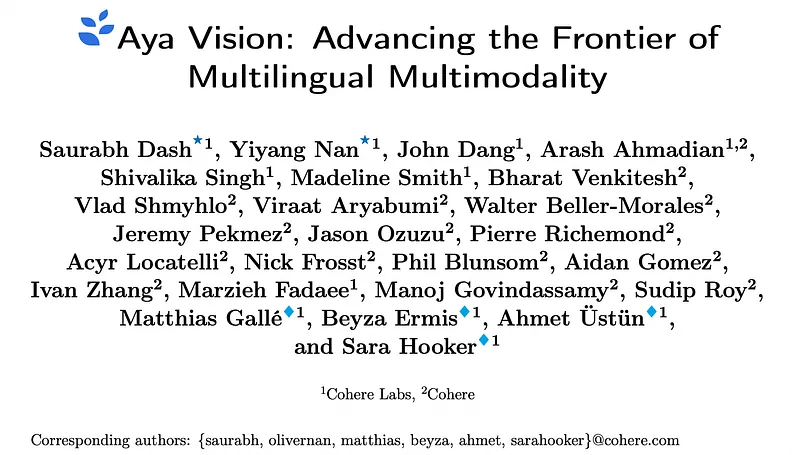
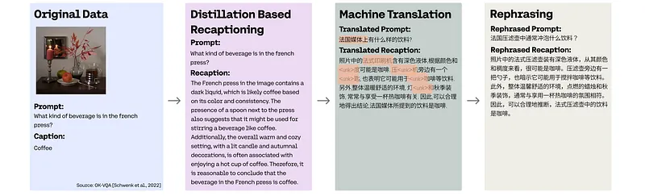
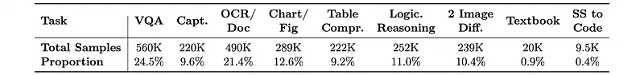
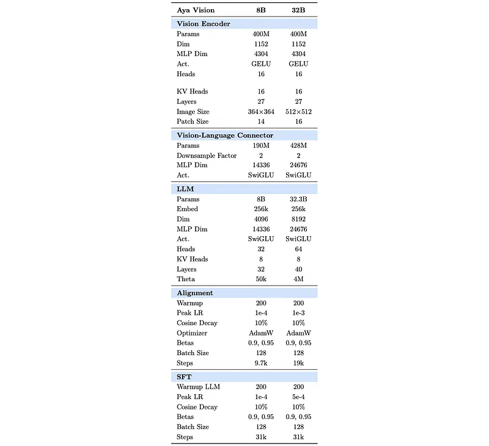
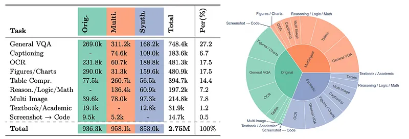
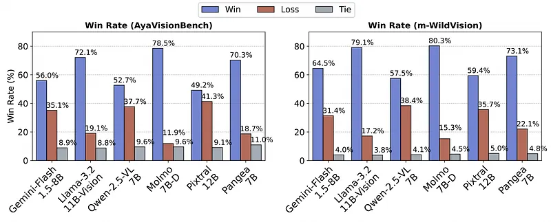
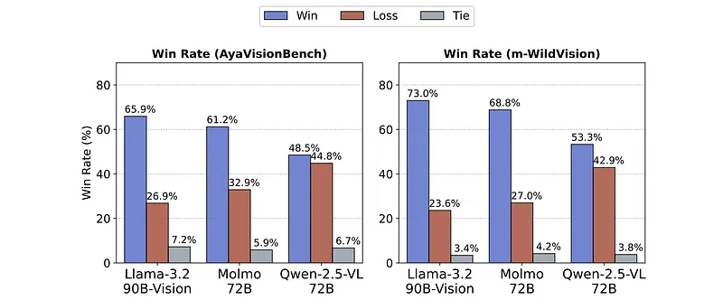
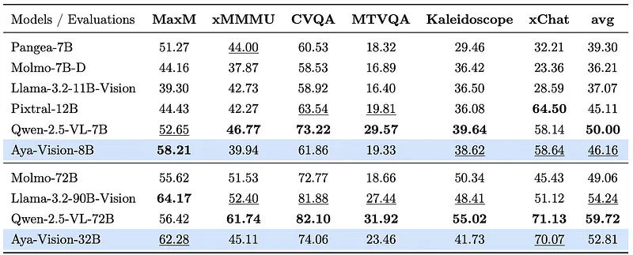
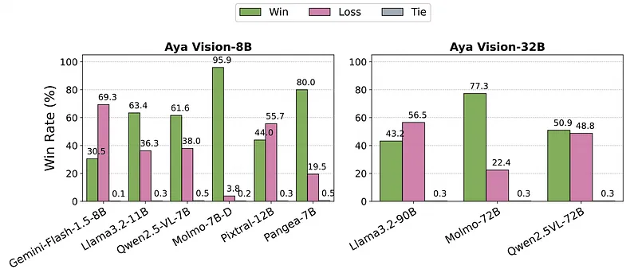
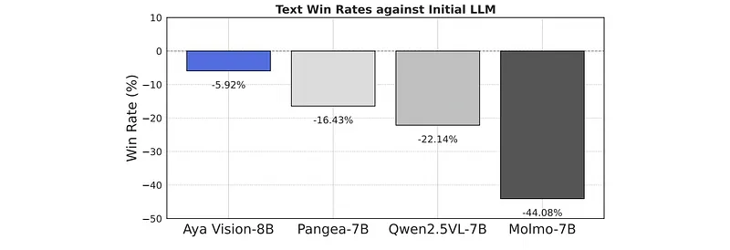

# Papers Explained 332 - Aya Vision

The models are available on [HuggingFace](https://huggingface.co/collections/CohereLabs/cohere-labs-aya-vision-67c4ccd395ca064308ee1484/).

This page ingests the source article into the wiki and connects it to [[Papers Explained Corpus]], [[Synthetic Data]], [[Multilingual Models]], [[Vision Language Models]], [[Large Language Models]], [[Evaluation and Benchmarks]], [[Verifier-Bounded Learning]].

## Source Metadata

- Source file: `raw/2025-03-18_Papers-Explained-332--Aya-Vision-5aec8dce396e.md`
- Source title: Papers Explained 332: Aya Vision
- Published: 2025-03-18
- Canonical: [https://medium.com/@ritvik19/papers-explained-332-aya-vision-5aec8dce396e](https://medium.com/@ritvik19/papers-explained-332-aya-vision-5aec8dce396e)

## Key Ideas

- translation combined with multilingual rephrasing.
- The dataset is constructed on well-established open-source resources, including Cauldron, a large-scale collection of 50 vision-language datasets (∼30M samples), and PixMo, a comprehensive dataset spanning seven multimodal tasks (∼ 6M samples).
- Following recaptioning, the average word count increases from 14.2 to 100.1, token count rises from 27.2 to 140.8, and Measure of Textual Lexical Diversity (MTLD) improves from 11.0 to 61.2.
- A two-stage filtering pipeline enhances the overall reliability of the recaptioned dataset.
- Stage 1 begins with simple keyword detection to identify recaptioned samples that exhibit common failure modes, such as refusals to respond or repeated phrases from the input prompt.

## Notes

Building multimodal language models is challenging because it requires connecting vision and language, finding good instruction data, and preventing the loss of text-only skills when vision is added. These problems get worse when dealing with multiple languages because there’s a lack of multimodal data, translations can be inaccurate, and models tend to forget previous knowledge. To solve these issues, a synthetic annotation framework is created to produce high-quality multilingual multimodal instruction data, allowing models to give natural responses to multimodal inputs in many languages. Additionally, a cross-modal model merging method is introduced to reduce forgetting, maintaining text-only skills while improving multimodal performance.

The models are available on [HuggingFace](https://huggingface.co/collections/CohereLabs/cohere-labs-aya-vision-67c4ccd395ca064308ee1484/).

## Multilingual Multimodal Data Framework

To solve for the scarcity of multilingual multimodal instruction data, prior efforts often depend on direct LLM-based translations of English-centric datasets. However, these methods still struggle with limited linguistic diversity, the introduction of “translationese” from overreliance on translation, strict task formulations, and a lack of conversational naturalness. To address these gaps, a robust multimodal synthetic re-annotation pipeline for constructing high-quality multilingual multimodal datasets is introduced. The pipeline comprises three core stages:

- distillation-based recaptioning

- dataset filtering

- translation combined with multilingual rephrasing.

*Figure: The synthetic annotation pipeline.*

### Data Collection

The dataset is constructed on well-established open-source resources, including Cauldron, a large-scale collection of 50 vision-language datasets (∼30M samples), and PixMo, a comprehensive dataset spanning seven multimodal tasks (∼ 6M samples). Other sources include SlideVQA, PDFVQA, and ScreenQA. To ensure robust generalization across task types, the number of samples per category is regulated to construct a balanced and representative dataset. The final collection contains ∼2.3M samples.

*Figure: Task-wise distribution in the curated dataset.*

### Distillation-based Recaptioning

The goal with synthetic re-annotation is to generate recaptions that are more detailed, natural, and diverse in both tone and content. A key constraint in this process is that the recaptioned outputs also must remain anchored to the ground-truth answer. To enhance the quality of synthetic data, task-specific prompt templates are designed for the teacher model, which guide the recaptioning process. These prompt strategies are adapted to rewrite captions based on the ground-truth and to meet the requirements of different vision-language tasks.

[ APP D ]

Following recaptioning, the average word count increases from 14.2 to 100.1, token count rises from 27.2 to 140.8, and Measure of Textual Lexical Diversity (MTLD) improves from 11.0 to 61.2.

### Verifying and Filtering Recaptioned Instruction Data

A two-stage filtering pipeline enhances the overall reliability of the recaptioned dataset.

Stage 1 begins with simple keyword detection to identify recaptioned samples that exhibit common failure modes, such as refusals to respond or repeated phrases from the input prompt. To catch these issues, a list of keywords and phrases is compiled that automatically flag such responses. Flagged samples are either sent back to the model for regeneration or discarded if the issue persists.

Stage 2 addresses more nuanced errors using command-r-plus-08–2024 for semantic verification. In this stage, the original and rephrased captions are presented to the model, which acts as a semantic judge to assess whether the answer to the original caption remains valid given the rephrased version. All corrupted samples identified at this stage are discarded. This step reveals an overall error rate of 3.2% (62,370 samples) in the recaptioned data.

```text
Question:
{question}
Ground Truth Answer:
{answer}
Generated Response:
{response}
Instruction:
Given the question, compare the generated response with the ground truth answer.
Your task is to evaluate the correctness of the generated response.
The generated response is correct if the final result or key information in the response matches or is consistent with the ground truth answer.
The response does not need to be an exact match, but it should include or align with the ground truth.
Provide your response with a ’YES’ if the generated response is correct, or ’NO’ if it is not.
Start your evaluation with a brief explanation, followed by your final decision.
Your output must strictly follow this format:
Explanation: <brief explanation> Final Decision: <YES or NO>
```

### Hybrid Translation Pipeline for Multilingual Instruction Data

Machine translation is initiated using the NLLB-3.3B model into the following 22 languages: Arabic, Chinese, Czech, Dutch, French, German, Greek, Hebrew, Hindi, Indonesian, Italian, Japanese, Korean, Persian, Polish, Portuguese, Romanian, Russian, Spanish, Turkish, Ukrainian, and Vietnamese. A post-editing step is then applied using a capable multilingual language model, command-r-pl-us-08–2024 to refine the translations. This step uses the initial machine-translated output as an in-context example to guide the model toward generating more fluent and accurate outputs. In doing so, common machine translation artifacts are corrected while preserving the original semantic content.

```text
Original Text:
{raw_text}
Translation:
{translation}
Instruction:
Given the original text and its translation, improve the quality of the translation by rephrasing it.
Ensure the rephrased translation closely aligns with the original text in meaning, structure, tone, and style.
Make the rephrased translation sound natural and fluent in the target language (language) while preserving all essential details, correcting any grammatical errors, and retaining all stylistic elements (e.g., enumeration, parentheses, punctuation, capitalization, spacing, line breaks, etc.) from the original.
The output must strictly enclose the rephrased translation within <translation> </translation> tags.
```

## Balancing Performance across Languages, Modalities and Tasks

Retaining the text-only performance of the backbone LLM, while acquiring strong multimodal capabilities through multimodal training is challenging for several reasons. Firstly, choosing the data mixture to strike a balance between multimodal and text datasets is a challenging problem, as finding the right balance is non-trivial and requires a multitude of ablations. Secondly, reintroducing previously seen text-only data can potentially lead to overfitting with minimal improvement in text performance and a higher degradation in multimodal performance.

### Sampling Visual Instructions from Multiple Sources and Languages

The training data includes three main types of datasets.:

- Synthetically re-annotated data in English, created after the initial data framework phase, totaling 2.29 million samples. To ensure all task categories are well-represented, datasets with fewer samples, like science or textbook questions, are upsampled. Datasets considered higher quality after manual review are also upsampled, resulting in the model seeing 3.5 million samples from this category.

- Multilingual datasets, which are created using a portion of the re-annotated English data. Data is sampled evenly across 22 languages (excluding English), keeping a similar task distribution to the first category. Although this category contains 5 million samples, 3.4 million are sampled uniformly across the 22 languages to maintain task balance.

- High-quality original datasets are used based on their quality. This is important because some evaluations expect precise answers that match the training data and may penalize correct but differently formatted answers. However, the original data is downsampled to prevent a decrease in overall quality, as it can negatively affect natural language generation and completion length, which can reduce the model’s conversational abilities. While this category has 6 million samples, 3.7 million are used for training.

Each data category includes a variety of tasks. To improve multilingual performance, different amounts of multilingual data are tested. The results show that about 66% of the training data is synthetically re-annotated, with 35% being multilingual datasets. The remaining 34% consists of high-quality original datasets. The final training dataset consists of 2.75 million sequence-packed samples.

### Unifying Multimodal Performance with State-of-the-Art Text Capabilities

A linear interpolation is performed between the text-only LLM and the backbone LLM of the multi-modal model as the merging method. Since the text-only language model lacks the vision encoder and alignment layer, these components are simply inherited from the vision-language model.

## Architecture

Vision Encoder: siglip2-so400m is used as the initialization for the vision encoder. This encoder has been pre-trained with an auto-regressive decoder-based loss in addition to the original sigmoidal loss. siglip2-so400m-patch14–384 in Aya- Vision-8B is used for a reduced activation footprint, making it widely accessible on cheaper hardware. For Aya-Vision-32B, siglip2-so400m-patch16–512 is opted for to achieve better performance.

Image Processing: To enable models to process images with arbitrary resolutions, input images are mapped to the nearest supported resolution that minimizes distortion in the aspect ratio. After resizing, the image is split into up to 12 non-overlapping tiles based on the image encoder’s resolution to be processed independently by the vision encoder. In addition to tiles, a thumbnail (resized) is included for a low-resolution overview of the image.

Vision-Language Connector: A 2-layer MLP with SwiGLU activation function is used. To reduce the number of image tokens passed to the language model, Pixel Shuffle is performed. This downsamples the image tokens in the spatial dimensions by stacking 2 × 2 patch embeddings along the embedding dimension before passing through the connector layer. This decreases the number of image tokens by 4×, resulting in a maximum of 2,197 and 3,328 image tokens for the 8B and 32B models respectively. When passing image tokens to LLM, special delimitation tokens are used to denote the start and the end of image token sequences. 1D-tile tags are injected to denote image tiles as a form of explicit positional encoding for the tiles. Regular text tokens (TILE_1,…,TILE_N and TILE_GLOBAL for thumbnail) are used for potential inference-time scaling.

Language Model: Aya-Vision-8B is based on an LLM from Command-R7B, further post-trained with the Aya Expanse recipe. Aya-Vision-32B uses the Aya-Expanse-32B.

## Multimodal Training

Aya Vision models are trained in two steps:

- Vision-Language Alignment

- Supervised Fine-tuning.

In the Vision-Language Alignment step, only the vision-language connector is trained by keeping both the vision encoder and the language model frozen. Aya-Vision-8B includes a 190M vision-language connector, while the 32B model has a 428M connector. Therefore, the 8B model is trained for 9.7k steps (1 epoch) and the 32B model for 19k steps (2 epochs). LLaVa-Pretrain serves as the primary data source in this step. However, since this data is English-only, a small fraction of the multilingual data generated by the data framework (amounting to 14% of the total data seen during this step) is added.

In the instruction fine-tuning step (i.e., supervised fine-tuning with visual instructions), both the vision-language connector and the language model are trained, but the vision encoder is kept frozen. Experiments are conducted with both full model fine-tuning and LoRA. Sequence packing is utilized to pack multiple samples into a single sequence of length 8192 for improved training efficiency.

*Figure: Overview of the multilingual multimodal SFT mixture from various task categories.*

## Evaluation

### Multilingual Multimodal Performance

*Figure: Pair-wise win-rates on AyaVisionBench and m-WildVision.*

- Aya-Vision-8B achieves best-in-class performance, outperforming all other models with win-rates ranging from 49.6% to 80.3%.

- Aya-Vision-8B shows slightly higher win-rates on m-WildVision compared to AyaVisionBench, indicating the challenging nature of AyaVisionBench.

- Aya-Vision-8B outperforms Qwen-2.5-VL-7B and Pixtral-12B by 54.8% win-rate averaged across the two datasets.

- Aya-Vision-8B surpasses strong proprietary models like Gemini-Flash1.5–8B with a win-rate of 60.3% on average.

- Aya-Vision-8B significantly outperforms Pangea-7B with a 71.7% win-rate, despite Pangea’s extensive multilingual training data.

- Aya-Vision-8B maintains competitive performance with Molmo-7B in English (48.3% win-rate) and outperforms it in other languages with an average win-rate of 80%.

*Figure: Pairwise winrates on AyaVisionBench and m-WildVision.*

- Aya-Vision-32B consistently outperforms models over 2× larger, such as Molmo-72B, Qwen-2.5-VL-72B, and Llama-3.2–90B-Vision, with win-rates ranging from 48.5% to 73%.

- Aya-Vision-32B outperforms Llama-3.2–90B-Vision by 65.9% and 73% win-rates on AyaVisionBench and m-WildVision, respectively.

- Aya-Vision-32B’s closest competitor is Qwen-2.5-VL-72B, which it outperforms by 50.8% win-rate on average across both datasets.

- The research emphasizes efficiency, achieving high performance with less compute, supporting the research community with limited access to resources.

*Figure: Evaluation on multilingual multimodal benchmarks for Aya-Vision-8B and AyaVision-32B.*

- Aya Vision models demonstrate strong performance across multiple-choice and short-form academic benchmarks despite being optimized for open-ended real-world usage.

- Aya-Vision-8B outperforms all models in its parameter class on the MaxM benchmark, including larger models like Pixtral-12B and LLaMA-3.2–11B-Vision.

- On the Kaleidoscope benchmark, Aya-Vision-8B performs competitively with Qwen-2.5-VL-7B and surpasses all other baselines.

- Aya-Vision-32B exhibits competitive performance on academic benchmarks against models more than twice its size, outperforming Molmo-72B on all benchmarks except xMMMU and closely matching Llama-3.2–90B-Vision, despite being nearly three times smaller.

- Aya-Vision-8B excels in xChatBench, outperforming models in the same parameter class and larger models like Molmo-72B and Llama-3.2–90B by 28.5% and 14.7% relative increase.

### Text-Only Performance

*Figure: Pairwise win-rates for Aya-Vision-8B (left) and 32B (right) on m-ArenaHard.*

- Aya-Vision-8B outperforms all models except Gemini-Flash1.5–8B.

- Aya-Vision-8B beats Llama-3.2–11B-Vision with a 63.4% win-rate but is outperformed by Pixtral-12B with a 44.0% win-rate.

- Aya-Vision-32B outperforms Molmo-72B and Qwen-2.5-VL-72B with win-rates of 77.3% and 50.9% respectively.

- Aya-Vision-32B is competitive with Llama-3.2–90B-Vision with a 43.2% win-rate.

- These results indicate that Aya Vision models maintain text performance while adding multimodal capabilities.

*Figure: Degradation in text-only win-rates after multimodal training.*

- Aya-Vision-8B limits text performance degradation to within 5.9% compared to its initial LLM.

- Other models show higher degradation: 16.4% for Pangea, 22.1% for Qwen-2.5, and 44.1% for Molmo.

- Highlights the effectiveness of the cross-modal merging framework.

## Paper

Aya Vision: Advancing the Frontier of Multilingual Multimodality [2505.08751](https://arxiv.org/abs/2505.08751)

## Figures

Figures from the Medium HTML export (`raw/2025-03-18_Papers-Explained-332--Aya-Vision-5aec8dce396e.md`); local copies under `wiki/assets/papers-explained-332-aya-vision/` when download succeeded.

| Figure | Caption |
|--------|---------|
|  | Title card: Aya Vision. |
|  | The synthetic annotation pipeline. |
|  | Task-wise distribution in the curated dataset. |
|  | A linear interpolation is performed between the text-only LLM and the backbone LLM of the multi-modal model as the merging method. |
|  | In the Vision-Language Alignment step, only the vision-language connector is trained by keeping both the vision encoder and the language... |
|  | Overview of the multilingual multimodal SFT mixture from various task categories. |
|  | Pair-wise win-rates on AyaVisionBench and m-WildVision. |
|  | Pairwise winrates on AyaVisionBench and m-WildVision. |
|  | Evaluation on multilingual multimodal benchmarks for Aya-Vision-8B and AyaVision-32B. |
|  | Pairwise win-rates for Aya-Vision-8B (left) and 32B (right) on m-ArenaHard. |
|  | Degradation in text-only win-rates after multimodal training. |
## Related

- [[Papers Explained Corpus]]
- [[Synthetic Data]]
- [[Multilingual Models]]
- [[Vision Language Models]]
- [[Large Language Models]]
- [[Evaluation and Benchmarks]]
- [[Verifier-Bounded Learning]]
- [[Papers Explained 331 - MAmmoTH-VL 2]]
- [[Papers Explained 333 - SmolDocling]]
- [[Introducing Command A Vision: Multimodal AI built for business]] — Cohere enterprise multimodal product line; Aya Vision is the research multilingual VLM from Cohere Labs.

#summary #topic
