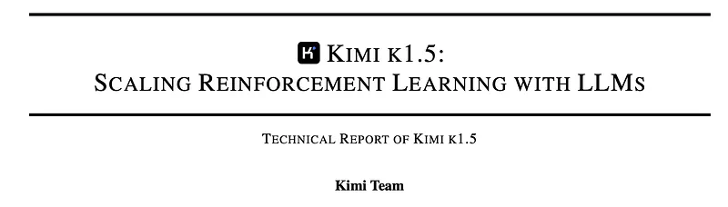
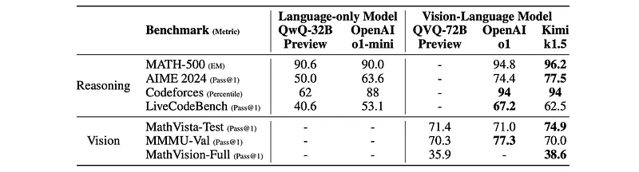
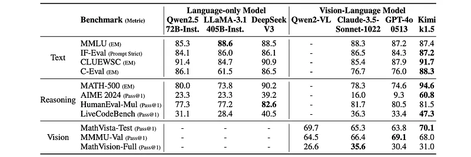
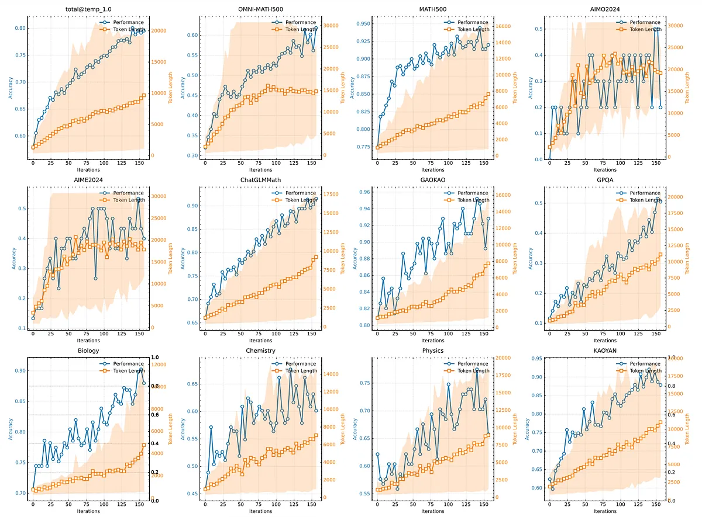
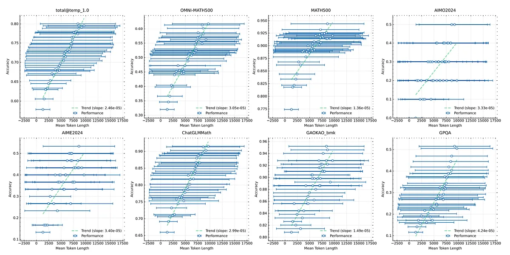
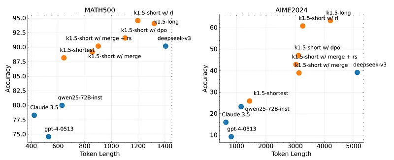

# Papers Explained 334 - Kimi k1.5

Kimi k1.5 multi-modal LLM trained with RL, including its RL training techniques, multi-modal data recipes, and infrastructure optimization.

This page ingests the source article into the wiki and connects it to [[Papers Explained Corpus]], [[Vision Language Models]], [[Reinforcement Learning Topic]], [[Reasoning Models]], [[Large Language Models]], [[Long Context]], [[Reinforcement Learning]], [[Supervised Fine-Tuning]].

## Source Metadata

- Source file: `raw/2025-03-20_Papers-Explained-334--Kimi-k1-5-c41e914cae7b.md`
- Source title: Papers Explained 334: Kimi k1.5
- Published: 2025-03-20
- Canonical: [https://medium.com/@ritvik19/papers-explained-334-kimi-k1-5-c41e914cae7b](https://medium.com/@ritvik19/papers-explained-334-kimi-k1-5-c41e914cae7b)

## Key Ideas

- The development of Kimi k1.5 consists of several stages: pretraining, vanilla supervised fine-tuning (SFT), long-CoT supervised fine-turning, and reinforcement learning (RL). This report focuses on RL
- The key properties that define a high-quality RL prompt set:
- Diverse Coverage: A tagging system is used to categorize prompts by domain and discipline to ensure balanced representation.
- Balanced Difficulty: An SFT model is used to generate answers ten times with a high sampling temperature; the pass rate is then used as a proxy for difficulty.
- Accurate Evaluability: To avoid reward hacking (achieving correct answers through incorrect reasoning), multiple-choice, true/false, and proof-based questions are excluded.

## Notes

Kimi k1.5 multi-modal LLM trained with RL, including its RL training techniques, multi-modal data recipes, and infrastructure optimization. Long context scaling and improved policy optimization methods are key ingredients of our approach, which establishes a simplistic, effective RL framework without relying on more complex techniques such as Monte Carlo tree search, value functions, and process reward models.

The development of Kimi k1.5 consists of several stages: pretraining, vanilla supervised fine-tuning (SFT), long-CoT supervised fine-turning, and reinforcement learning (RL). This report focuses on RL

## Approach

### RL Prompt Set Curation

The key properties that define a high-quality RL prompt set:

- Diverse Coverage: A tagging system is used to categorize prompts by domain and discipline to ensure balanced representation.

- Balanced Difficulty: An SFT model is used to generate answers ten times with a high sampling temperature; the pass rate is then used as a proxy for difficulty.

- Accurate Evaluability: To avoid reward hacking (achieving correct answers through incorrect reasoning), multiple-choice, true/false, and proof-based questions are excluded.

### Long-CoT Supervised Fine-Tuning

With the refined RL prompt set, we employ prompt engineering to construct a small yet high-quality long-CoT warmup dataset, containing accurately verified reasoning paths for both text and image inputs. It is designed to encapsulate key cognitive processes that are fundamental to human-like reasoning, such as planning, where the model systematically outlines steps before execution; evaluation, involving critical assessment of intermediate steps; reflection, enabling the model to reconsider and refine its approach; and exploration, encouraging consideration of alternative solutions.

### Sampling Strategies

Two sampling methods are proposed to utilize these priors to improve training efficiency.

- Curriculum Sampling: starts by training on easier tasks and gradually progresses to more challenging ones.

- Prioritized Sampling: The success rates si for each problem are tracked and problems are sampled proportional to 1 − si, so that problems with lower success rates receive higher sampling probabilities.

### Long2short: Context Compression for Short-CoT Models

An overthinking phenomenon is observed where the model’s response length significantly increases during RL training. Although this leads to better performance, an excessively lengthy reasoning process is costly during training and inference.

- Model Merging: This approach combines a long-cot model with a shorter model to obtain a new one without training. Specifically, we merge the two models by simply averaging their weights.

- Shortest Rejection Sampling: This method samples the same question n times (in our experiments, n = 8) and selects the shortest correct response for supervised fine-tuning.

- DPO: The shortest correct solution is selected as the positive sample, while longer responses are treated as negative samples, including both wrong longer responses and correct longer responses (1.5 times longer than the chosen positive sample). These positive-negative pairs form the pairwise preference data used for DPO training.

- Length Penalty: A length reward is introduced to restrain the rapid growth of token length, thereby improving the model’s token efficiency.

In preliminary experiments, length penalty may slow down training during the initial phases. To alleviate this, standard policy optimization without length penalty is employed, followed by a constant length penalty for the rest of training.

### Test Case Generation for Coding

The goal is to automatically generate test cases for coding problems that don’t require a special judge and have ground truth solutions available. This is achieved by leveraging the CYaRon library and a base Kimi k1.5 model to generate test cases based on problem statements and CYaRon usage statements. 50 test cases are generated per problem, and 10 ground truth submissions are run against each.

A test case is considered valid if at least 7/10 submissions produce matching results. A problem is included in the training set if at least 9/10 submissions pass all selected test cases for that problem.

### Reward Modeling for Math

The challenge lies in the fact that different written forms can represent the same mathematical answer.

A value-head based reward model (inspired by InstructGPT), trained on 800k data points, was used as the Classic RM. It takes the question, reference answer, and response as input and outputs a scalar indicating correctness. A reward model augmented with chain-of-thought reasoning, trained on 800k CoT-labeled examples, was also utilized. This Chain-of-Thought RM generates a step-by-step reasoning process before providing a correctness judgment in JSON format. This model improves accuracy, especially for nuanced problems.

Classic RM achieved ~84.4% accuracy, while Chain-of-Thought RM reached ~98.5% accuracy in manual spot checks. The Chain-of-Thought RM was used for RL training.

### Vision Data

Three categories of vision data are used to improve real-world image reasoning and align visual inputs with LLMs:

- Real-World Data: Includes science questions with graphical components, location guessing tasks, and data analysis from charts. This data improves visual reasoning in real-world scenarios.

- Synthetic Visual Reasoning Data: Artificially generated images and scenes designed to improve specific visual reasoning skills (spatial relationships, geometric patterns, object interactions). Provides a controlled environment and unlimited training examples.

- Text-Rendered Data: Textual content converted into visual format (screenshots, photos of documents) to ensure consistent model responses across different modalities (text and images). Improves handling of text-heavy images. Ensures the model provides consistent responses regardless of input modality (pure text or text rendered as an image).

### Pretraining

The Kimi k1.5 model is trained on a diverse multimodal corpus covering English, Chinese, Code, Mathematics & Reasoning, and Knowledge. The multimodal data includes Captioning, Image-text Interleaving, OCR, Knowledge, and QA datasets. The pretraining process involves three stages:

- Vision-language pretraining: Establishes a language foundation and gradually integrates multimodal data. The visual tower is initially trained in isolation without updating the language model parameters, then the language model layers are unfrozen, and the proportion of vision-text data is increased to 30%.

- Cooldown: Consolidates capabilities using curated and synthetic data, focusing on reasoning and knowledge-based tasks. High-fidelity subsets of the pre-training corpus are used for English and Chinese, while math, knowledge, and code domains are augmented with synthetically generated content.

- Long-context activation: Extends sequence processing to 131,072 tokens using upsampled long-context cooldown data, with a mix of full and partial attention data. The RoPE frequency was set to 1,000,000. The maximum sequence length is gradually increased from 4,096 to 32,768, and finally to 131,072.

### Vanilla Supervised Finetuning

Text data is created for non-reasoning tasks (705k examples) and reasoning tasks (295k examples).

For non-reasoning tasks, an initial seed dataset, human-annotated, is used to train a seed model. Model-assisted data generation uses diverse prompts to generate multiple responses per prompt using the seed model. Annotators then rank the responses and refine the top-ranked one for the final version. Tasks include question answering (500k examples), creative writing (5k examples), and long-context tasks (20k examples) such as summarization, document QA, translation, and writing.

Reasoning tasks (295k examples) utilize rejection sampling. Rule-based and reward modeling-based verification are used for tasks where automated evaluation is more accurate than human judgment. Tasks include coding (200k examples) and math and science (200k examples).

A text-vision dataset (1 million examples) includes various tasks involving visual and textual information, such as chart interpretation, optical character recognition (OCR), image-grounded conversations, visual coding, visual reasoning, and math/science problems with visual aids.

The model is trained in two epochs. Epoch 1 uses a 32k token sequence length, and Epoch 2 uses a 128k token sequence length.

## Evaluation

*Figure: Performance of Kimi k1.5 long-CoT and flagship open-source and proprietary models.*

- K1.5 long-CoT model: Achieved state-of-the-art results across various modalities, demonstrating significant improvements in reasoning, comprehension, and information synthesis over extended contexts. This represents a significant advancement in multi-modal AI capabilities.

*Figure: Performance of Kimi k1.5 short-CoT and flagship open-source and proprietary models.*

- K1.5 short-CoT model: Showed competitive or superior performance compared to leading open-source and proprietary models on tasks involving text, vision, and reasoning. The model exhibited particular strengths in natural language understanding, mathematics, coding, and logical reasoning.

### Long Context Scaling

Study of the scaling properties of Reinforcement Learning (RL) with Large Language Models (LLMs), specifically how increasing context length affects performance.

*Figure: The changes on the training accuracy and length as train iterations grow.*

- Increasing context length correlates with improved performance accuracy and longer response lengths in problem-solving.

- More challenging benchmarks show a greater increase in response length as training progresses, implying the model learns to generate more complex solutions for harder problems.

*Figure: Model Performance Increases with Response Length.*

- A strong correlation exists between the model’s output context length and its problem-solving abilities.

- Scaling to a 128k context length (k1.5 run) leads to continued improvement on difficult reasoning benchmarks.

### Long2short

Comparison of the token efficiency of the proposed long2short Reinforcement Learning (RL) algorithm for training short-context models from long-context models with existing methods like DPO, shortest rejection sampling, and model merging. Specifically, to evaluate how a long-context model can benefit a short-context model.

*Figure: Long2Short Performance.*

- The long2short RL algorithm achieved the highest token efficiency compared to the other methods (DPO, model merging, and shortest rejection sampling).

- All models in the k1.5 series (trained with variations of the long2short approach) demonstrated superior token efficiency compared to other models not trained with this approach.

- The k1.5-short w/ rl model achieved a Pass@1 score of 60.8 on AIME2024 with an average token usage of 3,272.

- The k1.5-shortest model achieved a Pass@1 score of 88.2 on MATH500 while using a similar number of tokens as other short models, indicating significantly better performance for the same computational cost.

## Paper

Kimi k1.5: Scaling Reinforcement Learning with LLMs [2501.12599](https://arxiv.org/abs/2501.12599)

## Figures

Figures from the Medium HTML export (`raw/2025-03-20_Papers-Explained-334--Kimi-k1-5-c41e914cae7b.md`); local copies under `wiki/assets/papers-explained-334-kimi-k1-5/` when download succeeded.

| Figure | Caption |
|--------|---------|
|  | Title card: Kimi k1.5. |
|  | An overthinking phenomenon is observed where the model’s response length significantly increases during RL training. |
|  | Performance of Kimi k1.5 long-CoT and flagship open-source and proprietary models. |
|  | Performance of Kimi k1.5 short-CoT and flagship open-source and proprietary models. |
|  | The changes on the training accuracy and length as train iterations grow. |
|  | Model Performance Increases with Response Length. |
|  | Long2Short Performance. |
## Related

- [[Papers Explained Corpus]]
- [[Vision Language Models]]
- [[Reinforcement Learning Topic]]
- [[Reasoning Models]]
- [[Large Language Models]]
- [[Long Context]]
- [[Reinforcement Learning]]
- [[Supervised Fine-Tuning]]
- [[Papers Explained 333 - SmolDocling]]
- [[Papers Explained 335 - Transformers without Normalization]]

#summary #topic
