# Papers Explained 337 - Logic-RL

This study explores the potential of rule-based reinforcement learning (RL) in large reasoning models. Synthetic logic puzzles are used as training data due to their controllable complexity and straightforward answer verification.

This page ingests the source article into the wiki and connects it to [[Papers Explained Corpus]], [[Reasoning Models]], [[Reinforcement Learning Topic]], [[Synthetic Data]], [[Model Compression and Efficiency]], [[Evaluation and Benchmarks]], [[Reinforcement Learning]], [[Verifier-Bounded Learning]], [[Supervised Fine-Tuning]].

## Source Metadata

- Source file: `raw/2025-03-25_Papers-Explained-337--Logic-RL-6f1ae1ffaf09.html`
- Source title: Papers Explained 337: Logic-RL
- Published: 2025-03-25
- Canonical: [https://medium.com/@ritvik19/papers-explained-337-logic-rl-6f1ae1ffaf09](https://medium.com/@ritvik19/papers-explained-337-logic-rl-6f1ae1ffaf09)

## Key Ideas

- The 7B model develops advanced reasoning skills — such as reflection, verification, and summarization — that are absent from the logic corpus.
- Several interesting findings emerge from this study:
- Longer responses don’t guarantee better reasoning. Length alone is not a valid performance metric for training time evaluation. The most efficient reasoning comes from the shortest path.
- Language mixing hinders reasoning. This observation underscores the need for a language consistency penalty in reward modeling.
- Increasing ‘thinking’ tokens do help. RL training naturally boosts the frequency of reflection- related words, suggesting a correlation between certain tokens’ frequency and performance.

## Notes

This study explores the potential of rule-based reinforcement learning (RL) in large reasoning models. Synthetic logic puzzles are used as training data due to their controllable complexity and straightforward answer verification.

The 7B model develops advanced reasoning skills — such as reflection, verification, and summarization — that are absent from the logic corpus. Remarkably, after training on just 5K logic problems, it demonstrates generalization abilities to the challenging math benchmarks AIME and AMC.

Several interesting findings emerge from this study:

- Longer responses don’t guarantee better reasoning. Length alone is not a valid performance metric for training time evaluation. The most efficient reasoning comes from the shortest path.

- Language mixing hinders reasoning. This observation underscores the need for a language consistency penalty in reward modeling.

- Increasing ‘thinking’ tokens do help. RL training naturally boosts the frequency of reflection- related words, suggesting a correlation between certain tokens’ frequency and performance.

- SFT memorizes; RL generalizes. SFT relies heavily on memorization, often leading to superficial shortcut learning, whereas RL self-evolves with minimal dependence on dataset structure.

- Cold start is a bonus, not a necessity. Training dynamics remain surprisingly similar whether starting from a base or instruct model, though the latter exhibits slightly better performance.

- Curriculum Learning still matters. Under a fixed data curation ratio, a well-designed curriculum learning approach always outperforms random shuffle.

## Data Synthesis

The Knights and Knaves (K&K) puzzles constitute an algorithmically generated reasoning dataset. In these puzzles, characters are either knights, who always tell the truth, or knaves, who always lie. The objective is to determine the nature of each character based on their statements. This dataset is distinguished by its high degree of controllability:

- Procedural Generation: Puzzles are systematically generated using logic templates, ensuring both consistency and infinite variability. Importantly, these puzzles represent unseen data for the original model, making them ideal for testing generalization capabilities.

- Controlled Difficulty Levels: The difficulty of the puzzles can be precisely adjusted, enabling the design of a curriculum learning strategy. Difficulty is modulated by varying the number of characters (2–8) and the complexity of logical operations (1–4 combinations of Boolean operators). Furthermore, more complex puzzles can serve as out-of-distribution tests for models trained on simpler cases, providing insights into their ability to generalize.

- Ease Verification:Each Puzzle has a single, unambiguous ground truth answer, with correctness guaranteed by the generation algorithm. Solutions require strict deductive reasoning, allowing for accurate evaluation of model responses and minimizing the risk of reward hacking.

## Rule Based Reward Modeling

Continuous monitoring of hacking behaviors in the model’s outputs led to the iterative refinement of the reward design, resulting in two types of rewards.

### Format Reward

Regular expression extraction is used to enforce a structured response format. The model is required to put its reasoning process within <think></think> tags and provide the final conclusion inside <answer></answer> tags. Including a <think> tag directly at the end of the prompt significantly reduces the difficulty for the base model to follow instructions.

Under an early imperfect rule design, the following phenomena were consistently observed:

• Skipping the <think></think> process and directly answering.

• Placing reasoning inside the <answer></answer> tag.

• Repeatedly guessing answers without proper reasoning.

• Including irrelevant nonsense in addition to providing the answer.

• Organizing the correct answer in a wrong manner for extraction.

• Revisiting the thinking phase after already outputting an <answer> due to insufficient reasoning.

• Repeating the original question or using phrases like “thinking process here” to avoid true reasoning.

Accordingly, the rule design was iteratively refined. For example, each tag should appear exactly once and in the correct sequential order, the thinking process must include genuine reasoning, and the conclusion should be presented in an extractable and readable manner. By enforcing these constraints, different actions receive appropriate rewards based on their adherence to the format.

### Answer Reward

Once the format is validated, the model’s answer is checked for a match with the ground truth.

## Experiment Setup

Experiments begin with various models from the Qwen2.5 series as potential baseline candidates. For instance, Qwen2.5-Math-7B exhibited a strong tendency to generate Python code blocks, which often conflicted with strict formatting requirements. Despite efforts to mitigate this behavior by removing system prompts and penalizing specific markdown styles, it remained challenging to fully address.

Both Qwen2.5–7B-Base and Qwen2.5–7B-Instruct are then tested as starting points. Surprisingly, the base and instruct models displayed nearly identical training metrics during RL training, including validation accuracy, response length growth curves, and reward curves. However, the instruct model demonstrated slightly higher test accuracy, making it the preferred choice.

## Evaluation

*Figure: Comparison of different models including reasoning models and general models on K&K logic puzzle across various difficulty*

- Despite the training dataset being limited to 3 to 7-person K&K logic puzzles — with fewer than 5,000 synthetic samples — the model demonstrates a remarkable ability to generalize to out-of- distribution (OOD) scenarios, such as 8-person puzzles.

- Compared to the initial average length of 500 tokens, after 1k steps of RL, the output has almost linearly and steadily increased to 2000 tokens, a significant increase of 4 times.

- As the response length increases, the model begins to exhibit more complex behaviors, such as reflection and exploration of alternative solutions.

### RQ 1: How Does GRPO Compare to Other RL Algorithms?

*Figure: Comparison of performance (averaged by sliding window = 50) in terms of training speed, accuracy, and reward gain.*

- PPO achieved the highest accuracy and reward.

- PPO was significantly slower (138%) than REINFORCE++ in training.

- REINFORCE++ demonstrated better stability, performance gains, and training efficiency compared to GRPO.

- REINFORCE++ generally outperformed GRPO across almost all metrics.

- GRPO performed the worst among the three algorithms.

### RQ 2. Do certain thinking tokens and language-mixing phenemona improve reasoning?

*Figure: Impact of complex reasoning behaviours and language mixing on reasoning performance.*

- Language mixing significantly decreases reasoning ability.

- While terms like “wait,” “verify,” “yet,” and “re-evaluate” show significant improvement, not all complex thinking tokens enhance reasoning ability, as exemplified by “recheck.”

- The complex reasoning behaviour “recheck” markedly diminishes reasoning ability, likely because its use signals the model’s uncertainty about its answer.

- There’s a clear difference between “re-evaluate” and “reevaluate”: the former leads to much higher answer scores, while the latter lowers them. When we checked its origin responses, “reevaluate” almost never appeared, while “re-evaluate” showed up frequently. This may suggest the model is more comfortable with words it has seen more often in pretrain corpus.

### RQ 3: Does an ’Aha Moment’ Emerge During Training?

*Figure: Tracking the frequency of words in the first 1,800 training steps.*

- Complex reasoning behaviors (self-reflection, exploration, verification, summarization) emerged gradually during training, even appearing as early as step 10.

- There was no single, sudden “aha moment” where these behaviors abruptly appeared.

### RQ 4: Can the Model Generalize to Out-of-Distribution (OOD) Tasks?

The model’s performance is tested on the AIME 2021–2024 and AMC 2022–2023 datasets, which are considered “Super OOD” due to their challenging and diverse problem sets.

*Figure: Training Step vs. Accuracy on AIME (2021–2024) and AMC (2022–2023) Datasets.*

- The model demonstrated strong Super OOD generalization capability.

- Performance improved by 125% on the AIME dataset and 38% on the AMC dataset..

- The RL process not only improves in-distribution performance but also fosters the development of robust and transferable reasoning strategies.

- The model’s reasoning skills generalize beyond the specific patterns of the training data, highlighting RL’s potential for broader generalization.

### RQ 5: Which Generalizes Better, SFT or RL?

Model performance is evaluated on original training data and slightly perturbed versions. Two perturbation types are used:

- Changing a statement’s boolean logic

- Reordering statements.

*Figure: RFT memorizes while RL generalizes.*

- SFT (represented by RFT) exhibits higher memorization scores, indicating greater sensitivity to perturbations and suggesting superficial alignment to training data format.

- RL demonstrates lower memorization scores and better generalization to unseen test data, implying improved reasoning capabilities and less reliance on surface-level patterns.

- RL encourages independent exploration, leading to better generalization.

### RQ 6: Is Curriculum Learning Still Necessary in RL?

*Figure: Comparison of test scores for curriculum learning and mixed-difficulty training.*

- Curriculum learning shows slightly higher test scores during intermediate training phases.

- This advantage diminishes over time, becoming practically insignificant.

- The performance difference during early training is statistically negligible, suggesting little impact on initial convergence.

- While curriculum learning might offer a marginal theoretical benefit in sample efficiency, its practical necessity is questionable due to the minimal real-world performance difference and the added complexity of staged training.

### RQ 7: Does Longer Response Length Guarantee Better Reasoning?

Comparison of two models trained with the same algorithm and base model but differing hyperparameters and dataset difficulties:

- Positive Example Model (Blue): Model with decreasing response length over time.

- Negative Example Model (Red): Model with increasing response length over time.

*Figure: Comparison of response length, validation accuracy, and mean reward across training steps for positive and negative example models.*

- The Positive Example Model (Blue) showed improved validation accuracy and reward despite decreasing response length, demonstrating better reasoning and generalization.

- The Negative Example Model (Red) showed no improvement in validation accuracy or reward despite increasing response length, suggesting that response length alone doesn’t enhance reasoning.

- Changes in response length are likely a byproduct of training dynamics (e.g., RL dynamics) rather than a direct cause of improved reasoning.

- No statistically significant evidence exists that the magnitude of length increase predicts proportional gains in reasoning performance. Longer responses don’t guarantee better reasoning; improved reasoning may lead to longer, more detailed explanations, but artificially lengthening responses doesn’t necessarily improve performance.

## Paper

Logic-RL: Unleashing LLM Reasoning with Rule-Based Reinforcement Learning [2502.14768](https://arxiv.org/abs/2502.14768)

## Figures

Figures from the Medium HTML export (`raw/2025-03-25_Papers-Explained-337--Logic-RL-6f1ae1ffaf09.html`); local copies under `wiki/assets/papers-explained-337-logic-rl/` when download succeeded.

| Figure | Caption |
|--------|---------|
| 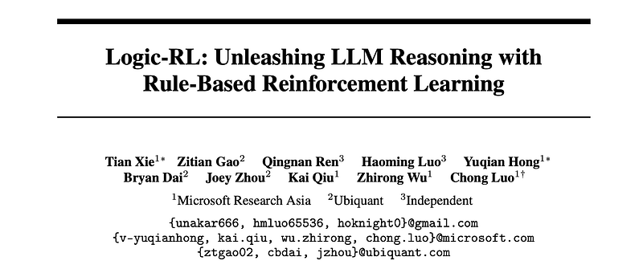 | Title card: Logic-RL. |
| 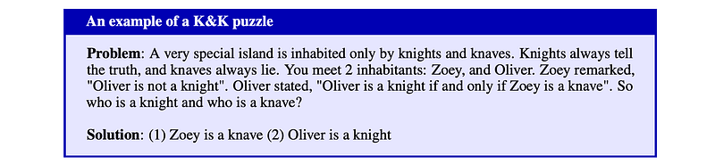 | The Knights and Knaves (K&K) puzzles constitute an algorithmically generated reasoning dataset. |
|  | Accordingly, the rule design was iteratively refined. |
|  | Once the format is validated, the model’s answer is checked for a match with the ground truth. |
| 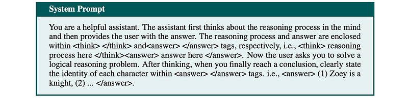 | Both Qwen2.5–7B-Base and Qwen2.5–7B-Instruct are then tested as starting points. |
| 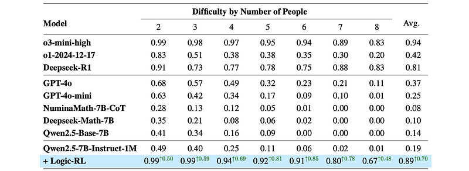 | Comparison of different models including reasoning models and general models on K&K logic puzzle across various difficulty. |
| 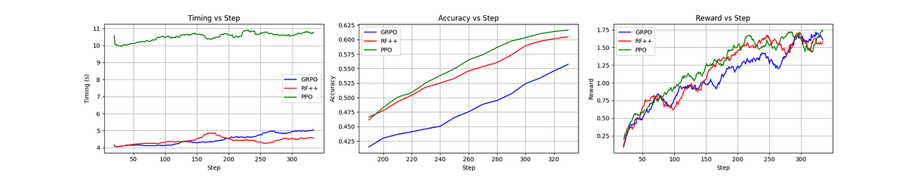 | Comparison of performance (averaged by sliding window = 50) in terms of training speed, accuracy, and reward gain. |
| 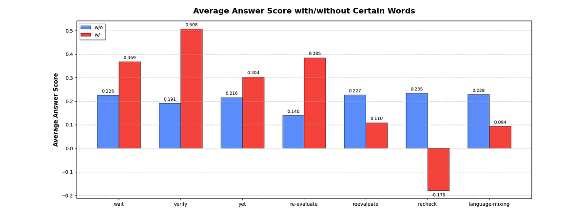 | Impact of complex reasoning behaviours and language mixing on reasoning performance. |
| 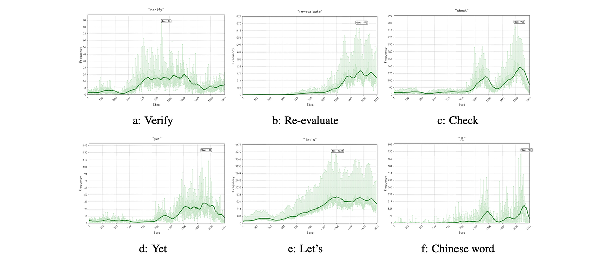 | Tracking the frequency of words in the first 1,800 training steps. |
| 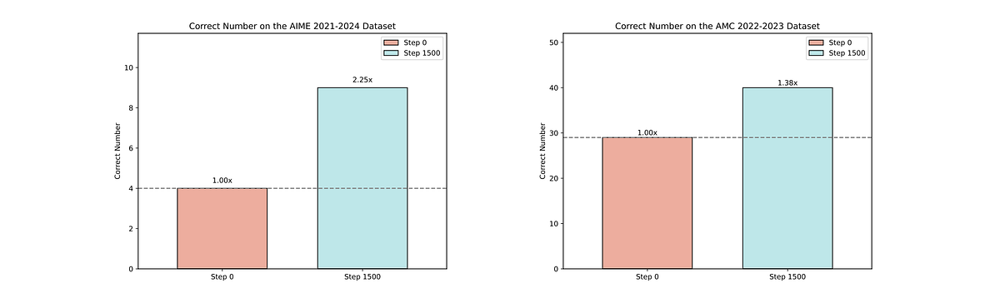 | Training Step vs. Accuracy on AIME (2021–2024) and AMC (2022–2023) Datasets. |
| 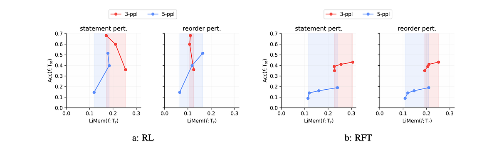 | RFT memorizes while RL generalizes. |
| 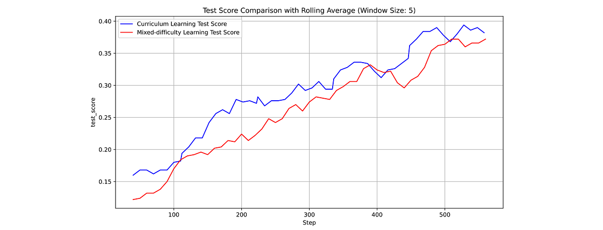 | Comparison of test scores for curriculum learning and mixed-difficulty training. |
| 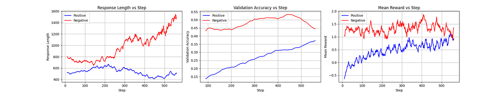 | Comparison of response length, validation accuracy, and mean reward across training steps for positive and negative example models. |
## Related

- [[Papers Explained Corpus]]
- [[Reasoning Models]]
- [[Reinforcement Learning Topic]]
- [[Synthetic Data]]
- [[Model Compression and Efficiency]]
- [[Evaluation and Benchmarks]]
- [[Reinforcement Learning]]
- [[Verifier-Bounded Learning]]
- [[Supervised Fine-Tuning]]
- [[Papers Explained 336 - Rethinking Compute-Optimal Test-Time Scaling]]
- [[Papers Explained 338 - Large-Scale Data Selection for Instruction Tuning]]

#summary #topic
